# 一、基础

## 1.1 C++头文件

**头文件包含:**

+ C++兼容C语言的头文件
+ C++自己写头文件，依旧按照C语言的头文件方式包含  #include "xxx.h"
+ C++包含C语言头文件方式可以省略.h  在相应头文件前面加个C  
  + #include <stdio.h>
  + #include <cstdio>
+ C++的标准头文件  #include <iostream>

## 1.2 C++命令空间

### 1.2.1 语法

```c++
namespace 空间名
{
    
}
//空间名随便起
//存放代码的空间
//不同空间可以存在相同名字
```

 **命名空间作用:**

+ 提高标识符使用率
+ 避免命名污染

### 1.2.2 标准命名std

C++所有的东西都是在std这个命名空间中，如果写C++程序，大家没加using namespace std; 所有C++的东西都需要加std::前置

```c++
#include <iostream>
using namespace std;	//标准命名空间
int main()
{
    return 0;
}
```

### 1.2.3 命名空间嵌套

空间嵌套大只需要剥洋葱即可

```c++
namespace A 
{
	int a = 1;
	namespace B 
	{
		int b = 12;
		namespace C 
		{
			int c = 123;
		}
	}
}
void  testNamespace() 
{
	//剥洋葱
	printf("%d\n", A::B::C::c);
	printf("%d\n", A::B::b);
	printf("%d\n", A::a);
	using namespace A::B::C;
	printf("%d\n", c);
}
```

### 1.2.4 使用方法

```c++
//方式1: 直接访问
空间名::变量名;

//方式2: 省略前置访问(推荐)
using 空间名::变量名;

//方式3: 省略前置访问
using namespace 空间名;
//这个语法语句有用于域
//使用这个语法时候一定要自己避免二义性问题
```

### 1.2.5 先声明后实现的玩法

```c++
#include <iostream>
using namespace std;
//先声明
namespace MM 
{
	void print();
	struct Girl;
}
//外面需要用空间名做限定
void MM::print() 
{
	cout << "ILoveyou" << endl;
}
struct MM::Girl 
{
	char name[20];
	int age;
};
void printGirl(struct MM::Girl girl) 
{
	cout << girl.name << "\t" << girl.age << endl;
}
void  testMM() 
{
	struct MM::Girl girl = { "girl",18 };
	MM::print();
	cout << girl.name << "\t" << girl.age << endl;
	printGirl(girl);
}

int main() 
{
	testMM();
	return 0;
}
```

## 1.3 作用域解析运算符 ::

命名空间名::命名空间内的属性

### 1.3.1 用于命名空间和类

1.**命名空间名::命名空间内的属性**

```c++
namespace NamespaceA{
    int x;
    class ClassA 
    {
        public:
              int x;
    };
}

int main() 
{
	// A namespace name used to disambiguate
	NamespaceA::x = 1;

	// A class name used to disambiguate
	NamespaceA::ClassA a1;
	a1.x = 2;  // 在使用成员函数就不用::
}
```

2.**没有范围限定符的::表示全局命名空间**

```c++
namespace NamespaceA{
    int x;
}

int x;

int main() {
    int x;
    // the x in main()
	x = 0;
    
    // The x in the global namespace
	::x = 1;    // 没有范围限定(NamespaceA) 的 范围解析运算符表示 全局命名空间
    
    // The x in the A namespace
	NamespaceA::x = 2;
}
```

**3.可以使用 范围解析运算符  标识的成员 namespace ，或标识在指令中 nominates 成员的命名空间的命名空间 using** 

在下面的示例中，可以使用 NamespaceC 来限定 ClassB ，即使 ClassB 是在命名空间中声明的， NamespaceB 因为 NamespaceB 是 NamespaceC 由指令在中命名的 using 。

```c++
namespace NamespaceB {
    class ClassB {
    public:
        int x;
    };
}

namespace NamespaceC{
    using namespace NamespaceB;
}

int main() {
    NamespaceB::ClassB b_b;
    NamespaceC::ClassB c_b;      //namespace NamespaceC 里使用了 using namespace NamespaceB;
    b_b.x = 3;
    c_b.x = 4;
}
```

**4.可使用范围解析运算符链** 

在以下示例中，NamespaceD::NamespaceD1 将**标识嵌套的命名空间 NamespaceD1**，并NamespaceE::ClassE::ClassE1 将标识嵌套的类 ClassE1。

```c++
namespace NamespaceD{
    namespace NamespaceD1{
        int x;
    }
}

namespace NamespaceE{
    class ClassE{
    public:
        class ClassE1{
        public:
            int x;
        };
    };
}

int main() {
    NamespaceD:: NamespaceD1::x = 6;   // 可使用范围解析运算符链
    NamespaceE::ClassE::ClassE1 e1;
    e1.x = 7  ;
}
```

### 1.3.2 用于静态成员和 静态方法

+ 类静态静态成员方法和静态方法声明

  ```
  ① 写在public中
  ② static只需要在头文件声明中写明就行
  ③ 静态数据成员属性必须在包含类方法的.cpp文件进行初始化,不能在类定义头文件里
  ```

**如果没有创建对象  就必须使用范围解析运算符  来调用  类的静态成员(方法和数据)。**

```c++
class ClassG {
public:
    static int get_x() { return x;}
    static int x;                     //
};

int ClassG::x = 6;   //

int main() {
 
    int gx1 = ClassG::x;             //必须  使用范围解析运算符  来调用  类的静态成员(方法和数据)。
    int gx2 = ClassG::get_x();

}
```

 **静态成员函数不能调用非静态数据成员和函数**

```c++
#include<bits/stdc++.h>
using namespace std; 
class test{
	private:
		int x;
		int y;
		public:
			static int num;
			static int Getnum()
			{
				x+=5;//错误，静态成员函数不能调用非静态数据成员
				num+=15;
				return num; 
			}
};

```

**静态成员在成员函数中使用要定义成全局 **

```c++
/**********************A.h****************************/
#define A_H
class A
{
    static int num1;        //这里只是声明，并没有定义
    int num2;               //声明，在实例化时分配内存
    A();
}
 
#endif

/**************************a.c**************/
#include "a.h"
int A::mun1;     //定义，分配内存，以后A每一个对象（实例）的创建都不再分配内存
void A::A()
{
    num2=1;
    num1=2; //不报错了
}
```

注意:

+ **如果没有创建对象  就必须使用范围解析运算符  来调用  类的静态成员(方法和数据)。**
+ **静态成员在成员函数中使用要定义成全局 ,  并且不能创建对象来使用因为是共享的**
+ **同一个静态成员共享数据。所以静态成员函数只能专门为了访问静态数据成员的。 静态成员函数不能调用非静态数据成员和函数, 静态成员函数不能被声明为const**

### 1.3.3 用于枚举

+ **如果枚举被定义成公有成员, 在成员函数中使用不用加::**
+ **在非成员函数中, 加上:: 才能够使用**

例子

```c++
enum EnumA{
    First,
    Second,
    Third
};

int main() {
    EnumA enum_value = EnumA::First;   //作用域内的解析运算符  与  范围枚举 枚举声明的值  一起使用
}
```

## 1.4 static

作用: 

+ **static改变函数和变量的作用域, 定义的函数内部(防止多文件重名)**
+ 在程序执行的整个过程中，都不释放内存
+ **静态变量在编译时初始化，仅初始化一次`如果没有初始值，将自动初始化为0`**
+ 类的静态方法和变量还表示共享 

##  1.5 类常量

### 1. 对于整形

注意  :  1, 2 仅适用于[整型](https://so.csdn.net/so/search?q=整型&spm=1001.2101.3001.7020)变量

1. **static  const   数据成员的初始化**  (只有static const的整型)

```c++
//对于类内static变量，仅能在头文件中声明，在实现文件中初始化。
static const int SIZE1;            // 仅声明，不能初始化
static const double pi1;
```

2. **枚举 (不用写变量名)**

注意:  **在类声明中只用const 是不能直接在声明中初始化的的**

### 2. 对于字符串

```c++
static const char *const filePath;
```

例子:

```c++
头文件:
public:
    User();
    ~User();
    static const char *const filePath;        //
    void writeInfoToFlie();

--------------------------------------
cpp函数:
#include <cstring>

const char *const User::filePath = "../build/data/user.txt";   //

User::User(/* args */)
{
    userData dat = {};
}
```

---------------

**注意区分 :**   

+ **类中设置const常量,必须使用static并且进行初始化.**
+ **类中如果要使用const也可以使用成员初始化列表 **

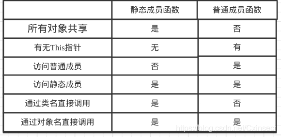

## 1.6 using

### 1.6.1 起别名

```c++
//No.1 变量,起别名
typedef int INT;
INT a = 1;
using 整数 = int;
整数 b = 12;

//No.2 函数指针,起别名
typedef int(*PFUNC)(int, int);
using FUNC = int(*)(int, int); //这两个写法是等价的
FUNC func = Max;
cout << func(1, 5) << endl;
```

相当于传统的typedef起别名

```cpp
typedef std::vector<int> intvec;
using 	intvec	= std::vector<int>;	//这两个写法是等价的
```

这个还不是很明显的优势，在来看一个列子：

```cpp
typedef void (*FP) (int, const std::string&);
```

若不是特别熟悉函数指针与typedef，第一眼还是很难指出FP其实是一个别名，代表着的是一个函数指针，而指向的这个函数返回类型是void，接受参数是int, const std::string&。

```php
using FP = void (*) (int, const std::string&);
```

这样就很明显了，一看FP就是一个别名。using的写法把别名的名字强制分离到了左边，而把别名指向的放在了右边，比较清晰，可读性比较好。比如：

```cpp
typedef std::string (Foo::* fooMemFnPtr) (const std::string&);
using fooMemFnPtr = std::string (Foo::*) (const std::string&);
```

### 1.6.2 子类中引用基类的成员

`using`的第三个作用是子类中引用基类的成员，一般都是`using CBase::a;`这样的形式出现，

**如果`ClassType`是模板的话，**

```cpp
using typename ClassType::ModuleType;
```

**如果`ClassType`不是模板的话，**

```cpp
using ClassType::ModuleType;
```

```cpp
#include <iostream>

using namespace std;

class ClassOne 
{
public:
	int w;
protected:
	int a;
};

class ClassTwo
{
public:
	using ModuleType = ClassOne;  //
};

template <typename ClassType>class ClassThree : private ClassType
{
public:
	using typename ClassType::ModuleType;   //
	ModuleType m;
	ClassThree() = default;
	virtual ~ClassThree() = default;
};

void main()
{
	ClassThree<ClassTwo>::ModuleType a;
}

```

## 1.7 类型转换

**记忆:**

| 类型名             | 类型                         | 字节 | 表示范围                            |
| ------------------ | ---------------------------- | ---- | ----------------------------------- |
| char               | 字符型                       | 1    | -128 ~127                           |
| unsigned char      | 无符号字符型                 | 1    | 0 ~255                              |
| signed char        | 有符号字符型（与字符型相同） | 1    | -128 ~127                           |
| int                | 整型                         | *    | 与机器有关- 2147483648 ~ 2147483647 |
| unsigned int       | 无符号整型                   | *    | 与机器有关                          |
| signed int         | 有符号整型（与整型相同）     | *    | 与机器有关                          |
| short int          | 短整型                       | 2    | -32,768~ 32,767                     |
| unsigned short int | 无符号短整型                 | 2    | 0~65,535                            |
| signed short int   | 有符号短整型（与短整型相同） | 2    | -32,768~ 32,767                     |
| long int           | 长整型                       | 4    | -2,147,483,648 ~2,147,483,647       |
| signed long int    | 有符号长整型（与长整型相同） | 4    | -2,147,483,648 ~ 2,147,483,647      |
| unsigned long int  | 无符号长整型                 | 4    | 0~4,294,967,295                     |
| float              | 浮点型                       | 4    | 3.4E +/- 38 (7位有效数字)           |
| double             | 双精度型                     | 8    | 1.7E +/- 308 (15位有效数字)         |
| long double        | 长双精度型                   | 10   | 1.2E +/- 4932 (19位有效数字)        |

==注:  int在16位机上是2字节,    loog在64位机上是8字节,   float  小数点6位,  double 小数点15位==

 int  一般  2 * 10^9

### 一. 隐式类型转换:

#### 1.数值类型:

**将一种类型的数据  赋值给   另外一种类型的变量时    就会发生自动类型转换，例如：**

ps:  ==先进行算数运算后 就会等到一个对应得值**==之后**再进行类型转换**

```c++
float f = 100;
//100 是 int 类型的数据，需要先转换为 float 类型才能赋值给变量 f。
//再如：
int n = f;
//f 是 float 类型的数据，需要先转换为 int 类型才能赋值给变量 n。

//先进行算数运算后就会等到一个对应得值之后,再进行类型转换
(int)(x+y);   //把表达式 x+y 的结果转换为 int 整型
```

--------

```c++
int a = 0;
long b = a + 1;              // int 转换为 long

long if (a == b) {}          // 默认的operator==需要a的类型和b相同，因此也发生转换}
```

==int转成long是向上转换，通常不会有太大问题，==  而long到int则很可能导致数据丢失，因此要尽量避免后者。

转换规则:


**注意 : 对字符 强制转换得不到 相应得数字  而是ascii码**

A 97    a 65    0 48

#### 2.类 类型:

```c++
class A{};
class B: public A  {};    //B是子类

void Fun(A& a);
B b;
Fun(b);                  //使用子类对象代替父类对象是可以的，也是因为隐式类型转换。
```

-------

```c++
class Test
{
	public:
		Test(int i);    //构造函数
};

Test t1 = 1;  //正确，由于强制类型转换，1先被Test构造函数构造成Test对象，然后才被赋值给t1
Test t2(1);   //正确
```

这种情况有时候很好，如果程序员的本意就是如此，那可以省去好几行代码。
有时这种情况看起来就不那么好，可能是一个错误，但是它却奇迹般的没有导致错误，要是因此产生一个bug，那么将是灾难性的。
**使用c++  explicit关键词:  表示只能显式的进行转换:**

```c++
//explic关键词的用法
class Test
{
	public:
		explicit Test(int i);
};
Test t2 = 1;  //编译报错
Test t2(2);   //编译没问题
```

### 二. 显示类型强制转换

#### 1. c语言的方式

语法:   Tyoe b = (Type)a

```cpp
int i = 1;
char a = (char )i;

int *p = &i;
int address = (int )p;
```

#### 2.标准C++的类型转换符

static_cast、dynamic_cast、reinterpret_cast、和const_cast。

**总结:**

+ **结论1:程序员必须清楚的知道要转变的变量，转换前是什么类型,转换后是什么类型，以及转换后有什么后果**

+ **结论2:一般情况下，不建议类型转换，避免进行类型转换**

| 类型转换符       | 用处                                                         |
| ---------------- | ------------------------------------------------------------ |
| static_cast      | 一般的转换                                                   |
| dynamic_cast     | 通常在基类和派生类之间转换时使用                             |
| const_cast       | 主要针对const的转换                                          |
| reinterpret_cast | 用于进行没有任何关联之间的转换，比如一个字符指针转换为一个整形数 |

##### (a).    static_cast

**语法：static_cast < type-id > ( exdivssion )**** 
主要有如下几种用法：
①**用于类层次结构中基类和子类之间指针或引用的转换:**
                **进行上行转换（把子类的指针或引用转换成基类表示)**；

```c++
//转换具有继承关系的对象指针

//父类指针转成子类指针
Animal* ani = NULL;
Cat* cat = static_cast<Cat*>(ani) ;

//子类指针转成父类指针
Cat* soncat = NULL;
Animal* anifather = static_cast<Animal*>(soncat) ;
```

②**用于基本数据类型之间的转换**，如把int转换成char 或者 把int转换成enum。这种转换的安全性也要开发人员来保证。

```c++
double a = 10/3;                            // 3
double a = static_cast<double>(10)/3;       // 3.3333
```

③**把空指针转换成目标类型的空指针。**(可能会报错)

```c++
int *p = NULL;
char *p = staic<char *>(p);
```

④**把任何类型的表达式转换成void类型。**

注意：static_cast不能转换掉exdivssion的const、volitale、或者__unaligned属性。

④**有继承关系的 引用**

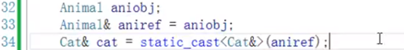

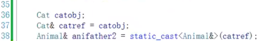

##### **结论**

**static_cast 用于:**

+ **内置的数据类型**

+ **具有继承关系的指针或者引用**

-----------

##### (b).   dynamic_cast

**语法：dynamic_cast < type-id > ( exdivssion )**

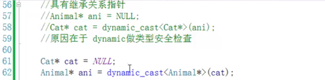

**dynamic_cast主要用于类层次间的上行转换和下行转换，还可以用于类之间的交叉转换。**
在类层次间进行上行转换时，dynamic_cast和static_cast的效果是一样的；在进行下行转换时，dynamic_cast具有类型检查的功能，比static_cast更安全。

子类转父类 由大转小 ok,  反过来 不一定可以

```c++
class B{
public:
int m_iNum;
virtual void foo();
};

class D:public B{
public:
char *m_szName[100];
};

void func(B *pb){
D *pd1 = static_cast<D *>(pb);
D *pd2 = dynamic_cast<D *>((pb);
}
```

在上面的代码段中，如果pb指向一个D类型的对象，pd1和pd2是一样的，并且对这两个指针执行D类型的任何操作都是安全的；
但是，如果pb指向的是一个B类型的对象，那么pd1将是一个指向该对象的指针，对它进行D类型的操作将是不安全的（如访问m_szName），
而pd2将是一个空指针。

另外要注意：B要有虚函数，否则会编译出错；static_cast则没有这个限制。
这是由于运行时类型检查需要运行时类型信息，而这个信息存储在类的虚函数表（
关于虚函数表的概念，详细可见）中，只有定义了虚函数的类才有虚函数表，
没有定义虚函数的类是没有虚函数表的。

另外，dynamic_cast还支持交叉转换（cross cast）。如下代码所示。

```c++
class A{
public:
int m_iNum;
virtual void f(){}
};

class B:public A{
};

class D:public A{
};

void foo(){
B *pb = new B;
pb->m_iNum = 100;

D *pd1 = static_cast<D *>((pb); //compile error
D *pd2 = dynamic_cast<D *>((pb); //pd2 is NULL
delete pb;
}
```

在函数foo中，使用static_cast进行转换是不被允许的，

将在编译时出错；而使用 dynamic_cast的转换则是允许的，结果是空指针。

##### **结论**

**dynamic  用于**:

+ **只能转换具有继承关系的指针或者引用**

+ **最好(只能)由子类型 转成 基类型**

--------------

##### (c).    const_cast

**语法：const_cast< type-id > (exdivssion)**

**作用: 增加或去除变量的const或volatile属性。**

```
**常量指针被转化成非常量指针，并且仍然指向原来的对象；**
**常量引用被转换成非常量引用，并且仍然指向原来的对象；常量对象被转换成非常量对象。**
```

Voiatile和const类试。举如下一例：

```c++
class B
{
   public:
         int m_iNum;
}
void foo()
{
      const B b1;        //
      b1.m_iNum = 100;   //error  必须但是进行初始化
    
      B b2 = const_cast<B>((b1);
      b2. m_iNum = 200;            //ok
}
```

上面的代码编译时会报错，因为b1是一个常量对象，不能对它进行改变；
使用const_cast把它转换成一个常量对象，就可以对它的数据成员任意改变。注意：b1和b2是两个不同的对象。

```c++
class A
{
	private:
		int a = 10;
		const int* p1 =  &a;
		int* p2 = const_cast<int*>(p1);
		*p2 = 20;             // 通过这样的代码 修改a的值
}
```

---------------

##### (d).reinterpret_cast(不建议用)

**语法：reinterpret_cast< type-id >(exdivssion)**

强制类型转换 可以是指针、引用、算术类型、函数指针或者成员指针。

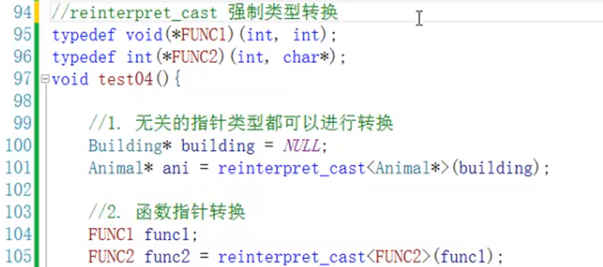


## 1.8  算术运算符

> +-*/%

### 一. 数值运行时的转换

1. **如果某一运算数是 `long double` 类型，将其它运算数转为 `long double` 类型**

2. **如果某一运算数是 `double` 类型，将其它运算数转为 `double` 类型**

3. **如果某一运算数是 `float` 类型，将其它运算数转为 `float` 类型**

4. 两个运算数都是整数的情况：

   1. **首先，进行整数提升整数提升规则**
      - 值域小于等于 int 值域的类型转换为 int 类型
      - 值域小于等于 unsigned int 值域的类型转化为 unsigned int 类型
   2. 提升后，如果两个运算数类型相同，直接计算
   3. 否则，如果两个运算数同为负数 或 同为正数，将等级小的类型转化为等级大的类型，然后计算
   4. 否则，如果无符号的运算数的等级大于等于有符号的运算数的等级，将有符号的运算数先转化为无符号的运算数，再计算
   5. 否则，如果有符号的运算数的类型的值域大于无符号的运算数的类型的值域，则，将无符号的运算数转换为有符号的运算数，再计算
   6. 否则，将两个运算数都转化为有符号数对应的无符号类型，然后计算

5. **浮点型赋值给整型时 : **

   - float 类型转换为 double 类型

   - **浮点型赋值给整型时，不会四舍五入，会直接舍去小数部分的数据**，也可以认为是执行了下取整运算。**一个浮点型若是小数部分为0，直接输出必然是不带小数点的**。

   - ```c++
     - 例如float a=3; 你若想输出3.0， 输出代码要这样写：cout << showpoint << a;
     ```

### 二. 算数运算

#### 1.最重要的两给运算:

==**核心:  先进行算数运算后就会等到一个对应得值**==之后**再进行类型转换**

​           **如:**   

```c++
 double b = 3/4;     // 显示得是0 而不是0.75 
                     // 因为 3/4 得到结果是 0  才会再进行类型转换(int-->double)  0转换成double是0.0                         但是默认不显示.0得情况
```

- **注**：在 `C++11` 中：

  - 对于除法（`/`），**结果将向 `0` 取整  不会四舍五入**，  例如：`-1/2 == 0`

    ​                                //注：除数不能为0     **两个整数相除，结果依然是整数(小数部分丢掉)**

  - 对于取模（`%`），**结果符号与被除数相同** ，例如：`-5 % -2 == -1`

    ​                                //**注：不能是两个小数，且除数不能为0.x  取模运算只针对整数**。

    #### (a). 求余的运算规律

    将两个整数看作是正数，再作除法运算:

    1.能整除时，其值为 0
    2.不能整除时，其值  =  后×整商-前，    差值的符号与前相同。

    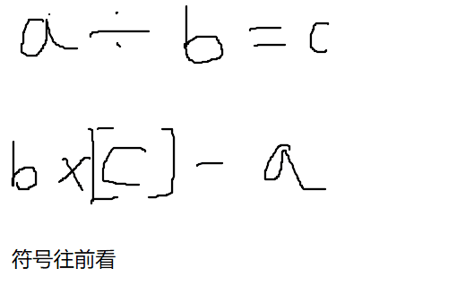

  ```
     例如：计算下 mod(7,-3) 的值
  不能整除，看作正数
     第一步，7 除以 3 得到的商为 2；
     第二步：3 * 2 - 7 = -1
     第三步：差值的符号与被除数相同，被除数是正数 7，所以最后得余数为 1
     其实就是乘法表 差
  ————————————————
  ```


**余数的妙用**

每行打印n个 

```c++
if( i % 每行输出个数 == 每行输出个数  + ( i的初始值 - 1 )          // i 初始值为 0
```

```c
void fun()
{
    for (int i = 0; i < 10; i++)
    {
        printf("%d", i + 1);
        if (i % 3 == 2)             //  3 + 0 - 1 = 2
            printf("\n");
    }
    
}

//结果
123
456
789
10
```

#### 2.其余相关运算和代码解释:

   **注**：

   - 浮点数之间的运算结果依旧是浮点数
   - 无符号的整数之间的运算结果依旧是无符号的整数
   - 有符号的整数之间的运算结果依旧是有符号的整数

~~~c++
 #include <iostream>
 using namespace std;
 int main()
 {
 	//加减乘运算:
 	int a1 = 10;
 	int b1 = 20;
 	cout << a1 + b1 << endl;    // 30
 	cout << a1 - b1 << endl;    // -10
 	cout << a1 * b1 << endl;    // 200
      
     
     //除法:
    int a1 = 10;
 	int b1 = 20;
 	cout << a1 / b1 << endl;       // 0 两个整数相除，结果依然是整数，不包含小数部分
 	double b3 = 0.36;
    double b4 = 0.42;
    cout << b3 / b4 << endl;     // 0.857143 两个小数可以相除
     //注：除数不能为0
 
     
    //求模运算(求余数)
    int c1 = 10;
    int c2 = 3;
    cout << c1 % c2 << endl; // 1
    //8 % 4     2余0    0
    //9 % 4     2余1    1
    //注：两个小数是不能进行求模运算的，且除数不能为0.x
     
 
    //前置递增：先让变量加1，然后再进行表达式的运算
    int k1 = 10;
    int k2 = ++k1 * 10;
    cout << "k1=" << k1 << endl;     // k1=11
    cout << "k2=" << k2 << endl;     // k2=110
     
 
    //后置递增：先进行表达式的运算，后让变量加1
    int l1 = 10;
    int l2 = l1++ * 10;
    cout << "l1=" << l1 << endl;    // l1=11
    cout << "l2=" << l2 << endl;    // l2=100
         
     
     return 0;
 
~~~

## 1.9 new指针

  [基础指针笔记](指针.md)

## 1.10 引用

**左引用:**

+ 左值引用做函数参数(相当于传本身过去,但是实参不能直接是右值(注意:按值转递不存在这个问题)), **左引用只能接受左值**

+ 左值引用做返回值   注意点:不能返回局部变量引用

**右引用**

+ 右值引用(实参直接是右值, 但是传左值时必须用move()转换)
  + 第一种. **常引用可以表达右值**, 但是不能操作本身数据了 //const int& cNum = 1234;
  + 第二种. 右值引用 &&

**基本用法**

```c++
	//基本用法 --->理解为起别名
	int 女朋友 = 111;
	int& 小可爱 = 女朋友;
	小可爱 = 888;
	cout << 女朋友 << endl;
	//应用场景
	//1.充当函数返回值，增加左值使用
	//注意点: 不能返回局部变量的引用
	//returnValue() = 134;
	returnValue2() = 1222;		//returnValue2()与g_num是一个东西
	cout << g_num << endl;
	//2.充当函数参数，防止拷贝本产生
	int num = 100;
	modify2(num);			//C++引用不是指针，传参传变量即可
	cout << "num:" << num << endl;
	//3.特殊引用类型
	//3.1 常用引用
	const int cNum = 11;
	const int& c = cNum;
	print(num);
	printData(num);
	printData(123);
	//print(123);
	//3.2 右值引用
	int&& girl = 11;     //右值引用--->新语法-->规则
	printData2(1234);
	//4.指针引用
	int number = 123;
	int* p = &number;	//指针类型: 去掉变量名
	int* &pp = p;
	int number2 = 1111;
	pp = &number2;
	cout << *p << endl;
	//5.关于右值引用,C++提供一个可以把左值变成右值的函数
	int data = 1234;
	int&& data2 = move(data);		//转交所有权限
	data2 = 234;
	cout << data << endl;
	data = 1234;
```

**例子**

```c++
#include <iostream>

using namespace std;
void modifyNum(int& num)
{
	num = 1000;
}

int& returnValue(int& num)
{
	return num;
}


void print(const int & num)
{
	cout << num;
}

void printValue(int&& num)
{
	cout << num;
}


int main(void)
{
	//左值引用做函数参数(相当于传本身过去,但是实参不能直接是右值(注意:按值转递不存在这个问题))
	int mm = 7;
	modifyNum(mm);
	cout << mm << endl;
	//左值引用做返回值   注意点:不能返回局部变量引用
	returnValue(mm) = 122;  
	cout << mm << endl;

	//右值引用(实参直接是右值,但是传左值必须用move()转换)
	
	//第一种. 常引用可以表达右值, 但是不能操作本身数据了 //const int& cNum = 1234;
	print(12);

	// 第二种. 右值引用
	printValue(1234);
	printValue(move(mm));  

	return 0;
}
```

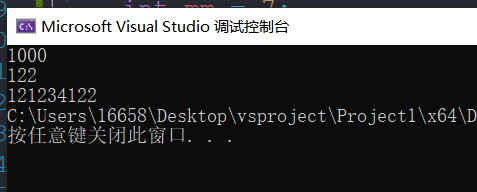

###  一、左值和右值

在 C++ 或者 C 语言中，一个表达式（可以是字面量、变量、对象、函数的返回值等）根据其使用场景不同，分为左值表达式和右值表达。

**判断某个表达式是左值还是右值的方法：**

+ ①  **位于  = 左侧就是左值；只能位于 = 右侧的就是右值。**

+ ② **有名称的、可以获取到地址的就是左值； 反之就是右值。**

+ **技巧:  **
  + **常量往往就是右值 (整形,字符就是常量,  而不是定义的常量)**
  + **匿名对象是右值**
  + **右值往往没有名称的，因此要使用它只能借助引用的方式**

```cpp
int a = 5;
5 = a;      //错误，5 不能为左值
 
/*
其中a是一个左值，字面值5是一个右值
*/

//注意:  C++中的左值也可以当作右值使用。
int b = 10;  // b 是一个左值
a = b;       // a、b 都是左值，只不过将 b 可以当做右值使用
```

上述示例中变量 a、b 是变量名且通过 &a 和 &b 可以获得他们的存储地址，因此 a 和 b 都是左值；反之，字面量 5、10，它们既没有名称，也无法获取其存储地址（字面量通常存储在寄存器中，或者和代码存储在一起），因此 5、10 都是右值。


###  二、左引用 和 右值引用

**左值引用** 用“&”表示。

```cpp
int num = 10;
int &b = num;   //正确
int &c = 10;    //错误
```

**右值引用**，用 "**&&**" 表示。

```cpp
int num = 10;
//int && a = num;  //右值引用不能初始化为左值
int && a = 10;
```

#### 右值引用的使用

① 和声明左值引用一样，右值引用也**必须立即进行初始化操作**，且**只能使用右值进行初始化**。

```cpp
int num = 10;
//int && a = num;  //右值引用不能初始化为左值
int && a = 10;
```

② 右值引用可以修改右值

```cpp
int && a = 10;
a = 11;
cout << a << endl;   //输出结果为11
```

③C++语法之词定义常量右值引用

```cpp
const int&& a = 10;  //编译器不会报错
```

但这种形式的右值引用并没有实际用处。一方面，右值引用主要用于移动语义和完美转发，其中前者需要有修改右值的权限；其次，常量右值引用的作用就是引用一个不可修改的右值，这项工作完全可以交给常量左值引用完成。

### 三、总结

① 非 常量左值引用可以引用的值的类型 只有 非常量左值， 

常量左值引用  可以引用的值的类型      非常量左值、常量左值  及  右值

```cpp
int num = 10;
int& a = num;	//编译成功，非常量左值引用支持引用非常量左值

const int num2 = 100;
int& b = num2;	//编译失败，非常量左值引用不支持引用常量左值

int& c = 10;	//编译失败，非常量左值引用不支持引用右值

const int& d = num;		//编译成功，常量左值引用支持引用非常量左值
const int& e = num2;	//编译成功，常量左值引用支持引用常量左值
const int& f = 100;		//编译成功，常量左值引用支持引用右值
```

② 右值引用不支持 引用左值；

非常量右值引用可以引用的值的类型 只有  非常量右值，

常量右值引用   可以引用的值的类型        非常量右值、常量右值

```cpp
int num = 10;
const int num2 = 100;

int&& a = num;	//编译失败，非常量右值引用不支持引用非常量左值

int&& b = num2;	//编译失败，非常量右值引用不支持引用常量左值
int&& c = 10;	//编译成功，非常量右值引用支持引用非常量右值

const int&& d = num;	//编译失败，常量右值引用不支持引用非常量左值
const int&& e = num2;	//编译失败，常量右值引用不支持引用常量左值
const int&& f = 100;	//编译成功，常量右值引用支持引用右值
```

### 四、move（）函数将左值 强制转换成 右值

move()函数的语法格式：

```cpp
move(arg)
//agr: 左值对象，该函数返回arg对象的右值形式
```

```c++
int num = 10;
int&& a = std::move(num);  //编译成功
cout << a << endl;   //输出结果为10；
```

### 五、右值引用的应用

**移动拷贝构造函数**

在 C++ 11 标准之前，如果想用其它对象初始化一个同类的新对象，只能借助类中的[拷贝构造函数](https://so.csdn.net/so/search?q=拷贝构造函数&spm=1001.2101.3001.7020)。拷贝构造函数的实现原理是为新对象复制一份和其它对象一模一样的数据。而当类中拥有指针类型的成员变量时，拷贝构造函数中需要以深拷贝的方式复制该指针成员。

```cpp
#include <iostream>
using namespace std;
class demo{
public:
    demo():num(new int(0)){
        cout<<"construct!"<<endl;
    }
    //拷贝构造函数（深拷贝）
    demo(const demo &d):num(new int(*d.num)){
        cout<<"copy construct!"<<endl;
    }
    ~demo(){
        cout<<"class destruct!"<<endl;
    }
private:
    int *num;
};
demo get_demo(){
    return demo();
}
int main(){
    demo a = get_demo();
    return 0;
}
```

> 如上所示，demo 类自定义了一个拷贝构造函数。该函数在拷贝 d.num 指针成员时，必须采用[深拷贝](https://so.csdn.net/so/search?q=深拷贝&spm=1001.2101.3001.7020)的方式，即拷贝该指针成员本身的同时，还要拷贝指针指向的内存资源。否则一旦多个对象中的指针成员指向同一块堆空间，这些对象析构时就会对该空间释放多次，这是不允许的。

可以看到，程序中定义了一个可返回 demo 对象的 get_demo() 函数，用于在 main() 主函数中初始化 a 对象，其整个初始化的流程包含以下几个阶段：

> 1. 执行 get_demo() 函数内部的 demo() 语句，即调用 demo 类的默认构造函数生成一个匿名对象；
> 2. 执行 return demo() 语句，会调用拷贝构造函数复制一份之前生成的匿名对象，并将其作为 get_demo() 函数的返回值（函数体执行完毕之前，匿名对象会被析构销毁）；
> 3. 执行 a = get_demo() 语句，再调用一次拷贝构造函数，将之前拷贝得到的临时对象复制给 a（此行代码执行完毕，get_demo() 函数返回的对象会被析构）；
> 4. 程序执行结束前，会自行调用 demo 类的析构函数销毁 a。

注意，目前多数编译器都会对程序中发生的拷贝操作进行优化，因此如果我们使用 VS 2017、codeblocks 等这些编译器运行此程序时，看到的往往是优化后的输出结果：

> construct!
> class destruct!

而同样的程序，如果在 Linux 上使用`g++ demo.cpp -fno-elide-constructors`命令运行（其中 demo.cpp 是程序文件的名称），就可以看到完整的输出结果：

> construct!        <-- 执行 demo()
> copy construct!    <-- 执行 return demo()
> class destruct!     <-- 销毁 demo() 产生的匿名对象
> copy construct!    <-- 执行 a = get_demo()
> class destruct!     <-- 销毁 get_demo() 返回的临时对象
> class destruct!     <-- 销毁 a

如上所示，利用拷贝构造函数实现对 a 对象的初始化，底层实际上进行了 2 次深拷贝操作。对于仅申请少量堆空间的临时对象来说，深拷贝的执行效率依旧可以接受，但如果临时对象中的指针成员申请了大量的堆空间，那么 2 次深拷贝操作势必会影响 a 对象初始化的执行效率。

那么当类中包含指针类型的成员变量，使用其它对象来初始化同类对象时，怎样才能避免深拷贝导致的效率问题呢？C++11 标准引入了解决方案，该标准中引入了右值引用的语法，借助它可以实现移动语义。

#### C++移动[构造函数](https://so.csdn.net/so/search?q=构造函数&spm=1001.2101.3001.7020)（移动语义的具体实现）

所谓**移动语义**，指以移动而非深拷贝的方式初始化含有指针成员的类对象。简单的理解，移动语义指的就是将其他对象（通常是临时对象）拥有的内存资源“移为己用”。

以前面程序中的 demo 类为例，该类的成员都包含一个整形的指针成员，其默认指向的是容纳一个整形变量的堆空间。当使用 get_demo() 函数返回的临时对象初始化 a 时，我们只需要将临时对象的 num 指针直接浅拷贝给 a.num，然后修改该临时对象中 num 指针的指向（通常另其指向 NULL），这样就完成了 a.num 的初始化。

> 事实上，对于程序执行过程中产生的临时对象，往往只用于传递数据（没有其它的用处），并且会很快会被销毁。因此在使用临时对象初始化新对象时，我们可以将其包含的指针成员指向的内存资源直接移给新对象所有，无需再新拷贝一份，这大大提高了初始化的执行效率。

例如，下面程序对 demo 类进行了修改：

```cpp
#include <iostream>
using namespace std;
 
class demo{
public:
    demo():num(new int(0)){
        cout<<"construct!"<<endl;
    }
 
    demo(const demo &d):num(new int(*d.num)){
        cout<<"copy construct!"<<endl;
    }
 
    //添加移动构造函数
    demo(demo &&d):num(d.num){
        d.num = NULL;
        cout<<"move construct!"<<endl;
    }
 
    ~demo(){
        cout<<"class destruct!"<<endl;
    }
private:
    int *num;
};
 
demo get_demo(){
    return demo();
}
 
int main(){
    demo a = get_demo();
    return 0;
}
```

添加了一个构造函数，和其它构造函数不同。此构造函数使用右值引用形式的参数，又称为**移动构造函数**。并且在此构造函数中，*num 指针变量采用的是**浅拷贝**的复制方式，同时**在函数内部重置了 d.num**，有效避免了“同一块对空间被释放多次”情况的发生*。

在 Linux 系统中使用`g++ demo.cpp -o demo.exe -std=c++0x -fno-elide-constructors`命令执行此程序，输出结果为：

> construct!
> move construct!
> class destruct!
> move construct!
> class destruct!
> class destruct!

通过执行结果我们不难得知，当为 demo 类添加移动构造函数之后，使用临时对象初始化 a 对象过程中产生的 2 次拷贝操作，都转由移动构造函数完成。

非 const 右值引用只能操作右值，程序执行结果中产生的临时对象（例如函数返回值、lambda 表达式等）既无名称也无法获取其存储地址，所以属于右值。当类中同时包含拷贝构造函数和移动构造函数时，如果使用临时对象初始化当前类的对象，编译器会优先调用移动构造函数来完成此操作。只有当类中没有合适的移动构造函数时，编译器才会退而求其次，调用拷贝构造函数。

> 在实际开发中，通常在类中自定义移动构造函数的同时，会再为其自定义一个适当的拷贝构造函数，由此当用户利用右值初始化类对象时，会调用移动构造函数；使用左值（非右值）初始化类对象时，会调用拷贝构造函数。

如果使用左值初始化同类对象，但也想调用移动构造函数完成，有没有办法可以实现呢？

默认情况下，左值初始化同类对象只能通过拷贝构造函数完成，如果想调用移动构造函数，则必须使用右值进行初始化。C++11 标准中为了满足用户使用左值初始化同类对象时也通过移动构造函数完成的需求，新引入了 std::move() 函数，它可以将左值强制转换成对应的右值，由此便可以使用移动构造函数。    

## 1.11 const问题

### (一)、注意const的两个概念

​       char * const   [指向字符的  静态指针]
​       const char *    [指向静态字符  的指针]   它的意思是指针指向的内容是不能被修改的

```c++
const void *a

这是定义了一个指针a，a可以指向任意类型的值，但它指向的值必须是常量。
在这种情况下，我们不能修改被指向的对象，但可以使指针指向其他对象。

例如：
const void *a；*a=0x123;//是编译通不过的，因为*a中放的是个const值。const值是不能被改变的。
const int m=1;   
const int n=2;
a=&m;  a=&n;//编译可以通过。

 

void* const a

这是定义了一个const指针a，a可以指向任意类型的值，但a是指向某个对象的常量指针。
我们不能修改指针中存储的地址，但可以修改指针指向的对象。

例如：
void* const a;这个定义：*a=0x123;是没问题的，
但是a=(void*)&b;是不行的，因为a是const变量。

如：
int m=1;   nt n=2;
a=&m;  a=&n;//编译不成功。

 
可以这么说，const void *a；中const修饰的是*a。在void* const a中，const 修饰的是a。
```

**前者const修饰的是指针，代表不能改变指针**
**后者const修饰的是char，代表字符值不能改变，但是指针可以变，也就是说该指针可以指针其他的const char。**

**const变量是不能修改本身但是可以赋值给另一个变量**

```c++
const int a = 100;
int b = a;
cout << b;  //100
```

### (二)、指针的赋值之间的关系

+ 非const指针:  不能指向(接受)const数据（数据为非指针类型)。

+ const指针:    既可以指向(及**把const或非const数据的地址赋给const指向的指针是可以的**)const数据又可以指向非const数据（**数据为非指针类型**）。 最好是对应更严谨==能这样做的原因 : 传递的实参时候是 数组而数组名就是地址==二级间接关系中，需要注意const指针的赋值。

##   1.12 C/C++的空指针

> NULL，0和nullptr

### 1.12.1 一、NULL与0

在C和C++中，NULL和0都可以使用。

C通常使用NULL，C++通常使用0

```c++
#include <stdio.h>
int main(void)
{
    int *p=NULL;
    int *q=0;
    printf("%d %d",p,q);
    //0 0
    return 0;
}
#include <iostream>
using namespace std;
int main()
{
    int *p=NULL;
    int *q=0;
    cout<<p<<" "<<q<<endl;
    //0 0
    return 0;
}
```

问：NULL到底是什么？

答：NULL是一个宏。

问：它的值是多少？

答：C/C++标准规定：它的值是一个空指针常量（null pointer constant），由实现定义。

NULL宏是如何定义的？

答：以gcc或clang编译器为例，NULL的定义大致如下（稍有简化）：

```c++
#if defined(__cplusplus)

 define NULL 0              // C++中使用0作为NULL的值
```

```c++
#else

 define NULL ((void *)0)    // C中使用((void *)0)作为NULL的值

#endif
```

问：什么样的值才能称之为空指针常量？

答：C语言中常数0和(void*)0都是空指针常量；C++中（暂且忽略C++11）常数0是，而(void*)0 不是

问：为什么C中(void*)0是空指针常量，而C++中不是？

答：因为C语言中任何类型的指针都可以（隐式地）转换为void*型，反过来也行。而C++中void*型不能隐式地转换为别的类型指针（例如：int*p = (void*)0;使用C++编译器编译会报错） 

### 1.12.2 二、nullptr(推荐使用)

nullptr是C++独有的，nullptr还是C++的一个关键字。 读音:"老"

C++引入nullptr是为了解决NULL为0，判断其是指针还是int类型的歧义

```c++
#include <stddef.h>
void foo(int)   {}   // #1
void foo(char*) {}   // #2
int main() 
{
    foo(NULL); 
    //C++会调用#1，认为NULL是0，是int
}
void foo(int)   {}   // #1
void foo(char*) {}   // #2
int main()
{
    foo(nullptr);
    //它会毫无异议地调用#2
}
```

## 1.13 退出

### 1.13.1  return 语句

return 语句的作用:

​     ( 1 ) return 从当前的方法中退出,  返回到调用该方法的语句处,  继续向下执行。
​     ( 2 ) return 返回一个值给调用该方法的语句，返回值的数据类型必须与方法的声明中的返回值的类型一致。
​     ( 3 ) return后面也可以不带参数，不带参数就是返回空，其实主要目的就是用于中断函数执行，返回调用函数

1. 返回值int 类型的函数返回：

​						return 0：一般用在主函数结束时，表示成功完成本函数
​						return -1：:表示返回一个代数值，一般用在子函数结尾。表示该函数失败

2. 布尔类型返回：

​						return 0： 返回假

​						return 1 ：返回真

3. void类型返回：

   ​			return; 表示函数返回，但是不返回值

-----------------

#### 1.13.1.1  函数if 中有return 退出函数

return是函数直接返回, 也就是结束该函数

 **在一个函数内任意位置调用return, 直接退出函数**

```c++
function_1()
{
   if(a!=b)
   {
     //代码段2;
     return ...;
    }
     //代码段1;
}
```

+ if判断正确，会执行代码段2，然后执行代码段2后面的return，  此时function_1执行结束，

​        将不再执行return之后的所有语句，所以不会执行代码段1

+ 那如果if判断错误，会跳过代码段2，直接执行代码段1

**返回0 或者 1 或者 -1都是在特定环境定义的。 比如在VC中提供的工具Error lookup中 0代表，操作成功完成。 1代表函数不正确。 -1是在子函数中使用**

+ ps:  main函数的return是返回给系统的，在系统层面，一般0表示exe执行成功，非0表示exe执行失败
+ 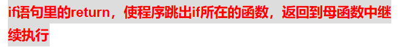

#### 1.13.1.2 循环中的  if  + return  循环找出条件/答案,  退出函数

  (在函数中调用的for循环常用)

该方法用处之一：循环找出条件/答案，

+ 如果循环结束答案没有找到就执行下面的语句

+ 如果找到答案，那就直接将方法抛弃。

ps: **如果是在函数中调用的for循环，可以用return；直接==退出当前函数执行==  从而达到退出for循环的目的  **

```c++
#include <iostream>
using namespace std;
void test(int &i)
{

     for(i=0;i<=5;i++)
    {
          if(i==2)    
          return;           //  在函数中调用的for循环
     }
}

int main(int argc,char *argv[])
{
    int i;
    test(i);
    cout<<"return的i："<<i<<endl;
    return 0;
 }
```

### 1.13.2  break 语句   (循环常用)

break 语句的作用

​    （1）**当break在循环体内时，强行终止整个循环的执行结束整个循环过程，不再判断执行循环的条件是否成立，直接转向循环体下面的语句。**
​    （2）**当break出现在循环体中的switch语句体内时，其作用只是跳出对应的switch语句体。**

'break' 用在循环语句块中, 只要执行到break语句, Matlab就会退出该循环, 但是它只能退出一层循环, 假如现在有内外两层循环, 在内层循环中执行break只会退出内层的循环.
break常和判断语句一起是使用.

#### 1.13.2.1 if + break  循环找出条件

**for循环中满足条件后使用break语句**

```
#include <iostream>
using namespace std;

int main(int argc,char *argv[])
{
    int i;
    for(i=0;i<=5;i++)
    {
        if(i==2)
          break;
    }
    cout<<i<<endl;
    return 0;
}
```

### 1.13.3  exit 函数(仅使用来处理出错的情形)

+ (1). 必须包含 `<cstdlib>` 头文件
+ 语法: **exit(EXIT_FAILURE);**    failure 费你儿
+ ==仅使用 exit 函数来处理出错的情形==

## 1.14 运算符

### 1.14.1  &和&&、|和|| 的区别

+ &&是逻辑与运算符，||是逻辑或运算符，都是逻辑运算符，**两边只能是bool类型**
+ &与| 既可以进行逻辑运算，又可以进行位运算位运算&spm=1001.2101.3001.7020)，**两边既可以是bool类型，又可以是数值类型**

if (A && B) 如果 A 为 false ，整个[表达式](https://so.csdn.net/so/search?q=表达式&spm=1001.2101.3001.7020)就为 false，不再计算 B 的值了。
if (A & B) 如果 A 为 false ，整个表达式就为 false，但还要计算 B 的值。
if (A && B++) 如果A 为 false，&&不会再计算后面的值
if (A & B++) 如果A 为 false，&则会计算后面的值

### 1.14.2 逗号运算符

**逗号表达式两种作用：**

1. 分割：  在**声明语句中**  和**for循化表达式**中  ,**逗号就是分隔符**

   如: 

   ```c++
   int head = 0, tail = 0;     //声明语句中
   
   ---------------------
   int j;
   for (int i = 20, j = 10; j < i; i++, j++)   // for循化表达式
   ```

2. 求值：**在用( ) 中,  属于逗号表达式 其值是第二部分 , 则取右边的值** , **()优先级最高**
   如 :

   ```c++
   printf("%dn" ,x%=(y%=2));  // 从右开始 
   
   printf(" %d\n",(a=a+ 1, a+b, b+1));  //  输出 b+1
   
   c = (17, 234); // c 只能是 234
   
   x=(i=4,j=16,k=42)  // x = 42
   ```

### 1.14.3 if 语句

#### 1.14.3.1 基础

1. **if ( variable == value )   可以等价成 if( value == variable)**

   ```c++
   规范 :  if (7 == a)   // 一定不能用 等号
   ```

2. **test-condition是  考虑极端情况**

3. **经常用到取反的思想**

   ```
   如果: ans != a 和 ans != b 则只能用&&连接
   ```

4. 条件运算符   ？:  可以用来简化if语句。其语法为： 

   ```sql
   条件表达式1 ? 表达式2 : 表达式3;
   ```

5. 格式:

   ```c++
   if (...)
   {
   	....
   }
   else if (...)
   {
   	....
   }
   else
   {
   	.....
   }
   ```

   ps : **只有一行语句时是可以省略括号的**

 **if…if…和if…else if的区别**

```c++
if (条件1)
{
    //语句1
}

if (条件2)
{
    //语句2
}

//这种格式中，程序会依次判断条件1和条件2是否成立并根据结果决定是否执行语句1和语句2，也就是说，第一个 if 块和第二个 if 块没有影响（除非在执行第一个 if 块的时候就凶残地 return 了）
```

而下面这种格式：

```c++
if (条件1) 
{
    //语句1
}
else if (条件2)
{
    //语句2
}

//if 块和 else if 块本质上是互斥的
```

总结:  

+ 如果是用的if，那么程序会把所有的if都走一遍。
+ 如果用的else if，当遇到符合条件的时候，程序就停止运行了，后面没执行的也不执行了。

#### 1.14.3.2 if和while中的条件

```c++
bool isBalanced(TreeNode* root) 
{
    if(root)
    {
    //表示root不为空执行  // 前提是指针
    }
    if(!root)
    {
    //表示root不为空执行
    }


    if(root==NULL)
    {
    //表示root为空执行)
    }

    if (root != nullptr)
    {
        // 表示 root不为空，就继续
    }  

    if(a)：如果a为真就继续，这里的真包括非0数字和字符；
    if(!a)：取a的相反值，就是如果a为假就继续，这个和最后一个等价；


    if(a==0)：如果a等于0，就继续；   
    if(a!=0)：这个就是如果a不等于0，就继续；


    // while 表示循环的前提条件
    while(root)
    {
        //表示root不为空循环 因为指针为空为false    //root为空就退出了
    }
    while(!root)
    {
        //为空就循环
    }

    while(a)  //表示当a!=0时执行循环，其等价于while(a!=0)。
    while(!a)  //表示当a=0时执行循环，其等价于while(a==0)。


    while(root==NULL)
    {
        //表示root为空就进入循环
    }
    while (root != NULL)
    {
        //表示root为不空就进入循环
    }
}
```

#  二、智能指针

动态内存管理会出现两种问题：一种是忘记释放内存，会造成内存泄漏；一种是尚有指针引用内存的情况下就释放了它，就会产生引用非法内存的指针。

为了更加容易（更加安全）的使用动态内存，引入了智能指针的概念。智能指针的行为类似常规指针，重要的区别是它负责自动释放所指向的对象。在使用智能指针的时候一般都是构建对象 ,不是new一个对象

C++11 引入了 3 个智能指针类型：

1. `std::unique_ptr<T>` ：独占资源所有权的指针。
2. `std::shared_ptr<T>` ：共享资源所有权的指针。
3. `std::weak_ptr<T>` ：共享资源的观察者，需要和 std::shared_ptr 一起使用，不影响资源的生命周期。

std::auto_ptr 已被废弃。

 **小结**

智能指针，本质上是对资源所有权和生命周期管理的抽象：

1. 当资源是被独占时，使用 std::unique_ptr 对资源进行管理。
2. 当资源会被共享时，使用 std::shared_ptr 对资源进行管理。
3. 使用 std::weak_ptr 作为 std::shared_ptr 管理对象的观察者。
4. 通过继承 std::enable_shared_from_this 来获取 this 的 std::shared_ptr 对象。

## (一)、共享指针 shard_ptr

```c++
#include <memory>  // 头文件
```

### 1.1  初始化

\1)创建空智能指针：

```c++
std::shared_ptr<int> p1;             //不传入任何实参
std::shared_ptr<int> p2(nullptr);    //传入空指针 nullptr
```

注意，空的 shared_ptr 指针，其初始引用计数为 0，而不是 1。


\2)创建指向一块存有 10 这个 int 类型数据的堆内存空间的智能指针(推荐):

```c++
std::shared_ptr<int> p3(new int(10));    //new 一个int内存 并且做初始化
```

```c++
    // 变量
    std::shared_ptr<int> p3(new int(10)); 
	cout << *p3 << endl;

    //数组
	shared_ptr<int>  p(new int[4]);
	int* pnum = p.get();  // 只能获取原生指针去访问
	for (int i = 0; i < 4; i++)
	{
		cout << pnum[i] << "\t";
	}
```

\3)通过函数创建智能指针(推荐)：

```c++
std::shared_ptr<int> p3 = std::make_shared<int>(10);
```

\4) 除此之外，shared_ptr<T> 模板还提供有相应的拷贝构造函数和移动构造函数，例如：

```c++
调用拷贝构造函数
std::shared_ptr<int> p4(p3);
//或者 std::shared_ptr<int> p4 = p3;
//调用移动构造函数
std::shared_ptr<int> p5(std::move(p4)); //或者 std::shared_ptr<int> p5 = std::move(p4);
```

### 1.2  提供的成员方法

| 成员方法名      | 功 能                                                        |
| --------------- | ------------------------------------------------------------ |
| operator=()     | 重载赋值号，使得同一类型的 shared_ptr 智能指针可以相互赋值。 |
| operator*()     | 重载 * 号，获取当前 shared_ptr 智能指针对象指向的数据。      |
| operator->()    | 重载 -> 号，当智能指针指向的数据类型为自定义的结构体时，通过 -> 运算符可以获取其内部的指定成员。 |
| swap()          | 交换 2 个相同类型 shared_ptr 智能指针的内容。                |
| reset()         | 当函数没有实参时，该函数会使当前 shared_ptr 所指堆内存的引用计数减 1，同时将当前对象重置为一个空指针；当为函数传递一个新申请的堆内存时，则调用该函数的 shared_ptr 对象会获得该存储空间的所有权，并且引用计数的初始值为 1。 |
| get()           | 获得 shared_ptr 对象内部包含的普通指针。                     |
| use_count()     | 返回同当前 shared_ptr 对象（包括它）指向相同的所有 shared_ptr 对象的数量。 |
| unique()        | 判断当前 shared_ptr 对象指向的堆内存，是否不再有其它 shared_ptr 对象再指向它。 |
| operator bool() | 判断当前 shared_ptr 对象是否为空智能指针，如果是空指针，返回 false；反之，返回 true。 |

>  除此之外，C++11 标准还支持同一类型的 shared_ptr 对象，或者 shared_ptr 和 nullptr 之间，进行 ==，!=，<，<=，>，>= 运算。

**智能指针的成员**

```
		get()函数:返回的是一个内置指针，指向管理对象，不能delete这个指针
		use_count():统计(引用)管理对象的智能指针对象数量
		swap():交换
		reset():  重新设置管理对象
```


```c++
#include <iostream>
#include <memory>
using namespace std;

/*
   智能指针: 能够自动管理内存
*/

class MM
{
public:
	MM(string name, int age) :name(name), age(age)
	{}
	~MM()
	{
		cout << "MM::~MM" << endl;
	}

	void print()
	{
		cout << name << ": " << age << endl;
	}
protected:
	string name;
	int age;
};


int main(void)
{
	// 2.智能指针的成员
	/*
		get()函数:返回的是一个内置指针，指向管理对象，不能delete这个指针
		use_count():统计(引用)管理对象的智能指针对象数量
		swap():交换
		reset():  重新设置管理对象
	*/

	shared_ptr<MM> pMM(new MM("小明", 19));
	cout << pMM.use_count() << endl;    // 1

	// 调用方法:
	// No.1
	pMM->print();
	//No.2
	pMM.get()->print();

	//统计
	auto pMM2(pMM);
	cout << pMM.use_count() << endl;  // 2
    // 重新设置管理对象
	pMM2.reset(); // 置为空
	cout << pMM.use_count() << endl;  // 1
	pMM2.reset(new MM("小红", 30));
	pMM2->print();
	// 交换
	pMM.swap(pMM2);
	pMM->print();
	return 0;
}
```

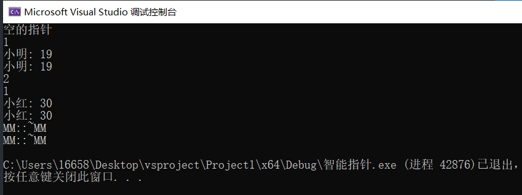


### 1.3  使用

#### 1.3.1 使用容器管理指针

#### 1.3.2  管理数组

```c++
#include <memory>
#include <string>
#include <iostream>
#include <vector>
#include <cstdio>
using namespace std;
/*

*/
void testOne() 
{
	shared_ptr<int> p1;			//无参构造
	if (!p1) 
	{
		cout << "空的智能指针对象" << endl;
		//return;
	}
	shared_ptr<int> p2(new int(123));		//new 一个int内存 并且做初始化
	//shared_ptr<int> p2 = new int(123); 错误
	shared_ptr<int> p3 = make_shared<int>(1234);
	//访问数据-->直接把智能指针对象当做指针即可
	cout << *p3 << endl;
	//cout << p3[0] << endl;  //错误,没有下标法使用方式
	//获取管理对象原生指针
	int* pNum = p3.get();
	cout << *pNum << endl;
	cout << pNum[0] << endl;
	//获取到原生指针的时候千万不要自己手动方式delete pNum;  错误
	//成员函数: use_count()
	cout <<"管理对象数:" << p3.use_count() << endl;
	shared_ptr<int> p4(p3);
	cout << "管理对象数:" << p3.use_count() << endl;
}


class MM 
{
public:
	MM(string name,int age):name(name),age(age) {}
	MM(string name) :name(name), age(0) {}
	MM() :name(""), age(0) {}
	void print() 
	{
		cout << name << "\t" << age << endl;
	}
	~MM() 
	{
		cout << "释放成功!" << endl;
	}
protected:
	string name;
	int age;
};


// 容器管理指针类型时,用智能指针
void testTwo() 
{
	shared_ptr<MM> pMM(new MM("name1", 18));
	pMM->print();
	vector<MM*> arr;
	arr.push_back(new MM("name1", 20));
	arr.pop_back();
	arr.clear();  // 不会调用析构函数的
    
    //  上述写法有弊端, 下面写法更好
	vector<shared_ptr<MM>> arr2;
	shared_ptr<MM> p(new MM("name2", 20));
	arr2.push_back(p);
    //
	shared_ptr<MM> pMM2 = make_shared<MM>("name3");
	pMM2->print();
}

// 管理数组
void testThree()
{
	// 普通类型数组
	shared_ptr<int>  p(new int[4] {1,2,3,4});
	int* pnum = p.get();  // 只能获取原生指针去访问
	for (int i = 0; i < 4; i++)
	{
		cout << pnum[i] << "\t";
	}
	cout << endl;

	//需要手动写删除器的情况
	// 自定义类型的数组
	//shared_ptr<MM>  pMM(new MM[4]) // 会报错
	// 针对对象数组
	shared_ptr<MM>  pMM(new MM[4], [](MM*& pMM) { delete[] pMM; });
	// 针对文件指针
	shared_ptr<FILE> pfile(fopen("1.txt", "w+"), [](FILE*& file) { free(file); });
}

// 当作函数参数
void printMM(shared_ptr<MM>& pMM) 
{
	pMM->print();
}

// 当作返回值
shared_ptr<int> returnPoint(int num) 
{
	return shared_ptr<int>(new int(num));
}

int main() 
{
	testOne();
	testTwo();
	testThree();
	return 0;
}
```


### 1.4  需要删除器的情况

==不是正常的new出来的对象象，一般都需要自己去写一个删除器去释放内存==

```c++
class testData
{
public:
	testData()
	{
		cout << "tetsData" << endl;
	}
	~testData()
	{
		cout << "~testData\n";
	}
};

void mycloseFile(FILE* fp)
{
	cout << "文件关闭成功\n";
	fclose(fp);
}


int main(void)
{
   // 删除器的用法
	// 正常写法:
	//shared_ptr<testData> p1(new testData[10]);  // 只会调用一个析构
	// 针对对象数组
	shared_ptr<testData> p1(new testData[10], [](testData* pObject){delete[] pObject; });

	// 针对文件指针
	shared_ptr<FILE> pf(fopen("1.txt", "w+"), mycloseFile);
    
    
    /*用lamda表达式
    //需要手动写删除器的情况
	// 自定义类型的数组
	//shared_ptr<MM>  pMM(new MM[4]) // 会报错
	// 针对对象数组
	shared_ptr<MM>  pMM(new MM[4], [](MM*& pMM) { delete[] pMM; });
	// 针对文件指针
	shared_ptr<FILE> pfile(fopen("1.txt", "w+"), [](FILE*& file) { free(file); });
	*/

}
```

**正常写法报错 :**

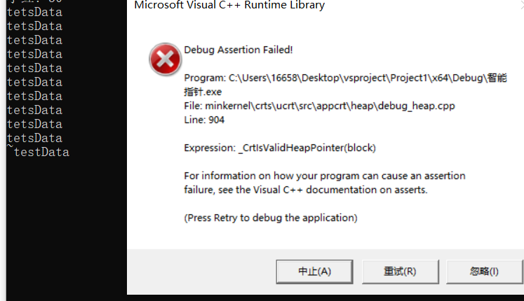

 **使用删除器后**

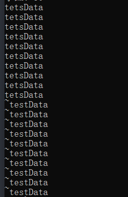

--------------

总代码:

```c++
#include <iostream>
#include <memory>
#include <cstdlib>

using namespace std;

/*
   智能指针: 能够自动管理内存
*/

class MM
{
public:
	MM(string name, int age) :name(name), age(age)
	{}
	~MM()
	{
		cout << "MM::~MM" << endl;
	}

	void print()
	{
		cout << name << ": " << age << endl;
	}
protected:
	string name;
	int age;
};

class testData
{
public:
	testData()
	{
		cout << "tetsData" << endl;
	}
	~testData()
	{
		cout << "~testData\n";
	}
};


void mycloseFile(FILE* fp)
{
	cout << "文件关闭成功\n";
	fclose(fp);
}

int main(void)
{
	// 1. 智能指针类对象
	// No.1 
	shared_ptr<int> p;
	if (!p)
	{
		cout << "空的指针" << endl;
	}

	// No.2
	shared_ptr<int> intData(new int(199));

	// No.3  make_shared: 如果是类的话,参数是由类管理的构造函数决定
	shared_ptr<string> strDate = make_shared<string>("I love you");


	// 2.智能指针的成员
	/*
		get()函数:返回的是一个内置指针，指向管理对象，不能delete这个指针
		use_count():统计(引用)管理对象的智能指针对象数量
		swap():交换
		reset():  重新设置管理对象
	*/

	shared_ptr<MM> pMM(new MM("小明", 19));
	cout << pMM.use_count() << endl;    // 1

	// 调用方法:
	// No.1
	pMM->print();
	//No.2
	pMM.get()->print();

	//
	auto pMM2(pMM);
	cout << pMM.use_count() << endl;  // 2
	pMM2.reset(); // 置为空
	cout << pMM.use_count() << endl;  // 1
	pMM2.reset(new MM("小红", 30));
	pMM2->print();

	pMM.swap(pMM2);
	pMM->print();


	// 删除器的用法
	// 正常写法:
	//shared_ptr<testData> p1(new testData[10]);  // 只会调用一个析构
	// 针对对象数组
	shared_ptr<testData> p1(new testData[10], [](testData* pObject){delete[] pObject; });

	// 针对文件指针
	shared_ptr<FILE> pf(fopen("1.txt", "w+"), mycloseFile);


	return 0;
}
```


## (二)、监视指针 weak_ptr

std::weak_ptr 要与 std::shared_ptr 一起使用。 一个 std::weak_ptr 对象看做是 std::shared_ptr 对象管理的资源的观察者，它不影响共享资源的生命周期：

1. 如果需要使用 weak_ptr 正在观察的资源，可以将 weak_ptr 提升为 shared_ptr。
2. 当 shared_ptr 管理的资源被释放时，weak_ptr 会自动变成 nullptr。

**小结:**

1. weak_ptr是一个弱引用指针，不会造成累计计数

2. weak_ptr只能从shared_ptr或者weak__ptr构造而来,

3. 目的主要是为解决shared_ptr循环引用内存未释放问题

4. 不能直接访问管理的对象（或者->访问）, 访问数据方式只能间过1ock函数访问shared ptr然后再去访问数据


### **2.1  循环引用的问题**

```c++
#include <iostream>
#include <memory>

using namespace std;
/*
1.weak_ptr是一个弱引用指针，不会累计计数
2.weak_ptr只能从shared_ptr或者weak__ptr构造而来
3.目的主要是为解决shared_ptr循环引用内存未释放问题
*/


class B;
class A
{
public:
	A()
	{
		cout << "A" << endl;

	}
	~A()
	{
		cout << "~A" << endl;
	}

	shared_ptr<B> b;
};

class B
{
public:
	B()
	{
		cout << "B" << endl;
	}
	~B()
	{
		cout << "~B" << endl;
	}

	shared_ptr<A> a;
};

int main(void)
{
	shared_ptr<A> aObject = make_shared<A>();
	shared_ptr<B> bObject = make_shared<B>();
	cout << aObject.use_count() << endl;
	cout << bObject.use_count() << endl;
	aObject->b = bObject;
	cout << aObject.use_count() << endl;
	bObject->a = aObject;
	cout << bObject.use_count() << endl;
}

```


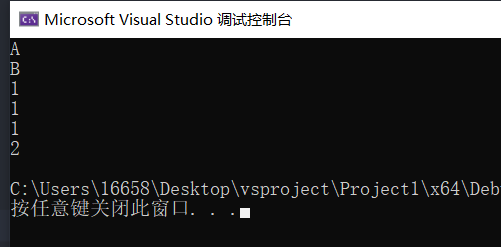

**使用weak_ptr()解决**

```c++
#include <iostream>
#include <memory>

using namespace std;
/*
1.weak_ptr是一个弱引用指针，不会累计计数
2.weak_ptr只能从shared_ptr或者weak__ptr构造而来
3.目的主要是为解决shared_ptr循环引用内存未释放问题
*/


class B;
class A
{
public:
	A()
	{
		cout << "A" << endl;

	}
	~A()
	{
		cout << "~A" << endl;
	}

	//shared_ptr<B> b;
	weak_ptr<B> b;
};

class B
{
public:
	B()
	{
		cout << "B" << endl;
	}
	~B()
	{
		cout << "~B" << endl;
	}

	//shared_ptr<A> a;
	weak_ptr<A> a;
};

int main(void)
{
	shared_ptr<A> aObject = make_shared<A>();
	shared_ptr<B> bObject = make_shared<B>();
	cout << aObject.use_count() << endl;
	cout << bObject.use_count() << endl;
	aObject->b = bObject;
	cout << aObject.use_count() << endl;
	bObject->a = aObject;
	cout << bObject.use_count() << endl;
}
```

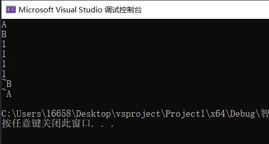


### 2.2   几种使用场景

```c++
#include <iostream>
#include <memory>

using namespace std;
/*
1.weak_ptr是一个弱引用指针，不会累计计数
2.weak_ptr只能从shared_ptr或者weak__ptr构造而来
3.目的主要是为解决shared_ptr循环引用内存未释放问题
*/


class B;
class A
{
public:
	A()
	{
		cout << "A" << endl;

	}
	~A()
	{
		cout << "~A" << endl;
	}

	//shared_ptr<B> b;
	weak_ptr<B> b;  // 3.目的主要是为解决shared_ptr循环引用内存未释放问题
};

class B
{
public:
	B()
	{
		cout << "B" << endl;
	}
	~B()
	{
		cout << "~B" << endl;
	}

	//shared_ptr<A> a;
	weak_ptr<A> a;  // 3.目的主要是为解决shared_ptr循环引用内存未释放问题
};

int main(void)
{
	shared_ptr<A> aObject = make_shared<A>();
	shared_ptr<B> bObject = make_shared<B>();
	cout << aObject.use_count() << endl;
	cout << bObject.use_count() << endl;
	aObject->b = bObject;
	cout << aObject.use_count() << endl;
	bObject->a = aObject;
	cout << bObject.use_count() << endl;

	{
		//1.weak_ptr是一个弱引用指针，不会造成累计计数
		//2.weak_ptr只能从shared_ptr或者weak__ptr构造而来

		shared_ptr<int> p(new int(100));
		cout << p.use_count() << endl;
		weak_ptr<int> w(p);  //这通过一个shared_ptr初始化

		cout << p.use_count() << endl;  // 1
		cout << w.use_count() << endl;  // 1

		weak_ptr<int> w2(w); //这通过一个weak_ptr初始化
		cout << w.use_count() << endl;   // 1
		cout << w2.use_count() << endl;  // 1
		w2.reset();
		cout << w.use_count() << endl;

		//通过weak_ptr访问shared_ptr,然后再去访问数据
		cout << *w.lock().get() << endl;
	}

}
```

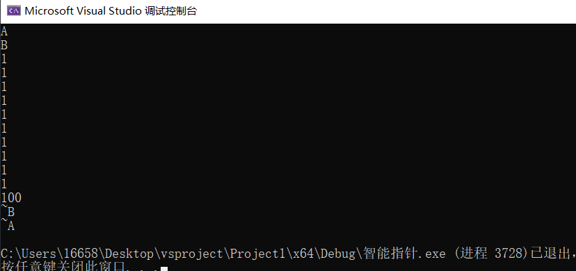


## (三)、独享指针

unique_ptr

+ 禁止拷贝和赋值
+ unique_ptr操作指针对象,  任何时候只能有一个去操作，
  	法1:  2.1通过move函数移交所有权
  	法2:  2.2通过reset结合release函数去移交

### 3.1 使用

#### 3.1.1 示例1

```c++
#include <iostream>
#include <memory>

using namespace std;
class Data
{
public:
	Data(int num) : num(num)
	{
		cout << "Data" << endl;

	}
	int getNum()
	{
		return num;
	}
	~Data()
	{
		cout << "~Data" << endl;
	}
protected:
	int num;

};

/*
unique_ptr
	1.禁止拷贝和赋值
	2.unique_ptr操作指针对象, 任何时候只能有一个去操作，
		2.1通过move函数移交所有权
		2.2通过reset结合release函数去移交
*/


int main()
{
	unique_ptr<Data> p1(new Data(1));
	// unique_ptr<Data> p2(p1);  //错误，因为拷贝构造删除了
	// unique_ptr<Data> p2;      //错误重载=函数被删除
	//p2 = p1;

	unique_ptr<Data> p2;
	//No.1
	p2 = move(p1);       // p1的所有权都给p2
	//cout << p1->getNum(); // 错误,p1 失去了管理对象
	cout << p2->getNum() << endl;
	//No.2
	p1.reset(p2.release());
	cout << p1.get()->getNum() << endl;

	//注意点:当我们自己用指针去操作智能指针操作的内存，尽量避免自己释放，导致重复析构问题
	// 下来做法错误
	Data* p3 = p1.get();
	cout << p3->getNum() << endl;
	delete p3;
	p3 = nullptr;

	return 0;
}
```

自己去释放内存造成的错误:

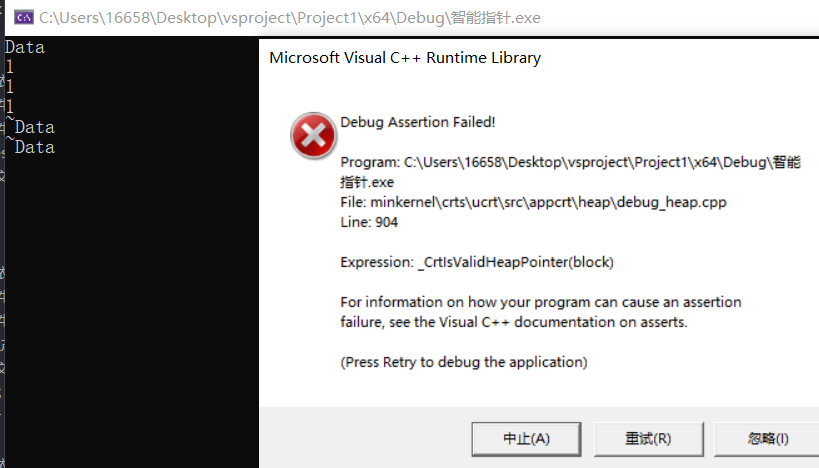


#### 3.1.2 示例2

```c++
#include <iostream>
#include <memory>
using namespace std;

/// 一般是
void testOne() 
{
	unique_ptr<int> p1(new int(1234));
	cout << *p1 << endl;
	unique_ptr<int> p2;
	//p2 = p1;						//错误
	//unique_ptr<int> p3(p2);		//错误
	p2 = move(p1);
	cout << *p2 << endl;
	//cout << *p1 << endl;			//错误,p1 失去了管理对象

	unique_ptr<int> p3(new int(435));
	p3.reset(p2.release());
	cout << *p3 << endl;
}

// 管理数组
class MM 
{
public:
	MM() {}
	void print() 
	{
		cout << "打印测试" << endl;
	}
	~MM() { cout << "析构完成..." << endl; }
protected:
};
void testTwo() 
{
	//unique_ptr 删除器写法,需要手动写入删除器的类型
	unique_ptr<MM,void(*)(MM*&)> pMM(new MM[4], [](MM*& pMM) {delete[] pMM; });
    
	using FUNC = void(*)(MM*&);  // 起别名
	unique_ptr<MM, FUNC> pMM2(new MM[4], [](MM*& pMM) {delete[] pMM; });
}

// 当作参数使用,必须用引用
void printUnique(unique_ptr<MM>& pMM) 
{
	pMM->print();
}

int main() 
{
	testOne();
	testTwo();
	unique_ptr<MM> pMM(new MM);
	printUnique(pMM);
	pMM->print();
	return 0;
}
```

### 3. 2 需要删除器的情况

​	情况和share_ptr一样但是写法不同

```c++
class MM 
{
public:
	MM() {}
	void print() 
	{
		cout << "打印测试" << endl;
	}
	~MM() { cout << "析构完成..." << endl; }
protected:
};

void testTwo() 
{
	//unique_ptr 删除器写法,需要手动写入删除器的类型
	unique_ptr<MM,void(*)(MM*&)> pMM(new MM[4], [](MM*& pMM) {delete[] pMM; });
    
	using FUNC = void(*)(MM*&); // 起别名
	unique_ptr<MM, FUNC> pMM2(new MM[4], [](MM*& pMM) {delete[] pMM; });
}
```

-----------------

# 三、C++类和对象

> C++类就是对事物的抽象，C++万物即可为类，和C语言的结构体一样的，是一系列事物的共同属性和行为。

## 3.1 构造函数和析构函数

### 3.1.1 构造函数

#### 构造函数特性

+ 构造函数名字和类名相同
+ 构造函数没有返回值
+ 不写构造函数，每一个类中都存在默认的构造函数，默认的构造函数是没有参数
  + default显示使用默认的构造函数
  + delete 删掉默认函数
  + 当我们自己写了构造函数，默认的构造函数就不存在
+ 构造函数不需要自己调用，在构造对象的时候自己调用
  + 构造函数决定的了对象的长相
  + 无参构造函数可以构造无参对象
  + 有参构造函数，对象必须要带有参数
+ 构造函数允许被重载和缺省
+ 构造函数一般情况是公有属性
+ 构造函数一般是用来给数据成员初始化
+ 构造函数允许调用另个构造函数，必须采用初始化参数列表的写法
  + 构造函数的初始化参数列表：  构造函数名(参数1，参数2,...):成员1(参数1)，成员2(参数2)....{}
+ 注意如果声明,  就必须写完定义再运行程序不然会报错
+ 用explicit 修饰构造函数得话, 不能采用  类名 对象 = { } 的方式构造对象
+ **成员初始化列表 和 this指针  可以在定义的形参名和数据成员相同时候避免二义性**

#### 综合代码

```c++
#include <iostream>
#include <string.h>
using namespace std;
class MM 
{
public:
	//构造函数
	//MM() = default;			//使用的函数是默认的构造函数
	//MM() = delete;
	MM()
	{
		cout << "无参构造函数,自己写了构造函数，默认的构造函数不存在了" << endl;
	}
	MM(int a) 
	{
		cout << "具有一个参数的构造函数" << endl;
	}
protected:
};

class Girl 
{
public:
	Girl() = delete;
protected:
};
class Student 
{
public:
	Student() = default;
	Student(string name, int age) 
	{
		//做初始化操作
		m_name = name;
		m_age = age;
	}
	void printStudent() 
	{
		cout << m_name << "\t" << m_age << endl;
	}
protected:
	string m_name;
	int m_age;
};


//初始化参数列表
class Test 
{
public:
	//构造函数特殊写法
	Test(int a, int b) :a(a), b(b)   // 成员参数列表
	{
	}
	Test():Test(0,0) {}				//无参构造函数调用有参构造函数
	//构造委托
	void print() 
	{
		cout << a << "\t" << b << endl;
	}
protected:
	int a=0;
	int b=0;
};

struct Data 
{
	int a;
	int b;
	int c;
	Data(int a) :a(a) {}
	Data(int a, int b, int c) :a(a), b(b), c(c) 
	{
		cout << "调用三个参数的构造函数" << endl;
	}
	void print() 
	{
		cout << a << "\t" << b << "\t" << c << endl;
	}
};

void testData() 
{
	Data data = { 1,2,3 };   //这个过程也是调用构造函数过程，{}中数据个数要和构造函数参数一致
}

void printData(Data data)    //待会研究
{
	data.print();
}

void printData2(Data& data) 
{
	data.print();
}

int main()
{
#if 0
	MM mm;
	MM girl(1);
	//Girl girl;
	//普通对象
	Student stu("npc", 18);
	stu.printStudent();
	//new一个对象
	Student* pstu = new  Student("执灯", 29);
	pstu->printStudent();

	//对象数组
	Student stuArray[3];			//无参构造函数构造
	Test test;
	test.print();

#endif
	Data data(1,2,3);
	printData(data);
	printData2(data);
	return 0;
}

```

### 3.1.2 析构函数

#### 析构函数特性

+ 析构函数名为 ~类名
+ 析构函数没有参数，所以析构函数不能被重载也不能缺省
+ 对象死亡(生命周期结束)的最后一个事情是调用析构函数
+ **当类的数据成员new了内存,  就必须手写一个出来析构函数**
+ 析构函数都是公有属性的
+ 不写析构函数，也会存在一个析构函数，但是不具有释放new的内存功能

#### 综合代码

```c++
#include <iostream>
using namespace std;
class MM 
{
public:
	MM() 
	{
		p = new int;
	}
	void freeMemory() 
	{
		delete p;
		p = nullptr;
	}
	~MM() 
	{
		cout << "我是析构函数" << endl;
		delete p;
		p = nullptr;
	}
protected:
	int* p;

};
int main() 
{
	{
		MM mm;
		//mm.freeMemory();
		MM* mm = new MM;
		//mm->freeMemory();
		delete mm;				//立刻马山调用析构函数
	}
	cout << "......" << endl;
	return 0;
}
```

### 3.1.3 构造和析构顺序

+ 一般情况构造顺序和析构顺序是相反的
+ new对象，调用delete直接被释放
+ static对象，最后释放

```c++
#include <iostream>
#include <string>
using namespace std;
class MM 
{
public:
	MM(string info = "A") :info(info)
	{	
		cout << info;
	}
	~MM() 
	{
		cout << info;
	}
protected:
	string info;
};
void testOrder() 
{
	MM mm1("B");			//B
	static MM mm2("C");		//C			//最后释放 C
	MM* p = new MM("D");	//D
	delete p;				//D
	MM arr[3];				//AAA
							//AAABC
}
int main() 
{
	testOrder();
	return 0;
}
```

## 3.2 复制构造函数和赋值运算符重载

### 3.2.1 复制构造函数

> **复制构造函数也叫做拷贝构造函数**(深度去复制一个对象给另一个对象)

####  3.2.1.1 复制构造函数特性

+ 不写拷贝构造函数，存在一个默认拷贝构造函数
+ 拷贝构造函数名和构造函数一样，算是构造函数特殊形态
+ 拷贝构造函数的唯一的一个参数就是对对象引用
  + 普通引用
  + const引用(一般用这个)
  + 右值引用--->移动拷贝构造函数

**会调用拷贝构造函数的情况 :**

1. **一个对象==初始化==另一个对象时**

   ```c++
   Girl girl("月亮", 18);
   
   //情形1
   Girl mm(girl);  //调用拷贝构造
   
   //情形2
   Girl beauty = mm; //调用拷贝构造
   
   //情形3,匿名对象的拷贝构造函数
   Girl test = Girl("匿名", 18);	 //调用拷贝构造 const Girl& //匿名对象是右值，右值引用
   ```

2. **当函数按值传递的类对象时  或者  函数返回对象时, 都会使用到复制构造函数(没有自定义编译器会自动生成复制构造)**

**注意:**

+ 复制构造函数会调用析构函数
+ **尽量按引用传递对象**,可以节约调用构造函数的时间和内存
+ 一般情况下要与赋值运算符(=)重载连用

```c++
StringBad::StringBad(const StringBad &st)    // 复制构造函数  // 没必要判断原来有没有因为只能在创建对象时用复制构造函数
{
	num strings++;  // 静态成员
	len = st.len;
	str = new char [len + 1]
	std::strcpy(str, st.str);
}

// 如果的数组必须用循环
```

#### 3.2.1.2 综合代码

```c++
#include <iostream>
#include <string>

using namespace std;

class MM 
{
public:
	MM() {}
	MM(MM& object) 
	{
		cout << "调用拷贝构造函数" << endl;
	}
protected:

};

class Girl 
{
public:
	Girl(string name, int age) :name(name), age(age) {}
	Girl():Girl("",0) {}
	Girl(const Girl& object) 
	{
		//构造函数就是通过一个对象赋值另一个对象
		name = object.name;
		age = object.age;
		cout << "调用拷贝构造函数" << endl;
	}
	void print() 
	{
		cout << name << "\t" << age << endl;
	}
protected:
	string name;
	int age;
};

void printGirl(Girl girl)   //Girl girl=实参
{
	girl.print();
}

void printMM(Girl& girl)
{
	girl.print();
}

void testGirl() 
{
	Girl girl("月亮", 18);
	Girl mm(girl);
	mm.print();
    
	Girl beauty = mm;
	beauty.print();
	cout << "传入普通变量" << endl;
	printGirl(girl);
	cout << "传入引用" << endl;
	printMM(girl);
	//匿名对象的拷贝构造函数
	//匿名对象是右值，右值引用
	Girl test = Girl("匿名", 18);	
}

class Boy 
{
public:
	Boy(string name, int age) :name(name), age(age) {}
	Boy(Boy&& object)		//右值引用->移动拷贝构造函数
	{
		name = object.name;
		age = object.age;
		cout << "右值引用的拷贝构造" << endl;
	}
	Boy(Boy& object) 
	{
		name = object.name;
		age = object.age;
		cout << "普通拷贝构造" << endl;
	}
protected:
	string name;
	int age;
};
void testBoy() 
{
	cout << ".............." << endl;
	Boy boy("boy", 18);
	Boy gg = boy;						//调用普通的对象
	Boy coolman = Boy("sdfd", 28);		//右值引用的拷贝构造函数
	//没有打印结果，IDE做了优化，看不到
}

int main() 
{
	MM mm;
	MM girl = mm;				//会调用拷贝构造函数
	//string str = "sdfsd";
	//string str2(str);
	//string str3 = str2;
	MM beauty(girl);			//会调用拷贝构造函数
	//误区
	MM  npc;
	npc = girl;					//运算符重载
	testGirl();
	testBoy();
	return 0;
}
```

### 3.2.2 赋值运算符重载

+ 由于目标对象可能引用了以前分配的数据，所以要delete
+ 函数应当避免将对象赋给自身
+ **函数返回一个指向调用对象的引用**
+ C++ 每个类中存在一个赋值的重载函数

```c++
  StringBad & StringBad::operator=(const StringBad & st)
  {
      // 复制来源就是本身数据时
      if (this == &st)    // object assigned to itself
  		return *this;   // alldone
      
      //
  	 delete [] str  //  原来的数据是动态创建的,所以要把自己原来的内容释放
          			// str是开辟内存空间的变量而不是类型名称
          		    //  因为这里在创建类的时候都会调用构造函数,又每一个构造函数都开创了空间
          
     // 做的事情就是复制构造函数做的事情
     len = st.len;
     str = char[len+1] 
     std::strcpy(str, st.str); 
     return *this； // 返回调用对象
  }
  
  // 返回类型不是const,因为方法operator=() 返回一个指向s2的引用,可以对其进行修改;
```

<font color=red>注意:  复制构造函数和赋值运算符重载一般连用并且写的内容逻辑也一样</font>

### 3.2.3 解决深浅拷贝问题

**深拷贝和浅拷贝**

1. 默认的拷贝构造是浅拷贝，不做内存申请的拷贝一般也是浅拷贝
2. 深拷贝，必须要为数据做新的内存申请，不可能让多个对象的指针属性指向同一段内存

```c++
#include <iostream>
#include <cstring>
#pragma warning(disable:4996)

using namespace std;


class Person
{
public:
	Person();
	Person(const char* name, int age);
	Person(const Person& p);   //
	~Person();
	Person& operator=(const Person& pr);  //
	void show()
	{
		cout << "show" << endl;
		cout << this->m_Name << this->m_Age;
	}

private:
	char* m_Name;     // 指针
	int m_Age;             
};


Person::Person()
{
	m_Name = new char[10];
	strcpy(m_Name, "null");
	this->m_Age = 100;
}

Person::Person(const char* name, int age)
{
	if (name)
	{
		m_Name = NULL;
		int len = strlen(name);
		m_Name = new char[len + 1];
		strcpy(m_Name, name);
	}
	else
	{
		strcpy(m_Name, "null");
	}
	m_Age = age;
}

Person::Person(const Person& p)  //复制构造函数
{
	int len = strlen(p.m_Name);
	m_Name = new char[len + 1];
	strcpy(m_Name, p.m_Name);

	m_Age = p.m_Age;
}

Person::~Person()
{
	delete[] m_Name;
}

Person& Person::operator=(const Person& pr)  //赋值构造函数
{
	if (this == &pr)
		return *this;

	delete[] this->m_Name;

	int len = strlen(pr.m_Name);
	m_Name = new char[len + 1];
	strcpy(m_Name, pr.m_Name);

	m_Age = pr.m_Age;

	return *this;
}

int main(void)
{
	Person pe("44", 11);
	Person p("11", 44);
	p.show();
	p = pe;
	p.show();

	Person p2(p);
	p2.show();

	Person p3;
	p3.show();
	return 0;
}
```

例子2

```c++
#include <iostream>
#include <cstring>
using namespace std;
class MM
{
public:
	MM(const char* str, int num)
	{
		int length = strlen(str) + 1;
		name = new char[length];
		strcpy_s(name, length, str);
		age = num;
	}
	MM(const MM& object) 
	{
		//深拷贝
		int length = strlen(object.name) + 1;	//有一个字符串结束标记\0
		name = new char[length];
		strcpy_s(name, length, object.name);
		age = object.age;
	}
	~MM() 
	{
		if (name != nullptr) 
		{
			delete[] name;
			name = nullptr;
		}
	}
protected:
	char* name;
	int age;
};
void testQuestion()
{
	MM mm("月亮",19);
	MM girl = mm;
}

int main() 
{
	testQuestion();
	return 0;
}
```

## 3.3 运算符重载

> **C++运算符重载赋予运算符具有操作对象的功能**

### 3.3.1 引言

```c++
#include <iostream>
using namespace std;
class Data 
{
public:
	Data(int first, int second) :first(first), second(second) {}
	void print() 
	{
		cout << first << ":" << second << endl;
	}
protected:
	int first;
	int second;
};
int main()
{
	Data data1(1, 2);
	Data data2(2, 3);
	//错误，+不能直接操作自定义类型
	//Data result = data1 + data2;
	return 0;
}
```

解决: **使用运算符重载赋予运算符具有操作对象的功能**

```c++
#include <iostream>
using namespace std;
class Data 
{
public:
	Data() {}
	Data(int first, int second) :first(first), second(second) {}
	void print() 
	{
		cout << first << ":" << second << endl;
	}
	//运算符重载函数是类成员函数
	Data operator+(Data& data) 
	{
		/*
		Data result = Data(this->first + data.first, this->second + data.second);
		return result;
		*/
		//等效下面四行函数
		/*
		
		Data result;
		result.first = this->first + data.first;
		result.second = this->second + data.second;
		return result;
		
		*/
		return Data(this->first + data.first, this->second + data.second);
	}
	friend Data operator+=(Data& data1, Data& data2);


protected:
	int first;
	int second;
};
Data operator+=(Data& data1, Data& data2) 
{
	data1.first += data2.first;
	data1.second += data2.second;
	return data1;
}
int main()
{
	Data data1(1, 2);
	Data data2(2, 3);
	//错误，+不能直接操作自定义类型
	//重载函数隐式调用
	Data result = data1 + data2;		//拷贝构造函数不写存在默认的
	//类成员函数重载本质是把data1 + data2 解析为 data1.operator+(data2);
	//重载函数显式调用
	Data result2 = data1.operator+(data2);
	result2.print();
	result.print();
	Data data3;
	data3=data3 + data1;
	int a = 1;
	a = a + 3;
	//友元重载
	Data data4(1, 4);
	Data data5(3, 5);
	data4 += data5;		//解析为 operator+=(data4, data5);
	data4.print();
	Data returnObject=operator+=(data4, data5);
	//函数返回值类型:Data 
	//函数名: operator+
	returnObject.print();
	return 0;
}
```

### 3.3.2 运算符重载特性

+ **类的运算符重载的形参有一个操作数是通过this指针隐式的传递的**

+ **重要思想:**  如果方法通过计算得到的是一个新的类, 则应考虑是否可以使用类的构造函数来完成(这样可以通过构造函数去创建一个无名的对象返回给调用者,可以让代码简洁)

+ 确定const是否要加上.  **const一般情况是都要加上的**

+ **①重载+ - *  一般返回值都是类(按值转递).   ②比较符(>,>==,<=)的话一般返回值就是bool** (通过默认运算符的或者调用函数完成需求).     **③重载[], ++ 一般返回引用,不然会出现如下问题**

  ```c++
  T& operator[](int index)   //arr[0] = 1;  // 出现表达式是可修改的左值 解决方法: 重载[]时返回引用 
  iterator& operator++(int)   //++
  ```


**对于C++运算符重载的本质就是函数调用，所以运算符重载函数如何编写最为重要**

+ 函数返回值: 当前运算符运算结束后产物类型 ,int a,int b, a+b  返回值 int
+ 函数名:  operator和运算符组成函数名
+ 函数参数
  + 运算符重载函数是类中成员函数: 函数参数等于操作数-1
  + 运算符重载函数是友元函数: 函数参数等于操作数
+ 函数体: 写运算符的实际想要的运算即可

### 3.3.3 特殊运算符重载

+ . =  () ->  []  只能重载为类成员函数
+ 运算符重载必须存在至少一个自定义类型才能重载
+ .   .*  ?:   ::  不能被重载
+ C++只允许重载已有运算符，不能无中生有
+ 习惯行为: 单目运算符采用类的成员函数重载，双目运算符采用友元重载

#### 3.3.3.1 ++ 和--运算符的重载

对于++和--重载 通过增加无用参数(int) 标识为后置运算

```c++
#include <iostream>
#include <string>
using namespace std;
class MM
{
public:
	MM(string name = "", int money = 0) :name(name), money(money) {}
	void print()
	{
		cout << name << "\t" << money << endl;
	}
	MM & operator++()				//前置的
	{
		this->money++;
		return *this;
	}
	MM operator++(int)			//int 只有标识作用 //这里不能用引用,因为是临时的
	{
		return MM(this->name, this->money++); //重要思想:  如果方法通过计算得到的是一个新的类, 则应考虑是否可以使用类的构造函数来完成(这样可以通过构造函数去创建一个无名的对象返回给调用者,可以让代码简洁)
	}

protected:
	string name;
	int money;
};

int main() 
{
	MM mm("月亮", 100);
	cout << "前置实现" << endl;
	MM result = ++mm;
	result.print();
	mm.print();
	cout << "后置实现" << endl;
	result = mm++;
	result.print();
	mm.print();

	return 0;
}
```

#### 3.3.3.2 流对象重载(友元函数)

> cout本质是一个类的对象: ostream,cin本质也是一个类对象: istream

+ 写在类里

+ **常用的友元:  重载 << 运算符**

+ **返回引用, 参数也都是引用**(流重载尽量用引用类型)

+ 固定格式:

  ```c++
  #include <iostream>
  
  // >>
  friend std::istream &operator>>(std::istream &is, complex &c);  //不用const的原因:输入肯定是想{  
     //要修改类对象的数据
   	is >> c.sdf;
  	return is;
  }
  
  //<<
  friend std::ostream &operator<<(std::ostream &os, const complex &c); // 输出只是读取,所以要加上const
  ```

+ **一般情况看调用的类在操作的运算符那侧来选择使用非成员还是成员函数来进行重载. 成员函数的运算符重载类一定在左侧**

+ **末尾没有 const**

+ **友元函数的运算符重载的形参是要操作的全部东西**

```c++
#include <iostream>
#include <string>
using namespace std;
class MM
{
public:
	MM(string name = "", int money = 0) :name(name), money(money) {}
	void print()
	{
		cout << name << "\t" << money << endl;
	}
	MM operator++()				//前置的
	{
		this->money++;
		return *this;
	}
	MM operator++(int)			//int 只有标识作用
	{
		return MM(this->name, this->money++);
	}
	//流重载  
	//cout << mm;
	friend ostream& operator<<(ostream& out, MM& object);
	//cin >> mm;
	friend istream& operator>>(istream& in, MM& object);
protected:
	string name;
	int money;
};

ostream& operator<<(ostream& out, MM& object) 
{
	out << "美女信息:" << endl;
	out << object.name << "\t" << object.money << endl;
	return out;
}

istream& operator>>(istream& in, MM& object) 
{
	cout << "请输入美女信息:" << endl;
	in >> object.name >> object.money;
	return in;
}

int main() 
{
	MM mm("月亮", 100);
	cin >> mm;
	cout << mm;
	return 0;
}
```

#### 3.3.3.3 文本重载

所谓的文本重载，就是重载后缀，固定写法 

+ 函数参数:一定是：unsigned long long
+ 函数名: operator "" 要重载的后缀    ---->一般重载后缀采用下换线系列
  + 一个运算符或者一个后缀只能重载被重载

```c++
//文本重载
unsigned long long  operator"" _h(unsigned long long num) 
{
	return num * 3600;
}
unsigned long long  operator"" _s(unsigned long long num)
{
	return num;
}
unsigned long long  operator"" _min(unsigned long long num)
{
	return num*60;
}
int main()
{
    int data = 1_h + 10_min + 50_s;
	cout << data << endl;
	return 0;    
}
```

#### 3.3.3.4 operator实现隐式转换

所谓是隐式转换就是可以让对象直接赋值给普通数据

```c++
operator 隐式转换的类型 ()
{
    return 数据;
}
```

```c++
// 定义MM类,里面的重载符如下
//隐式转换--->便捷获取数据成员的接口
operator string() 
{
    return this->name;
}

//作用类似于
string getName()
{
   return this->name;
}

//使用
MM mm("月亮", 100);
string name = mm;  //name=月亮
```

#### 3.3.3.5  综合代码

```c++
#include <iostream>
#include <string>
#include <chrono>
using namespace std;
class MM
{
public:
	MM(string name = "", int money = 0) :name(name), money(money) {}
	void print()
	{
		cout << name << "\t" << money << endl;
	}
	MM operator++()				//前置的
	{
		this->money++;
		return *this;
	}
	MM operator++(int)			//int 只有标识作用
	{
		return MM(this->name, this->money++);
	}
	//流重载
	//cout << mm;
	friend ostream& operator<<(ostream& out,const MM& object);
	//cin >> mm;
	friend istream& operator>>(istream& in, MM& object);

	//隐式转换--->便捷获取数据成员的接口
	operator int() 
	{
		return this->money;
	}
	operator string() 
	{
		return this->name;
	}
protected:
	string name;
	int money;
};
ostream& operator<<(ostream& out, MM& object) 
{
	out << "美女信息:" << endl;
	out << object.name << "\t" << object.money << endl;
	return out;
}
istream& operator>>(istream& in, MM& object) 
{
	cout << "请输入美女信息:" << endl;
	in >> object.name >> object.money;
	return in;
}

//文本重载
unsigned long long  operator"" _h(unsigned long long num) 
{
	return num * 3600;
}
unsigned long long  operator"" _s(unsigned long long num)
{
	return num;
}
unsigned long long  operator"" _min(unsigned long long num)
{
	return num*60;
}

int main() 
{
	MM mm("月亮", 100);
	cout << "前置实现" << endl;
	MM result = ++mm;
	result.print();
	mm.print();
	cout << "后置实现" << endl;
	result = mm++;
	result.print();
	mm.print();


	string str = "sdfsdf";
	cout << str << endl;			//cout << str
	
	//cin >> mm;
	//cout << mm;

	cout << 1_h << endl;

	int data = 1_h + 10_min + 50_s;
	cout << data << endl;

    // 隐式转换
	int money = mm;
	cout << money << endl;
	string name = mm;
	cout <<name << endl;

	return 0;
}
```

#### 3.3.5 运算符的应用场景

+ 迭代器实现：让对象模拟指针的行为
+ 函数包装器：把函数指针包装成为一个对象
+ 智能指针： 可以实现内存的自动申请和释放

```c++
#include <iostream>
#include <string>
#include <list>
#include <new>
#include <functional>
using namespace std;

//No.1 迭代器-->就是类中类  +  重载运算符的应用
struct Node 
{
	int data;
	Node* next;
	Node(int data = 0) :data(data), next(nullptr) {}
};

class List 
{
public:
	List() 
	{
		frontNode = nullptr;
		tailNode = nullptr;
		curSize = 0;
	}
	void push_front(int data) 
	{
		Node* newNode = new Node(data);
		if (curSize == 0)
			tailNode = newNode;
		else
			newNode->next = frontNode;
		frontNode = newNode;
		curSize++;
	}
protected:
	Node* frontNode;
	Node* tailNode;
	int curSize;

public:
	//迭代器部分
	class iterator 
	{
	public:
		iterator(Node* pmove = nullptr) :pmove(pmove) {}
		bool operator!=(const iterator& object) const
		{
			return this->pmove != object.pmove;
		}
		iterator operator++() 
		{
			pmove = pmove->next;
			return iterator(pmove);
		}
		int operator*() 
		{
			return pmove->data;
		}
	protected:
		Node* pmove;
	};
public:
	iterator begin() 
	{
		return iterator(frontNode);
	}
	iterator end() 
	{
		return iterator(nullptr);
	}
};

//No.2 函数包装器
class Func 
{
	using PF = void(*)();
public:
	Func(PF pf) :pf(pf) {}
	void operator()() 
	{
		pf();
	}
protected:
	PF pf;
};
void print() 
{
	cout << "函数包装器的测试代码" << endl;
}

//No.3 智能
//通过对象死亡会自动调用析构函数
class Auto_ptr 
{
public:
	Auto_ptr(int* ptr) :ptr(ptr) {}
	~Auto_ptr() 
	{
		if (ptr != nullptr) 
		{
			delete ptr;
			ptr = nullptr;
		}
	}
	int* operator->() 
	{
		return this->ptr;
	}
	int operator*() 
	{
		return *this->ptr;
	}
protected:
	int* ptr;
};

int main() 
{
#if 0

	string str = "ILoveyou";
	string::iterator iter;
	cout << "第一个元素:" << *str.begin() << endl;
	cout << "最后一个二元素:" << *(str.end()-1) << endl;			//*str.end() 是错误的
	for (iter = str.begin(); iter != str.end(); iter++)
	{
		cout << *iter << " ";
	}
	cout << endl;
	List list;
	list.push_front(1);
	list.push_front(2);
	list.push_front(3);
	List::iterator iterList;
	for (iterList = list.begin(); iterList != list.end(); ++iterList)
	{
		cout << *iterList << " ";
	}
	cout << endl;
#endif


	//模版---->这看不懂没关系，后面会讲
	//std::list<int> my;
	//my.push_front(1);
	//my.push_front(2);
	//my.push_front(3);
	//std::list<int>::iterator stdIter;
	//for (stdIter = my.begin(); stdIter != my.end(); ++stdIter)
	//{
	//	cout << *stdIter << " ";
	//}

	Func object(print);
	object();					//通过对象调用函数


	//模版---->这看不懂没关系，后面会讲
	function<void()> object2(print);
	object2();


	Auto_ptr p(new int(1234));
	cout << *p << endl;

	//模版---->这看不懂没关系，后面会讲
	unique_ptr<int> stdp(new int(1234));
	cout << *stdp << endl;

	return 0;
}
```

## 3.4 特殊成员

### 3.4.1 const数据成员

+ 不能被修改const数据成员
+ 初始化必须采用初始化参数列表

### 3.4.2 const成员函数

+ 写法上比较特殊的写法， const修饰函数，写在函数的后面
+ const函数和普通函数可以共存
  + 普通对象优先调用普通函数
  + 常对象只能调用常成员函数
+ const函数不能修改数据成员

### 3.4.3 const对象

+ 常对象只能调用常成员函数
+ **c++ 函数前面和后面 使用const 的作用：**
  - 前面使用const 表示返回值为const
  - 后面加 const表示函数不可以修改class的成员

```c++
#include <iostream>
#include <string>

using namespace std;

class MM 
{
public:
	MM(string Name,int Num) :num(Num)
	{
		name = Name;
		//num = Num;		//错误，const数据只能通过初始化参数列表做初始化
	}
	void print() 
	{
		//num = 123;		//错误，const数据不能被修改
		cout << name << "\t" << num << endl;
	}
protected:
	const int num;
	string name;
};

class Girl 
{
public:
	Girl(string name, int age) :name(name), age(age){}
	void print() const					//常成员函数
	{
		//name = "sfsf";				//错误，常成员函数不能修改数据成员
		cout << "常对象只能调用常成员函数" << endl;
		cout << name << "\t" << age << endl;
	}
	void print() 
	{
		cout << "普通对象优先普通函数" << endl;
		cout << name << "\t" << age << endl;
	}
	void printData() 
	{
		cout << "普通函数" << endl;
	}
protected:
	string name;
	int age;
};
int main() 
{
	MM mm("name", 1001);
	mm.print();

	Girl girl("girl", 1002);
	girl.print();
	const Girl beauty("mm", 1003);
	beauty.print();
	//beauty.printData();				//错误   常对象只能调用常成员
	return 0;
}
```

### 3.4.4 this指针

+ 用来在类中表示对象本身
+ 避免名字同名问题，用来区分参数和数据成员

```c++
#include <iostream>
#include <string>
using namespace std;
class MM 
{
public:
	MM(string name, int age) 
	{
		//this可以区分参数和数据成员
		this->name = name;
		this->age = age;
		//this = nullptr;
	}
	void print() 
	{
		cout << this->name << " " << this->age << endl;
	}
	//函数返回对象
	MM GetMM() 
	{
		return *this;
	}
	//函数返回对象指针
	MM* GetMMPoint() 
	{
		return this;
	}
protected:
	string name;
	int age;
};
int main() 
{
	MM mm("mm",18);
	mm.print();					//this表示mm的地址
	MM girl("girl", 28);
	girl.print();
	//语法上OK 没有实际含义
	mm.GetMM().GetMM().GetMM().GetMM().GetMM().print();
	mm.GetMMPoint()->GetMMPoint()->GetMMPoint()->print();

	return 0;
}
```

### 3.4.5 静态成员

static修饰数据或者函数，叫做静态成员，静态成员不属于对象，属于类，所有对象的公有的。

+ 静态依旧受权限限定
+ 静态成员访问
  + 通过对象访问
  + 直接类名限定访问
+ 静态数据必须在类外做初始化，类初始化不需要static修饰
+ 静态成员函数
  + 不能直接访问非静态数据成员，必须要通过对象去访问。
  + 静态成员函数中没有this指针(不能使用this指针)

```c++
#include <iostream>
#include <string>
using namespace std;
class Login 
{
public:
	Login(string name) :name(name)
	{
		count++;
		cout << "登录成功" << endl;
	}
protected:
	string name;
public:
	//static int count=0			//错误 ，必须在类外做初始化
	static int count;				//静态数据成员
};
int Login::count = 0;				//类外初始化

class Girl 
{
public:
	Girl(string name) :name(name) {}
	static void printData()			//静态成员函数
	{
		//this->name = "dsfd";				//错误写法，静态成员函数没有this指针
		cout << "静态成员函数" << endl;
		//cout << name << endl;				//错误 ，静态成员函数不能直接访问非静态数据成员
		cout << "count:" << count << endl;	//静态成员函数可以直接访问静态数据成员

	}
    
	static void print(Girl& girl) 
	{
		cout << girl.name << "\t" << girl.count << endl;
		Girl mm("mm");
		cout << mm.name << "\t" << mm.count << endl;
	}

protected:
	string name;
	static int count;
};
int Girl::count = 0;

int main() 
{
	Login login("小美");
	cout << Login::count << endl;
	cout << login.count << endl;
	Login mm("月亮");
	cout << Login::count << endl;
	//静态数据是所有对象共有的
	cout << mm.count << endl;
	cout << login.count << endl;
	cout << "当前游戏人数:" << Login::count << endl;

	Girl girl("girl");
	girl.printData();
	Girl::printData();
	Girl::print(girl);
	static Girl sgirl("static");			//释放是最后释放
	return 0;
}
```

## 3.5 友元函数

c++友元代表是一种关系，一种无视类的权限限定的关系，C++友元关系用friend关键字描述

+ 友元函数
+ 友元类

友元关系只是单纯提供一个场所，赋予对象具有无视权限的功能。打破类的封装性

### 3.5.1 友元函数

+ 普通函数成为友元
+ 另一个类的成员函数成为友元函数
+ 友元函数不属于类，就是一个外部函数。

```c
#include <iostream>
using namespace std;
class MM 
{
public:
	void print() 
	{
		cout << "见了一个面" << endl;
	}
	friend void hotel();				//用friend修饰的函数叫做友元函数
	friend void house(MM& girl);
protected:
	string name="mm";
private:
	int age=18;
};
//类外实现不需要friend了，不需要类名限定
void hotel() 
{
	MM mm;
	mm.print();
	cout << mm.name << "\t" << mm.age << endl;
}
void house(MM& girl) 
{
	girl.print();
	cout << girl.name << "\t" << girl.age << endl;
}
//另一个类的成员函数成为友元函数  知道有这么回事即可
class B
{
public:
	void printA();
protected:

};
class A 
{
public:
	friend void B::printA();
protected:
	int a=1234;
};

void B::printA()
{
	A aObject;
	cout << aObject.a << endl;
}
int main() 
{
	hotel();
	MM girl;
	girl.print();
	//类外无法访问类中的保护和私有属性
	//cout << girl.name << "\t" << girl.age << endl;
	house(girl);

	B b;
	b.printA();
	return 0;
}
```

### 3.5.2 友元类

```c++
#include <iostream>
#include <string>
using namespace std;
class MM 
{
	friend class Boy;
public:
	void printMM()
	{
		cout << "MM" << endl;
	}
protected:
	string name = "MM";
};

class Boy 
{
public:
	void printBoy() 
	{
		mm.printMM();
		cout << mm.name << endl;			//无视权限
	}
	void printData() 
	{
		MM girl;
		cout << girl.name << endl;			//无视权限
	}
	void print(MM& mm) 
	{
		cout << mm.name << endl;
	}
protected:
	MM mm;
};

//互为友元
class A 
{
public:
	friend class B;
	void printA();
protected:
	int a = 1;
};
class B 
{
public:
	friend class A;
	void printB() 
	{
		A aObject;
		cout << aObject.a << endl;
	}
protected:
	int b = 2;
};
void A::printA() 
{
	B bObject;
	cout << bObject.b << endl;
}
int main() 
{
	Boy boy;
	MM mm;
	boy.print(mm);

	B bObject;
	bObject.printB();


	return 0;
}
```

## 3.6 类中的public、protected、private

1、[public]() 类内外均可访问。

2、[protected](https://so.csdn.net/so/search?q=protected&spm=1001.2101.3001.7020)：类内部、派生类内部--->可以访问；   类的对象、派生类的对象-->不可访问。

3、[private](https://so.csdn.net/so/search?q=private&spm=1001.2101.3001.7020)：只有本类内部-->可以访问；                     类的对象、派生类、派生类的对象，统统的-->不可访问。

**proteced和private 在外部都不能访问,    唯一区别在有派生类中展现**

```c++
class Father
{
public:
	Father(){};
		void print()
	{
		cout << "dsd";
	}
private:
	int money;
protected:
	int name;
};

int main()
{
	Father father;
	father.print();  // public    // 正确
	father.name;     // protect   // 错误
	father.money;    // private   // 错误
	return 0;
}
```

## 3.7 C++继承

> C++继承 代表父类属性在子类中会存在一份。理解起来理解为生物学的继承即可，子承父业，传承血脉继承 子类中不会产生新的属性，派生子类会有新属性产生。继承中分为父类和子类，派生分为基类和派生类。

### 3.7.1 基本语法

```c++
class 父类{};
class 子类名:继承方式 父类名
{
	
};
//继承方式
//所谓的权限限定词
//public protected private
//公有继承  保护继承  私有继承
```

### 3.7.2 三种继承方式

继承中权限问题： 代表就是继承下来的属性在子类当中的呈现

| 继承方式  | public继承 | protected继承 | private继承 |
| --------- | ---------- | :------------ | ----------- |
| public    | public     | protected     | private     |
| protected | protected  | protected     | private     |
| private   | 不可访问   | 不可访问      | 不可访问    |

**类私有成员-----只有对应的类的成员函数能访问**

私有继承：`使用私有继承，基类的公有成员和保护成员都将成为 派生类的私有成员，是可以可以在派生类的成员函数中使用`

保护继承:  `与私有继承的区别是在派生类中才会表示出来.在派生类中可以直接访问基类的保护成员.对于外部世界而言保护成员行为和私有成员一致`

公有继承:  **可以在派生类中添加新的类数据或类方法**

<font color=red>父类中的私有属性, 无论什么继承方式 , 子类都无法访问</font>

多态公有继承: **如果在派生类中修改了基类类方法的行为。**

派生类 不能从继承继承 :  友元函数  构造析构函数(原因类名不同) 赋值构造函数

总结:   父类中的私有属性, 无论什么继承方式 , 子类都无法访问 , 其他的由继承方式确定(能降级或者平级, 比如: public继承就是该是啥就是啥继承完事儿)

```c++
#include <iostream>
using namespace std;

/*
	No.1继承中的基本概念:
	父类  子类
	基类派生类(子类中有新增东西)
	如何写一个继承
	class  子类 : 继承方式  父类名
	{

	};
	继承方式:  public  protected  private

	No.2继承的实质:  表示父类中的属性在子类当中都存在
	NO.3 继承的权限问题
	继承方式:   public     protected private
	父类属性:   
	pubic:      pubic       protected   private
	protected:    protected   protected   private
	private:    不可访问     不可访问      不可访问
	权限限定词只会增强权限

	// 父类中的私有属性, 无论什么继承方式 , 子类都无法访问
*/

class father
{
public:
	father(int money) : money(money)
	{}
	void print();
private:
	int money;
protected:
	int name;
};


// 公有属性  -- > 同属性继承
class Son : public father
{
public:
		//print();
private:
	
protected:
	    //int name;
};

// 私有继承 ---> 基类的公有成员和保护成员都将成为 派生类的私有成员 , 因此可以在派生类的成员函数中使用
class Son2 : private father
{
public:
	
protected:

private:
	//  print();
	//   int name;

};

//保护继承 ---> 在派生类中可以直接访问基类的保护成员.对于外部世界而言保护成员行为和私有成员一致
class Son3 : protected father
{
public:

protected:
	//  print();
	//  int name;
private:

};


int main()
{	
	return 0;
}

```

### 3.7.3 继承方式特性

+ 继承中权限
  + 继承方式只能增强权限
  + 父类当中私有属性，无论采用什么继承方式，子类都可以直接访问
+ 继承中的构造函数

  + 继承下来的属性必须要通过父类的构造函数去初始化
  + 子类的构造函数必须要采用初始化参数列表的方式调用父类的构造函数
  + 构造顺序:优先构造父类，在构造在类

```c++
#include <iostream>
using namespace std;
//权限问题
class MM				//父类
{
public:
	string name;
	void print() {}
protected:
	int age;
private:
	int num;
};
class Girl :public MM	//子类
{
public:
	//	string name;
	//	void print() {}
	void printGirl() 
	{
		cout << name << "\t" << age << endl;
		//cout << num << endl;			//错误的，私有属性不能被访问
	}
protected:
	//	int age;
private:
	//	int num;  不可访问
};

class Boy :protected MM 
{
public:
	void printBoy() 
	{
		cout << name << "\t" << age << endl;
		//cout<<num<<endl;					//错误的
	}
protected:
	//	string name;
	//	void print() {}
	//	int age;
private:
	//	int num;  不可访问
};

class GG :private MM 
{
public:
	void printGG() 
	{
		cout << name << "\t" << age << endl;
	}
protected:

private:
	//	string name;
	//	void print() {}
	//	int age;
	//	int num;				//不可访问的
};
//构造函数写法
class Father 
{
public:
	Father() { cout << "构造father" << endl; }
	Father(string name, int money) :name(name), money(money) {}
	void printFather() 
	{
		cout << name << "\t" << money << endl;
	}
	string GetName() 
	{
		return name;
	}
protected:
	int money;
private:
	string name;
};
class Son :public Father 
{
public:
	Son()					//子类想要这种构造函数，父类必定存在一个无参构造函数
	{
		cout << "构造son" << endl;
	}
	Son(string name, int money, int num) :Father(name, money)
	{
		this->num = num;				//这个东西初始化没有要求
	}
	void printSon() 
	{
		//私有属性不能直接访问，但是可以通过父类的方法访问
		cout << GetName() << "\t" << money << "\t" << num << endl;
	}
protected:
	int num;
};

int main() 
{
	Girl girl1;
	girl1.name = "sdfd";
	girl1.print();
	//girl1.age = 12;					//保护属性
	Boy boy;
	//boy.name = "sdfds";				//继承方式只会增强权限


	Son son;
	Son son2("老汉儿", 100, 1001);
	son2.printSon();

	return 0;
}
```

###  3.7.4 派生类构造函数

**说白了通过初始化参数列表, 利用父类的构造构造函数,构造个父类**

继承中构造函数的写法

1. 子类的构造函数必须要调用父类的构造函数，因为 继承下来的属性，只能通过父类的构造函数进行初始化

2. 子类的构造函数初始化父类的属性的时候，必须采用初始化参数列表的方式进行初始化

**核心要点:**

1. 创建基类对象(在头文件中操作)

   + 法一:    **B(int n, const A &a)**
   + 法二:    **B(int n,  int a, string str);**  // int a, string str 是  A的数据成员

2. 派生类构造函数应通过成员初始化列表将基类信息传递给基类构造函数(一般在源文件中)(1.基类的参数写在后面,  2. 形参名和基类的一致. )

   + 法一:   

     ```c++
     B::B(int n, const A &a) : A(a)   // 类传递类,会调用复制构造函数.//但不需要使用动态内存所以可以这样
     {
     }
     ```

   + 法二:   

     ```c++
     B::B(int n,  int a, string str) : A(a, str)  // int a, string str 是A的数据成员
     {
     }
     ```

3. 派生类构造函数初始化派生类新增的数成员


**太长换行格式:** 

+ **(1) .h中与()对齐**
+ **(2).cpp文件中与最前面对齐**
+ **(3) :  在行首是可以的**

### 3.7.5 派生类与基类的关系

1. **派生类对象可以使用基类的方式(私有方法除外).  通过 . 的方式**

   + 如:

     ```c++
     B b;
     b.a1();  //a1是基类的方法 
     ```

2. **基类指针/引用可以在不进行显示类型转换的情况下指向派生类(单向的),  但是基类的指针只能调用基类的方法.不能直接去调用派生类的方法.**(==除虚方法, 虚方法可以自动匹配,new的对象==)

   + 如:

     ```c++
     A *a = &B;
     a->a1(); // 基类的指针只能调用基类的方法  // 如果是虚函数就会使用的是子类的
     ```

      例子:

     ```c++
     #include <iostream>
     
     using namespace std;
     
     class MM
     {
     public:
     	virtual void printf()
     	{
     		cout << "父类的虚函数" << endl;
     	}
     
     	void print()
     	{
     		cout << "父类的普通函数" << endl;
     	}
     };
     
     class Boy : public MM
     {
     public:
     	void printf()
     	{
     		cout << "子类的虚函数" << endl;
     	}
     
     	void print()
     	{
     		cout << "子类的普通函数" << endl;
     	}
     };
     
     int main(void)
     {
     	MM* mm = new Boy;
     	mm->print();        // 父类的普通函数   //函数没有virtual 看指针类型
     	mm->printf();	    // 子类的虚函数     //函数有virtual 看对象类型
     
     	return 0;
     }
     ```

     运行结果:

     ```c
     父类的普通函数
     子类的虚函数
     ```

3. **能将基类的对象初始化为子类对象**

   + 如:

     ```c++
     B b(xxx);
     A a(b);
     
     -------------
     B b(xxx);
     A a;
     a = b; // 赋值-->调用重载运算符
     ```


### 3.7.6 多继承

#### 3.7.4.1 简单多继承

存在2个或者是2个以上的父类称之为多继承

+ 构造顺序问题： 只和继承顺序有关，和初始化参数列表的顺序没有一点关系

```c++
#include <iostream>
using namespace std;
//欧皇
//阳倩
//欧阳锋

class MM 
{
public:
	MM(string firstMMName, string secondMMName) 
	{
		this->firstMMName = firstMMName;
		this->secondMMName = secondMMName;
	}
protected:
	string firstMMName;
	string secondMMName;
};

class GG 
{
public:
	GG(string firstGGName, string secondGGName) :firstGGName(firstGGName), secondGGName(secondGGName)
	{

	}
protected:
	string firstGGName;
	string secondGGName;
};

class Son :public MM, protected GG 
{
public:
	Son(string firstGGName,string secondGGName,
		string firstMMName,string secondMMName,
		string secondSonName) :GG(firstGGName,secondGGName),MM(firstMMName,secondMMName)
	{
		this->firstSonName = firstGGName + firstMMName;
		this->secondSonName = secondSonName;
	}
	void printName() 
	{
		cout << (firstSonName + secondSonName) << endl;
	}
protected:
	string firstSonName;
	string secondSonName;
};

int main() 
{
	Son son("欧", "皇", "阳", "倩", "锋");
	son.printName();
	return 0;
}
```

#### 3.7.4.2 菱形继承

继承无论被继承多少次，属性一致都在，所以一般类不能被继承很多层。继承太多次数，会导致子类臃肿

```c++
/*
		A
		
	B		 C

		D
D中A的属性，必须调用A的构造函数初始化
*/

#include <iostream>
using namespace std;
class A 
{
public:
	A(int a) :a(a) {}
protected:
	int a;
};

class B :virtual public A 
{
public:
	B(int a, int b) :A(a), b(b) {}
protected:
	int b;
};

class C :virtual public A 
{
public:
	C(int a,int c):A(a),c(c){}
protected:
	int c;
};

class D :public B, public C 
{
public:
	D(int a, int b, int c, int d) :B(a, b), C(a, c), A(a) {}
	D() :B(1, 2), C(3, 4), A(5) {}
	void print() 
	{
		cout << a << endl;
		//虚继承的目的就是为了让孙子类只保留一份爷爷类的属性
		cout << A::a << endl;
		cout << B::a << endl;
		cout << C::a << endl;
	}
protected:
	int d;
};

int main() 
{

	D  d(1, 2, 3, 4);
	d.print();

	D d2;
	d2.print();

	return 0;
}
```

#### 3.7.4.3 继承中的同名问题

+ 没有用类名限定的基础上，就近原则，在哪个类里面调用那个类的方法
+ 用类名限定，可以访问指定类中的成员
+ 类指针被子类对象初始化
  + 父类没有virtual ，就看指针类型
  + 有virtual ，看对象类型

```c++
#include <iostream>

using namespace std;

class MM 
{
public:
	void print() 
	{
		cout << "MM::print" << endl;
	}
protected:
	string name="MM";
};

class Son :public MM 
{
public:
	void print() 
	{
		cout << "Son::print" << endl;
		cout << name << endl;	//就近原则
		cout << MM::name << endl;
	}
	void printData() 
	{
		print();
	}
protected:
	string name="son";			//就近原则
};

int main() 
{
	//正常调用--->就近原则
	Son son;
	son.print();
	son.printData();
	Son* pSon = new Son;
	pSon->print();				//覆盖 --->正常情况调用，无法访问到父类的同名方法
	pSon->MM::print();			//类名限定调用相应类函数
	//非正常调用
	MM* pFather = new Son;		//C++允许父类指针被子类对象初始化
	pFather->print();			//父类中没有virtual修饰的时候，看指针类型，有virtual看对象类型
	//pFather->printData();		//错误，父类指针不能访问子类中父类没有属性
	//注意点: 子类指针被父类对象初始化，有危险。一般不被允许
	return 0;
}
```

## 3.8 虚函数和多态

#### 3.8.1 虚函数

C++类中用virtual修饰函数虚函数,构造函数没有虚构造函数，存在虚析构函数，C++所有函数 都是一个指针去存储的，所以具有虚函数的类，内存会增加一个指针大小的内存。

1. 虚函数在类中用virtual修饰的函数就是虚函数

2. 虚函数对于类的内存影响
   + 空的类的内存:    1字节(类中不存在虚函数)
   + 对于类有数据后，就按照c语言结构一样的内存对齐方式去计算内存
   + 虚函数对于类的内存影响无论多少个虚函数都是用一个指针去存储，所以只会增加一个指针类型的字节数4

```C++
#include <iostream>
#include <string>
using namespace std;
class MM 
{
public:
	virtual void print() 
	{
		cout << "我是一个虚函数" << endl;
	}
	virtual void printData() 
	{
		cout << "我是第二个虚函数" << endl;
	}
protected:
};

class Boy :public MM 
{
public:
	void print() 
	{
	}
protected:

};

int main(void)
{
	// 空的类占一个字节
	cout << sizeof(Boy);

	// 虚函数存放的函数指针
	cout << sizeof(MM);      // 是8

	// 通过虚函数 去访问函数  
	MM mm;
	int** pObeject = (int**)&mm;
	using pf = void(*)();

	pf pf1 = (pf)pObeject[0][0];   // 调用第一个虚函数
	pf1();

	pf pf2 = (pf)pObeject[0][1];
	pf2();
	return 0;
}

/*
Boy:1
M:4
我是虚函数！
第二个虚函数
*/
```

**虚函数的保存方式:**

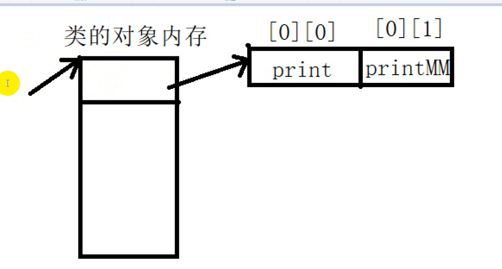

#### 3.8.2 纯虚函数

纯虚函数也是虚函数一种，只是没有函数体，怎么表示没有函数体

+ 纯虚函数--->虚函数=0;
+ 具有一个或者多个纯虚函数的类叫做抽象类
  + 抽象类不能构建对象
  + 但是可以构建对象指针

```c++
#include <iostream>
using namespace std;
class MM 
{
public:
	virtual void print() = 0;			//纯虚函数
protected:

};

int main() 
{
	//MM mm;							//抽象类不能构建对象
	MM* pmm = nullptr;
	return 0;
}
```

#### 3.8.3 虚析构函数

> virtual修饰的析构函数就是虚析构函数，当存在子类对象初始化父类指针的时候，父类析构函数就是要虚析构函数。基类必须使用一个虚析构函数。

```c++
#include <iostream>

using namespace std;

class MM 
{
public:
	virtual ~MM() 
	{
		cout << "MM:" << endl;
	}
};

class Girl :public MM 
{
public:
	~Girl() 
	{
		cout << "Girl:" << endl;
	}
};

int main() 
{
	MM* p = new Girl;		//子类对象初始化父类指针的时候，父类的析构函数要用virtual修饰
	delete p;
	return 0;
}
```

#### 3.8.4 C++多态(多态公有继承)

> 多态指的是因为指针的不同对象的赋值操作所导致的统一行为的不同结果。

多态公有继承: ==**如果在派生类中修改了基类类方法的行为就使用多态公有继承。**==

1. 存在不正常指针的引用(不正赋值关系)
2. public继承
3. 父类中存在虚函数
4. **基类必须使用一个虚析构函数(virtual ~B())**

1. **如果要派生类中重新定义基类的方法, 则将它设置为虚方法(及方法声明的前面加一个virtual. 基类和派生类的方法样子一样) ,否则设置为非虚函数**
2. **虚方法定义时,如果派生类的 虚方法要使用基类的虚函数则要加 :: 指明是基类的虚函数(原因同名).  但是使用基类普通方法就直接用就是**.  用虚函数则使用动态联编
3. 可以使用一个基类的对象指针来表示多种类型的

**核心要点:**

+ **正常指针和正常对象调用行为，就近原则**
+ <font color=red>父类指针被子类对象初始化</font>
  + ==函数有virtual 看对象类型==
  + ==函数没有virtual 看指针类型==
  + 总结: 是虚函数到底调用什么看new的对象
+ **final关键字 禁止子类重写父类方法**
+ **override 显示说明当前函数重写函数**

例子1

```c++
#include <iostream>

using namespace std;

class MM 
{
public:
	virtual void print() 
	{
		cout << "美女上厕所" << endl;
	}
	void printData() 
	{
		cout << "美女" << endl;
	}
	virtual void print2() final   //final关键字 禁止子类重写父类方法
	{
		cout << "final 禁止重写" << endl;
	}
};

class GG :public MM 
{
public:
	void print() override					//重写
	{
		cout << "帅哥上厕所" << endl;
	}
	void printData()
	{
		cout << "帅哥" << endl;
	}
	//void print2()    //错误，父类禁止重写
	//{

	//}
protected:
};

int main() 
{
	//正常调用，就近原则
	GG gg;
	gg.print();
	gg.printData();
    // 子类如果想要访问继承下来的同名函数, 使用 类名::强制指定
	gg.MM::printData();   //访问MM中的printData()
    
	MM mm;
	mm.print();
	mm.printData();
    
	GG* pGG = new GG;
	pGG->print();
	pGG->printData();
    
	MM* pMM = new MM;
	pMM->print();
	pMM->printData();
    
	//非正常调用
	MM* p = new GG;
	p->print();				//函数有virtual看对象  一号行为
	p->printData();			//函数没有virtual看指针类型
	p = &mm;
	p->print();				//二号行为
	return 0;
}
```

例子2

```c++
#include <iostream>

using namespace std;

class MM
{
public:
	void print()
	{
		cout << "MM print" << endl;
	}

	virtual void printVirtual()
	{
		cout << "MM printVirtual" << endl;
	}

	virtual ~MM();
protected:

};


class Boy : public MM
{
public:
	void print()
	{
		cout << "Boy print" << endl;
	}

	void printVirtual()    // 重写
	{
		cout << "Boy printVirtual" << endl;
	}
	~Boy();
protected:
};

class Nn : public Boy
{
public:
	void printVirtual()
	{
		cout << "Nn printVirtual" << endl;
	}
	~Nn();
};


int main(void)
{
	// N0.2 多态
	// 正常情况下的对象 : 就近原则同名无所谓
	MM mm;
	Boy boy;
	mm.print();
	boy.print();
	// 子类如果想要访问继承下来的同名函数, 使用 类名::强制指定
	boy.MM::print();

	//非正常情况:  父类指针被子类对象初始化，但是子类对象不能被父类对象初始化
	//不存在virtual的情况下:看指针类型
	MM* pMM = new Boy;
	pMM->print();
	// Boy * pBE = new MM;  // 危险行为

	// 存在virtual的情况下:
	pMM->printVirtual();  // 用的子类同名函数

	pMM = &mm;
	pMM->printVirtual();  // 用父类中的函数

	//C++多态，因为赋值的不同，而导致的相同行为的不同的结果，把这一现象称之为多态(重写)

	// 多态的必要因素:
	// 1.必须父类存在virtual 2.子类必须存在同名函数  3.必须存在这样非正常情况下的指针使用(父类指针被子类指针初始化)
	// 虚函数一直是虚函数,不论被继承多少次
	pMM = &boy;
	pMM->printVirtual();
	Boy* pBg = new Nn;
	pBg->printVirtual();  // 用的子类Nn的同名函数


	// N0.3 析构问题
	// 虚析构函数

	return 0;
}
```

#### 3.8.5 纯虚函数和抽象类

> ADT: abstract data type  抽象数据类型  主要是通过继承抽象类中，子类必须要实现父类的抽象方法，子类才可以创建对象。

例子1

```c++
#include <iostream>

using namespace std;

//No.1纯虚函数就是没有函数体的虚函数虚函数=0;
//No.2具有至少—个纯虚函数的类叫做抽象类
// 2.1抽象不能构建对象
// 2.2抽象类可以构建对象指针

//No.3 ADT abstract data type : 抽象数据类型
//抽象类被继承下来，子类如果想要构建对象，必须要把父类中纯虚函数重写

class MM
{
public:
	virtual void print() = 0;
};


class stack
{
public:
	virtual ~stack();
	virtual void push() = 0;
	virtual void pop() = 0;
	virtual bool empty()const = 0;
	virtual bool full() = 0;
	virtual int tpo() = 0;
	virtual int size() = 0;
};

class arrrStack : public stack
{
public:
	~arrrStack();
	void push()
	{}
	void pop()
	{}
	bool empty() const
	{
		return true;
	}
	bool full()
	{
		return false;
	}
	int tpo()
	{
		return 11;
	}
	int size()
	{
		return 111;
	}
};

int main(void)
{
	//MM mm;  // 报错 抽象不能直接创建对象

	stack* pStack = new arrrStack;
	for (int i = 0; i < 3; i++)
	{
		pStack->push();
	}
	return 0;
}
```

例子2

```c++
#include <iostream>
#include <string>

using namespace std;

class MM 
{
public:

protected:
	string name;
	int age;
};

class MMSystem 
{
public:
	virtual void insertData(MM data) = 0;
	virtual void printData() = 0;
	virtual bool empty() const = 0;
	virtual int size() const = 0;
};

class List :public MMSystem
{
public:
	void insertData(MM data) 
	{

	}
	void printData()
	{

	}
	bool empty() const 
	{
		return false;
	}
	int size() const 
	{
		return 0;
	}
protected:

};

class Array :public MMSystem 
{
public:
	void insertData(MM data)
	{

	}
	void printData()
	{

	}
	bool empty() const
	{
		return false;
	}
	int size() const 
	{
		return 0;
	}
protected:

};

int main() 
{
	MMSystem* pmm = new List;
	MM mm;
	pmm->insertData(mm);
	pmm->printData();
	cout << pmm->empty() << endl;  //0

	MMSystem* pmm2 = new Array;
	pmm2->insertData(mm);
	pmm2->printData();
	cout << pmm2->empty() << endl; //0

	return 0;
}
```

#### 3.8.6 dynamic_cast 类型转换

**dynamic_cast转换:**

+ 上行转换  子类到父类   和 static_cast 差不多
+ 下行转换  父类到子类   dynamic_cast 更为安全
+ 交叉交换  多继承

```c++
#include <iostream>

using namespace std
    
class MM
{
public:
	 virtual void print() 
	 {
		cout << "MM" << endl;
		cout << name << endl;
	 }
	 //void printMM() 
	 //{
		// cout << "父类有，子类没有的方法" << endl;
		// cout << name << endl;
	 //}
protected:
	string name = "MM";
};

class Girl :public MM 
{
public:
	void print() 
	{
		cout << "Girl" << endl;
		cout << gName << endl;
	}
	//void printData() 
	//{
	//	cout << "子类有父类没有的方法" << endl;
	//	cout << gName << endl;
	//}
protected:
	string gName = "girl";
};

class A 
{
public:
	virtual void print() { cout << "A" << endl; }
};

class B 
{
public:
	virtual void print() { cout << "B" << endl; }
};

class C :public A, public B 
{
public:
	void print() { cout << "C" << endl; }
};

int main() 
{

	MM* parent = new MM;  //父类
	Girl* son = new Girl; //子类
	//上行转换
	MM* psUP = static_cast<MM*>(son);  //子类转父类
	MM* pdUP = dynamic_cast<MM*>(son); 
	MM* p = son;					  //隐式转换是成立
	psUP->print();
	psUP->print();
	//下行转换
	//Girl* pp = parent;			//正常是危险的。

	Girl* psDown = static_cast<Girl*>(parent);  //父类转子类
	psDown->print();
	//psDown->printData();
	//psDown->printMM();
	cout << "......" << endl;
	Girl* pdDown = dynamic_cast<Girl*>(parent);   //能够检测是否存在virtual，不存在不能转换
	if (pdDown != nullptr) 
	{
		pdDown->print();
		//pdDown->printData();
		//pdDown->printMM();
	}


	A* pA = new C;
	B* pB = dynamic_cast<B*>(pA);
	pB->print();

	return 0;
}
```

#### 3.8.7 成员函数指针

```c++
#include <iostream>
#include <functional>

using namespace std;

class MM 
{
public:
	void print() 
	{
		cout << "我是成员函数" << endl;
	}
	static void printData() 
	{
		cout << "静态成员函数" << endl;
	}
};

void printInfo(int a, int b, int c) 
{
	cout << "a:" <<a<< endl;
	cout << "b:" <<b<< endl;
	cout << "c:" <<c<< endl;
}

void testBind() 
{
	//bind:函数适配器，让函数调用形态可以适用于别的形态
	printInfo(1, 2, 3);
	auto func = bind(&printInfo, std::placeholders::_1, std::placeholders::_2, 123);
	func(11,22);
}

int main() 
{
	//创建方式

	//p = &MM::printData;
	//写不明白的同学 一个auto搞定
	auto p2 = &MM::printData;
	p2();
	void(*p3)() = &MM::printData;
	p3();

	//普通函数创建指针
	void (MM:: *p)() = &MM::print;

	//调用形态
	MM mm;
	(mm.*p)();

	//auto func= bind(&MM::print, &mm);
	//func();
	testBind();
	return 0;
}
```

### 3.9 C++匿名对象

**1.产生匿名对象的三种情况：**
  1）以值的方式给函数传参；

​				Cat(); —> 生成了一个匿名对象，执行完Cat( )代码后，此匿名对象就此消失。这就是匿名对象的生命周期。

​			   Cat cc = Cat(); —>首先生成了一个匿名对象，然后将此匿名对象变为了cc对象，其生命周期就变成了cc对象的生命周期。

  2）[类型转换]

  3）函数需要返回一个对象时；return temp;

**2.匿名对象的生命周期**

注意：匿名对象的生命周期（重要）

例子1：

```cpp
class A
{
public:
    A(int s)
    {
        i = s;
    }

    void myshow()
    {
          cout<<i<<endl;
    }
private:
     int i;
};

void playstage()
{
     cout << A(10).myshow() << endl;//调用匿名对象

　　　A a = 11;//此处发生隐身转换。。。。相当于  A a = A(11);   此处的A(11)就是一个匿名对象

     A b = A(12);//当匿名对象有等待初始化的对象接的时候，只调用一次构造和析构函数
     
     A c;//调用一次构造函数
     c = A(13);//此处为赋值。此处的匿名对象会调用一次构造函数
}

void main()
{
    playstage();

    system("pause");

}

```

例2：

```cpp
class Cat
{
public:
    Cat()
    {
        cout<<"Cat类 无参构造函数"<<endl;
    }

    Cat(Cat& obj)
    {
        cout<<"Cat类 拷贝构造函数"<<endl;
    }

    ~Cat()
    {
        cout<<"Cat类 析构函数 "<<endl;
    }

};

void playStage() //展示对象的生命周期
{
    Cat();             /*在执行此代码时，利用无参构造函数生成了一个匿名Cat类对象；执行完此行代码，
                            因为外部没有接此匿名对象的变量，此匿名又被析构了*/
    Cat cc = Cat();    /*在执行此代码时，利用无参构造函数生成了一个匿名Cat类对象；然后将此匿名变 成了cc这个实例对象*/
    
}

int main()
{
    playStage();
    system("pause");
    return 0;
}
```

输出：
1.Cat类 无参构造函数
2.Cat类 析构函数
3.Cat类 无参构造函数
4.Cat类 析构函数

说明：

1、在执行playStage( )函数中的Cat( )时，生成了一个匿名对象，执行完Cat( )代码后，此匿名对象就此消失。这就是匿名对象的[生命周期](https://so.csdn.net/so/search?q=生命周期&spm=1001.2101.3001.7020)。

2、在执行playStage( )函数中Cat cc = Cat();时，首先生成了一个匿名对象，因为外部有cc对象在等待被实例化，然后将此匿名对象变为了cc对象，其生命周期就变成了cc对象的生命周期。

**总结：**
如果生成的匿名对象在外部有对象等待被其实例化，此匿名对象的生命周期就变成了外部对象的生命周期；

如果生成的匿名对象在外面没有对象等待被其实例化，此匿名对象将会生成之后，立马被析构。

**3.匿名对象产生的三种场景**

```cpp
//匿名对象产生的三种场景
#include<iostream>
using namespace std;

class Point{
public:
    Point(int a,int b){
        cout << "有参构造函数被调用了1" << endl;
        this->x = a;
        this->y = b;
    }
    Point(Point &a1){
        cout << "拷贝构造函数被调用了2" << endl;
        this->x = a1.x;
        this->y = a1.y;
    }
    ~Point(){
        cout << "析构函数被调用了3" << endl;
        cout << "x=" << x << endl;
        cout << "y=" << y << endl;
    }
    Point Protset(int a){
        this->x = a;
        return *this;
        //执行 return *this; 会产生一个匿名对象，作为返回值
        //强调：如果返回值是引用，则不会产生匿名对象
    }

    Point Protset2(int a){
        Point temp(a, a);
        return temp;
        //执行 return temp;会先产生一个匿名对象,执行拷贝构造函数，作为返回值,
        //然后释放临时对象temp
    }

    //总结：函数返回值为一个对象（非引用）的时候会产生一个匿名对象，匿名对象根据主函数的操作决定生命周期

    Point& Protset3(int a){
        Point temp(a, a);
        return temp;
        //执行 return temp;不会产生匿名对象，而是会将temp的地址先赋值到引用中，
        //在释放temp的内存，此时Point&得到是一个脏数据
    }

    void PrintfA()const{
        cout << "x="<<x << endl;
        cout << "y=" << y << endl;
    }

private:
    int x;
    int y;
};


void ProtectA(){
    //生成一个匿名对象，因为用来初始化另一个同类型的对象，这个匿名对象会直接转换成新的对象，
    //减少资源消耗
    Point p1 = Point(1,1);
    /*Point p2(2, 2);
    p2 = p1.Protset(3);
    p2.PrintfA();*/
    //观察发现p2打印出正确数据,因此得出结论p1.Protset(3);返回来一个匿名对象，
    //但是这个匿名对象执行完"="之后，才会被释放
    Point p4(5, 5);
    p4=p1.Protset2(4);
    p4.PrintfA();
}

void main(){
    ProtectA();
    system("pause");
}
```

注意:

+ **静态数据成员(属性和方法)是在必须在包含类方法的.cpp文件进行初始化 而不是类定义头文件里**

+ **类中设置const常量,必须使用static并且进行初始化.**
+ **类中如果要使用const也可以使用成员初始化列表 **


# 四、C++函数思想

## 4.1  函数指针

> 例如 : 可以编写将另一个函数的地址作为参数的函数.这样第一个函数就能找到第二个函数,并运行它.与直接调用另一个的函数相比. 这种方法很笨拙，但它允许在不同的时间传递不同函数的地址，这意味着可以在不同的时间使用不同的函数。

一般的时候用不到函数指针，主要还是一个简化结构和程序通用性的问题，也是实现面向对象编程的一种途径。

**用法 :**

1. 实现面向对象编程中的多态性

2. 回调函数  

**可以 当作指针使用  或者 当作形参使用**

==核心== : 

**(1)只需要改变指向的函数, 就可以操作不同的函数并不关心该函数的具体算法**

**(2)创建一个函数指针, 在完成指向后,  pf就完全能当作指向函数使用就行**

**(3)指向的是函数**

**(4)没有解引用等于值的说法**

### 4.1.1 基本使用

代码解释 函数指针的作用:

```c++
//引言:
int *p;
int a;
p=&a;       //这是一般整型指针
```

```c++
//-----------------------------  

//当作指针使用:
#include <iostream>

int a1(int a,int b){return 0;}   //比如说是函数1
int b2(int a,int b){return 1;}   //比如说是函数2

int estimate()
{
    int (*pf)(int,int);       //这里就是函数指针
    
	pf = a1;     //它可以指向a1
	std::cout << pf(1,2) << std::endl;   // 没有借引用有的操作
	
	pf = b2;     //也可以指向b2,  只需要改改指向的对象，就可以操作不同的函数
	std::cout<<pf(1,2) << std::endl;
	return 0;
}


------------------------------------------------------
    
    
//当作形参使用:   
#include <iostream>  
    
void visit_pointer(Item &item);

class A
{
    private:
        enum {SIZE = 20};
        Item items[SIZE];
    public:
        void visit(void (*pf)(Item &));
};

void A::visit(void (*pf)(Item &))   //Item &itme 及数据类型的引用
{
    for (int i = 0; i < top; i++)
    {
        pf(items[i]);         // 现在pf = vister_pointer // 实参  item_[i]
    }
}

void visit_pointer(Item &item)
{
    std::cout << "Item = " << item << std::endl;
}

int main(void)
{ 

   visit(visit_pointer);  // 传入 函数名
}

//顺序 : main --> vist---->vist_item


-------------------------------------------------------------


//函数指针的数组
void func1()
{
	printf("func1调用\n");
}
void func2()
{
	printf("func2调用\n");
}
void func3()
{
	printf("func3调用\n");
}

void test02()
{
	//函数指针数组---->调用多个数组
	void(*fun_array[3])();

	fun_array[0] = func1;
	fun_array[1] = func2;
	fun_array[2] = func3;

	for (int i = 0; i < 3;i++)
	{
		fun_array[i]();
	}
}


```

通过一个例子来阐释这一过程 假设要设计一个名为estimate()的函数作用 :估算编写指定行数的代码所需的时间，去让不同的程序员都将使用该函数。对于所有的用户来说，estimate()中有一部分代码都是相同的，但该函数允许每个程序员提供自己的算法来估算时间。为实现这种目标，采用的机制是---> **程序员将要使用的算法函数的地址传递给 estimate().**

-----

**==要的:==**

**声明函数指针:**

+ **函数名直接用   (*pf)  替换**
+ **函数的形参名称不用写 :**

+ + **原因:根本用不到形参名. 因为它 本身作用就是:  只需要改变指向的函数就可以操作不同的函数并不关心函数的具体算法**

+ **写明形参类型和返回类型即可**

----------

### 4.1.2 函数指针定义方式

函数指针定义方式有三种：

* 先定义函数类型，通过函数类型定义函数指针变量
* 先定义函数指针类型，再通过函数指针类型定义函数指针变量(推荐)
* 直接定义函数指针变量

代码如下：

```C
void func(int a ,char b)
{
	printf("hello world\n");
}

void test01()
{
	//1、先定义函数类型，通过函数类型定义函数指针变量
	typedef void(FUNC_TYPE)(int,char);
	FUNC_TYPE * pFunc = func;
	pFunc(10,'a');


	//2、先定义函数指针类型，再通过函数指针类型定义函数指针变量
    //函数返回值类型  (* 指针变量名) (函数参数列表);
	typedef void(*FUNC_TYPE2) (int, char);
	FUNC_TYPE2 pFunc2 = func;
	pFunc2(10, 'a');

	//3、直接定义函数指针变量
	void(*pFunc3)(int, char) = func;
	pFunc3(10, 'a');

	//4、函数指针 和 指针函数区别
	//函数指针是指向函数的指针；
 	//指针函数是返回类型为指针的函数；
}

//函数指针的数组
void func1()
{
	printf("func1调用\n");
}
void func2()
{
	printf("func2调用\n");
}
void func3()
{
	printf("func3调用\n");
}

void test02()
{
	//函数指针数组---->调用多个数组
	void(*fun_array[3])();

	fun_array[0] = func1;
	fun_array[1] = func2;
	fun_array[2] = func3;

	for (int i = 0; i < 3;i++)
	{
		fun_array[i]();
	}
}
```

### 4.1.3 回调函数案例

当**函数指针做函数参数**的时候，利用函数指针调用所指的函数时，**称为回调函数**

**案例1 ：提供一个函数，实现可以打印任何类型的元素(其实就是自己设计不同类型的函数实现)**

```C
// 回调函数
void printText(void * data, void(*func)(void *))    //void *万能指针接任意类型的地址
{                                            // 使用函数指针交给用户自己
	func(data);   // 回调
}

void myPrintInt(void * data) //参数就是每个元素的地址
{
	int * num = data;     // 交给用户自己设计
	printf("%d\n", *num);
}


void test01()
{
	int a = 10;
	printText(&a, myPrintInt);     //使用回调函数
}


-----------
    
struct Person
{
	char name[64];
	int age;
};

void myPrintPerson(void * data) //参数就是每个元素的地址
{
	struct Person * p = data;
	printf("姓名：%s 年龄： %d \n", p->name,p->age);
}

void test02()
{
	struct Person p = { "Tom", 100 };      
	printText(&p, myPrintPerson);               //使用回调函数
}
```


**案例2 ：提供一个函数，可以打印任意类型的数组**

```C
// 回调函数   可以用来打印任意类型的数组
void printALLArray(void *arr, int eleSize, int len , void(*myFunc)(void *))
{
	char * p = arr;
	for (int i = 0; i < len;i++)
	{
		char * eleAddr = p + eleSize* i; // 计算出每个元素的地址
		myFunc(eleAddr);      // 交给用户
	}
}

/**
//分析:
//1.
void printAllArray (void *arr, int len)
{
    
    for (int i = 0; i< len;i++)
    {
        printf("%d\n"，arr[i];    //void a = 10; err
    }
}

//2.
void printA11Array (void *arr, int len)
{
    char * p = arr;
    for (int i = 0; i < len; i++)
    {
   		printf("%d\n"，*(int*)(p + 4 * i) ) ;   // 因为现在的数据的 int 4字节
    }
}
**/


 
void myPrintInt(void * data) 
{
	int * num = data;			// 交给用户自己设计
	printf("%d\n", *num);
}


---------------
    
    
    
struct Person
{
	char name[64];
	int age;
};

void myPrintPerson(void * data)
{
	struct Person * p = data;
	printf("姓名： %s  年龄： %d \n", p->name, p->age);
}

void test01()
{
	int arr[] = { 1, 2, 3, 4, 5 };

	int len = sizeof(arr) / sizeof(int);
	printALLArray(arr, sizeof(int), len, myPrintInt);

    
    -------------
        
        
	struct Person personArr[] = 
	{
		{ "aaa", 10 },
		{ "bbb", 20 },
		{ "ccc", 30 },
		{ "ddd", 40 }
	};

	len = sizeof(personArr)/ sizeof(struct Person);
	printALLArray(personArr, sizeof(struct Person), len, myPrintPerson);
}
```

**案例3 ：查找数组中的某个元素是否存在**

```C
//回调函数
//查找数组中的元素是否存在
int findArrayEle(void *arr, int eleSize, int len, int(*myFunc)(void * , void *) , void * data)
{
	char * p = arr;             // 用指针接不等于在进行强转
	for (int i = 0; i < len; i++)
	{
		char * eleAddr = p + eleSize* i; //计算每个元素的地址
        
		if (myFunc(eleAddr , data))  // 交给用户自己设计
		{
			return 1;
		}
	}
	return 0;
}


int myFindPerson(void * data1, void * data2)     // 交给用户自己设计
{
	struct Person * p1 = data1;
	struct Person * p2 = data2;
	if (strcmp(p1->name,p2->name) == 0  && p1->age == p2->age )
	{
		return 1;
	}
	return 0;
}

void test02()
{
	struct Person personArr[] =
	{
		{ "aaa", 10 },
		{ "bbb", 20 },
		{ "ccc", 30 },
		{ "ddd", 40 }
	};

	int len = sizeof(personArr) / sizeof(struct Person);

	struct Person p = { "aaa", 10 };
    
    // 从personArr[]查找 p
	int ret = findArrayEle(personArr, sizeof(struct Person), len, myFindPerson , &p);

	if (ret)
	{
		printf("找到了！\n");
	}
	else
	{
		printf("未找到!\n");
	}
}
```

**案例4 ：对任意类型数组进行排序**

// **使用排序算法**

```c++
#include <iostream>
#include <vector>
#include <cstring>

using namespace std;

struct Person
{
	char name[64];
	int age;
};


void bubbleSort(void *arr, int eleSize, int len, int(*myCompare)(void *, void *))
{

    char * p = (char *)arr;
    char * temp = new char[eleSize];   //用char * temp = new char会报错   
    //注意 1. new和new[]的区别
    // new 用于单个对象或实例的创建，就是调用类的构造函数。
    // new [] 用于创建对象或实例的数组实例，并且地址是连续的。(内存分配的时候有可能不连续，但地址链表是连续的。)
    for (int i = len - 1; i > 0; i--)
    {
        for (int j = 0; j < i; j++)
        {
         
            //if (arr[j + 1] > arr[j])   // void * 是不能直接解引用
            char * pJPlus = p + (j + 1)*eleSize;   // 得到数组中下标 j+1的首地址
            char * pJ = p + j*eleSize;   // 得到数组中下标 j+1的首地址


            if (myCompare(pJ, pJPlus))    // 使用回调函数让用户决定  // 从大到小排还是从小到大排
            {
                // 交换元素
                // memcpy 用于内存之间的拷贝
                memcpy(temp, pJPlus, eleSize);
                memcpy(pJPlus, pJ, eleSize);
                memcpy(pJ, temp, eleSize);
            }
        }
    }
}


int CompareInt(void *data1, void *data2)          // 用户决定 
{
    int * num1 = (int *)data1;   // 前一个数
    int * num2 = (int *)data2;   // 后一个数

    // // 降序   5 4 3 2 
    // if (*num1 < *num2)    // 升序 if (*num1 < *num2)    
    //     return 1;
    // else
    //     return 0;
    // 优化
    return *num1 < *num2;
}


int ComparePerson(void *data1, void *data2)
{
    struct Person *p1 = (struct Person *)data1;   // 前一个数
    struct Person *p2 = (struct Person *)data2;   // 后一个数

    // 升序
    return p1->age > p2->age;
}


void test01()
{
    int arr[] = {1,  3, 5, 2, 4};
    int len = sizeof(arr) / sizeof(int);
    bubbleSort(arr, sizeof(int), len, CompareInt);

    for (int n : arr)
    {
        cout << n << endl;
    }
}


void test02()
{
	struct Person personArr[] =
	{
		{ "aaa", 10 },
		{ "bbb", 40 },
		{ "ccc", 30 },
		{ "ddd", 20 }
	};

    // 按照年龄 升序
	int len = sizeof(personArr) / sizeof(struct Person);
    bubbleSort(personArr, sizeof(struct Person), len,  ComparePerson);
    
    for (int i = 0; i< len; i++)
    {
        cout << personArr[i].name  << personArr[i].age << endl;
    }

}


int main(void)
{
    cout << "test01的测试" << endl;
    test01();
    cout << endl;
    cout << "test02的测试" << endl;
    test02();
    return 0;
}
```

运行结果

```c
test01的测试
5
4
3
2
1
test02的测试
aaa10
ddd20
ccc30
bbb40
```

## 4.2 函数重载

> 函数重载在是指在同一个作用域内，有多个函数名相同，返回值相同, 但是形参列表不同（参数类型不同，参数个数不同，参数顺序不同）

### 4.2.1 形参列表不同

+ 参数的数目不同
+ 参数的类型不同
+ 参数的顺序不同(建立在类型不同的基础上)

```C++
//函数重载:

//类型不同
void print(int a, int b) 
{
	cout<<"都是整数:" << a + b << endl;
	
}

void print(char a, char b) 
{
	cout <<"都是字符：" << a + b << endl;
}

//数目不同
void print(int a, int b, int c) 
{
	cout << a + b + c << endl;
}

//顺序不同
void print(int a, double b) 
{
	cout << "顺序不同" << endl;
}
void print(double a, int b) 
{
	cout << "顺序不同" << endl;
}
```

## 4.3 函数缺省(默认值)

> 函数缺省就是给函数形参默认初始化，就是给形参赋初始值。如果不传参，使用默认参数。

#### 函数缺省原则

+ 只能从右往左缺省，中间不能存在空的。
+ 传参的时候从左往右赋值，没有的使用默认参数
+ 多文件中，.h声明函数缺省即可，实现文件不需要缺省

```c++
//函数缺省
int Sum(int a=0, int b=0, int c=0, int d = 0) 
{
	return a + b + c + d;
}

int main() 
{
	//putimage(int x,int y,IMAGE* mm);
	//putimage(int x,int y,IMAGE* mm,int xx,int yy);
	cout << Sum() << endl;		//a=0 b=0 c=0 d=0
	cout << Sum(1) << endl;		//a=1 b=0 c=0 d=0
	cout << Sum(1, 2) << endl;	//a=1 b=2 c=0 d=0
	cout << Sum(1, 2, 3) << endl;	//a=1 b=2 c=3 d=0
	cout << Sum(1, 2, 3, 4) << endl;//a=1 b=2 c=3 d=4
	return 0;
}
```

## 4.4  内联函数和宏函数

### 4.4.1 内联函数使用条件

1.  函数尽量的短(<10行)

2.  函数简单(不能有复杂语句while,switch等)
3.  内联函数不能递归调用自己
4.  虚函数不能内联

### 4.4.2 内联函数和宏定义的区别

1. 宏由预处理器在预处理阶段展开,内联函数是由编译器控制的。
2. 在编译的时候，内联函数直接被嵌入到目标代码中去，而宏只是一个简单的文本替换。
3. 内联函数是函数,可以进行诸如类型安全检查、语句是否正确等编译功能。宏不是函数,不具有这样的功能。
4. 内联函数在运行时可调试，宏定义不可以。

例子

```c++
//内联函数
inline int Max(int a,int b) 
{
	return a > b ? a : b;
}
struct MM 
{
	//默认内联
	void print() 
	{
		cout << "11" << endl;
	}
};
```

注意: 在结构体中或者在类中实现的函数默认为内联函数

### 4.4.3 类定义的内联函数

内联函数就是编译完成函数的存储形式是二进制形式，是一种牺牲空间的方式提升运行效率。

**类定义的内联函数分为以下3种：**

+ 隐式内联
+ 在类里面显示声明，在类外面定义
+ 追加内联

#### 4.4.3.1 隐式内联

```cpp
class Person
{
public:
	Person(const string &name)
	{
		Name = name;
	}
    
    void printName()//printName 定义在类里面是隐式内联函数
	{
		cout << Name << endl;
	}
private:
	string Name;
};
```

#### 4.4.3.2 在类里显式声明,在类外隐式定义

```cpp
class Person
{
public:
	Person(const string &name)
	{
		Name = name;
	}
    inline void printName();//成员被函数前加了inline是显式内联函数 //在类里面显式声明
	
private:
	string Name;
};

void Person::printName()
{//在类外面定义
	cout << Name << endl;
}
```

#### 4.4.3.3 在类里隐式声明,在类外显式定义

```cpp
class Person
{
public:
	Person(const string &name)
	{
		Name = name;
	}
    void printName();  //在类里面没有显式声明
	
private:
	string Name;
};

inline void Person::printName()//成员被函数前加了inline是显式内联函数
{//在类外面显式定义
	cout << Name << endl;
}
```

## 4.5 形参和返回值

### 4.5.1 形参的类型设置

> 传递实参,给对应形参后--->形参就是实参

#### 4.5.1.1传递(处理)的数据

+ 数组 --->指针,  又分为 字符串(字符数组)  和 普通的数组(其他整型数组)

  对 char型数组:

  ```c++
  void func(const char* s);
  void func(char *s)        // 当想修改字符串实参的内容时 //注意: func("字符") 报错
  ```

     对于普通的数组:

  ```c++
  int array(int arr[], int n);
  //里面的函数实现和以前一样
  //方式二:
  int array(int *arr, int n);
  -------------------
  //二维数组   (c++二维数组  行可以省略,  java二维数组 列可以省略)
   int array(int arr2[][4],  int m, int n);
   int array(int (*arr2)[4], int m, int n);   //二维数组名 等价与 一维数组的指针
   int array(int **a, int m, int n ;       // a也是当作数组名
  ```

  结构体数组:

  ```c++
  void printPerson( struct Person personArr[], int len)
  结构体数组的长度: :int len = sizeof(personArr) / sizeof(struct Person);
  ```

+ 结构体---->引用或指针(数据结构常用), 后者访问成员数据的时候用箭头(结构体数组除外)

+ 类 ----> 引用

+ 枚举

  ```c++
  //1. 普通枚举 enum 枚举 形参名;    //void printDay(enum Day day)
  // 定义一个枚举类型
  enum Day { MON,TUE };
  // 使用枚举类型作为函数的形参
  void printDay(enum Day day) {}
     
  //2. 类枚举 枚举 形参名   //void printDay(Day day)
  class MyClass {
  public:
      // 枚举类型作为成员函数的形参
      enum Day { MON,TUE };
      // 使用枚举类型作为函数的形参
      void printDay(Day day) {}
  }
  ```

+ 上述不想修改传入的实参数据 就用 const限定 

+ 对引用就跟使用不通变量一样使用就行

+ 其他数据类型(如 int ,char....)---->不想修改就按值,  想修改就指针

+ 函数指针 

#### 4.5.1.2 传递二维数组的方法

##### 方法一：把参数声明为一个指向数组的指针

```cpp
#include <stdio.h>

void foo(int a[][3], int m, int n)
// 或者
void foo(int (*a)[3], int m, int n) {
    int i = 1;
    int j = 1;
    printf("a[%d][%d]=%d\n", i, j, a[i][j]);
}

int main() {
    int a[2][3] = {
        {1,2,3},
        {4,5,6}
    };
    foo(a, 2, 3);     //
}
```

注意：此时还是需要指定二维数组的列长度，不然函数内部还是无法使用二维下标去访问数组

##### 方法二：把参数声明为指向指针的指针

```cpp
#include <stdio.h>

void foo(int **a, int m, int n) {
    int i = 1;
    int j = 1;
    printf("a[%d][%d]=%d\n", i, j, a[i][j]);
}

int main() {
    int a[2][3] = {
        {1,2,3},
        {4,5,6}
    };
    int * p[3];    //

    p[0] = a[0];
    p[1] = a[1];
    p[2] = a[2];
    foo(p, 2, 3);    //
}
```

### 4.5.2 返回类型

> 基础

1. <font color=red>**return 后面 不要返回指向局部变量 或 临时变量的引用/指针**</font>

2. **有返回类型**表示:  想 **调用这个函数就能得到一个返回结果**,可以用变量接受它(看需求)用来处理 (1) 本身就有的数据 并且想用这个函数就能得到一个返回结果,  

3. **无返回类型** 并不是不能用来修改东西,可以通过传递形参的引用或者指针 来**处理.**
   + 用来处理 (1)本身就有的数据 (2) 通过传递形参的引用或者指针来处理实参的东西
   + 没有明确的返回目的
   + 一般类的成员函数中常用
4. ( 3),(4) 有时候是都能处理同一件事的,
5. **具体看情况而定**

> 返回类的函数 :

**一般情况:   返回本身 (this) 可以用引用(或者指针)  .  不是返回局部的或者临时的就可以用引用  (效率更高)**

**如果方法或者函数 要返回局部对象 就返回对象(按值返回).  ps: 按值返回对象就会调用复制构造函数()**

如:   *友元函数常用的重载 <<* 

```c++
std::ostream & operator<<(std::ostream &os; const Time &t)
{
	os << t.time;
	return os;   // os不是临时的
}
```

****


> **判断真假的函数  :**

**看自己定义的函数返回类型是什么对应着使用**

1. 用bool类型: 

   + +  **结论：bool类型就是一个特殊的int型，它只有0和非0两种情况。0为false，非0为true）**
     +  所有非零值都将转换为 `true`和 零值转换为 `false` . 负数为非零时，它们被转换为 `true`

     ```c++
     int func()
     {   if (//满足条件) 
         	return true
         else if (//不满足条件)
             return false
      }
     ```

2. 用int类型:

   + ```c++
     int func()
     {   if (//满足条件) 
         	return 1
         else if (//不满足条件)
             return 0
      }
     ```

 **技巧:   关系表达式---->就根据真假输出**  真是1,假是0. 有时候可以简化代码

------------

> 返回数组的函数 :

C++中函数是不能直接返回一个[数组](https://so.csdn.net/so/search?q=数组&spm=1001.2101.3001.7020)的，但是数组其实就是指针，所以可以让函数返回指针来实现。

`不能直接返回函数中定义的数组，会被释放掉`

```c++
int main()
{
    float A[3] = { 1, 1, 1};
    float B[3] = { 1, 2,3};
    float *M = add(A, B);   // 接受数组
    cout << M[0] << " " << M[1] << "  "<<M[2]<<endl;
    cout << M[0] << " " << M[1] << "  " << M[2] << endl;
    delete[] M;   //增加
    system("pause");
    return 0;
}

float* add(float a[3], float b[3])
{
    float* sum = new float[3];   // 不能返回一个普通的数组
    sum[0] = a[0] + b[0];
    sum[1] = a[1] + b[1];
    sum[2] = a[2] + b[2];
    return sum;  // 返回数组
}
```

**2 . 返回vector<int> :**

```c++
class Solution {
public:
    vector<int> twoSum(vector<int>& nums, int target) {
        int n = nums.size();
        for (int i = 0; i < n; ++i) {
            for (int j = i + 1; j < n; ++j) {
                if (nums[i] + nums[j] == target) {
                    return {i, j};   // 返回数组
                }
            }
        }
        return {};  // 返回空
    }
};


int target = 9;
vector<int> nums = {2,7,11,15},  result;  // result 定义成一个vector

result = twoSum(nums,target);   /// result 接受 twoSum返回的值
```

# 五、c++模版

[模版笔记](c++模板.md)

# 六、异常

## 一、什么是异常处理和异常机制

异常处理:  

+ 处理程序中的错误  比如  尝试除以零的操作。

异常机制: 

+ c++异常机制跨函数

+ c++异常时必须处理

## 二、异常处理

### 基本的异常处理

C++中异常处理主要是使用三个关键字：**try、catch 和 throw；**

- 抛出异常: throw    当问题出现时，程序会抛出一个异常。这是通过使用 throw 关键字来完成的。
- 处理异常: catch     在您想要处理问题的地方，通过异常处理程序捕获异常。catch 关键字用于捕获异常。
- 检查异常: try         try 块中的代码标识将被激活的特定异常。它后面通常跟着一个或多个 catch 块。

注意点： try和catch必须成对出现，并且，try语句后面{}不能省略

基本语法:

```c++
try{
    //可能抛出异常的语句
}catch (exception_type_1 e){
    //处理异常的语句
}catch (exception_type_2 e){
    //处理异常的语句
}
//其他的catch
catch (exception_type_n e){
    //处理异常的语句
}
```

捕获异常的例子

```c++
#include <iostream>

using namespace std;

int divide(int x, int y)
{
    if (y == 0)
        throw y;
    return x / y;
}

void calldivide(int x, int y)
{
    divide(x, y);
}

int main(void)
{
    try{
       calldivide(10, 0);
    }catch(int e)
    {
        cout << "除数为" << e << endl;
    }
    return 0;
}


// 结果:
除数为0
```

如果异常抛到顶层，还没有处理这个时候程序会崩掉

### 无异常的函数写法

```c++
#include <iostream>
using namespace std;
//老版本写法
int max(int a, int b) throw() 
{
	// warning C4297: “max”: 假定函数不引发异常，但确实发生了
	//if (a == 0)
	//	throw 1;
	return a > b ? a : b;
}
//新版本 noexcept
int min(int a, int b) noexcept 
{
	return a > b ? b : a;
}

int main() 
{
	cout << min(1, 2) << endl;
	return 0;
}
```

### 删减符 ...

捕获任何类型的异常

```c++
#include <iostream>
using namespace std;

int getValue(int a, int b) 
{
	if (b == 0)
		throw "除数不能为零";
	return a / b;
}

void deleteList(int size) 
{
	if (size == 0)
		throw 0;
    cout << "假装删除操作" << endl;
}

int main() 
{
	cout << min(1, 2) << endl;
	try 
	{
		getValue(1, 0);
		deleteList(1);
	}
	catch (...) 
	{
		cout << "引发异常" << endl;
	}
	return 0;
}

/*运行结果
引发异常
*/
```

## 三、异常的优点

假设b为0的时候，我们没有抛出异常，那么程序会出现什么现象？毫无疑问，程序会奔溃，无法继续运行；我们换一种思路想想一下，在我们实际生产中，如果正在运行的程序，由于某个异常数据，直接挂掉，那么老大还不把你宰了（刚好猪肉贵~~~）；所以，使用异常的好处就出现了，使用异常可以很好的规避程序由于异常直接挂掉的风险。

## 四、栈解旋

异常被抛出后，从进入try块起，到异常被抛掷前，这期间在栈上构造的所有对象，都会被自动析构。析构的顺序与构造的顺序相反，这一过程称为栈的解旋(unwinding).

throw有点类似于return.

```c++
#include <iostream>

using namespace std;

class Person
{
private:

public:
    Person(){
        cout << "对象构建" << endl;
    }

    ~Person(){
        cout << "对象析构" << endl;
    }
};


int divide(int x, int y)
{
    Person p1, p2;
    if (y == 0)
        throw y;          // 抛出异常    p1, p2;会自动析构
                          // 这两个对象是局部变量，存放在栈，throw有点类似于return，函数结束了不就自动释放了
    return x / y;
}

int main(void)
{
   
    try{                  // 捕获异常
       divide(10, 0); 
    }catch(int e)         // 处理异常
    {
        cout << "异常捕获了, 除数为" << e << endl;
    }
    return 0;
}
```

效果:

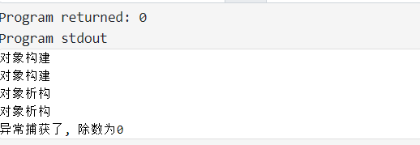


## **五、**异常接口声明

异常接口声明作用:

+ **加强程序的可读性**，可以在函数声明中 **列出可能抛出异常的所有类型**，例如:void func0 throw(AB.C);这个函数func能够且只能抛出类型A,B,C及其子类型的异常.
+ 如果在函数声明中没有包含异常接口声明，则此函数可以抛任何类型的异常，例如:void func0一个不抛任何类型异常的函数可声明为:void func0 throw0
+ 如果一个函数抛出了它的异常接口声明锁不允许抛出的异常,unexcepted函数会被调用，该函数默认行为调用terminate函数中断程序。

```c++
#include <iostream>

using namespace std;


//不支持了 
void func() throw(int, float, char)
{
     throw "adc";
}

// 不抛出任何类型的异常
int fun02(int x, int y) throw()
{         
    return x / y;
}

// 可以抛出任何类型的异常
 void fun03()
{

}

int main(void)
{
    try{
        fun02(2, 0);
    }catch(char *str){

    }catch(int e){
       cout << "异常捕获了, 除数为" << e << endl;

    }catch(...){
        cout << "未知类型的异常";
    }

    return 0;
}

```

## 六、**C++标准异常**

> 异常处理比较鸡肋，以后基本上很少用到，知道有这么回事即可

### 1. 异常类型和异常变量的生命周期

throw的异常的类型:

+ 数字( int )、字符串( const char * )、类对象(系统的或者自定义的) 。

+ **catch 需严格匹配异常类型。**
+ 注意:异常对象的内存模型

```c++
#include <iostream>
#include <cstring>

using namespace std;

void func01()
{
    throw 1;
}

void func02()
{
    throw "exception";
}


class MyException
{
private:
    char *error;   // 指针

public:
    MyException(const char *str){
        int len = strlen(str);
        error = new char[len];
        strcpy(error, str);
    }

    // 写出 复制构造函数和赋值运算符重载 防止 出现析构多次
    MyException(const MyException &ex){
        error = new char[strlen(ex.error) + 1];
        strcpy(error, ex.error);
    }

    MyException &operator=(const MyException &ex){
        if (error)
            delete[] error;

        error = new char[strlen(ex.error) + 1];
        strcpy(error, ex.error);
        return *this;
    }

    ~ MyException(){
        if (error)
            delete[] error;
    }

    void what(){
        cout << error << endl;
    }
};


void func03()
{
    throw MyException("刚写的自定义异常");   //匿名类  // 构造函数  // 
}

void test01()
{
    try{
        func01();       
    }catch(int e){
        cout << "整形异常捕获" << endl;
    }

    try{
        func02();
    }catch(const char *e){
        cout << "字符串异常捕获" << endl;
    }

    try{
        func03();
    }catch(MyException e){     // MyException e 调用拷贝构造函数
        e.what();
    }

}


int main(void)
{
    test01();
    return 0;
}

```

结果:

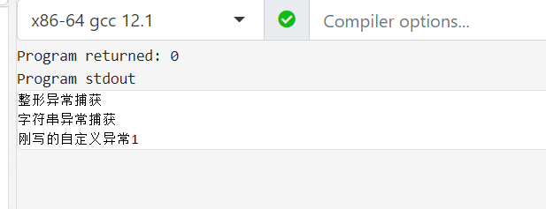

注意: 这不写写出 复制构造函数和赋值运算符重载 会出现 free(): double free detected in tcache 2 的错误

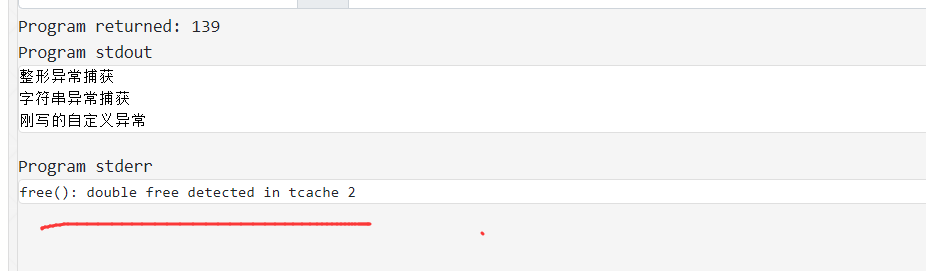


### 2.  异常变量的生命周期

```c++
#include <iostream>

using namespace std;

class MyException
{
private:
   
public:
    MyException(){
   
        cout << "构造" << endl;
    }

    MyException(const MyException &ex){
    
        cout << "拷贝构造" << endl;
    }

    ~ MyException(){   
        cout << "析构" << endl;
    }

};

void func03()
{
    throw MyException();   //匿名类  // 构造函数  //  第一步创建类名对象 调用构造
}


void test01()
{

    //普通类型元素     引用    指针
    //普通元素  异常对象catch处理完之后就 析构
    //引用的话 不用调用拷贝构造，异常对象catch处理完之后就析构

      try{
        func03();
    }catch(MyException e){  // 第二步用另一个MyException对象去接受 抛过来的匿名对象  调用拷贝构造函数
        cout << "异常捕获" << endl;
    }  
}

int main(void)
{
    test01();
    return 0;
}

```

结果:

1.**用普通元素常对象**

```c++
void func03()
{
    throw MyException();   //匿名类  // 构造函数  //  第一步创建类名对象 调用构造
}
```

```c++
try{
    func03();
}catch(MyException e){  // 第二步用另一个MyException对象去接受 抛过来的匿名对象  调用拷贝构造函数
    cout << "异常捕获" << endl;
}  
```

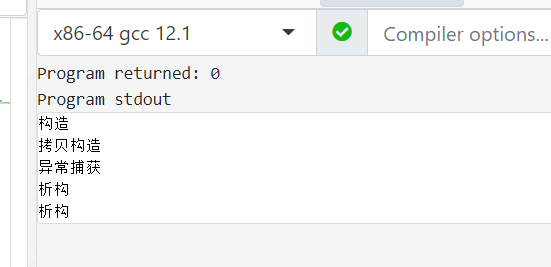

2.**用引用去接**

+ 不用调用拷贝构造，异常对象catch处理完之后就析构

```c++
void func03()
{
    throw MyException();   //匿名类  // 构造函数  //  第一步创建类名对象 调用构造
}
```

```c++
try{
	func03();
}catch(MyException &e){             // 用到是引用 不调用拷贝构造函数
   cout << "异常捕获" << endl;
}
```

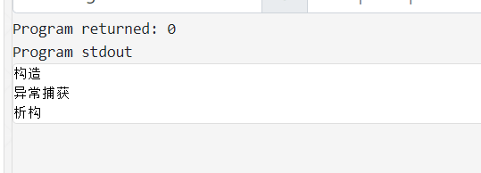

3.**用指针去接**

```c++
void func03()
{
    throw new MyException();   //匿名类  // 构造函数  // 
}
```

```c++
try{
	func03();
}catch(MyException *e){     
	cout << "异常捕获" << endl;
	delete e;                        //必须手动释放
}
```

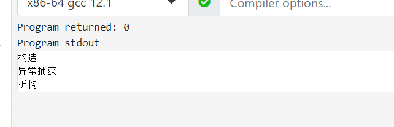


-----------------

### 3.标准异常类使用

C++ 提供了一系列标准的异常，定义在 中，我们可以在程序中使用这些标准的异常

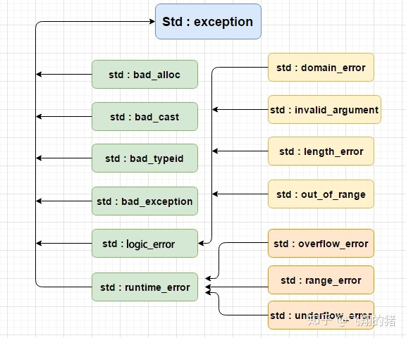

异常说明：

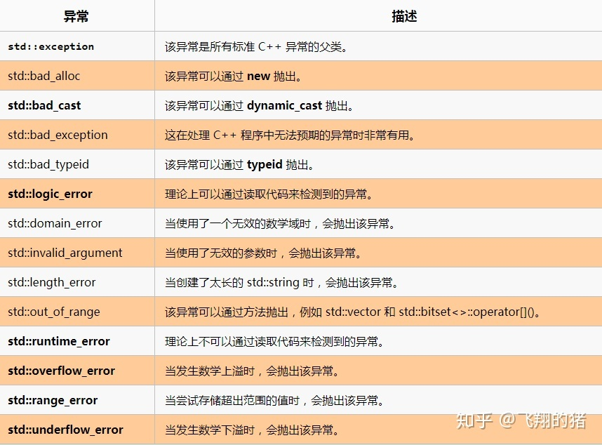

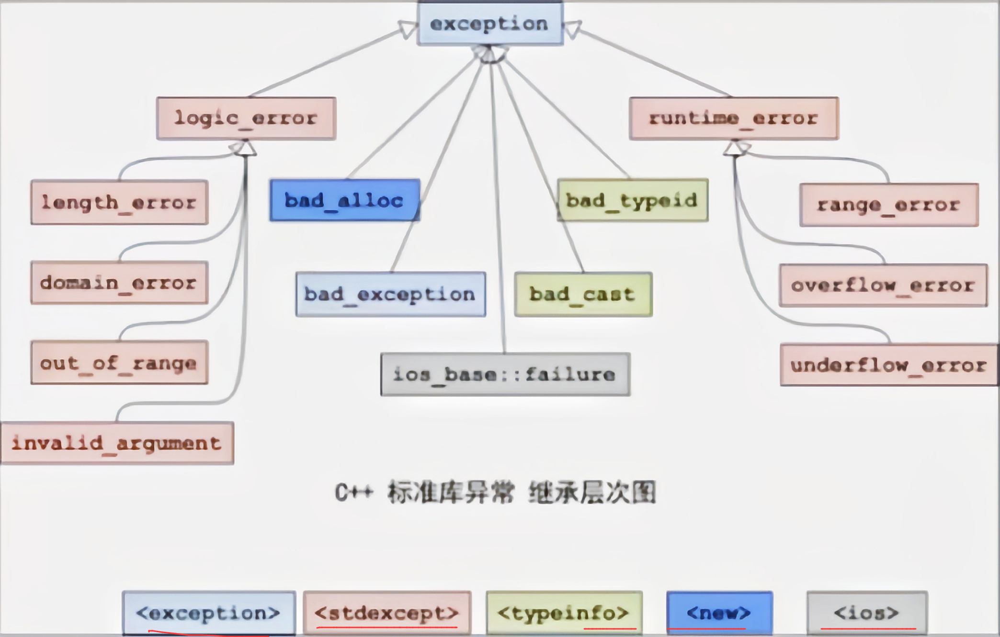

**简单的使用标准异常类  : **

```c++
#include <iostream>
#include <stdexcept>    // 标准异常类的头文件

using namespace std;

class Person
{
private:
    int mAge;

public:
    Person()
    {
        mAge = 0;
    }

    void setAge(int age)
    {
        if (age < 0 || age > 100)
            throw out_of_range("年龄应该在0-100之间");
        mAge = age;
    }
};


void test01()
{
    Person p;

    try {
        p.setAge(1000);
    }catch(out_of_range e){     //catch(exception)  因为out_of_range是exception的子类，可以捕获
       cout << e.what() << endl;
    }
}


int main(void)
{
    test01();
    return 0;
}
```


### 4. 自定义异常类

如何编写自己的异常类

1. **建议自己的异常类要继承标准异常类。**因为C++中可以抛出任何类型的异常，所以我们
   的异常类可以不继承自标准异常，但是这样可能会导致程序混乱,尤其是当我们多人协同开
   发时。
2. 当继承标准异常类时，必须**重载父类的what 函数和虚析构函数。**
3. 因为栈展开的过程中，要复制异常类型，那么要根据你在类中添加的成员考虑是否提供
   自己的复制构造函数。


**自定义的异常类**

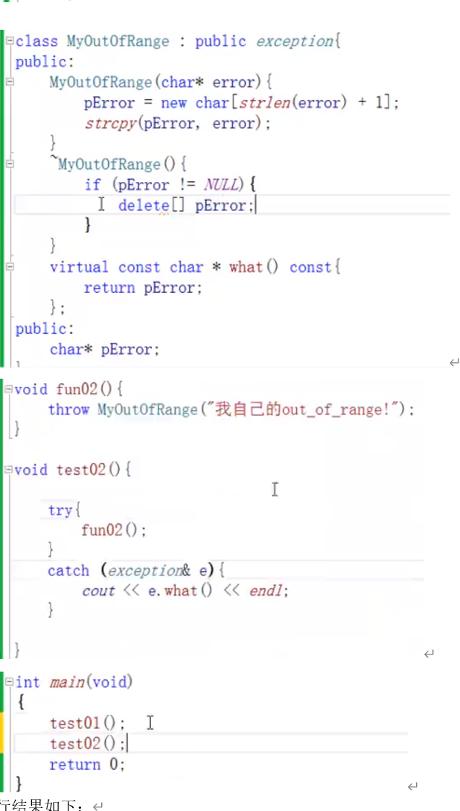

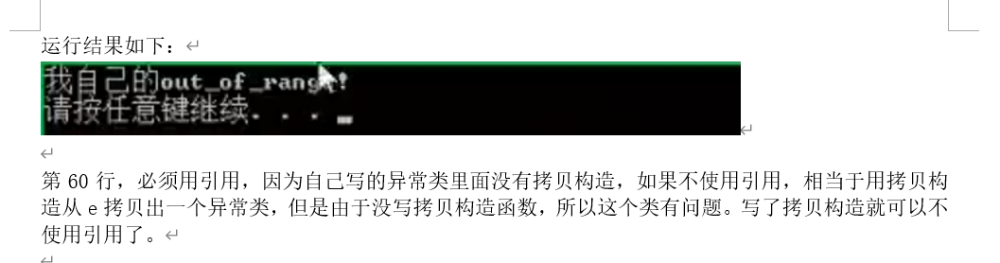


### 5.  继承在异常中的应用

**strcpy的实现 **

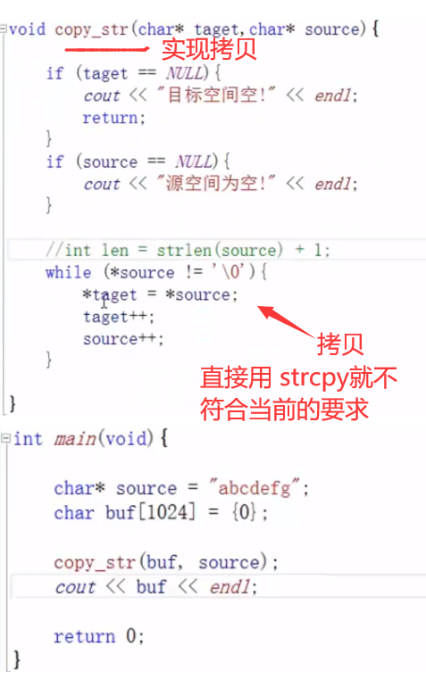


---

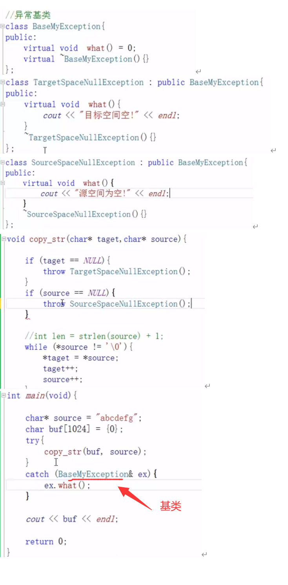

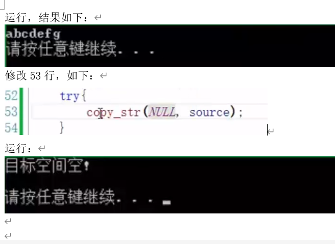


# 七、C++正则库

## 正则表达式语法

正则是一种规则，它用来匹配（进而捕获、替换）字符串。这种规则需要“模式”、“字符串”这两样东西，“模式”根据正则规则，来处理“字符串”。这种规则被许多语言支持，C++11以后才支持正则。

**常用元字符**

| 代码/语法 | 说明                                                         |
| --------- | ------------------------------------------------------------ |
| .         | 匹配除换行符以外的任意字符                                   |
| \w        | 匹配字母、数字、下划线, 等价于[a-zA-Z0-9_]                   |
| \W        | 匹配不是字母、数字、下划线的其他字符                         |
| \s        | 匹配任意空白字符, 等价于(\t\n\r\f)                           |
| \S        | 匹配任意非空字符                                             |
| \d        | 匹配数字,  等价于[0-9]                                       |
| \D        | 匹配不是数字的字符                                           |
| \b        | 匹配单词的开始或结束指示字符串的边界（头/尾/空格左/空格右），字符\b要求边界的左边是字符，\b字符要求边界的右边是字符。 |
| \A        | 匹配字符串开头                                               |
| \Z        | 匹配字符串结尾的,如果存在换行,只匹配到换行前的结束字符串     |
| \z        | 匹配字符串结尾的,如果存在换行,匹配到换行符\n                 |
| \G        | 最好完成匹配的位置                                           |
| \n        | 匹配一个换行符                                               |
| \t        | 匹配一个制表符(tab)                                          |
| ^字符     | 匹配字符串的开始,且要求字符串以字符开头                      |
| 字符$     | 匹配字符串的结束, 且要求字符串以字符结尾                     |
| [ x ]     | 用来表示一组字符,  比如[a-z0-9]表示小写和数字之中的,   [abc]表示abc之中的任意一个 |
| [^x]      | 匹配除了x以外的任意字符,   比如\[^abc]表示  abc之外的        |
| a\|b      | 匹配a或者b                                                   |
| (…)       | 匹配括号里的表达式,也可以表示一个组                          |

**常用限定符**

| 代码/语法 | 使用      | 说明                                       |
| :-------- | :-------- | ------------------------------------------ |
| *         | 字符*     | 要求字符出现0到多次   {0,}                 |
| +         | 字符+     | 要求字符出现1到多次     (\w)  {1,}         |
| ?         | 字符?     | 要求字符出现0次或1次    {0,1}              |
| {n}       | 字符{n}   | 要求字符出现n次,  比如\d{5}表示匹配5个数字 |
| {n,}      | 字符{n,}  | 要求字符出现n到多次  {0,}                  |
| {n,m}     | 字符{n,m} | 要求字符出现n到m次、                       |

==含有`\`的元字符，在C++定义时，都要写成`\\`==

## 常用正则表达式大全

**一、校验数字的表达式**

```
 1 数字：^[0-9]*$
 2 n位的数字：^\d{n}$
 3 至少n位的数字：^\d{n,}$
 4 m-n位的数字：^\d{m,n}$
 5 零和非零开头的数字：^(0|[1-9][0-9]*)$
 6 非零开头的最多带两位小数的数字：^([1-9][0-9]*)+(.[0-9]{1,2})?$
 7 带1-2位小数的正数或负数：^(\-)?\d+(\.\d{1,2})?$
 8 正数、负数、和小数：^(\-|\+)?\d+(\.\d+)?$
 9 有两位小数的正实数：^[0-9]+(.[0-9]{2})?$
10 有1~3位小数的正实数：^[0-9]+(.[0-9]{1,3})?$
11 非零的正整数：^[1-9]\d*$ 或 ^([1-9][0-9]*){1,3}$ 或 ^\+?[1-9][0-9]*$
12 非零的负整数：^\-[1-9][]0-9"*$ 或 ^-[1-9]\d*$
13 非负整数：^\d+$ 或 ^[1-9]\d*|0$
14 非正整数：^-[1-9]\d*|0$ 或 ^((-\d+)|(0+))$
15 非负浮点数：^\d+(\.\d+)?$ 或 ^[1-9]\d*\.\d*|0\.\d*[1-9]\d*|0?\.0+|0$
16 非正浮点数：^((-\d+(\.\d+)?)|(0+(\.0+)?))$ 或 ^(-([1-9]\d*\.\d*|0\.\d*[1-9]\d*))|0?\.0+|0$
17 正浮点数：^[1-9]\d*\.\d*|0\.\d*[1-9]\d*$ 或 ^(([0-9]+\.[0-9]*[1-9][0-9]*)|([0-9]*[1-9][0-9]*\.[0-9]+)|([0-9]*[1-9][0-9]*))$
18 负浮点数：^-([1-9]\d*\.\d*|0\.\d*[1-9]\d*)$ 或 ^(-(([0-9]+\.[0-9]*[1-9][0-9]*)|([0-9]*[1-9][0-9]*\.[0-9]+)|([0-9]*[1-9][0-9]*)))$
19 浮点数：^(-?\d+)(\.\d+)?$ 或 ^-?([1-9]\d*\.\d*|0\.\d*[1-9]\d*|0?\.0+|0)$
```

**二、校验字符的表达式**

```
 1 汉字：^[\u4e00-\u9fa5]{0,}$
 2 英文和数字：^[A-Za-z0-9]+$ 或 ^[A-Za-z0-9]{4,40}$
 3 长度为3-20的所有字符：^.{3,20}$
 4 由26个英文字母组成的字符串：^[A-Za-z]+$
 5 由26个大写英文字母组成的字符串：^[A-Z]+$
 6 由26个小写英文字母组成的字符串：^[a-z]+$
 7 由数字和26个英文字母组成的字符串：^[A-Za-z0-9]+$
 8 由数字、26个英文字母或者下划线组成的字符串：^\w+$ 或 ^\w{3,20}$
 9 中文、英文、数字包括下划线：^[\u4E00-\u9FA5A-Za-z0-9_]+$
10 中文、英文、数字但不包括下划线等符号：^[\u4E00-\u9FA5A-Za-z0-9]+$ 或 ^[\u4E00-\u9FA5A-Za-z0-9]{2,20}$
11 可以输入含有^%&',;=?$\"等字符：[^%&',;=?$\x22]+
12 禁止输入含有~的字符：[^~\x22]+
```

**三、特殊需求表达式**

```
 1 Email地址：^\w+([-+.]\w+)*@\w+([-.]\w+)*\.\w+([-.]\w+)*$
 2 域名：[a-zA-Z0-9][-a-zA-Z0-9]{0,62}(/.[a-zA-Z0-9][-a-zA-Z0-9]{0,62})+/.?
 3 InternetURL：[a-zA-z]+://[^\s]* 或 ^http://([\w-]+\.)+[\w-]+(/[\w-./?%&=]*)?$
 4 手机号码：^(13[0-9]|14[0-9]|15[0-9]|16[0-9]|17[0-9]|18[0-9]|19[0-9])\d{8}$ (由于工信部放号段不定时，所以建议使用泛解析 ^([1][3,4,5,6,7,8,9])\d{9}$)
 5 电话号码("XXX-XXXXXXX"、"XXXX-XXXXXXXX"、"XXX-XXXXXXX"、"XXX-XXXXXXXX"、"XXXXXXX"和"XXXXXXXX)：^(\(\d{3,4}-)|\d{3.4}-)?\d{7,8}$ 
 6 国内电话号码(0511-4405222、021-87888822)：\d{3}-\d{8}|\d{4}-\d{7} 
 7 18位身份证号码(数字、字母x结尾)：^((\d{18})|([0-9x]{18})|([0-9X]{18}))$
 8 帐号是否合法(字母开头，允许5-16字节，允许字母数字下划线)：^[a-zA-Z][a-zA-Z0-9_]{4,15}$
 9 密码(以字母开头，长度在6~18之间，只能包含字母、数字和下划线)：^[a-zA-Z]\w{5,17}$
10 强密码(必须包含大小写字母和数字的组合，不能使用特殊字符，长度在8-10之间)：^(?=.*\d)(?=.*[a-z])(?=.*[A-Z]).{8,10}$  
11 日期格式：^\d{4}-\d{1,2}-\d{1,2}
12 一年的12个月(01～09和1～12)：^(0?[1-9]|1[0-2])$
13 一个月的31天(01～09和1～31)：^((0?[1-9])|((1|2)[0-9])|30|31)$ 
14 钱的输入格式：
15    1.有四种钱的表示形式我们可以接受:"10000.00" 和 "10,000.00", 和没有 "分" 的 "10000" 和 "10,000"：^[1-9][0-9]*$ 
16    2.这表示任意一个不以0开头的数字,但是,这也意味着一个字符"0"不通过,所以我们采用下面的形式：^(0|[1-9][0-9]*)$ 
17    3.一个0或者一个不以0开头的数字.我们还可以允许开头有一个负号：^(0|-?[1-9][0-9]*)$ 
18    4.这表示一个0或者一个可能为负的开头不为0的数字.让用户以0开头好了.把负号的也去掉,因为钱总不能是负的吧.下面我们要加的是说明可能的小数部分：^[0-9]+(.[0-9]+)?$ 
19    5.必须说明的是,小数点后面至少应该有1位数,所以"10."是不通过的,但是 "10" 和 "10.2" 是通过的：^[0-9]+(.[0-9]{2})?$ 
20    6.这样我们规定小数点后面必须有两位,如果你认为太苛刻了,可以这样：^[0-9]+(.[0-9]{1,2})?$ 
21    7.这样就允许用户只写一位小数.下面我们该考虑数字中的逗号了,我们可以这样：^[0-9]{1,3}(,[0-9]{3})*(.[0-9]{1,2})?$ 
22    8.1到3个数字,后面跟着任意个 逗号+3个数字,逗号成为可选,而不是必须：^([0-9]+|[0-9]{1,3}(,[0-9]{3})*)(.[0-9]{1,2})?$ 
23    备注：这就是最终结果了,别忘了"+"可以用"*"替代如果你觉得空字符串也可以接受的话(奇怪,为什么?)最后,别忘了在用函数时去掉去掉那个反斜杠,一般的错误都在这里
24 xml文件：^([a-zA-Z]+-?)+[a-zA-Z0-9]+\\.[x|X][m|M][l|L]$
25 中文字符的正则表达式：[\u4e00-\u9fa5]
26 双字节字符：[^\x00-\xff]    (包括汉字在内，可以用来计算字符串的长度(一个双字节字符长度计2，ASCII字符计1))
27 空白行的正则表达式：\n\s*\r    (可以用来删除空白行)
28 HTML标记的正则表达式：<(\S*?)[^>]*>.*?</\1>|<.*? />    (网上流传的版本太糟糕，上面这个也仅仅能部分，对于复杂的嵌套标记依旧无能为力)
29 首尾空白字符的正则表达式：^\s*|\s*$或(^\s*)|(\s*$)    (可以用来删除行首行尾的空白字符(包括空格、制表符、换页符等等)，非常有用的表达式)
30 腾讯QQ号：[1-9][0-9]{4,}    (腾讯QQ号从10000开始)
31 中国邮政编码：[1-9]\d{5}(?!\d)    (中国邮政编码为6位数字)
32 IP地址：\d+\.\d+\.\d+\.\d+    (提取IP地址时有用)
33 IP地址：((?:(?:25[0-5]|2[0-4]\\d|[01]?\\d?\\d)\\.){3}(?:25[0-5]|2[0-4]\\d|[01]?\\d?\\d)) 
```

## 正则操作

```c++
#include<regex>   ///头文件
```

基本操作

1. 构建正则对象(准则)
2. 调用正则函数 
3. 传入相应参数即可，分析结果

处理问题:

+ 字符串匹配问题  regex_match()
+ 字符串截取(获取)问题  regex_search() 或者 sregex_token_iterator类
+ 字符串替换问题 regex_replace()

```c++
#include <regex>
#include <string>
#include <iostream>
using namespace std;
void test_regex_match() 
{
	//1.正则做匹配时候一定是完全匹配
	string str = "ILoveyou1314";
	regex reg("[a-z0-9]+");		//1个或者多个小写字母或者数字
	if (regex_match(str, reg)) 
	{
		cout << "匹配" << endl;
	}
	else 
	{
		cout << "不匹配" << endl;
	}
	//2.正则对象附加参数的构造方式
	regex reg2("[a-z0-9]+", regex_constants::icase); // regex_constants::icase忽略大写小写
	if (regex_match(str, reg2))
	{
		cout << "匹配" << endl;
	}
	else
	{
		cout << "不匹配" << endl;
	}
    
	regex reg3("[a-z0-9A-Z]+");
	if (regex_match(str, reg3))
	{
		cout << "匹配" << endl;
	}
	else
	{
		cout << "不匹配" << endl;
	}
    
	//3.原生字符串充当正则对象
	//	string str = "ILoveyou1314";
	regex reg4("ILoveyou[0-9]+");
	if (regex_match(str, reg4))
	{
		cout << "匹配" << endl;
	}
	else
	{
		cout << "不匹配" << endl;
	}
}

//字符串截取问题regex_search()
void test_regex_search()
{
	smatch result;
	//prefix(): 获取前缀
	//suffix(): 获取后缀
	//str(): 获取匹配到字符串
	//只做操作第一次匹配的
	string str = "ILoveyou1314IMiisyou520Iwantyou";
	bool flag = regex_search(str, result, regex("\\d+"));	//\d+多个数字
	if (flag == true) 
	{
		cout << "size:" << result.size() << endl;
		cout << "匹配:" << result.str() << endl;      // 1314 
		cout << "前缀:" << result.prefix() << endl;  // ILoveyou
		cout << "后缀:" << result.suffix() << endl;  // IMiisyou520Iwantyou
	}
    
	//怎么获取所有匹配到的字符串
	//sregex_iterator类
	//1.带惨构造: 正常区间描述匹配正则
	//2.无参构造: 结束标记  --->istream_iterator   end of 
	sregex_iterator end;
	regex reg("\\d+");
	sregex_iterator pos(str.begin(), str.end(), reg);
	while (pos != end) 
	{
		cout << pos->str() << " "; // 1314  520
		pos++;
	}
    
    //
    string reHeader = "内容";
    std::regex pattern("set-cookie:\\s*([^\\n]+)");  //模版
    std::smatch match;
    std::string::const_iterator iter(reHeader.cbegin());
    std::string::const_iterator end(reHeader.cend());
    while (std::regex_search(iter, end, match, pattern))
    {
        
    }

    // 推荐
	//怎么获取不匹配的
	//sregex_token_iterator 这个类相对于sregex_iterator来说多了一个可选项(就是多了附加参数,0:找的就是匹配，-1找的就是不匹配)
	regex reg2("\\d+");
	sregex_token_iterator endToken;
	sregex_token_iterator posToken(str.begin(), str.end(), reg2, -1);
	while (posToken != endToken) 
	{
		cout << posToken->str() << endl;
		posToken++;
	}

}

// 字符串替换问题 regex_replace()
void test_regex_replace() 
{
	//替换所有满足规则的内容
    // 例子1
	string str = "I妈sdfdsdf妈Ilikeyou妈";
	regex reg("妈");
	cout << "屏蔽结果:" << regex_replace(str, reg, "**") << endl;
    // 例子2
	string str2 = "臭 sb,我太会sb sssb";
	regex reg2("sb");
	cout << "屏蔽结果:" << regex_replace(str2, reg2, "**") << endl; // 臭 **,我太会** ss**
    // 例子3
    string str = " 123  45 6 78  9  ";
	regex reg("  ");
	cout << str << endl;
	cout << regex_replace(str, reg, " "); // 123 45 6 78 9
    
	//附加参数替换模式
	cout << "only one:" << regex_replace(str2, reg2, "**",regex_constants::format_first_only) << endl; //臭 **,我太会sb sssb // 只替换第一次匹配的  
	cout << "format_no_copy" << regex_replace(str2, reg2, "**", regex_constants::format_no_copy) << endl;  //****** //只保留匹配的替换 
}
int main() 
{

	test_regex_match();
	test_regex_search();
	test_regex_replace();
	return 0;
}
```

# 八、日期和时间

```c++
#include <chrono>   // 头文件
using namespace std::chrono;  //命名空间
```

`chrono` 库里包括三种主要类型：`clocks`，`time points` 和 `durations`。

表示时钟的clock，表示时间间隔的 duration 和 表示时间点的 time_point。

+ 时钟
  + system_clock
  + steady_clock
  + high_resolution_clock
+ 类型转换
  + to_time_t
  + from_time_t
+ 时间描述
+ 时间间隔

## 1. 时钟

C++ 定义了三种类型的时钟：

- `std::chrono::system_clock`：本地系统的当前时间 (可以调整)
- `std::chrono::steady_clock`：不能被调整的，稳定增加的时间, 最适合于计算程序的耗时时长。
- `std::chrono::high_resolution_clock`：提供最高精度的计时周期

提供了一个静态成员函数 `now()` 用于获取当前时间，该函数的返回值都是 `time_point` 类型，system_clock 还另外提供了两个支持系统时间和 std::time_t 相互转换的静态成员函数： `to_time_t()` 和 `from_time_t()`。

## 2. 时间间隔

+ 整型持续时间:需要duration_castz转换

+ chrono 中预定义了一系列常用的 duration，可以直接使用：

  ```c++
  //duration的参数
  using atto  = ratio<1, 1000000000000000000LL>;
  using femto = ratio<1, 1000000000000000LL>;
  using pico  = ratio<1, 1000000000000LL>;
  using nano  = ratio<1, 1000000000>;
  using micro = ratio<1, 1000000>;
  using milli = ratio<1, 1000>;
  using centi = ratio<1, 100>;
  using deci  = ratio<1, 10>;
  using deca  = ratio<10, 1>;
  using hecto = ratio<100, 1>;
  using kilo  = ratio<1000, 1>;
  using mega  = ratio<1000000, 1>;
  using giga  = ratio<1000000000, 1>;
  using tera  = ratio<1000000000000LL, 1>;
  using peta  = ratio<1000000000000000LL, 1>;
  using exa   = ratio<1000000000000000000LL, 1>;
  ```

  ```c++
  //duration_cast的参数
  std::chrono::nanoseconds    duration<long long, std::ratio<1, 1000000000>>
  std::chrono::microseconds   duration<long long, std::ratio<1, 1000000>>
  std::chrono::milliseconds   duration<long long, std::ratio<1, 1000>>
  std::chrono::seconds        duration<long long>
  std::chrono::minutes        duration<int, std::ratio<60>>
  std::chrono::hours          duration<int, std::ratio<3600>>
  ```

  

## 3. Time point

`std::chrono::time_point` 是一个表示具体时间点的类模板，可以表示距离时钟原点的时间长度（duration）。

```cpp
template<
    class Clock,
    class Duration = typename Clock::duration
> class time_point;
```

其中的 Clock 用来指定要使用的时钟，比如要使用的 system_clock，steady_clock；

Duration 表示从时钟原点开始到现在的时间间隔，可以设置不同的时间计量单位。


`time_point` 表示一个时间点，通过 `time_since_epoch()` 函数就可以得到该时间点到时钟原点的时间间隔。

```cpp
#include <iostream>
#include <chrono>
using namespace std::chrono;

int main() {
    // now 表示当前时间到时钟原点的毫秒数
    time_point<system_clock> now = system_clock::now();

    auto elapsed = duration_cast<std::chrono::hours>(now.time_since_epoch());
    std::cout << elapsed.count() << " 小时" << std::endl;
    std::cout << now.time_since_epoch().count() << " 毫秒"<< std::endl;
    return 0;
}
```

定义 now 时传入 `system_clock` 为第一个参数，使用 `duration_cast` 将毫秒单位转换为小时单位。

time_point 想要进行精度转换，则使用 `std::chrono::time_point_cast`，用法和 duration_cast 相同，区别就在于输出参数从传入 duration 改为 time_point，如下例子所示。

```cpp
#include <iostream>
#include <chrono>
using namespace std::chrono;

int main() {
    auto t1 = system_clock::now();
    auto t2 = time_point_cast<seconds>(t1);
    std::cout << t1.time_since_epoch().count() << " 毫秒" << std::endl;
    std::cout << t2.time_since_epoch().count() << " 秒" << std::endl;
    return 0;
}
```

## 4. 字符串转成日期

### std::get_time()函数

它用于从应用中输入流的字符中提取字符，并将它们解析为参数`fmt`中指定的时间和日期信息。获得的数据存储在`tmb`指向的`struct tm`对象。 //更多请阅读：https://www.yiibai.com/cpp_standard_library/cpp_get_time.html 

常用

```
时:分:秒 %H:%M:%S        %T (C++11标准)
年-月-日 %Y:%m:%d        %F (C++11标准)
当地时间标准 %X
十二小时制 %I (%p <==> a.m|p.m 或者当地写法)
当期日期标准 %x
一年的第几天 %j
第几周 %U (00-53) 周日为第一天
%W (00-53) 周一为第一天
%V (01-53) 周一为第一天 (C++11标准)
周一为星期的第一天
每年的第一星期为包含1月4号的那个星期.
或者包含第一个星期四那个星期
星期几 %w (0-6) %u(1-7)(C++11标准)
星期几 %a 单词简写 %A 单词全称 (当地写法)
```

例子

```c++
#include <iostream>     
#include <iomanip>      
#include <ctime>        

int main () {
  struct std::tm when;
  std::cout << "Please, enter the time: ";
  std::cin >> std::get_time(&when,"%R");   

  if (std::cin.fail()) std::cout << "Error reading time/n";
  else {
    std::cout << "The time entered is: ";
    std::cout << when.tm_hour << " hours and " << when.tm_min << " minutes/n";
  }

  return 0;
}
```

###  mktime

**函数原型**

```c
time_t mktime(struct tm *)
1
```

**其中的 tm 结构体定义如下：**

```c
struct tm {
int tm_sec; /* 秒 – 取值区间为[0,59] */
int tm_min; /* 分 - 取值区间为[0,59] */
int tm_hour; /* 时 - 取值区间为[0,23] */
int tm_mday; /* 一个月中的日期 - 取值区间为[1,31] */
int tm_mon; /* 月份（从一月开始，0代表一月） - 取值区间为[0,11] */
int tm_year; /* 年份，其值等于实际年份减去1900 */
int tm_wday; /* 星期 – 取值区间为[0,6]，其中0代表星期天，1代表星期一，以此类推 */
int tm_yday; /* 从每年的1月1日开始的天数 – 取值区间为[0,365]，其中0代表1月1日，1代表1月2日，以此类推 */
int tm_isdst; /* 夏令时标识符，实行夏令时的时候，tm_isdst为正。不实行夏令时的进候，tm_isdst为0；不了解情况时，tm_isdst()为负。*/
};
```

例子

```c++
class Solution {
public:
    int dayOfYear(string date) {
        tm t{};
        //strptime(date.c_str(), "%Y-%m-%d", &t);
        istringstream ss(date);
        ss >> get_time(&t, "%Y-%m-%d");
        mktime(&t);
        return t.tm_yday + 1;
    }
};
```

## 5. 综合代码

```c++
#include <iostream>
#include <ctime>    // c语言时间库
#include <chrono>   // c++时间库
#include <iomanip>  // 格式化打印时间
#include <thread>   // 描述时间

using namespace std;
using namespace chrono;


/*************************** c语言版本 ***************************/
void cGetTime()
{
	// 基于当前系统的当前日期/时间
	time_t now = time(NULL);

	cout << "时间戳(1970到目前经过秒数):" << now << endl;

	tm* ltm = localtime(&now);
	// 直接输出
	cout << ctime(&now);
	//put_time()打印格式
	cout << put_time(ltm, "%F %X") << endl;
	cout << put_time(ltm, "%Y") << endl;
	// 输出 tm 结构的各个组成部分
	cout << "年: " << 1900 + ltm->tm_year << endl;
	cout << "月: " << 1 + ltm->tm_mon << endl;
	cout << "日: " << ltm->tm_mday << endl;
	cout << "时间: " << ltm->tm_hour << ":";
	cout << ltm->tm_min << ":";
	cout << ltm->tm_sec << endl;
}

/*************************** c++ ***************************/
// 查看系统当前时间:
void  GetTime()
{
	auto curTime = system_clock::now();
	//to_time_t(): 把time_point转换为time_t
	time_t tm_time = system_clock::to_time_t(curTime);
	cout << "时间戳: " << curTime.time_since_epoch().count() << endl;  //c语言是time(NULL)的返回值
	//直接输出时间
	cout << "日期: " << ctime(&tm_time);

	tm* pTime = localtime(&tm_time);
	//put_time()打印格式
	cout << put_time(pTime, "%F %X") << endl;
	cout << put_time(pTime, "%Y") << endl;
	// 普通方式输出 tm 结构的各个组成部分
	printf("%4d年%02d月%02d日 %02d:%02d:%02d\n",
		pTime->tm_year + 1900, pTime->tm_mon + 1, pTime->tm_mday, pTime->tm_hour, pTime->tm_min, pTime->tm_sec);
}

// 高精度时钟
void  HighClock()
{
	//clock() 函数完成
	high_resolution_clock::time_point start = high_resolution_clock::now();
	for (int i = 0; i < 10000; i++)
	{
		int a = 1;
		a++;
	}
	high_resolution_clock::time_point end = high_resolution_clock::now();
	//auto dt = end - start;	//纳秒
	duration<double, ratio<1, 1000>> dt = end - start;			//定义一个秒对象
	cout << "耗时:" << dt.count() << endl;
}

// 耗时 Duration类
void CountTime()
{
	auto t1 = system_clock::now();
	this_thread::sleep_for(5s);
	auto t2 = system_clock::now();

	// 浮点持续时间:不需要duration_cast
	duration<double, milli> fp_ms = t2 - t1;
	// 整型持续时间:需要duration_castz转换
	auto int_ms = duration_cast<milliseconds>(fp_ms);

	// 将整型持续时间 转换为更短的可分时间单位的整型持续时间:不需要duration_cast
	duration<long, micro> int_usec = int_ms;

	cout << "耗时:   " << fp_ms.count() << " 毫秒\n"
		<< "\t" << int_ms.count() << " 整毫秒\n"
		<< "\t" << int_usec.count() << " 整微秒\n";
    
	// 直接得到整型时间间隔
	auto stime = steady_clock::now();
	this_thread::sleep_for(1s);
	auto etime = steady_clock::now();
	// 打印时间
	auto duration2 = duration_cast<microseconds>(etime - stime);
	cout <<"耗时:   " <<  duration2.count() << endl;
}

// 时间的描述 #include <thread>
void showTime()
{
	// 参数可以直接写时间单位
	this_thread::sleep_for(1s);
	//this_thread::sleep_for(2min);
	//this_thread::sleep_for(1h);
	//this_thread::sleep_for(1ms);
	//this_thread::sleep_for(10000ns);
	cout << "休眠1秒钟" << endl;
	this_thread::sleep_for(seconds(1));		//等效上面这种写法,但不推荐
}

int main(void)
{
	GetTime();
	HighClock();
	CountTime();
	showTime();
	return 0;
}
```

运行结果:

```c++
时间戳(1970到目前经过秒数):1673769483
Sun Jan 15 15:58:03 2023
2023-01-15 15:58:03
2023
年: 2023
月: 1
日: 15
时间: 15:58:3
时间戳: 16737694832950860
日期: Sun Jan 15 15:58:03 2023
2023-01-15 15:58:03
2023
2023年01月15日 15:58:03
耗时:0.0064
耗时:   5004.21 毫秒
        5004 整毫秒
        5004000 整微秒
耗时:1006105
休眠1秒钟
```

# 九、C++文件

## 电脑文件路径问题

**绝对路径**:    在电脑硬盘上的路径
**相对路径**:    相对于某一项目或者某一文件而言的路径

-------------------

+ 绝对路径:

  绝对路径还是比较好掌握的，比如我电脑存在一张图片路径为:C:\Users\lenovo\Pictures\Saved Pictures 			\picture.jpg


+ 相对路径:

  下符号代表的含义:

  ```c
  / 根目录
  . / 页面所在目录(相当于不写，直接写文件或图片名字)
  . ./ 页面所在文件夹上一级目录
  ```


1.同一个文件夹下相互引用(同级文件)

+ 直接引用文件名或图片名即可.

2.引用其他文件夹目录下的文件

- 如下，index.jsp 和j sp文件夹是同一级目录，search.jsp在jsp文件夹下
- 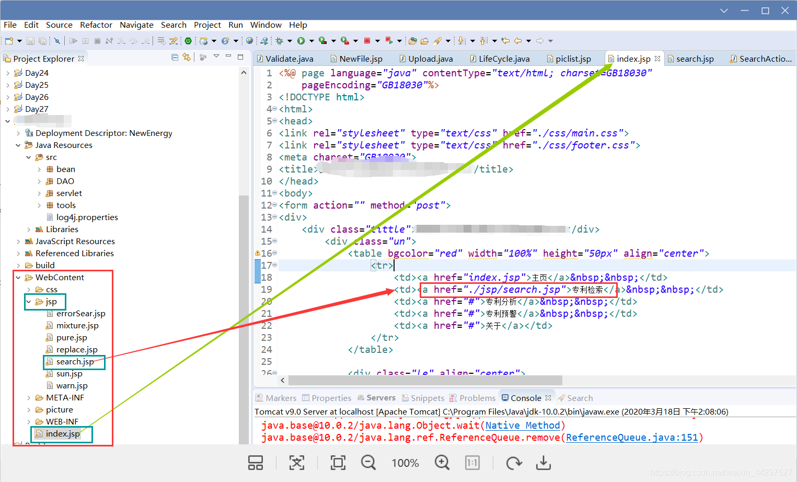

3.引用上一级目录下的文件

+ 如下，index.jsp和jsp在同一个文件夹下，warn.jsp是jsp下的文件，相对于warn.jsp来说index.jsp是它的上一级文件，在warn.jsp中引用index.jsp
+ 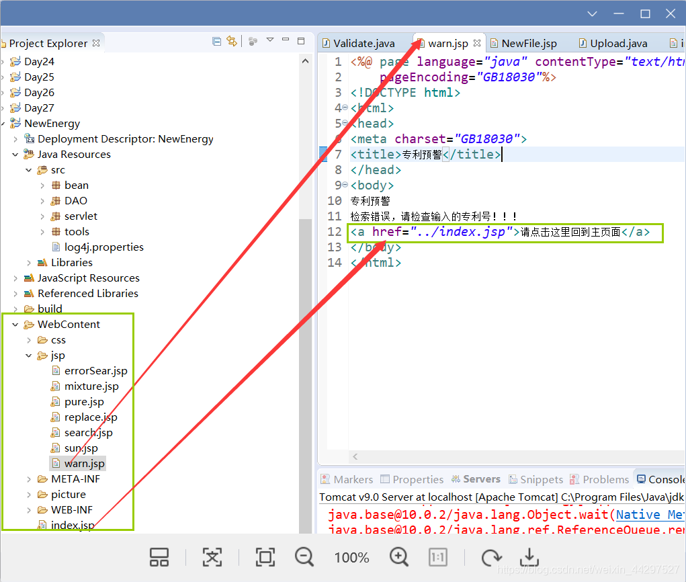

--------------

**总结 : ** 同一个文件夹里，直接用    向上相差一个文件可以用一下../     工程以外直接用绝对路径


## filesystem类

```c++
#include <filesystem>  // 头文件,   c++17支持
```

核心:

+ 路径操作
+ 文件状态
+ 遍历文件

```c++
#include <filesystem>
#include <iostream>
#include <fstream>   // 文件操作
#include <set>
using namespace std;


/********************************* 路径操作 **************************************/
void testPath() 
{
	//创建单层目录
	error_code temp;
	filesystem::create_directory("xxx", temp);
	cout << temp.message() << endl;   //输出 操作成功完成
    
	//创建多级目录
	filesystem::create_directories("YYY/小电影", temp);
	cout << temp.message() << endl;
}

void testpathClass() 
{
	//path类,路径管理
	filesystem::path url = filesystem::current_path();			//获取当前路径
	cout << url / "某某某" << endl;									//路径直接/作为路径的组合
	cout <<"当前路径:" << url << endl;
	cout << "当前路径:" << url.string() << endl;
	cout << "根目录:" << url.root_directory() << endl;
	cout << "相对路径:" << url.relative_path() << endl;
	cout << "根名:" << url.root_name() << endl;
	cout << "根路径:" << url.root_path() << endl;

}

/********************************* 文件类型 **************************************/
void getStatus(filesystem::file_status object) 
{
	switch (object.type()) 
	{
	case filesystem::file_type::regular:
		cout << "磁盘文件" << endl;
		break;
	case filesystem::file_type::directory:
		cout << "目录" << endl;
		break;
	case filesystem::file_type::unknown:
		cout << "无法识别" << endl;
		break;
	}
}
void testStatus() 
{
	//file_status类  文件状态管理
	filesystem::create_directory("Box");
	getStatus(filesystem::status("Box"));
	fstream file("Box/file", ios::out | ios::trunc); // 创建文件
	getStatus(filesystem::status("Box/file"));
}


/********************************* 遍历文件 **************************************/
//遍历文件
//directory_entry
//directory_iterator: 遍历文件
//recursive_directory_iterator:递归遍历

//遍历当前路径下的 所有目录(仅限一层)
void tarverseDirectroyFirst()
{
	filesystem::path  url("C:\\Users\\16658\\Desktop\\Project_temp\\文件路径");
	if (!filesystem::exists(url))		//判断当前路是否存在
	{
		cout << "目录不存在" << endl;
		return;
	}
	filesystem::directory_iterator object(url);
	for (auto v : object)
	{
		cout << v.path() << endl;
		//cout << v.path().filename() << endl;
	}
}

//遍历当前目录下的 所有文件
void travserDirectorySecond()
{
	filesystem::path url("C:\\Users\\16658\\Desktop\\Project_temp\\文件路径");
	set<string> dir;
	for (filesystem::directory_iterator end, begin(url); begin != end; ++begin)
	{
		if (!filesystem::is_directory(begin->path()))
		{
			dir.insert(begin->path().filename().string());
		}
	}
	for (auto v : dir)
	{
		cout << v << endl;
	}
}

//遍历路径下面的所有文件(包括不同目录)
void travserDirectoryThird()
{
	filesystem::path url("C:\\Users\\16658\\Desktop\\Project_temp\\文件路径");
	multiset<string>  dir;
	for (filesystem::recursive_directory_iterator end, begin(url); begin != end; ++begin)
	{
		if (!filesystem::is_directory(begin->path()))
		{
			dir.insert(begin->path().filename().string());
		}
	}
	for (auto v : dir)
	{
		cout << v << endl;
	}
}

int main() 
{
	//testPath();
	//testpathClass();
	//testStatus();
	//tarverseDirectroyFirst();
	//travserDirectorySecond();
	travserDirectoryThird();
	return 0;
}
```

##  文件读写

### 步骤1:包含头文件 #include < fstream >

### 步骤2：创建流对象

包括：1）ofstream : 写文件 （2）ifstream : 读文件 （3）fsream : 读写文件

如：

```c++
ifstream  fin；  // 读
    
ofstream fout;   // 写
```

### 步骤3：打开文件

打开文件 fin.open ("文件路径" ,打开方式)

**打开方式包括：**

1. ios::in    读文件 
2. ios::out  写文件（直接用的话会丢丢弃已有数据，即隐含为trunc）**一般和4连用**
3. ios::binary 二进制方式
4. ios:app 追加写（要配合out使用，直接写的话会隐含用 ios：：out
5. ios::trunc 覆盖写（要配合out使用）
6. ios::out | ios::binary 二进制写
7. ……

**最好把文件名用全局变量定义出来**

```c++
string filename = “./test.txt"
或
const char* filename = “./test.txt"
```

**********************************************************************

如：

```c++
ifstream fin.open("/home/bing/slambook14/slambook/ch2/test1.txt",ios::in); 

或者 
ofstream  fout("/home/bing/slambook14/slambook/ch2/test1.txt", ios::out | ios:app)
```

####  一 . 向流中读入数据，最后关闭流

```c++
fin << x << " " << y << endl;
fin.close();
```

**判断文件打开是否成功 :**

```c++
if(!fin.is_open())
{
   cerr << "Can't open" << fileName << "file for output.\n";
}
```

#### 二.  向流中写入数据，最后关闭流

```cpp
fout << x << " " << y << endl;
fout.close();
```

```c++
C++文件输出的<<运算在文本输出模式下很好用，其后边可以直接跟float、int、double数字的类型，其会将他们转为对应的字符的ASCLL，最后将他们输出到文件。

ofstream fcout(filePath, ios_base::out);

char a[] = "abcdef";

int b = 1; int c = 2;

fcout << a < b << c;
```

### 步骤4：读写数据

#### 前提: 申请读空间

```c
//申请读空间：
char buf[1024]={0};
```

```
	ifstream fin("B.txt", ios::binary);//以二进制方式打开文件
	if (!fin.is_open())
	{
		cerr << "can not open the input file!" << endl;//输出错误信息并退出
		exit(1);
	}
	istreambuf_iterator<char> beg(fin), end;
	string content(beg, end); //将文件全部读入string字符串
	fin.close();
```

####   第一种读的方式（按元素直接读）：

```c++
//申请读空间：
char buf[1024]={0};    就是临时申请一个 1024大的读空间（又叫buffer)，并且初始化为0。
while (fin >> buf)
{
    cout << buf << endl;//每一次的buf是空格或回车键（即白色字符）分开的元素
}
文件：
1 2 3
a b c
112
geya
读取结果：
1
2
3
a
b
c
112
geya
    
    
string ch2;
fin >> ch2;
```

#### 第二种读的方式（使用getline按行读）：

```c++
char buf[1024]={0};
while(fin.getline(buf,sizeof(buf)))
{
    std::cout<<buf<<std::endl;
} 
文件：
1 2 3
a b c
112
geya
读取结果：
1 2 3
a b c
112
geya
```

####  第三种读的方式直接读到字符变量中)：

若已知文件里头数据的顺序，则直接定义字符变量存储单个元素，**以白色字符为分割**

```c++
char a,s1,s2,s3,s4,s5;
std::string s6;
fin >> a >> s1 >> s2 >> s3>>s4>>s5>>s6;
std::cout<<a<<" "<<s1<<" "<<s2<<" "<<s3<<" "<<s4<<" "<<s5<<" "<<s6;

文件：
1 2 3
a b c
112
geya
读取结果：
1 2 3 a b c 112
```

####  第四种读的方式(读以逗号隔开的文本)

如果给出以下数组：

23，12，34，56，33

则：

```cpp
vector<int> data;
	int tmp;
while (cin >> tmp) {
	data.push_back(tmp);
	if (cin.get() == '\n') break;
}
```

如果给出矩阵：

12，23，34

23，45，56

34，45，76

则：

```cpp
vector<vector<int>> arr;	
vector<int> a;
while (cin>>num) {
    a.push_back(num);
    if (cin.get() == '\n'){
       arr.push_back(a);
       a.clear();
  }
}
```

如果给出以下数列：

dsfsd,sdsf,sdf,ftry,hyrdr

```cpp
	vector<string> data;
	string tmp;
	while (cin>>tmp) {
		if (cin.get() == '\n') break;
	}
```

### 步骤5：数据类型转换

**一般默认从文件中读取的是字符格式或者字符串格式的数据**,    当要读出来存入成int,double就可以使用sstream

**==方法一：直接定义负责接受的变量数据类型，按行分后再按单词分==**

**下面这个例子就是实际应用中经常用到的例子，比如一个人有多个手机号：**

一行代表一个人的信息，以行为单位存储信息：

```c++
#include "libHelloSLAM.h"
#include<iostream>
#include<fstream>
#include<string>
#include<vector>
#include <sstream>

struct people{
    std::string name;
    std::vector<int> phonenum;
};

int main( int argc, char** argv )
{
    std::ifstream fin;
    fin.open("test.txt");
    if(!fin.is_open())
    {
        std::cerr<<"cannot open the file";
}
    
    
char line[1024]={0};
std::vector<people> People;
//从文件中提取“行”
while(fin.getline(line,sizeof(line)))    // 都是用循环
{
    //定义局部变量
    people p;
    //从“行”中提取“单词”
    std::stringstream word(line);
    word >> p.name ;
    int num;
    while(word >> num)
        p.phonenum.push_back(num);
    People.push_back(p);
}
 std::cout<<People[1].name<<"'s phonenumber is:"<< People[1].phonenum[1];  

}
```

文件：
gyb 1333 12212
lck 212  33113
ddl 332  41311

输出：
lck's phonenumber is:33113

==最重要的是以下两个==：

--------------

**//从文件中提取“行”**

**用循环 +   fin.getline(line, sizeof(line))**

**//从“行”中提取“单词”**
**std::stringstream word(line);**

---

**这里用到了stringstream，需要包含<sstream>，<sstream> 主要用来进行数据类型的自动转换**

+ 注意: 一般情况下 字符 强转 int 的转的ascill码

**如：**

```cpp
#include <string>
#include <sstream>
#include <iostream>
#include <stdio.h>
using namespace std;
 int main()
{
    stringstream sstream;
    string strResult;
    int nValue = 1000;
 
    // 将int类型的值放入输入流中
    sstream << nValue;
    // 从sstream中抽取前面插入的int类型的值，赋给string类型
    sstream >> strResult;
     
     cout << "[cout]strResult is: " << strResult << endl;
    printf("[printf]strResult is: %s\n", strResult.c_str());
//这里的  str() 方法是将 stringstream 类型转换为 string 类型
     return 0;
}
```

### 其他

补充看到的orbslam中的读取文件的代码

```cpp
void LoadImages(const string &strPathToSequence, vector<string> &vstrImageFilenames, 
                vector<double> &vTimestamps)
{
    // step 1 读取时间戳文件
    ifstream fTimes;
    string strPathTimeFile = strPathToSequence + "/times.txt";
    fTimes.open(strPathTimeFile.c_str());
    while(!fTimes.eof())
    {
        string s;
        getline(fTimes,s);
        // 当该行不为空的时候执行
        if(!s.empty())
        {
            stringstream ss;
            ss << s;
            double t;
            ss >> t;
            // 保存时间戳
            vTimestamps.push_back(t);
        }

    string strPrefixLeft = strPathToSequence + "/image_0/";
    const int nTimes = vTimestamps.size();
    vstrImageFilenames.resize(nTimes);

    for(int i=0; i<nTimes; i++)
    {
        stringstream ss;
        ss << setfill('0') << setw(6) << i;
        vstrImageFilenames[i] = strPrefixLeft + ss.str() + ".png";
    }
```

**********************************************************************


```cpp
//多文件，按文件名顺序读写
//使用boost::format进行字符串的格式化
boost::format fmt("./%s/%d.%s");
for(int i =0 ;i<5;i++)
cv::imread((fmt%"color"%(i+1)%"png").str())
```

*****************************************************************************

读特定列：

```cpp
int main()
{
    ifstream ff1;
    ff1.open("/home/bing/ORB/ORB_SLAM2/LiGT/LiGT_results.txt");    
    if(!ff1.is_open()) 
        cerr<<"can not open";

    char line[1024] = {0};
    float globalt[1000][3];
    int ii=0;
    while(ff1.getline(line,sizeof(line)))
    {

        std::stringstream word(line);
        for(int qq=0; qq<12; qq++)
        {
            float tamp;
            word>>tamp;
            //   cout<< tamp<< "   "<<qq<<endl;
            if (qq == 9)   
                globalt[ii][0] = tamp;
            if (qq == 10)
                globalt[ii][1] = tamp;
            if (qq == 11)
                globalt[ii][2]= tamp;
            }
            ii++;
        }
	}
}
```

*****************************************************************************

有些参数太多，改起来又要重新编译，所以最好用超参数定义在外部txt文件中，其定义和读取举例如下：

```cpp
using namespace std;
using namespace cv;
 bool config::GetFile(const string &filename)
{
    if (config_ == NULL)
          config_ = std::shared_ptr<config>(new config);
    else
        config_->file_ = FileStorage(filename.c_str(), FileStorage::READ);
    
    if(config_->file_.isOpened() == false)
    {
        cerr<<"con not open";
        return false;
    }
    return true;
    
}
static T GetParameter(const string &key)
{
    return T(config_->file_[key]);
    
}


dataset_ = Dataset::Ptr(new Dataset(Config::Get<std::string>("dataset_dir")));
```


```cpp
 ifstream fin(dataset_path_ + "/calib.txt");
 if (!fin) {
 LOG(ERROR) << "cannot find " << dataset_path_ << "/calib.txt!";
 return false;
        }

 for (int i = 0; i < 4; ++i){   //一共有P0,P1,P2,P3四个相机，这里就是要把四个相机的参数全部读取到
            //前三个字符是P0：所以这里定义了一个长度为3的字符数组，读完这三个字符后就遇到了第一个空格，fin将会跳过这个空格，读取参数
 char camera_name[3];
 for (int k = 0; k < 3; ++k) {
 fin >> camera_name[k];
            }

            //将相机后面对应的12个参数读入到projection_data[12]中
 double projection_data[12];
 for (int k = 0; k < 12; ++k) {
 fin >> projection_data[k];
            }
```

## stringstream的用法

**stringstream可以进行 cin 和 cout的操作**

 **一、**

//Example：**可以用于分割被空格、制表符等符号分割的字符串**

```c
#include<iostream>  
#include<sstream>        //istringstream 必须包含这个头文件
#include<string>  
using namespace std;  
int main(){  
    string str="i am a boy";  
    istringstream is(str);  
    string s;  
    while(is>>s)  {  
        cout<<s<<endl;  
    }  
} 
```

输出结果：

```text
i
am
a
boy
```


```c++
fin里是 2.5e+11
string ch2;
fin >> ch2;   // 从fin中取一个
stringstream ch(ch2);
ch >> RadiusCanvas;
cout << RadiusCanvas;  //2.5e+11
```


 **二、**

//Example：**stringstream、istringstream、ostringstream的构造函数和用法**

```c
#include <iostream>
#include <sstream>
int main()
{
    // default constructor (input/output stream) 默认构造函数(输入/输出流)
    std::stringstream buf1;
    buf1 << 7;
    int n = 0;
    buf1 >> n;
    std::cout << "buf1 = " << buf1.str() << " n = " << n << '\n';
 
    // input stream  输入流
    std::istringstream inbuf("-10");
    inbuf >> n;
    std::cout << "n = " << n << '\n';
 
    // output stream in append mode (C++11) // 追加模式下的输出流(c++ 11)
    std::ostringstream buf2("test", std::ios_base::ate);
    buf2 << '1';
    std::cout << buf2.str() << '\n';
}
```

输出结果：

```text
buf1 = 7 n = 7
n = -10
test1
```


 **三、**

//Example：stringstream的.str()方法

```c
#include <sstream>
#include <iostream>
int main()
{
    int n;
 
    std::istringstream in;  // 也可以用in(“12”)
    in.str("1 2");
    in >> n;
    std::cout << "after reading the first int from \"1 2\", the int is "
              << n << ", str() = \"" << in.str() << "\"\n";
 
    std::ostringstream out("1 2");
    out << 3;
    std::cout << "after writing the int '3' to output stream \"1 2\""
              << ", str() = \"" << out.str() << "\"\n";
 
    std::ostringstream ate("1 2", std::ios_base::ate);
    ate << 3;
    std::cout << "after writing the int '3' to append stream \"1 2\""
              << ", str() = \"" << ate.str() << "\"\n";
}
```

输出结果：

```text
after reading the first int from "1 2", the int is 1, str() = "1 2"
after writing the int '3' to output stream "1 2", str() = "3 2"
after writing the int '3' to append stream "1 2", str() = "1 23"
```

注意事项：

> 由于stringstream构造函数会特别消耗内存，似乎不打算主动释放内存(或许是为了提高效率)，但如果你要在程序中用同一个流，反复读写大量的数据，将会造成大量的内存消耗，因些这时候，需要适时地清除一下缓冲 (用 stream.str("") )。

----------


# 十、 随机值获取——random

头文件:

```c++
#include <random>    // 随机数
```

随机数:

```c++
// 随机数 1-100
random_device rd;
mt19937 mt(rd());
uniform_real_distribution<double> dist(1.0, 100.0);  // 随机小数

for (int i = 0; i < size; i++)
{
    data.push_back( dist(mt) );
}
```

## 非负数——uniform_int_distribution

------

`uniform_int_distribution` 是一个随机数分布类，也是个模板类，模板参数为生成随机数的类型（不过只能是 int、unsigned、short、unsigned short、long、unsigned long、long long、unsigned long long 中的一种）。

因此，一个生成 0 到 9 的随机数程序可以这么写：

```cpp
#include <iostream>
#include <random>
using namespace std;

int main( ){
    default_random_engine e;
    // e.seed(chrono::high_resolution_clock::now().time_since_epoch().count()); 
    e.seed(time(NULL));
    uniform_int_distribution<unsigned> u(0, 9);
    
    for(int i=0; i<10; ++i)
        cout<<u(e)<<"     ";
    return 0;
}
```

在我们的系统中，它的生成结果为：

```undefined
0     1     7     4     5     2     0     6     6     9     
```

## 随机浮点数——uniform_real_distribution

------

`uniform_real_distribution` 是一个随机数分布类，它也是模板类，参数表示随机数类型（可选类型为 float、double、long double）。

下面是一个生成 10 个 0~1 之间的随机浮点数的例子：

```cpp
#include <iostream>
#include <random>
using namespace std;

int main( ){
    default_random_engine e;
    // e.seed(chrono::high_resolution_clock::now().time_since_epoch().count()); 
    e.seed(time(NULL));
    uniform_real_distribution<double> u(0.0, 1.0);
    for(int i=0; i<10; ++i)
        cout<<u(e)<<endl;
    return 0;
}
```

在我们的系统上的结果为：

```css
0.131538
0.45865
0.218959
0.678865
0.934693
0.519416
0.0345721
0.5297
0.00769819
0.0668422
```

## 随机布尔值——bernoulli_distribution

------

`bernoulli_distribution` 是一个分布类，但它不是模板类。它的构造函数只有一个参数，表示该类返回 true 的概率，该参数默认为 0.5 ，即返回 true 和 false 的概率相等。

下面是一个生成 10 个随机布尔值的例子：

```cpp
#include <iostream>
#include <random>
using namespace std;

int main( ){
    default_random_engine e;
    // e.seed(chrono::high_resolution_clock::now().time_since_epoch().count()); 
    e.seed(time(NULL));
    bernoulli_distribution u;
    for(int i=0; i<10; ++i)
        cout<<u(e)<<" ";
    return 0;
}
```

在我们的系统上的结果为：

```undefined
1 1 1 0 0 0 1 0 1 1
```

## 随机数种子

```c++
default_random_engine e; // 随机引擎
e.seed(chrono::high_resolution_clock::now().time_since_epoch().count()); // 随机数种子c++
```

## c语言方式

### 基本使用

```c
#include <stdlib.h>
#include <time.h>

srand((unsigned int )time(NULL));   // 随机数种子
    
// 生成 [0, max]
int x = rand() % (max + 1);

// 生成 [min, max] 范围的随机数
int x = min + rand() % (max - min + 1);
```

例子:

```c++
srand((unsigned int )time(NULL))   // 随机数种子

int a = rand() % 11 + 20;          // [10, 20] 的随机数
char a = rand() % 25 + 'A';        // 随机26个大写字母
```

总结:

+ 当成索引用不用考虑重复, 满足需求在计数就行.

+ 当成值用,有时就需要考虑重复.

###  产生多个不重复的随机数

####  类型一: 完全范围内的随机数

- 举例:  在整数1-100以内, 产生100个不同的随机整数
- 思想:  先初始化一个顺序数组,   将所有数字打乱, 按顺序选取各个数

```c
int a[100];

//1.初始化:按序列号依次赋值
for(int i = 0; i < 100; i++)
{
    a[i] = i + 1;   // 里面的数据  //  随机的数字来自这里   [1-100]
}

//2.生成不同的随机数序列
int cnt = 100
while (--cnt)     // [起始值,最后值)   [1,n-1] 循环n-1次
{
    swap(a[cnt], a[rand()%cnt]);   // 能用尽量用这个,有对应的封装就直接用,没有就自己写
}


/*
int cnt = 100
while (--cnt)     
{
    swap(&temp[cnt], &temp[rand() % cnt]);   // 注意
}
void swap(int *x, int *y) 
{
    int temp = *y;
    *y = *x;   
    //将x指针所指地址的值 赋值给 y指针所指地址；*x相当于一个整数，将其赋值给指针变量所指的地址
    *x = temp;
}

*/
[1-100]
```

例子

```c++
#include <iostream>
#include <random>
#include <algorithm>
#include <vector>

int main() {
    const int numCount = 10; // 随机数数量
    std::vector<int> numbers(numCount); // 存储随机数的向量

    // 使用 std::random_device 获取真正的随机种子
    std::random_device rd;
    std::mt19937 gen(rd());

    // 定义随机数分布范围
    std::uniform_int_distribution<int> distribution(0, 99);

    // 生成不重复的随机数
    for (int i = 0; i < numCount; ++i) {
        // 生成随机数
        numbers[i] = distribution(gen);
        
        // 检查新生成的随机数是否与之前已生成的随机数重复，如果重复则重新生成
        while (std::find(numbers.begin(), numbers.begin() + i, numbers[i]) != numbers.begin() + i) {
            numbers[i] = distribution(gen);
        }
    }

    // 打印生成的随机数
    for (int num : numbers) {
        std::cout << num << " ";
    }
    std::cout << std::endl;

    return 0;
}

```

例子

```c++
#include <iostream>
#include <cstdlib>
#include <ctime>
#include <unordered_set>

int main() {
    const int numCount = 10; // 随机数数量
    std::unordered_set<int> numbers; // 存储随机数的集合

    // 使用时间作为随机数种子
    std::srand(std::time(0));

    // 生成不重复的随机数
    while (numbers.size() < numCount) {
        int num = std::rand() % 100; // 生成0到99之间的随机数
        numbers.insert(num);
    }

    // 打印生成的随机数
    for (int num : numbers) {
        std::cout << num << " ";
    }
    std::cout << std::endl;

    return 0;
}

```

####  类型二: 部分范围内的多个不同的随机数

- 举例:  在整数1-100以内, 产生20个不同的随机整数
- 思想:  标记无冲突法

```c++
 1 void GenerateDiffNumber(int *diff,int maxn,int num)
 2 {
 3     int rnd;
 4     int *tmp;
 5     tmp = (int *)malloc(sizeof(int)*maxn);
 6 
 7     //1.初始化
 8     for (int i = 0; i < maxn; i++)
 9     {
10         tmp[i] = i;
11     }
12 
13     //2.产生num个不同的数
14     for (int i = 0; i < num; i++)
15     {    
16         do 
17         {
18             rnd = rand() % maxn;//rnd<maxn
19 
20         } while (tmp[rnd]==-1);
21 
22         diff[i] = rnd;
23         tmp[rnd] = -1; //该位置的数已被选择过,将其标记为-1   
24     }
25 
26     free(tmp);
27 }
```

## 综合代码

```c++
#include <random>
#include <iostream>
#include <chrono>
#include <functional>
using namespace std;
int main() 
{
	//生成随机数
	default_random_engine e;
	e.seed(chrono::high_resolution_clock::now().time_since_epoch().count()); // c++
	//e.seed(time(NULL));
	for (int i = 0; i < 3; i++) 
	{
		cout << "随机生成:" << e() % 10 << endl;		//e() 生成随机数
	}
	cout << "max:" << e.max() << endl;
	cout << "min:" << e.min() << endl;
	//引擎结合分布方式生成随机数
	uniform_int_distribution<int>  durtaion(1, 6);
	cout << "uniform:" << durtaion(e) << endl;
    //  随机数
	auto rand = bind(durtaion, e);
	cout << "bind:" << rand() << endl;
	cout << "bind:" << rand() << endl;
	cout << "bind:" << rand() << endl;
    
    
	//适配器实例化产生随机数
	//线性同余:  //y=(x*a+c)%m;
	linear_congruential_engine<unsigned int, 1, 2, 10>  ee; // 1 2 10 a c m
	ee.seed((size_t)time(nullptr));
	cout << "线性同余:" << ee() << endl;
	cout << "线性同余:" << ee() << endl;

	//梅森旋转
	mt19937_64 eee;
	cout << "梅森旋转:" << eee() << endl; // 产生格很大的随机数
	mersenne_twister_engine<unsigned int, 10, 1, 1, 1, 1, 1, 1, 1, 1, 1, 1, 1, 1> eeee;
	eeee.seed((size_t)time(nullptr));
	cout << "梅森旋转:" << eeee() << endl;

	return 0;
}
```