# C语言

## 一、vs的使用和快捷键

1. Ctrl+F5运行但不调试

2. F5直接调试  可能会闪退(使用system(pause) 头文件 #include<stdlib.h>)
3. 对代码进行语法检查1, ctrl + Shift +B   编译代码，(生成解决方案)
4. Ctrl +F   编译代码


## 二、计算机组成原理

### 2.1 进制理论

进制也就是进位计数制，是人为定义的带进位的计数方法。 对于任何一种进制---N进制，就表示每一位置上的数运算时都是逢N进一位。 

比如0 1 2 3 4 5 6 7 8 9 10 11 12 13...，在数数时某一位数量满10了就向前进位，这种逢十进一的进位制，就叫十进制。比如1小时有60分钟，1分钟有60秒，满60进一，这就是六十进制。

而在计算机中常用的进制除了``十进制``，还有``二进制``、``八进制``、``十六进制``

 **二进制**

组成：0 1

规则：逢二进一

表示方式：二进制数1000010可写成(1000010)2 或写成1000010B

 **八进制**

组成：0 1 2 3 4 5 6 7

规则：逢八进一

表示方式：八进制数520可写成(520)8 或写成520O

  **十六进制**

组成：0 1 2 3 4 5 6 7 8 9 A B C D E F  (A代表10 以此类推)

规则：逢十六进一

表示方式：十六进制的520可以写成(520)16 或写成520H


**在计算机中，有这么多种进制表示方式原因**

+ 方便：二进制数中只有两个数码0和1，可用具有两个不同稳定状态的元器件来表示一位数码。

+ 简单：二进制数运算简单，大大简化了计算中运算部件的结构，0+0=0，0+1=1，1+0=1，1+1=10。

+ 真假：二进制天然兼容逻辑运算。

+ 缺点：二进制计数在日常使用上有个不便之处，就是位数往往很长，读写不便，如：把十进制的100000D写成二进制就是11000011010100000B，所以计算机领域我们实际采用的是十六进制。二进制数转换为十六进制数时，长度缩减为原先的约四分之一，把十进制的100000写成八进制就是303240。十六进制的一个数位可代表二进制的四个数位。这样，十进制的100000写成十六进制就是186A0。

  

### 2.2 存储单位

我们平常使用的程序，如：Windows操作系统、打字软件、游戏软件等。一般安装在硬盘等外存上，但仅此是不能使用其功能，必须把它们调入内存中运行，才能真正使用其功能。

因为内存的读写速度相对于外存来说非常快，但是内存是暂时存储程序以及数据的地方。当我们使用WPS处理文稿时，当你在键盘上敲入字符时，它被存入内存中。当你选择存盘时，内存中的数据才会被存入硬（磁）盘。

内存是由无数个晶体管组成的(可以理解为灯泡)，一个晶体管作为一比特(bit)的存储器。每个晶体管可以存储一个二进制0或1，比特通常也叫做位。


**位(bit)**：		   计算机存储的最小单位

**字节(byte):**	   数据表示的最小单位

+ **一个字节 通常等于 8位  (1 byte   =  8 bit  =  8个二进制数)**
+ 记忆:  位数就是2进制数个数

**千字节(KB)：**

+ 1KB = 1024 byte
+ 2^10 = 1024 btye

+ 字节以上的转换单位都是1024，字节以下一个字节等于八个位

**兆字节(MB)**:

+ 1MB = 1024KB
+ 1GB  = 1024MB
+ 1TB = 1024GB

---------------

**拓展:  硬盘标注的容量与实际的容量不一样**

假设买的256G硬盘实际上只有238.4G，换算一下：

``硬盘厂商十进制计算：``256 G  = 256,000 MB = 256,000,000 KB = 256,000,000,000 Byte	**以1000为单位换算**

``操作系统二进制计算:``  256G = 262,144MB = 268,435,456KB = 274,877,906,944Byte	**以1024为单位换算**

``那么256G实际容量：``256,000,000,000Byte/1024MB/1024MB/1024MB = 238.4G

所以，买256G硬盘实际上只有238.4G，而且容量越大差距也就越大了。


### 2.3 进制转换


#### 2.3.1 **十进制转其他进制**

#### 2.3.1.1 法一: 短除法

+ 以十进制数520为例，分别转换为二进制、八进制和十六进制，转换过程如下：

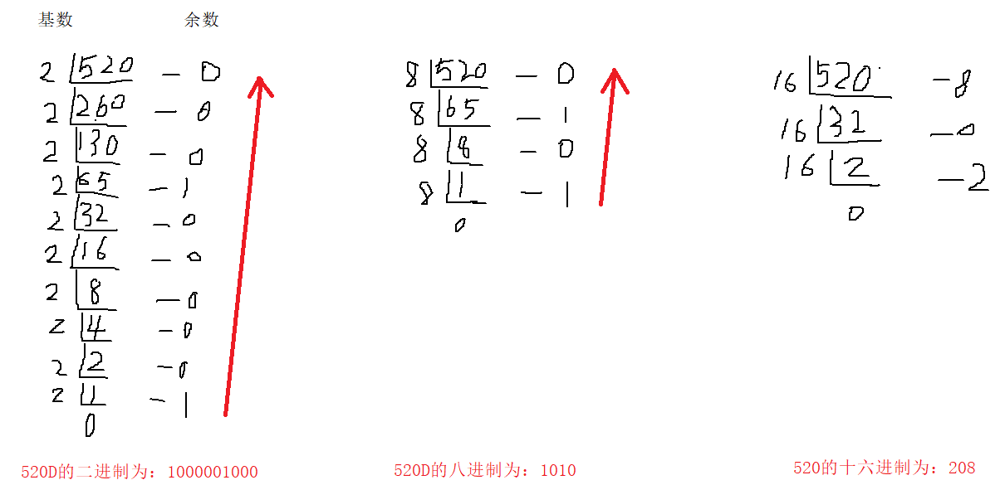


#####  2.3.1.2 法二: 拼凑法

**2的n次方表**


​    0.5 0.25 0.125

案例:

```c++
// 十进制:  533.125
533.125 = 512 + 4 + 1 + 0.125  // 对应2的n次方表 有的写1 没有写 0

//二进制
1000010101.001
```


####  2.3.2 **其他进制转十进制：位权相加**

本质就是权数

步骤:

1. 对其他进制从右往左依次开始编号，0 1 2 3 4 5 ...

2. 每一位的数通过公式 【数值 * 基数^编号】计算，
3. 把结果相加，即得到转换结果


以上面的520D的二进制、八进制和十六进制为例

```二进制10 0000 1000 转十进制```

```c
98 7654 3210 编号
10 0000 1000 B
1*2^9 + 0 + 1*2^3 = 512 + 0 + 8 = 520 D
```

``八进制1010 转十进制``

```c
3210 编号
1010 O
1*8^3 + 0 +1*8^0  = 520 + 8 =520 D  
```

``十六进制208 转十进制``

```c
210 编号
208 H
2*16^2 + 0 + 8*16^0 = 2*256 + 8 = 520 H  
```


#####  2.3.2.1 **八进制、十六进制与二进制相互转换：拆位和拼凑**

本质还是拼凑

``八进制与二进制``

+ 一个八进制数可以拆分为3个二进制数，3个二进制数可以合成一个八进制数    

+ 八进制数  0-7

+ 不够三位凑成三位 (4 2 1)   如 : 011 --> 3  111 --> 7

  ```c++
  //二进制 转 八进制
  // 三位一组转二进制,不够三位凑成三位
  001 000 001 000 B
  1   0   1   0   O
      
  //八进制转二进制
  // 用拼凑法.相当于每个位转二进制,不够三位凑成三位
  1   3   1   4   5   2   0    O    
  001 011 001 100 101 010 000  B
  ```

  

``十六进制与二进制``

+ 一个八进制数可以拆分为4个二进制数，4个二进制数可以合成一个十六进制数

+ 十六进制  0-9 A B C D E F (A代表10 以此类推)

+ 不够三位凑成四位 (8 4 2 1)     如: 1111 --> 15   --> F

  ```c++
  //二进制转十六进制
  //四位一组转二进制,不够三位凑成四位
  0010 0000 1000 B
  2    0    8    H
      
  //十六进制转二进制
  //用拼凑法.相当于每个位转二进制,不够三位凑成四位
  1    3    1    4    5    2    0    H
  0001 0011 0001 0100 0101 0010 0000 B    
  ```

  


### 2.4 整数的存储方式

#### 2.4.1 整数的存储方式

##### 2.4.1.1 机器数和机器数的真值

**1，机器数**

一个数在计算机中的二进制表示形式，叫做这个数的机器数。机器数是带符号的，在计算机用机器数的**最高位**存放符号，正数为0，负数为1。

比如:  十进制中的数 +3 ，**计算机字长为8位**，转换成二进制就是0000 0011，如果是 -3 ，就是 100 00011 。这里的 0000 0011 和 1000 0011 就是机器数。


**2，机器数的真值**

**将带符号位的机器数对应的真正数值**称为**机器数的真值**。

因为第一位是符号位，所以机器数的形式值就不等于真正的数值。

例如: 上面的有符号数 1000 0011，其最高位1代表负，其真正数值是 -3，而不是形式值131（1000 0011转换成十进制等于131）。

比如：0000 0001的真值 = +000 0001 = +1，1000 0001的真值 = –000 0001 = –1


##### 2.4.1.2 原码, 反码, 补码

在计算机中，数据有三种表现形式，分别为：原码、反码、补码

==总结:==

* 原码：最高位为符号位，0代表正，1代表负
* 反码：无符号或正数，原码 = 反码；负数反码  =  原码符号位不变，其余为取反
* 补码：无符号或正数，原码 = 反码； 负数补码  =  反码 + 1

**注：计算机存放数据都是用补码形式**


 **1. 原码**

+ **原码就是机器数的真值，原码是人脑最容易理解和计算的表示方式** 。  用第一位表示符号，其余位表示值。

比如：如果是8位二进制： 

```
[+1]原= 0000 0001    
[-1]原= 1000 0001
```

**因为第一位是符号位（即第一位不表示值，只表示正负）所以 8位二进制数的有效位就只有7位(2^7 = 128),    所以整数的( 0的源码有两个,这里先不考虑0), 取值范围就是：**  **[1111 1111 , 0111 1111]   即   [-127 , 127]**    (有符号的)

**那么一个字节的取值范围就是: **


**2. 反码**

+ 正数的反码是其本身；
+ 负数的反码是在其原码的基础上，符号位不变，其余各个位取反。

比如：如果是8位二进制：

```
[+1] = [0000 0001]原 = [0000 0001]反
[-1] = [1000 0001]原 = [1111 1110]反
```


**3.补码**

+ 正数的补码就是其本身；
+ 负数的补码是在其原码的基础上，符号位不变，其余各位取反，最后+1。(也即在反码的基础上+1)

比如：如果是8位二进制：

```
[+1] = [0000 0001]原 = [0000 0001]反 = [0000 0001]补
[-1] = [1000 0001]原 = [1111 1110]反 = [1111 1111]补
```

对于负数，补码表示方式也是人脑无法直观看出其数值的。通常也需要转换成原码再计算其数值。


#### 2.4.1.3   补码意义

* 统一了零的编码

| **十进制数** | **原码**  |
| ------------ | --------- |
| +0           | 0000 0000 |
| -0           | 1000 0000 |

| **十进制数** | **反码**  |
| ------------ | --------- |
| +0           | 0000 0000 |
| -0           | 1111 1111 |

| **十进制数** | **补码**                                              |
| ------------ | ----------------------------------------------------- |
| +0           | 0000 0000                                             |
| -0           | 10000 0000由于只用8位描述，最高位1丢弃，变为0000 0000 |


* 将减法运算转变为加法运算

  例如： 9 - 6

| **十进制数** | **原码**  |
| ------------ | --------- |
| 9            | 0000 1001 |
| -6           | 1000 0110 |

如果用原码计算：

| 0000 1001   |
| ----------- |
| 1000 0100 + |
| 1000 1111   |

结果： 9 - 6 = -15不正确

利用补码进行计算

| **十进制数** | 补码       |
| ------------ | ---------- |
| 9            | 0000  1001 |
| -6           | 1111  1010 |

| 0000 1001  |
| ---------- |
| 1111 1010  |
| 10000 0011 |

最高位的1溢出，剩余8位二进制表示为3，结果正确


##### 2.4.1.4 取数据

1. 无符号取数据： %u %lu   %llu  %o  %x  ...
2. 有符号取数据： %d  %ld  %lld  %f  %llf ...


**取数据步骤：**

* 高位如果是0， 代表正数   原码 = 反码 = 补码 ，原样输出

* 高位如果是1， 代表**负数 补码的 符号位不变，其余位取反 + 1**

  

注：**程序中的八进制和十六进制的数据，不用考虑正负，都按照无符号对待**

```c
void test01()
{
	char num = -15;
	//原码  1000 1111
	//反码  1111 0000
	//补码  1111 0001
    
	//有符号输出 
    //补码  1111 0001
    //原码  1000 1111
	printf("%d\n", num);   // -15

	//无符号输出
    //补码  1111 0001
    //原码  1111 0001
	printf("%u\n", num & 0x000000ff);
	//编译器自动让结果与 前3个字节为1 的数字 做了按位或操作
	/*
		0000 0000 0000 0000 0000 0000 1111 0001  反码
		1111 1111 1111 1111 1111 1111 0000 0000 |
		1111 1111 1111 1111 1111 1111 1111 0001  结果
	*/
}

void test02()
{

	char num = 0x9b;  // 16转2进制 这个就是 1001  1011  就是补码 
	//计算机原样存储  
    
	// 有符号取
	// 补码 1001  1011
	//变回去 原码 1110  0101  =  -（64 + 32 + 4 + 1） = - 101
	printf("%d\n", num);

	//无符号取
	printf("%x\n", num & 0x000000ff); //9b
	printf("%u\n", num & 0x000000ff); // 128 + 16 + 8 + 2 + 1 = 155
}
```

------------

**补充printf格式化输出: **

```c
void test01()
{
	int a = 10;

	printf("十进制：%d\n", a);
	printf("八进制：%#o\n", a);
	printf("十六进制：%#x\n", a);
	printf("十六进制：%#X\n", a);
}

void test02()
{
	int a = 123;		//十进制方式赋值
	int b = 0123;		//八进制方式赋值， 以数字0开头
	int c = 0xabc;	    //十六进制方式赋值

	printf("十进制：%d\n", a);
	printf("八进制：%#o\n", b);	  //%o,为字母o,不是数字
	printf("十六进制：%#x\n", c);
}

int main(void)
{
    test01();
    test02();
    return 0;
}
```

结果;

```
十进制: d
八进制: 012
十六进制: 0xa
十六进制: 0XA

十进制: 123
八进制: 0123
十六进制: 0xabc
```


#####  2.4.1.5 总结

一共有多少二进制位数要看具体情况   如: 类型 char 1字节(8位) --->8个二进制个数

```c
负数(高位1):   反码(符号位不变) + 1;
无符号取/正数/八进制 十六进制的数据:  原反补都相同
如果八进制,十六进制的数据 要用有符号取, 就需要考虑正负了
```

**使用计算器:**

+ 有符号去看高位,0用最高位判断正负, 按在计算机上最高位都用0
+ 无符号最高位是多少, 按在计算机上最高位就用多少


---------


#### 2.4.2 小数的存储方式

现如今的计算机中浮点数的存储都是遵循IEEE754/854标准，以**二进制的科学计数法存放到内存中。**

对于浮点数在计算机中有两种存储的精度，**即单精度和双精度，单精度是32位，双精度是64位。**


+ 符号位S：0为正，1为负

+ 指数E：即阶码，指明了小数点在数据中的位置

  + 为了让指数表示正、负引入了偏差码，
  + float的为127

    + 
  + double的为1024

+ 尾数M：**小数点后面的部分**

  ----------------------

**十进制小数  转  二进制小数-**-

+ 先把整数部分转化为二进制
+ 再把小数部分转化为二进制(**用2乘以小数部分，每次将结果整数取出，然后用剩余小数部分继续乘以2，直到小数部分为零，**或者达到要求的精度为止)

**例子1:**

十进制小数:   float f =   5.25 

1. 整数部分转二进制：5     ->  101

2. 小数部分转二进制

   ```c
   //小数部分转二进制：0.25  ->  0.01
   
   0.25 * 2 = 0.5  --- 0
   0.5  * 2 = 1.0  --- 1  
       
   //得小数部分：0.01    
   ```

​    3.  最后结果转成科学计数法：101.01 = 1.0101 * 2^2

可见指数实际值为2，加上偏差码127，2 + 127 = 129，129的二进制为10000001B.

**5.25在内存中的存储情况为:**

|  S   |  E(阶码)  | M(小数点后面的部分)(23位及23个二进制数) |
| :--: | :-------: | :-------------------------------------: |
|  0   | 1000 0001 |      0101 0000 0000 0000 0000 000       |

**如果把这个值作为整型使用，将是一个很大的数字，是1084751872**


**例子2:**

十进制小数:    float f = 5.20

1. 先把整数部分转成二进制:5- > 101

2. 把小数部分转为二进制:

   ```c
   //小数部分转二进制：0.20  -> 0.00110011
   0.20 * 2 = 0.4-0
   0.4* 2 = 0.8- 0
   0.8 *2 = 1.6- 1
   0.6* 2 = 1.2-1
   0.2 *2 = 0.4-0
   
   //得小数部分: 0.00110011
   ```
   
3. 最后结果转成科学计数法: 101.00110011 =  1.0100110011 *2^2

------------------------


把这个内存里面的值转为十进制小数：

例子:

计算机存储的小数(5.25):   0  1000 0001  0101 0000 0000 0000 0000 000

```c
//1, 首先判断S表示的正负      +
//2，计算出E实际表示的指数   1000 0001 = 129    129 - 127 = 2
//3，根据M写出二进制小数形式  1.0101 * 2^2  = 101.01
//4，对二进制小数以小数点为界限开始编号(使用加权法或者用拼凑法)

210 -1-2 编号
101. 0 1 B
1*2^2 + 0 + 1*2^0 + 0*2^(-1) + 1*2^(-2) = 4 + 1 +  0.25 =5.25   
```


**注意：**

- 在二进制，第一个有效数字必定是“1”，因此这个“1”并不会存储。 (阶码的原因)

- 浮点数不能精确表示其范围内的所有数。会精度丢失

  例子:   小数5.20 

  

- 可精确表示的数不是均匀分布的，越靠近0越稠密。


**补充例子**

1、把二进制 101000000111011011000转换为 十进制 八进制 十六进制的数，要有过程。（必做）

```
101000000111011011000

21 .. 14 13 12 11 10 9 8 7 6 5 4 3 2 1 0
加权法
```

2、尝试写出 9 - 13=-4 的二进制计算过程。（必做）

```
9:  0000 1001
13: 1000 1101
补码:
0000 1001
1111 0011
= 1111 1100

取数据:
1000 0011 + 1
= 1000 0100
结果为4
```

3、现有一单精度小数的二进制存储形式`1 1000 0011  011101`，请算出对应的十进制小数，要有过程（必做）

```
单精度小数 32
// 127
1 1000 0011  011101
1 -->  -
1000 0011 ---> 221 ---> 221 - 127 = 4 
0.011101 ---> 111.01
111.01 -->转二进制 11.25
```


## 三、基础数据类型

### 3.1 标识符和命名规范

标识符是编程时使用的名字，用于给变量、常量、函数、语句块等命名，以建立起名称与使用之间的关系。

C语言中把标识符分为三类：关键字，预定义标识符，用户自定义标识符 ,对于自定义标识符有如下规则和规范

**命名基本规则**

+ **标识符由字母（A-Z，a-z）、数字（0-9）、下划线“_”组成，**并且首字符不能是数字，但可以是字母或者下划线。例如，正确的标识符：abc，a1，prog_to。
+ 不能把C语言关键字作为用户标识符，例如if，for，while等。
+ 标识符对大小写敏感，即严格区分大小写。
+ 标识符命名应做到**“**见名知意**”**，例如，长度（length），求和、总计（sum），圆周率（pi）……

**常用命名规范**

+ 小驼峰(推荐)
  + 第一个单词首字母小写，后面其他单词首字母大写
  + 如：myName  youAge
+ 大驼峰
  + 所有单词的首字母都大写
  + 如MyName YouAge
+ 匈牙利
  + 在标识符前面加上小写字母作为前缀，标识出变量的作用域，类型等等
  + g_   全局变量 
  + c_   常量 
  + s_   静态成员变量

注意：写项目的时候，保持一种标准，建议使用小驼峰（工作了看企业需求）


### 3.2 常量与变量

#### **3.2.1 常量**

**常量是固定值，在程序执行期间不会改变。**这些固定的值，又叫做**字面量**。

常量可以是任何的基本数据类型，比如整数常量、浮点常量、字符常量，或字符串字面值，也有枚举常量。

##### 3.2.1.1  整数常量

整数常量可以是十进制、八进制或十六进制的常量。前缀指定基数：0x 或 0X 表示十六进制，0 表示八进制，不带前缀则默认表示十进制(VS2019支持二进制常量表示：0b或0B表示二进制)。

```c
80			//十进制,没有前缀
0120		//八进制
0X50		//十六进制
0B1010000	//二进制
```

**整数常量也可以带一个后缀**，后缀是 U 和 L 的组合，U 表示无符号整数（unsigned），L 表示长整数（long）。后缀可以是大写，也可以是小写，U 和 L 的顺序任意。

```c
520L   // long int
0X50l  // long int
520UL  // unsigned long int
```


##### 3.2.1.2 浮点常量

浮点常量由整数部分、小数点、小数部分和指数部分组成。可以使用小数形式或者指数形式来表示浮点常量。

当使用小数形式表示时，必须包含整数部分、小数部分，或同时包含两者。当使用指数形式表示时， 必须包含小数点、指数，或同时包含两者。带符号的指数是用 e 或 E 引入的。

```c
// 默认就是双精度的.想要一个的单精度,在浮点数后面加个f
3.1213F
3.1213f
```

```c
0.25;		//合法
.25;		//合法 	相当于0.25
5.;			//合法 	相当于5.0

// 指数形式
5.20E0      //合法    5.20 * 10^0
5.20E-1     //合法    5.20 * 10^-1
314159E-5;	//合法	3.14159;
314159E;	//非法	应输入指数值而非“;”
.E-5;		//非法	缺少整数或者分数
```


##### 3.2.1.3 字符常量

字符常量是括在单引号中，例如: 'x' 。

字符常量可以是一个普通的字符（例如 'x'）、一个转义序列（例如 '\t')，或一个通用的字符（例如 '\u02C0'）。

**ASCII字符代码表：**


严格意义来说字符 就是 特殊字符 + 0-9数字字符 + 英文大小写字符

**转义字符:** ==一种特殊的字符常量==

+ 以反斜线"\"开头，后跟一个或几个字符。
+ 转义字符具有特定的含义，不同于字符原有的意义，故称“转义”字符。
+ 转义字符中只能使用小写字母，每个转义字符只能看作一个字符。
+ ‘\v’垂直制表和‘\f’换页符对屏幕没有任何影响，但会影响打印机执行响应操作。

下表列出了一些这样的转义序列码：

| 转义序列 | 含义                  | ASCII码值(十进制) |
| :------- | :-------------------- | ----------------- |
| \\\      | \ 字符                | 092               |
| \\'      | ' 字符                | 039               |
| \\"      | " 字符                | 034               |
| \a       | 警报铃声              | 007               |
| \b       | 退格键                | 008               |
| \f       | 换页符                | 012               |
| \n       | 换行符                | 010               |
| \r       | 回车                  | 013               |
| \t       | 水平制表符            | 009               |
| \v       | 垂直制表符            | 011               |
| \0       | 空字符(NULL),没有字符 | 000               |
| \ddd     | 一到3位的八进制数     | -                 |
| \xhh     | 一到2位的十六进制数   | -                 |

```c
//转义字符
printf("\\ \n" );    // 输出 \
printf("\’ \n" );    // 输出 '
printf("\" \n" );
printf("\a" );       // 响铃
printf( "hello \n" );
printf( "hello \ bworld \n" );
printf( "hello\f\n" );
printf( "world \r" );// r是光标移动到开头l //windows系统上换行就是\n Linux系统上换行是\r\n

// \t制表符
// 一个中文两字节跨度
// 1，默认以8个字符宽度对其(加上本身)
// 2，如果本身字符串大小等于了八个字符宽度，那则以16个字符宽度对其(以8个字符宽度累加)
printf( "name\t\tage \tscore \n" );
printf("顽石老师\t18\t59.5\n" );
//结果:
name           age     score
顽石老师        18      59.5
```


##### 3.2.1.4 字符串常量

字符串字面值或常量是括在双引号 "" 中的。

+ 一个字符串包含类似于字符常量的字符：普通的字符、转义序列和通用的字符。 

+ 可以使用空格做分隔符，把一个很长的字符串常量进行分行。

下面的实例显示了一些字符串常量。下面这三种形式所显示的字符串是相同的。

```c
"hello,world";

"hello,
 world";

"hello,""w""orld";
```


##### 3.2.1.5 定义常量

在 C 中，有两种简单的定义常量的方式：

1. 使用 **#define** 预处理器。
2. 使用 **const** 关键字。

**#define 预处理器**

>#define identifier value	/\*#define 标识符  常量值\*/

*示例：*

```c
#include<stdio.h>

#define PI 3.1415

int main()
{
	printf("圆的面积为:%lf",PI*3*3);   
    return 0;
}
//output:圆的面积为:28.273500
```

**const关键字**

使用 **const** 前缀声明指定类型的常量，如下所示：

> const type variable = value;


const 声明常量要在一个语句内完成：

==const 声明常必须同时进行初始化==


具体请看下面的实例：

*示例：*

```c
#include<stdio.h>

int main()
{
    const float PI = 3.1415f;
	printf("圆的面积为:%f",PI*3*3);   
    return 0;
}
//output:圆的面积为:28.273500
```

注意: 把常量定义为大写字母形式.


#### 3.2.2 变量

变量来源于数学，是计算机语言中能储存计算结果或能表示值的抽象概念。

每种变量都有对应的数据类型，有不同大小的存储空间*(为了适应不同的数据类型，也为了节省内存)*，在C语言中主要有如下

##### 3.2.2.1 **基础数据类型**


| 类型          | 32位编译器                                              | 64位编译器                |
| ------------- | ------------------------------------------------------- | ------------------------- |
| char          | 1个字节                                                 | 1个字节                   |
| char*         | 4个字节（32位的寻址空间是2^32, 即32个bit，也就是4个字节 | 8个字节（同理64位编译器） |
| short int     | 2个字节                                                 | 2个字节                   |
| int           | 4个字节                                                 | 4个字节                   |
| unsigned int  | 4个字节                                                 | 4个字节                   |
| float         | 4个字节                                                 | 4个字节                   |
| double        | 8个字节                                                 | 8个字节                   |
| long          | 4个字节                                                 | 8个字节                   |
| long long     | 8个字节                                                 | 8个字节                   |
| unsigned long | 4个字节                                                 | 8个字节                   |

+ 实型默认都是double型
+ 整型默认都是int型
+ 所有类型默认都是有符号(signed)型

##### 3.2.2.2 变量的定义

定义变量就是告诉编译器在何处创建变量的存储，以及如何创建变量的存储。

> type variable_list

在这里，**type** 必须是一个有效的 C 数据类型，可以是 char、int、float、double 或任何用户自定义的对象，**variable_list** 可以由一个或多个标识符名称组成，多个标识符之间用逗号分隔。下面列出几个有效的声明：

```cpp
int age,money;
char sex;
float PI;
```

**变量可以在定义的时候被赋值，这种在定义是指定一个初始值的方式叫做变量的初始化。**

```c
int age = 18;	//初始化
age = 19;		//赋值
```

>不带初始化的定义：变量的初始值是未定义的。


### 3.3 左值（Lvalues）和右值（Rvalues）

C 中有两种类型的表达式：

1. **左值（lvalue）：**指向内存位置的表达式被称为左值（lvalue）表达式。左值可以出现在赋值号的左边或右边。
2. **右值（rvalue）：**右值（rvalue）指的是存储在内存中某些地址的数值。右值是不能对其进行赋值的表达式，也就是说，右值可以出现在赋值号的右边，但不能出现在赋值号的左边。

**变量是左值**，因此可以出现在赋值号的左边。

**数值型的字面值(常量)是右值**，因此不能被赋值，不能出现在赋值号的左边。

下面是一个有效的语句：

```c
int g = 20;		//g是左值
```

但是下面这个就不是一个有效的语句，会生成编译时错误：

```c
10 = 20;		//10是右值
```

### 3.4 数据类型转换

数据类型转换就是将数据（变量、数值、表达式的结果等）从一种类型转换为另一种类型。

#### 3.4.1 **隐式自动类型转换**

自动类型转换就是编译器默默地、隐式地、偷偷地进行的数据类型转换，这种转换不需要程序员干预，会自动发生。

1) 将一种类型的数据赋值给另外一种类型的变量时就会发生自动类型转换，例如：

```cpp
float f = 100;
```

100 是 int 类型的数据，需要先转换为 float 类型才能赋值给变量 f。再如：

```cpp
int n = f;
```

f 是 float 类型的数据，需要先转换为 int 类型才能赋值给变量 n。

在赋值运算中，赋值号两边的数据类型不同时，需要把右边表达式的类型转换为左边变量的类型，这可能会导致数据失真(数据输入和输出不一致)，或者精度降低；所以说，自动类型转换并不一定是安全的。对于不安全的类型转换，编译器一般会给出警告。

2) 在不同类型的混合运算中，编译器也会自动地转换数据类型，将参与运算的所有数据先转换为同一种类型，然后再进行计算。转换的规则如下：

- 转换按数据长度增加的方向进行，以保证数值不失真，或者精度不降低。例如，int 和 long 参与运算时，先把 int 类型的数据转成 long 类型后再进行运算。
- 所有的浮点运算都是以双精度进行的，即使运算中只有 float 类型，也要先转换为 double 类型，才能进行运算。
- char 和 short 参与运算时，必须先转换成 int 类型。


自动类型转换示例：

```c
#include<stdio.h>
int main()
{    
    float PI = 3.14159;    
    int s1, r = 5;    
    double s2;    
    s1 = r * r * PI;    
    s2 = r * r * PI;    
    printf("s1=%d, s2=%f\n", s1, s2);    
    return 0;
}
```

运行结果：
s1=78, s2=78.539749

在计算表达式`r*r*PI`时，r 和 PI 都被转换成 double 类型，表达式的结果也是 double 类型。但由于 s1 为整型，所以赋值运算的结果仍为整型，舍去了小数部分，导致数据精度丢失。


#### 3.4.2 强制类型转换

自动类型转换是编译器根据代码的上下文环境自行判断的结果，有时候并不是那么“智能”，不能满足所有的需求。如果需要，程序员也可以自己在代码中明确地提出要进行类型转换，这称为强制类型转换。

强制类型转换的格式为：

```c
(type) expression
```

`type`为目标类型名称，`expression`为表达式。例如：

```c
(float) a;    //将变量 a 转换为 float 类型
(int)(x+y);   //把表达式 x+y 的结果转换为 int 整型
(float) 100;  //将数值 100（默认为int类型）转换为 float 类型
```

下面是一个需要强制类型转换的经典例子：

```c
#include <stdio.h>
int main()
{    
    int sum = 315;  //总数    
    int count = 7;  //数目    
    double average;  //平均数    
    average = (double) sum / count;    
    printf("Average is %lf!\n", average);    
    return 0;
}
output:Average is 44.714286!
```

sum 和 count 都是 int 类型，如果不进行干预，那么`sum / count`的运算结果也是 int 类型，小数部分将被丢弃；虽然是 average 是 double 类型，可以接收小数部分，但是心有余力不足，小数部分提前就被“阉割”了，它只能接收到整数部分，这就导致除法运算的结果严重失真。

既然 average 是 double 类型，为何不充分利用，尽量提高运算结果的精度呢？为了达到这个目标，我们只要将 sum 或者 count 其中之一转换为 double 类型即可。上面的代码中，我们将 sum 强制转换为 double 类型，这样`sum / count`的结果也将变成 double 类型，就可以保留小数部分了，average 接收到的值也会更加精确。

注意不能写作`(double) (sum / count)`，这样写运算结果将是 44.000000，仍然不能保留小数部分。


### 3.5 基本输入输出

若需要使用输入输出函数，则需要包含  <stdio.h>头文件。

#### 3.5.1 输出

##### 3.5.1.1 printf

printf可以格式化输出任意的基本数据类型的变量。

```c
int printf(const char*format, ...)
    
// 参数
format："格式控制符"是用双引号括起来的字符串（格式控制符，也叫[占位符](#占位符(格式控制符))）
...：   "输出列表"中的数据可以是合法的常量、变量和表达式，要与“格式控制字符串”中的格式一一对应。
```

#####  显示方式:

**printf打印形式(%02X, %2X, %-2X, %.nf, %m.nf, %e, %m.ne, %2d, %-2d, %02d, %.2d)**

整2表示前面占两个 ,  负2表示后面占两个空格  ,  02表示不足位补0;

对应f  :  .2表示 小数 点后有几位   , 4.3表示前面空位,小数点后有3位


##### 3.5.1.2 putchar

**打印一个字符**在显示器屏幕上

```c
int putchar(int ch);
putchar('A');
puchar(65);
```


##### 3..5.1.3 puts

**简单的输出一个字符串**，puts函数会在输出字符串之后**，自动进行换行。**

```c
int puts(const char*str);
puts("hello world");	
```


#### 3.5.2 输入

##### 3.5.2.1 scanf

scanf是最常用的输入函数，可以格式化输入任意基本数据类型的变量。

```c
int scanf(const char* format, ...);

//参数
format："格式控制符"是用双引号括起来的字符串
...：   "输入列表"中的数据必须是合法变量的地址表(即变量前面加&符)，要与“格式控制字符串”中的格式一一对应。
如果输入的输入不止一个，在format格式控制字符串中，必须以空格间隔。
```

  ==注意:  字符串不需要取地址其余需要取地址==

**示例：**

```c
const double PI = 3.1415;
int  radius = 0;
printf("请输入半径:\n");
scanf("%d", &radius);
printf("圆的面积为:%lf", PI * radius * radius);
```


**使用scanf() 会有错误解决方法如下:**

+ **1, #define  _CRT_SECURE_NO_WARNINGS  (推荐)** 关闭安全开发生命周期检查

+ 2, 菜单栏->属性->C/C++->SDL->否

+ 3, 使用scanf_s替代scanf()

  ```c
  char ch = 0;
  char name[ 50] = "";
  //使用scanf_s输入字符和字符串时，必须指定缓冲区长度
  scanf_s( _Format: "%c %s", &ch,1,name,50);     //字符串不需要取地址
  printf(_Format: "%c %s \n", ch, name);
  ```


**特殊的,专门针对字符串格式控制符的**

```c
//特殊的，专用用来输入字符串的格式控制符%[]l 
scanf("%[A-Za-z0-9]", name );    // 只要出现不在A-Za-z0-9的字符,后面的丢去
printf( "%s" , name);

//取反
scanf(_Format:"%[^0-9]",name);
printf( _Format : "%s" , name) ;
```


 **scanf函数注意事项**

*scanf函数的格式字符串由以下三类字符组成：*

+ 1>格式符(也叫占位符)
  和printf函数类似，scanf函数的格式字符串以%开始，以一个格式字符结束，中间可以插入附加的字符。格式符告诉了scanf函数该读取什么样的数据。

+ 2>空白符
  空白符可以是空格(用空格键输入)、制表符(用Tab键输入)和新行符(用回车键输入)。

+ 3>非空白符
  除去格式说明符合空白符之外，就是非空白符。非空白符在用户输入的时候，也必须一并输入。


  ​                    

##### 3.5.2.2 getchar

**输入一个字符**, 需要按回车键

```c
int getchar();
```

****


##### 3.5.2.3  **_getch() **

**输入一个字符**  **不用用户按回车  **

**头文件: #include <conio.h> 不是所有平台支持**且该函数的输入不会自动显示在屏幕上


##### 3.5.2.4 gets_s

**简单输入一个字符串**

```c
char* gets_s(char*  _Buffer,size_t _Size);
```


#### 3.5.3 占位符(格式控制符format)

**占位符就是先占住一个固定的位置，等着你再往里面添加内容的符号，广泛用于计算机中各类文档的编辑。**

格式占位符(%)是在C/C++语言中格式输入函数，如 scanf、printf 等函数中使用。其意义就是起到格式占位的意思，表示在该位置有输入或者输出。

C语言中，有专门的格式占位符对整型、浮点型、指针类型进行输入输出。  **决定了数据的解析**

 **整型**

+ 常用

  格式控制符必须和后面的数据类型匹配

| 占位符 | 说明                   |
| ------ | ---------------------- |
| %hd    | short                  |
| %hu    | unsigned short         |
| %d，%i | int类型                |
| %u     | unsigned int类型       |
| %ld    | long int               |
| %lu    | unsigned long int      |
| %lld   | long long int          |
| %llu   | unsigned long long int |
| %c     | char                   |

+ 指定进制输出

| 占位符 | 说明                                                       |
| ------ | ---------------------------------------------------------- |
| %o     | 有符号八进制整数                                           |
| %x，%X | 无符号十六进制整数，并以小写abcdef表示\|并以大写ABCDEF表示 |

如果想要输出相应的进制的前缀，可以在%和符号之间加上#。

```c
int  a = 10;
printf("%#o\n", a);
printf("%#x %#X\n", a, a);
```

**OUTPUT：**

```cpp
012
0xa 0XA
```


**浮点型**

| 占位符 | 说明                                                         |
| ------ | ------------------------------------------------------------ |
| %f     | float                                                        |
| %lf    | double                                                       |
| %e，%E | 以指数形式输出浮点数(输入时小数形式和指数形式都可以识别)     |
| %g，%G | 自适应输出小数或者指数形式(输入时小数形式和指数形式都可以识别) |

+ %g用来输出实数，它根据数值的大小，自动选f格式或e格式（选择输出时占宽度较小的一种），且不输出无意义的0。

```c
printf("%g\n", 0.00001234);		//1.234e-05
printf("%g\n", 0.0001234);		//0.0001234
```


 **指针类型**

| 占位符 | 说明                     |
| ------ | ------------------------ |
| %p     | 以十六进制的方式输出地址 |


**字符串**

| 占位符 | 说明                      |
| ------ | ------------------------- |
| %s     | 输出/输入以\0结尾的字符串 |
| %[]    | 输入字符串的特殊占位符    |

％[ ]，这个参数的意义是读入一个字符集合。[ ]是个集合的标志，因此%[ ]特指读入此集合所限定的那些字符,比如%[A-Z]是输入大写字母，一旦遇到不在此集合的字符便停止。如果集合的第一个字符是"^"，这说明读取不在"^"后面集合的字符，既遇到"^"后面集合的字符便停止。如果要在循环中用**scanf(**"%\[^\n] "**, s)**读取多行的字符串，就要在读取一行后，再用scanf(“%c”,ch) 或者getchar()函数读取一个字符(**换行符)**，将输入缓冲区中的换行符给读出来。否则的话，在下一次读取一行的时候，第一个就遇到'\n'，就会读入一个空字符串。

 **格式控制符可选项**

```c
%[-][0][M]*
```

+ % 和 *组成占位符

+ M：表示以指定的宽度输出，若数据的位数小于M，则左侧补空格；若M前面有"C"，则左端补''C"

+ 0：如果指定了'0'，则以'0'进行填充

+ -：表示左对齐  + 表示右对齐

  

#### 3.5.4  注意事项和总结

+ 格式字符中，除了X、E、G外，其他均用小写字母，如“%d”不能写成“%D”。
+ 不同类型的数据应使用相应类型的格式字符说明其输出形式。
+ 如需输出双引号，应在“格式控制”中表示为转义字符的形式并用单引号引起来，即“\””。
+ 如需输出字符“％”，在“格式控制”中用连续两个“％”即可。
  如：printf(“%d%%”,s);
+ 当“格式控制”中格式符个数少于输出表中的输出项时，多余的输出项不予输出。
+ 当“格式符”多于输出项时，结果为不定值。
+ **记忆常见 h-->short   d-->int  l-->long   u-->无符号  f-->float lf--->double**

​         


**补充例子**

编程实现输入一个字符，若字符是大写字母则转小写输出，如是小写字母则转大写字母输出，不是字母字符直接输出。

```c
#include <stdio.h>

int main(void)
{
    char ch = '9';
    if ((int)ch > 97 && (int)ch < 122) 
        ch -= 32;
    else if ((int)ch > 65 && (int)ch < 90)
        ch += 32;

    printf("%c", ch); 
    return 0;
}
```


## 四、 运算符和表达式

**运算符**：运算符用于执行程序代码运算，会针对一个以上操作数来进行运算。例如：2+3，其操作数是2和3，而运算符则是“+”

**操作数**：是运算符作用于的实体，操作数指出指令执行的操作所需要数据的来源。

**表达式**：是由数字、运算符、数字分组符号（括号）、自由变量等以能<font color = red>求得数值的</font>有意义排列方法所得的组合。

**表达式书写规则**

+ 1，运算符不能相邻。例a+ -b是错误的
+ 2，乘号不能省略。列x乘以y，应写成x*y，而不是xy
+ 3，可用多层括号表示运算次序，括号必须成对出现，均使用小括号。


**运算符优先级和结合性**

所谓优先级就是当一个表达式中有多个运算符时，先计算谁，后计算谁。这个其实我们在小学学算术的时候就学过，如`1+4÷2`

那么“结合性”是什么呢？优先级都是关于优先级不同的运算符参与运算时先计算谁后计算谁。但是如果运算符的优先级相同，那么先计算谁后计算谁呢？这个就是由“结合性”决定的。

比如`1+2×3÷4`，乘和除的优先级相同，但是计算的时候是从左往右，即先计算乘再计算除，所以乘和除的结合性就是从左往右。就是这么简单！

### 4.1 运算符分类

**按所需操作数分类：**

+ 单目运算符
+ 双目运算符
+ 三目运算符

**按作用分类：**


### 4.2  算术运算符

| **符号** | **功能** |
| -------- | -------- |
| +        | 单目正   |
| -        | 单目负   |
| +        | 加       |
| -        | 减       |
| *        | 乘       |
| /        | 除       |
| %        | 取模     |

+ 单目正负不会改变操作数的值。

  ```CPP
  int num = 10;
  -num;	//表达式的值为-10  num还是为10
  ```

+ 整数相除会向下取整。

  ```cpp
  5/2   == 2
  5/2.0 == 2.5
  ```

+ 取模运算只针对整数。

  ```cpp
  5%2 == 1
  5.2%2		//语法错误
  ```


### 4.3  赋值运算符

| **符号** | **功能** |
| -------- | -------- |
| =        | 赋值     |
| +=       | 赋值     |
| -=       | 赋值     |
| *=       | 赋值     |
| /=       | 赋值     |
| %=       | 赋值     |
| <<=      | 赋值     |
| >>=      | 赋值     |

+ 将一个数据(常量或表达式)赋值给一个变量。

  ```cpp
  int age =18;
  age +=2;		//age = age +2;
  age +=5-3;		//age = age+(5-3);
  ```


### 4.4  关系运算符

| **符号** | **功能** |
| -------- | -------- |
| >        | 大于     |
| <        | 小于     |
| ==       | 等于     |
| >=       | 大于等于 |
| <=       | 小于等于 |
| !=       | 不等于   |

+ **关系表达式的值只有2种，为真(true)返回1，为假(false)返回0。**

  ```c
  bool ret =  'z' >= ch >= 'a';	
  //有问题:这种写法是数学中的写法，在C语言中是不行的
  // ret = 1 
  // ret >= 'a'  // 0
  
  //在C语言中必须用逻辑运算符连接关系表达式，不能连着写
  
  
  int x=3,y=4,z=4;
  printf("%d\n",(z>=y>=x) ? 1:0);
  // 结果 0
  ```

  

+ **头文件 stdbool.h**

+ 所谓关系运算，就是做比较，日常生活中经常遇到一些真假判断，比如说，“张三比李四高”、“济南到北京比济南到上海近”，“5大于2”这些问题的答案是真或假。程序设计是对实际问题解决过程的模拟，常常需要做判断，像“如果这样，我就执行动作A，如果那样，我就执行动作B”，那怎么判断这样那样呢，就需要关系运算符和关系表达式。


### 4.5  逻辑运算符

| **符号** | **功能**                      |
| -------- | ----------------------------- |
| &&       | 逻辑与                        |
| \|\|     | 逻辑或                        |
| !        | 单目逻辑非   (0变非0, 非0变0) |

+ **逻辑表达式的值只有2种，为真(true)返回1，为假(false)返回0。**

  ```c
  int a = 0, b = 5, c = 0, d;
  d = !a && !b || !c;
  printf("%d\n", !a);      // 1
  printf("%d\n", d);       // 1
  
  int a = 0, b = 5, c = 1, d;
  d = !a && !b || !c;
  printf("%d\n", !a);    // 1
  printf("%d\n", d);     // 0
  ```

  

+ **一般用来连接关系表达式。**


#### 4.5.1 短路现象

在由&&和||运算符组成的逻辑表达式中，C语言有个“节省计算”原则，**当计算出一个子表达式的值后便可确定整个逻辑表达式的值时，后面的子表达式就不需要再计算了，这种表达式也称为短路表达式。**

**举个栗子：**

```cpp
false  && printf("1\n");
true   && printf("2\n");

false  || printf("3\n");
true   || printf("4\n");
//output :2
//		  3	
```

**对于&&符号，如果左边表达式为false，则右边表达式不会执行，**即不会执行printf(“1”)，如果左边表达式为true,则右边表达式会执行，即会执行printf(“2”)，输出2

**对于||符号,如果左边为true,则右边表达式不会执行，**即不会执行printf("4")，如果左边表达式为false,则右边表达式会执行，即执行printf("3"),输出3。

**所以 if 中谁写前面是有影响的**


### 4.6 特殊运算符

 **特殊算术运算符**

| **符号** | **功能** |
| -------- | -------- |
| ++       | 自增     |
| --       | 自减     |

+ 对变量进行+1和-1的操作。

+ 只能对变量使用，不能用于常量和表达式
+ 前置时是先运算、后使用
+ 后置时是先使用、后运算
+ **注意：不要嵌套使用**  

```cpp
int a = 1;
printf("%d", (a++ + ++a));  //1 + 3
```


### 4.7  逗号运算符

用逗号将多个表达式连接起来，又称为“顺序求值运算符”。整个表达式的值是最后那个逗号之后表达式的值。详细看c++的笔记

**逗号表达式两种作用：**

+ 分割：

  ```cpp
  int a,b,c,d;
  ```

+ 求值：

  ```cpp
  int a = (1,3,5,7,9);   // a = 9
  ```


### 4.8  条件表达式

条件表达式可以对指定的条件进行判断，true和false分别执行不同的代码。

>条件 ？表达式1 ： 表达式2 可以得到返回值

```cpp
printf(5 > 0 ?  "正数" : "负数");
printf((5 > 0) ?  ("正数") : ("负数"));		//为了避免眼花缭乱，可以把每个表达式都加上圆括号
```


### 4.9 取地址符

**&变量名：获取任何变量的地址**都是取到的首地址

```c++
printf("%d", &a);
```

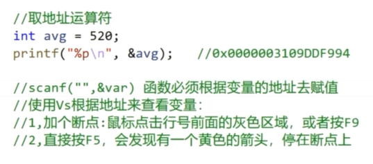

### 4.10  sizeof 求内存大小的运算符

sizeof() 是一个判断数据类型或者表达式长度的运算符，**对 sizeof() 的处理都是在编译阶段进行。**

```c
sizeof(int)   // int 4
```

  

### 4.11 位运算符

| **符号** | **功能** | **记忆技巧**     |
| -------- | -------- | ---------------- |
| &        | 按位与   | 有0则0           |
| \|       | 按位或   | 有1则1           |
| ^        | 按位异或 | 相同为0，不同为1 |
| ~        | 单目取反 | 0变1,1变0        |
| <<       | 左移     | 移位右边补0      |
| >>       | 右移     | 移位左边补0      |

+ **位运算只针对整型和字符型，而且是直接对二进制进行操作**


#### 4.11.1 按位与&

和逻辑与运算 && 意思一样，只不过作用在每一位上。

**有0则0：**对于每一位来说，两个数都是真，则为真，否则为假。

```cpp
// 用1字节测试
3-> 0b 0000 0011
2-> 0b 0000 0010 
3&2 ->0b 0000 0010
```


#### 4.11.2  按位或|

和逻辑或运算 || 意思一样，只不过作用在每一位上。

**有1则1：**对于每一位来说，但凡有个真的就是真，否则为假。

```cpp
3	-> 0b 0000 0011
2	-> 0b 0000 0010
3|2 ->0b 0000 0011
```


#### 4.11.3  按位异或^

**相同为0，不同为1： **对于每一位来说，只要相同就为0，不同就为1。

```cpp
3	-> 0b 0000 0011
2	-> 0b 0000 0010
3^2 ->0b 0000 0001
```


#### 4.11.4  按位取反

**0变1，1变0**，对每一位进行取反，即0变1，1变0

```cpp
6	-> 0b 0000 0110
~6	-> 0b 1111 1001    //补码:最高位变成了符号位，所以结果肯定是一个负数
       0b 1000 0110	  //反码
       0b 1000 0111	  //原码
result: -7
    
//~0是多少
0000 0000
1111 1111   --> 255 (无符号)
```


#### 4.11.5 左移

左移操作就是整体往左移动 n 位，**右边缺的就补充 0。**

```cpp
3		-> 0b 0000 0011
3<<1 	-> 0b 0000 0110 == 6
    
2		-> 0b 0000 0010
2<<2 	->0b 0000 1000 == 8
```

左移 1 位之后这个数相当于乘2。

但是这只适用于左边溢出的高位中不包含 1 时。

如果把 1 扔了，那就肯定不是 2 倍了嘛。

#### 4.11.6 右移

右移操作就是整体往右移动 n 位，左边缺的补充符号位。

```cpp
3		-> 0b 0000 0011
3>>1 	-> 0b 0000 0001 ==1
    
2		-> 0b 0000 0010
2>>2    -> 0b 0000 0000 == 0
```

正数右移操作的效果是这个数除以 2。


```c++
// 状态                // 可以写成
const int None = 0;   // 0
const int MAX = 2;    // 1 << 1
const int MIN = 4;    // 1 << 2
const int ACTIVE= 8;  // 1<< 3
int curState = 10;

// | 当前的状态是最大化与激活
curState = MAX | ACTIVE;
/*
*2 0000 0010
*8 0000 1000
*------------....
*  0000 1010  
```


```c
// & 判断一下有没有激活状态
*curState 0000 1010
*ACTIVE   0000 1008
*-- - -- ---------
		  0000 1000  ->ACTIVE


*curState  0000 1010
MAX        0000 0010
----------------
		   0000 0010 -->MAX 
```


```c
// ^ 如果没有某个状态就添加，如果有就取消, 没有的时候就加上
curState = curState ^MIN;
/**没有的时候就加上
*MAX | ACTIVE   0000 1010
*MIN            0000 0100
0000 1110

*有的时候就去掉
*curState 0000 1110
*MIN      0000 0100
0000 1010
```


## 五、循环结构

 程序最小独立单元

如果把写程序和写小说类比，变量常量等可以看成是字和词，函数可以看成是一个段落，运算符等可以看作是字词的组合方式（规则），那么，字词组成的句子就是小说的最小独立单元，表达了一定的意思，同样，程序的最小独立单元是“语句”，每个语句表达出完整的意义。

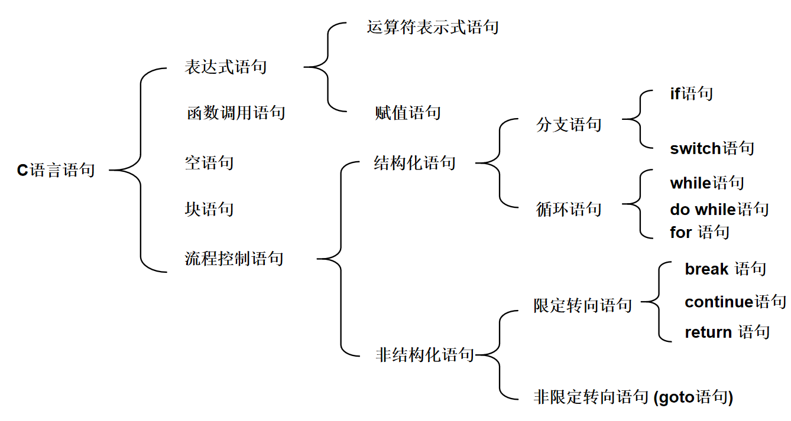


### 5.1  三种控制结构

结构化程序设计提供了3种控制结构，分别是顺序结构、分支结构和循环结构，早在1966年，牛人Bohm和Jacopini便证明了，用此3种基本结构可以构成任意复杂的算法。3种基本控制结构如所示。


### 5.2  顺序结构

顺序结构表示程序中的各操作是按照它们出现的先后顺序执行的。

顺序结构是最简单的程序结构，也是最常用的程序结构，只要按照解决问题的顺序写出相应的语句就行，它的执行顺序是自上而下，依次执行。

例如，a = 3，b = 5，现交换a，b的值，这个问题就好像交换两个杯子水，这当然要用到第三个杯子，假如第三个杯子是c，那么正确的程序为： c = a； a = b； b = c； 执行结果是a = 5，b = c = 3如果改变其顺序，写成：a = b； c = a； b = c； 则执行结果就变成a = b = c = 5，不能达到预期的目的，初学者最容易犯这种错误。

### 5.3  分支结构

顺序结构的程序虽然能解决计算、输出等问题，但不能做判断再选择。对于要先做判断再选择的问题就要使用分支结构。分支结构的执行是依据一定的条件选择执行路径，而不是严格按照语句出现的物理顺序。

**单一分支**

+ 语法

  ```c
  if(条件)
  {
   	分支   
  }
  ```

+ 规则：当条件成立时，执行分支体，否则不执行。


**双分支**

+ 语法

  ```c
  if(条件)
  {
      分支1
  }else
  {
      分支2
  }
  ```

+ 规则：当条件成立时，执行分支体1，否则执行分支体2。


**嵌套分支**

+ 语法

  ```c
  if(条件1){分支1}
  else if(条件2){分支2}
  ...
  else if(条件n){分支n}
  else{分支n+1}
  ```

+ 规则：条件1成立时，执行分支1，然后结束分支语句，否则继续依次判断后面的条件，或者直到某个条件满足。如果条件都不满足，则会执行else分支。


**switch开关语句**

+ 语法

  ```c
  switch(exp)
  {
      case 常量表达式1:
      case 常量表达式2:
      case 常量表达式3:
      ...
      case 常量表达式4:
      [以下语句为可选]
      default:
          break;
  }++
  ```

+ 规则：

  + exp(表达式)和case后面的“常量表达式”的结果值的类型应该一致。其类型可以是除实型以外的任何类型（如整型、字符型、枚举类型）。
  + 在同一switch语句中，case后的常量表达式的值必须唯一。
  + switch语句中可以不含default分支；default分支并不限定在最后，几个case分支也没有顺序区别，但必须做适当处理，否则会影响执行结果。


### 5.4 循环结构

有的时候，我们可能需要多次执行同一块代码。一般情况下，语句是按顺序执行的：函数中的第一个语句先执行，接着是第二个语句，依此类推。

编程语言提供了更为复杂执行路径的多种控制结构。

循环语句允许我们多次执行一个语句或语句组，下面是大多数编程语言中循环语句的流程图：


#### 5.4.1  循环类型

C 语言提供了以下几种循环类型。

**for 循环**

+ 语法

  ```cpp
  for(init;condition;increment)
  {
      循环体;
  }
  ```

+ 规则

  + **init** 会首先被执行，且只会执行一次。这一步允许声明并初始化任何循环控制变量。您也可以不在这里写任何语句，只要有一个分号出现即可。

  + 接下来，会判断 **condition**。如果为真，则执行循环体。如果为假，则不执行循环主体，且控制流会跳转到紧接着 for 循环的下一条语句。

  + 在执行完 for 循环主体后，控制流会跳回上面的 **increment** 语句。该语句允许您更新循环控制变量。该语句可以留空，只要在条件后有一个分号出现即可。

  + 条件再次被判断。如果为真，则执行循环，这个过程会不断重复（循环主体，然后增加步值，再然后重新判断条件）。直到条件变为假时，for 循环终止。

    

**while循环**

+ 语法

  ```cpp
  while(condition)
  {
      循环体;
  }
  ```

+ 规则

  + 只要condition为真，C 语言中的 **while** 循环语句会重复执行循环体。


**do...while循环**

+ 语法

  ```cpp
  do
  {
      循环体;
  }while(condition);
  ```

+ 规则

  + 不像 **for** 和 **while** 循环，它们是在循环头部测试循环条件。在 C 语言中，**do...while** 循环是在循环的尾部检查它的条件。
  + **do...while** 循环与 while 循环类似，但是 do...while 循环会确保至少执行一次循环。


#### 5.4.2 循环控制语句

循环控制语句改变你代码的执行顺序。通过它你可以实现代码的跳转。

C 提供了下列三个循环控制语句。

##### 5.4.2.1 break语句

**作用**：终止**循环**或 **switch** 语句，程序流将继续执行紧接着循环或 switch 的下一条语句。

+ break只能跳出一层循环，多层循环需要使用标志。

+ break不能用在处循环和switch之外的任意语句中。

  

##### 5.4.2.2 continue语句

**作用：**告诉一个循环体立刻停止本次循环迭代，重新开始下次循环迭代。

+ **continue** 语句有点像 **break** 语句。但它不是跳出，而是会跳过剩下的循环代码，直接开始下一次循环。
+ 对于 **for** 循环，**continue** 语句执行后自增语句仍然会执行。对于 **while** 和 **do...while** 循环，**continue** 语句执行后，重新执行条件判断语句。


##### 5.4.2.3  goto语句

**作用：**将控制转移到被标记的语句。但是不建议在程序中使用 goto 语句。

+ C 语言中的 **goto** 语句允许(在同一函数内)跳转到任何的被标记的语句。

  **注意：**在任何编程语言中，都不建议使用 goto 语句。因为它使得程序的控制流难以跟踪，使程序难以理解和难以修改。任何使用 goto 语句的程序可以改写成不需要使用 goto 语句的写法。

  

**练习**：break
	找到第一个能被12整除的数
**练习**：continue
	求10以内所有偶数的和


##### 5.4.2.4  无限循环

如果条件永远不为假，则循环将变成无限循环。**for** 循环在传统意义上可用于实现无限循环。由于构成循环的三个表达式中任何一个都不是必需的，您可以将某些条件表达式留空来构成一个无限循环。

**实例**

```cpp
#include <stdio.h>  
int main()
{   
    for( ; ; )   
    {      
        printf("该循环会永远执行下去！\n");   
    }   
    return 0; 
}
```

当条件表达式不存在时，它被假设为真。您也可以设置一个初始值和增量表达式，但是一般情况下，C 程序员偏向于使用 for(;;) 结构来表示一个无限循环。

**注意：**您可以按 **Ctrl + C** 键终止一个无限循环。


**补充例子**

+ 求[1,100]的和。
+ 写一个九九乘法表。
+ 求一个整数是奇数还是偶数。
+ 求100以内的素数
  + 素数又称质数。所谓素数是指除了 1 和它本身以外，不能被任何整数整除的数，例如17就是素数，因为它不能被 2~16 的任一整数整除。
  + **思路1)**：因此判断一个整数m是否是素数，只需把 m 被 2 ~ m-1 之间的每一个整数去除，如果都不能被整除，那么 m 就是一个素数。
  + **思路2)**：另外判断方法还可以简化。m 不必被 2 ~ m-1 之间的每一个整数去除，只需被 2 ~  之间的每一个整数去除就可以了。如果 m 不能被 2 ~  间任一整数整除，m 必定是素数。例如判别 17 是是否为素数，只需使 17 被 2~4 之间的每一个整数去除，由于都不能整除，可以判定 17 是素数。
  + **原因**：因为如果 m 能被 2 ~ m-1 之间任一整数整除，其二个因子必定有一个小于或等于 ，另一个大于或等于 。例如 16 能被 2、4、8 整除，16=2*8，2 小于 4，8 大于 4，16=4*4，4=√16，因此只需判定在 2~4 之间有无因子即可。

+ 随机产生20个[10 -100]的正整数，输出这些数以及他们中的最大数 (不准用数组)

  ```c
  #include <stdio.h>
  #include <stdlib.h>
  #include <time.h>
  
  int main(void)
  {
      srand((unsigned int)time(NULL));
      int a = rand() % 11 + 90;          // [10, 100]
      printf("%d", a);
      return 0;
  }
  ```

  ```c
  char a = rand() % 25 + 'A';     // 随机26个大写字母
  ```

+ 输入一行字符，分别统计输入了多少个字母、数字、空格和其他字符。(不准用数组)
+ 输出显示1~100之间可以被n整除的所有整数，运行时n由键盘输入。要求每一行显示5个数，并且统计一共有多少个整数能被n整除。(不准用数组)


```cpp
//求[1,100]的和。
void summation()
{
	int sum = 0;
	for(int i=0;i<=100;i++)
	{
		sum+=i;
	}
	printf("[1,100]的和为:%d\n",sum);
}
//写一个九九乘法表。
void multiTable()
{
    for (int i = 1; i <= 9; i++)
	{
		for (int k = 1; k <= i; k++)
		{
			printf("%d*%d=%2d ", k, i, i * k);
		}
		printf("\n");
	}
}

//求一个整数是奇数还是偶数。
void oddAndEvenNumber()
{
    for(int i=0;i<100;i++)
    {
        if(i & 1 ==  0)
        {
            printf("%2d是偶数\n",i);
        }
    }
}

//求100以内的素数
void  primeNumber()
{
	for (int i = 2; i <= 100; i++)
	{
		bool flag = true;
		for (int k = 2; k < i; k++)
		{
			if (i % k == 0)
			{
				flag = false;
				break;
			}
		}
		if (flag)
		{
			printf("i%d是素数\n", i);
			flag = true;
		}
	}
}
```


## 六、数组

### 6.1 一维数组

数组：相同数据类型的集合，多个变量共同使用一个变量名称，并用下标加以区分

+ 如：现在需要存储全班同学的年龄，那么有n个同学，则需要定义n个变量，定义和管理都十分的麻烦。但是我们用数组只需要一行代码就可以定义完成。

  ```c
  //普通方式
  int age1,age2,age3,age4,age5...agen;
  //使用数组
  int age[n];
  ```

#### 6.1.1  数组初始化

初始化只能在定义数组的同时进行

```c
//不同的初始化方式测试
int arr[8];						//不初始化
int arr[a]                      //error 必须是常量
int arr[8]=0;					//error 数组初始化需要代扣好的初始值设定项列表(大括号初始化)
int arr[8]={0};					//true	告诉编译器，所有的都按一个方式初始化
int arr[8]={6};					//true	只有第一个为6，剩下的元素都自动初始化为0
int arr[8]={1,2,3,4,5,6};		//true
int arr[8]={0,1,2,3,4,5,6,7,8};	//error	初始值太多，超出了数组的存储范围
int arr[8]={,,,5,2,0};			//error 初始化只从从左到右，前面和中间都不能省略
int arr[]={1,2,3,4,5};			//true	数组里有几个元素？未指定数组大小，编译器会自动推导出来
int arr[];						//error	既不告诉编译器要多大内存，也不说有几个元素，编译器并不知道改怎么分配内存
```

#### 6.1.2 输出数组

输出一个元素：数组名[下标]

```c
printf("%d",arr[0]);
```

输出所有元素：需要用循环输出

```c
for(int i=0;i<8;i++)
{
    printf("%d",arr[i]);
}
```

**注意：**

+ 数组的下标是从0开始的，因为下标是当前元素相对于第一个元素的偏移量

+ 输出的时候下标不能超出最大下标，最大小标为数组大小减一

#### 6.1.3 数组的输入

```c
int arr[8];
for(int i=0;i<8;i++)
{
    scanf("%d",&arr[i]);
}
```

#### 6.1.4 数组的插入、删除

数组不擅长插入（添加）和删除元素。数组的优点在于它是连续的，所以查找数据速度很快。但这也是它的一个缺点。正因为它是连续的，所以当插入一个元素时，插入点后所有的元素全部都要向后移；而删除一个元素时，删除点后所有的元素全部都要向前移。

```c
//插入
int arr[10] = { 5,2,0 };
int maxSize = 10;		//数组最大存储数量
int curSize = 3;		//数组当前存储元素的有效个数
int pos = -1;			//要删除或者插入的位置
int data = -1;			//要插入的数据
printf("请输入要插入的pos和data:");
scanf_s("%d%d", &pos, &data);
if (curSize == maxSize)
{
	printf("数组已满，无法插入~\n");
}
else
{
	//如果能插入，但是下标输入错误，那么就插到有效元素的后面
	if (pos<0 || pos >= maxSize)
	{
		pos = curSize;
		printf("下标输入错误，自动插入到有效元素的后一个\n");
	}
    
	//把插入点后面所有的数据往后移动
	for (int i = curSize; i > pos; i--)
	{
		arr[i] = arr[i - 1];
	}
	arr[pos] = data;
	curSize++;
}

//删除
printf("\n请输入要删除的pos:");
scanf_s("%d", &pos);
if (curSize == 0)
{
	printf("数组为空，无需删除~\n");
}
else
{
	//不能够乱删除，只要不是有效元素的下标统统不用理会
	if (pos < 0 || pos >= curSize)
	{
		printf("pos不合法,无法删除\n");
	}
	else
	{
		for (int i = pos; i < maxSize; i++)
		{
			arr[i] = arr[i + 1];
		}
		curSize--;
	}
}
```

#### 6.1.5 数组排序

**使用排序算法**

```c
//冒泡排序
int* bubbleSort(int arr[], int n)
{
    for (int i = n - 1; i > 0; i--)
    {
        for (int j = 0; j < i; j++)
        {
            if (arr[j] <  arr[i])   // 小到大
            {
                int temp = arr[j];
                arr[j] = arr[j + 1];
                arr[j + 1] = temp;
            }
        }
    }
	return arr;
}

//选择排序
void selectSort(int arr[],int n)
{
	for (int i = 0; i < n-1; i++)
	{
		int min = i;
		for (int j = i+1; j < n; j++)
		{
			if (arr[j] < arr[min])
			{
				min = j;
			}
		}
		if (min != i)
		{
			int temp = arr[i];
			arr[i] = arr[min];
			arr[min] = temp;
		}
	}
}
/*例如
int i=0；//i：0 1 2 3 4
6  9  8  1  0     5个数
第一趟：0  1  6  8  9 
第二趟：
第三趟：
第四趟：
*/

//插入排序
void insertSort(int arr[], int n)
{
	for (int i = 1; i < n; i++)
	{
		int temp = arr[i];
		int j;
		for (j = i - 1; temp < arr[j]&& j >= 0; j--)
		{
				arr[j+1] = arr[j];	
		}
		if (i != j+1)
		{
			arr[j + 1] = temp;
		}
	}
}
/*例如
int i=0；//i： 1 2 3 4
6  9  8  1  0     5个数
第一趟：6 9 8 1 0
第二趟：6 8 9 1 0
第三趟：1 6 8 9 0
第四趟：0 1 6 8 9
*/
```


补充例子:

//  现在有如下的一个数组：
// 	int oldArr[] = {1,3,4,5,0,0,6,6,0,5,4,7,6,7,0,5} ;
// 	要求将以上数组中值为0的项去掉，将不为0的值存入一个新的数组，生成的新数组为：
// 	int newArr[] = {1,3,4,5,6,6,5,4,7,6,7,5} ;

```c
#include <stdio.h>
#include <stdlib.h>
#include <time.h>

int main(void)
{
    int oldArr[] = {1,3,4,5,0,0,6,6,0,5,4,7,6,7,0,5};
    int j = 0;
    for (int i = 0; i < sizeof(oldArr)/sizeof(int); i++)
    {
        if (oldArr[i] != 0)
        {
            oldArr[j++] =  oldArr[i];
        }
    }

    for (int i = 0; i < j; i++)
    {
        printf("%d", oldArr[i]);
    }
    return 0;
}
```


### 6.2  二维数组

#### 6.2.1 二维，三维数组和推箱子

二维数组与一维数组相似，但是用法上要比一维数组复杂一点。二维数组用的相对较少，因为二维数组的本质就是一维数组，只不过形式上是二维的。

#### 6.2.2  二维数组

**定义：**数据类型 数组名\[<font style = "color:rgb(10,158,22)">ROW</font>][<font style = "color:rgb(10,158,22)">COL</font>]

+ ROW 二维数组的行

+ COL  二维数组的列

  > 对于二维数组，可以看成一张表格，方便理解。但是下标和一维数组一样，都是从0开始的

**内存理解：**

+ 二维数组是由行和列组成的，所以说，要获取到一个元素，需要用两个下标表示 

+ 可以理解为二维数组的每个元素都是一维数组

  


#### 6.2.3 **初始化**


**注意**

+ 在初始化的时候可以省略行(ROW)，但是不能省略列


#### 6.2.4 二维数组使用

+ 二维数组的元素也称为双下标变量，其表示的形式为：数组名\[下标][下标]
+ 下标变量和数组定义在形式中有些相似，但这两者具有完全不同的含义。
  + 数组定义的方括号中给出的是某一维的长度，即可取下标的最大值；
  + 而数组元素中的下标是该元素在数组中的位置标识。
  + 前者只能是常量，后者可以是常量、变量或表达式。


**访问所有元素**：需要使用双重循环，分别遍历行和列


### 6.3 三维数组

三维数组也与一维数组相似，但是用法上要比二维数组还复杂一点。三维数组用的极少。三维数组可以看成，每个元素都是一个二维数组的一维数组。

**定义**：数据类型 数组名\[<font style = "color:rgb(10,158,22)">LEVEL</font>]\[<font style = "color:rgb(10,158,22)">ROW</font>][<font style = "color:rgb(10,158,22)">COL</font>]

+ LEVEL 	三维数组的层

+ ROW 	三维数组的行

+ COL  	三维数组的列

  > 对于三维数组可以理解为一个本子，每一页都是一层，而每一页上的表格就是对于的二维数组


**内存理解：**

+ 三维数组是由很多个二维数组构成的，所以说，要获取到一个元素，需要:
  + 找到层数    即哪一个二维数组
  + 找到二维数组之后遍历就方便了

+ 用三维数组实现推箱子的关卡跳转


```c
定义三维数组
int map[3][10][10] =
{
    {
    	{1,2},
        {2,3}
    },
    {
    	{5,6},
        {7,8}
    },
    {
    	{12,13},
        {88}
    }
};
printf(_Format: "%d \ n", map[0][1][1]);  // 3

//遍历
for (int i = 0; i < 3; i++)
{
    for (int r = 0; r < 10; r++)
    {
        for (int c = 0; c < 10; c++)
        {
            printf("%d ", map[i][r][c]);
        }
        printf("\n");
    }
    printf("\n\n");
}
```


### 6.4 推箱子小游戏

推箱子游戏时一款很有趣味的游戏，其开发过程有一定的技巧和方法，其中涉及到二维数组等基础知识以及键盘操作。


**游戏设计步骤：**

+ 1，初始化数据
+ 2，绘制界面
+ 3，人及箱子移动


**基本属性定义：**


WALL：▓

DEST：☆

BOX：□

PLAYER：♀

BOX+DEST：★

PLAYER+DEST：♂


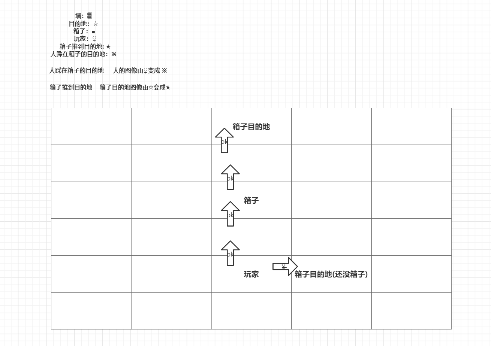

```c
#include <stdio.h>
#include <conio.h>
#include <stdlib.h>

/* 推箱子
*  1.数据: 空地0 墙1 目的地2 箱子3 玩家4
* WALL：▓
  DEST：☆
  BOX：■
  PLAYER：♀
  BOX+DEST：★
  PLAYER+DEST：※
	2. 数据储存: 数组
*/

#define SPACE     0 //空地
#define WALL      1 //墙
#define DEST      2 //目的地
#define BOX       3 //箱子
#define PLAYER    4 //玩家

//玩家站在目的地 BOX + DEST：     5
//箱子站在目的地 PLAYER + DEST：  6

int level = 0;	//当前所在关卡

int map[3][10][10] = {
	{
		{0,0,0,0,0,0,0,0,0,0},
		{0,0,0,1,1,1,0,0,0,0},
		{0,0,0,1,2,1,0,0,0,0},
		{0,0,0,1,0,1,1,1,1,0},
		{0,1,1,1,3,0,3,2,1,0},
		{0,1,2,3,4,0,1,1,1,0},
		{0,1,1,1,1,3,1,0,0,0},
		{0,0,0,0,1,2,1,0,0,0},
		{0,0,0,0,1,1,1,0,0,0},
		{0,0,0,0,0,0,0,0,0,0}
	},
	{
		{0,0,0,0,0,0,0,0,0,0},
		{0,0,1,1,0,0,1,1,0,0},
		{0,1,0,0,1,1,0,0,1,0},
		{1,2,0,0,0,0,0,0,2,1},
		{1,0,0,3,4,0,3,0,0,1},
		{0,1,0,0,0,3,0,0,1,0},
		{0,0,1,0,3,0,0,1,0,0},
		{0,0,0,1,2,2,1,0,0,0},
		{0,0,0,0,1,1,0,0,0,0},
		{0,0,0,0,0,0,0,0,0,0}
	},
	{
		{1,1,1,1,1,1,1,0,1,1},
		{0,1,2,0,0,4,1,1,1,0},
		{0,0,1,0,0,0,0,0,1,0},
		{0,0,1,3,0,0,3,0,1,1},
		{0,0,1,0,0,0,0,0,2,1},
		{0,0,1,0,0,3,0,1,1,1},
		{0,0,1,0,0,0,0,1,0,0},
		{0,0,1,0,3,0,0,1,0,0},
		{0,1,2,0,0,0,0,2,1,0},
		{1,1,1,1,1,1,1,1,1,1}
	}
};

void show()
{
	for (int i = 0; i < 10; i++)
	{
		for (int j = 0; j < 10; j++)
		{
			switch (map[level][i][j])
			{
			case SPACE:
				printf("  ");
				break;
			case WALL:
				printf("▓ ");
				break;
			case DEST:
				printf("☆");
				break;
			case BOX:
				printf("■");
				break;
			case PLAYER:
				printf("♀");
				break;
			case PLAYER + DEST:		//玩家站在目的地
				printf("※");
				break;
			case BOX + DEST:		//箱子站在目的地
				printf("★");
				break;
			}
		}
		printf("\n");
	}
}

void move()
{
	//先找到玩家的位置 (r,c)
	int r = 0, c = 0;
	bool isEnd = false;  // 退出双层循环
	for (int i = 0; i < 10; i++)
	{
		for (int k = 0; k < 10; k++)
		{
			//找到玩家 或者站在目的地上的玩家
			if (map[level][i][k] == PLAYER || map[level][i][k] == PLAYER + DEST)
			{
				r = i;
				c = k;
				isEnd = true;
				break;
			}
			if (isEnd == true)
				break;
		}
	}

	// 获取按键操作
	int key = _getch(); //  _getch(); 输入之后不需要按回车
	//printf("%d", key);
	/*
	* 上建72
	* 下键80
	* 左键75
	* 右键77
	*/

	switch (key)
	{
	case 72:
	case 'w':
	case 'W':
		//玩家移动的情况:玩家的前面是空地；玩家的前面是箱子的目的地
		if (map[level][r - 1][c] == SPACE || map[level][r - 1][c] == DEST)
		{
			//先把玩家移动到前面
			map[level][r - 1][c] += PLAYER;
			//然后把玩家从原来的位置删除
			map[level][r][c] -= PLAYER;
		}
		// 能够推箱子的情况:
		//玩家的前面是箱子
		else if (map[level][r - 1][c] == BOX || map[level][r - 1][c] == BOX + DEST)
		{
			//能够推箱子的情况:箱子的前面是空地；箱子的前面是目的地
			if (map[level][r - 2][c] == SPACE || map[level][r - 2][c] == DEST)
			{
				//把箱子移动到箱子前面
				map[level][r - 2][c] += BOX;
				//把箱子从原来的位置清除掉
				map[level][r - 1][c] -= BOX;
				//把玩家移动到原来箱子的位置
				map[level][r - 1][c] += PLAYER;
				//把玩家从原来的位置清除
				map[level][r][c] -= PLAYER;
			}
		}
		break;
	case 80:
	case 's':
	case 'S':

		//玩家移动的情况:玩家的前面是空地；玩家的前面是目的地
		if (map[level][r + 1][c] == SPACE || map[level][r + 1][c] == DEST)
		{
			//先把玩家移动到前面
			map[level][r + 1][c] += PLAYER;
			//然后把玩家从原来的位置删除
			map[level][r][c] -= PLAYER;
		}
		//玩家的前面是箱子
		else if (map[level][r + 1][c] == BOX || map[level][r + 1][c] == BOX + DEST)
		{
			//能够推箱子的情况:箱子的前面是空地；箱子的前面是目的地
			if (map[level][r + 2][c] == SPACE || map[level][r + 2][c] == DEST)
			{
				//把箱子移动到箱子前面
				map[level][r + 2][c] += BOX;
				//把箱子从原来的位置清除掉
				map[level][r + 1][c] -= BOX;
				//把玩家移动到原来箱子的位置
				map[level][r + 1][c] += PLAYER;
				//把玩家从原来的位置清除
				map[level][r][c] -= PLAYER;
			}
		}
		break;
	case 75:
	case 'a':
	case 'A':
		//玩家移动的情况:玩家的前面是空地；玩家的前面是目的地
		if (map[level][r][c - 1] == SPACE || map[level][r][c - 1] == DEST)
		{
			//先把玩家移动到前面
			map[level][r][c - 1] += PLAYER;
			//然后把玩家从原来的位置删除
			map[level][r][c] -= PLAYER;
		}
		//玩家的前面是箱子
		else if (map[level][r][c - 1] == BOX || map[level][r][c - 1] == BOX + DEST)
		{
			//能够推箱子的情况:箱子的前面是空地；箱子的前面是目的地
			if (map[level][r][c - 2] == SPACE || map[level][r][c - 2] == DEST)
			{
				//把箱子移动到箱子前面
				map[level][r][c - 2] += BOX;
				//把箱子从原来的位置清除掉
				map[level][r][c - 1] -= BOX;
				//把玩家移动到原来箱子的位置
				map[level][r][c - 1] += PLAYER;
				//把玩家从原来的位置清除
				map[level][r][c] -= PLAYER;
			}
		}
		break;
	case 77:
	case 'd':
	case 'D':
		//玩家移动的情况:玩家的前面是空地；玩家的前面是目的地
		if (map[level][r][c + 1] == SPACE || map[level][r][c + 1] == DEST)
		{
			//先把玩家移动到前面
			map[level][r][c + 1] += PLAYER;
			//然后把玩家从原来的位置删除
			map[level][r][c] -= PLAYER;
		}
		//玩家的前面是箱子
		else if (map[level][r][c + 1] == BOX || map[level][r][c + 1] == BOX + DEST)
		{
			//能够推箱子的情况:箱子的前面是空地；箱子的前面是目的地
			if (map[level][r][c + 2] == SPACE || map[level][r][c + 2] == DEST)
			{
				//把箱子移动到箱子前面
				map[level][r][c + 2] += BOX;
				//把箱子从原来的位置清除掉
				map[level][r][c + 1] -= BOX;
				//把玩家移动到原来箱子的位置
				map[level][r][c + 1] += PLAYER;
				//把玩家从原来的位置清除
				map[level][r][c] -= PLAYER;
			}
		}
		break;
	}
}

// 判断是否通过
bool judge()
{   // 没有箱子就是通关
	for (int i = 0; i < 10; i++)
	{
		for (int k = 0; k < 10; k++)
		{
			//如果找到了箱子，就说明没有过关
			if (map[level][i][k] == BOX)
			{
				return false;
			}
		}
	}
	return true;
}

int main(void)
{
	// 游戏都有一个循环
	bool isDone = false;
	while (!isDone)
	{
		// 清除屏幕
		system("cls");
		show();
		if (judge())
		{
			level++;
			if (level == 3)
			{
				printf("恭喜你，通关了，奖励一杯卡布奇洛\n");
				isDone = true;
				exit(EXIT_FAILURE);
			}
			else
				printf("恭喜你，过关了！按任意键进入下一关\n");
		}
		move();
	}

	return 0;
}
```


**补充例子:**

运用二维数组生成扫雷游戏地图，	详细需求如下

 + 定义10*10的数组，把所有元素初始化为0
 + 随机生成10个雷，一定要有10个（ -1表示雷）
 + 把以雷为中心的九宫格所有元素加1(雷除外)
 + 输出数组，观察是否正确

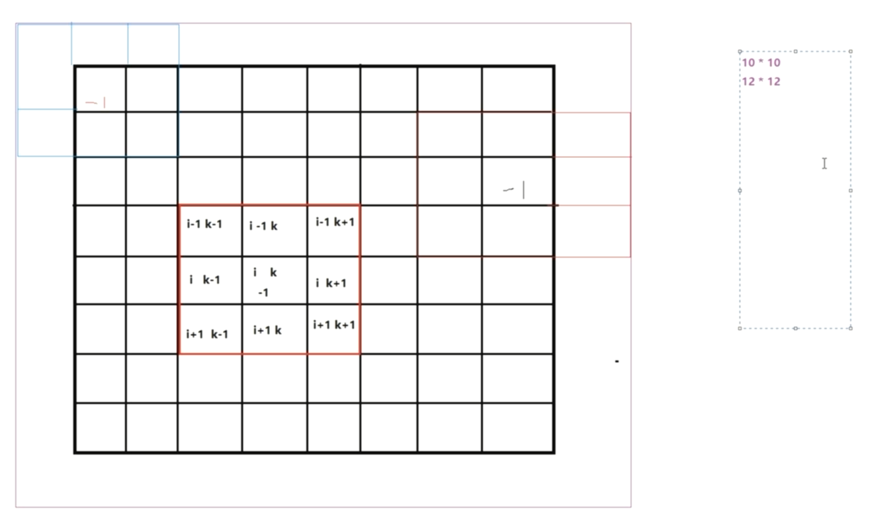

上图是 另一种思路

```c++
#include <stdio.h>
#include <stdlib.h>
#include <time.h>

/*运用二维数组生成扫雷游戏地图，详细需求如下:
+ 定义10 * 10的数组，把所有元素初始化为0
+ 随机生成10个雷，一定要有10个（ - 1表示雷）
+ 把以雷为中心的九宫格所有元素加1(雷除外)
+ 输出数组，观察是否正确
*/


void test()
{
	srand((unsigned int)time(NULL));

	int map[10][10] = {0};

	// 随机生成10个雷
	for (int k = 0; k < 10; )
	{
		int r = rand() % 10;  // [0, 9]
		int c = rand() % 10;
		if (map[r][c] == 0)
		{
			map[r][c] = -1;
			// 遍历以雷区为中心的九宫格
			for (int i = r - 1; i <= r + 1; i++)
			{
				for (int j = c - 1; j <= c + 1; j++)
				{
					// 通过长度的限制消除数组越界的东西
					if ((i >= 0 && i < 10 && j >= 0 && j < 10) && map[i][j] != -1)
					{      
						map[i][j] += 1;
					}
				}
			}
			k++;
		}
	}

	//// 以雷为中心的九宫格所有元素加1(
	//for (int i = 0; i < 10; i++)
	//{
	//	for (int j = 0; j < 10; j++)
	//	{
	//		if (map[i][j] == -1)   // 找到雷的坐标(i, j)
	//		{
	//			// 遍历以雷区为中心的九宫格
	//			for (int r = i - 1; r <= i + 1; r++)
	//			{
	//				for (int c = j - 1; c <= j + 1; c++)
	//				{
	//					if ((r >= 0 && r < 10 && c >= 0 && c < 10) && map[r][c] != -1)
	//					{
	//						map[r][c] += 1;
	//					}
	//				}
	//			}
	//		}
	//	}
	//}

	// 遍历
	for (int i = 0; i < 10; i++)
	{
		for (int j = 0; j < 10; j++)
		{
			printf("%2d ", map[i][j]);
		}
		printf("\n");
	}
}

int main(void)
{
	test();
	return 0;
}
```

**知识点: 随机数 和 九宫格**


## 七、字符串与字符数组

### 7.1 字符和字符串

**字符**

+ 普通字符：'a','1'
+ 转义字符：'\a','\n'...

**字符串**

+ “Boy”,”Maye”

**字符与字符串的区别**

​		1，形式上不同
​				2，本质上：字符串有结束符 '\0'

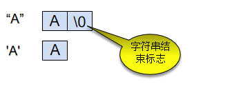

`字符A和字符串A所占内存空间不一样`	

字符: 计算机存储的是整形,

字符串: 可见字符 + '\0'

```cpp
printf("%d %d", sizeof('a'),sizeof("a"));     // 4 2
```


### 7.2  字符串与字符数组

**特点：**

+ 字符数组可以没有'\0'
+ 字符串必须要有'\0'
+ 字符数组可以存储字符串

字符串一定是字符数组，字符数组不一定是字符串

**下列字符数组存储的是不是字符串：**

+ char str[10] = {'1','b','c'};		//并不是字符串，没有\0
+ char str[1] ={'\0'};		 	     //是字符串 等价于””
+ “abcdedf”; 			                  //也是字符串,编译器会自动的在双引号最后加，上\0
+ char str[10] =“abcdef"; 		//字符串可以用字符数组表示{'a','b'...'\0'}
+ char str[10]={''a,”,”b”,”c”,'\0'}	//不是字符串
+ char *p=”maye”;			          //一个字符指针指向字符串

**总结：**

+ 编译器不会给字符数组自动添加'\0'

+ 编译器会自动给双引号的字符串字面值加上'\0'

+ 指针指向的字符串是常量，是没法修改的。


### 7.3 字符数组的输入

 **scanf**

+ 使用scanf输入字符串时，**遇到空格会自动截断**，**遇到回车结束,自动添加'\0'**

+ 输入超出范围时，不会进行越界检查，甚至能完全输出

  

 **getchar**

+ ==**不会自动结尾加'\0'**==

```cpp
char str[10];
for(int i=0;i<10;i++)
{
    str[i] = getchar();
}
puts(str);	//如果结尾没有'\0',输出结果将不可预料，可以改为逐个字符输出
```

+ 在结尾自动加上’\0‘

```cpp
for(int i=0;i<10;i++)
{
    str[i] = getchar();
    if(str[i] == '\n')
    {
        str[i] = '\0';
        break;
    }
}
```

**gets_s**

+ **能读取空格，遇到回车结束,自动添加'\0'**
+ 输入超出范围时，会进行越界检查,如下图


### 7.4 printf、puts能输出字符串的原因

由于C语言中没有真正的字符串类型，可以通过字符数组表示字符串，因为它的元素地址是连续的，这就足够了。 
		（1）从首地址开始逐字节寻址，把存储单元（一个字节）内的数据转换为ASCII字符格式输出。

（2）直到某一个字节内存的元素为字符'\0'时，输出此字符并且寻址结束。

如果字符数组里没有'\0'，那么使用printf (%s) 输出时，就找不到正确的结束标志，就会多输出一些乱码。


### 7.5 字符串处理函数

 **strlen**

>int strlen ( const char *str )

+ 求字符串长度(不包括\0)

```cpp
strlen("hello maye");	
```

 **strcpy/strncpy**

>char *strcpy( char *dest, const char *src )

+ 把一个src拷贝到dest中去，要保证dst缓冲区有足够的内存
+ strcpy 会在dest结尾添加\0
+ strncpy 不会在dest结尾添加\0

```cpp
char dest[10];
strcpy(dest, "maye");
puts(dest);
```

**strcmp/strncmp**

> int strcmp( char *str1, char *str2 )

+ 比较str1和str2，str1>str2 返回1，str1==str2 返回0，否则返回-1

```cpp
int res = strcmp("maye", "maye");
printf("res:%d\n", res);
```

**strcat/strncat**

> char *strcat(char *dest, const char *src)

+ 把src连接到dest的末尾(\0的位置)

```cpp
char dest[20]="hello ";
strcat(dest, "maye");
puts(dest);
```

**strchr/strrchr**

> char* strchr(char* _String, int _Ch)

+ 在字符串string中查找字符val，存在返回val的开始位置，否则返回NULL

```cpp
char words[] = "hello every one,My name's maye";
puts(strchr(words, 'o'));
```

 **strstr**

> char* strstr(char* _String, char * _SubString)

+ 在字符串string中查找子串substr，存在返回substr的开始位置，否则返回NULL

```cpp
char words[] = "hello every one,My name's maye";
puts(strstr(words, "one"));
```

 **memcmp**

>int memcmp( void const* _Buf1, void const* _Buf2,size_t     _Size);

+ 内存比较，不仅可以比较字符串，还可以比较其他的内存

```cpp
int arr[5] = { 1,2,6,4,5};
int arr1[5] = { 1,2,5,4,5 };
int ok = memcmp(arr, arr1, sizeof(int) * 5);
int ok1 = strcmp(arr, arr1);
printf("%d  %d\n", ok,ok1);
```

**memcpy**

>void* memcpy( void* _Dst,    void const* _Src, size_t     _Size);

+ 内存拷贝

```cpp
int temp[5];
memcpy(temp, arr,sizeof(int)*5);
//strcpy(temp, arr);		//复制整型数组会有问题

for (int i = 0; i < 5; i++)
{
	printf("%d ", temp[i]);
}
```

 **memset**

>void* memset( void*  _Dst, int    _Val,size_t _Size);

+ 按字节对内存进行初始化

```cpp
char num[5];
memset(num, 127, sizeof(char) * 5);
for(int i = 0; i < 5; i++)
{
	printf("%d ", num[i]);
}
```


##   八、 函数

### 8.1 函数概念

+ 是完成特定任务的独立程序代码
+ 是构成程序的基本模块

+ 可以省去编写重复代码的苦闷
+ 可以让程序模块化，提高代码可读性
+ 方便后期修改、完善
+ 隐藏了实现的细节


### 8.2 函数分类

**从用户角度**

+ 标准函数，即库函数
  + C语言封装好的函数，非常丰富
  + 例如：
    + —输入/输出：scanf(),printf(),rand()...
    + —数学计算：sqrt(),abs(),sin()...
+ 自定义函数
  + 自己编写的用来完成特定任务的代码块

**从函数形式**

+ 无参函数：getchar()
+ 有参函数：putchar('a')


### 8.3 函数的定义

和变量一样，要想使用一个函数，定义是不可缺少的，函数定义有4个要素：<font color=red>返回类型，函数名和函数体</font>，参数列表和返回类型对应着输入输出，函数名是函数的标识，而函数体是一段可执行的代码块，实现特定的算法或功能。

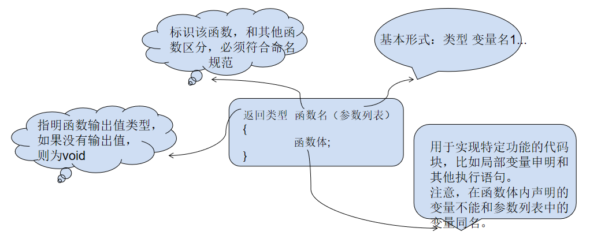

如果我们要写一个功能，用来获取两个数中的最大值，我们可能这样写。

```cpp
a>b ? a:b;
```

这样写，是很好的，但是当我们需要多次使用的时候，代码将变得不清晰，此时我们可以用一个函数对这个功能进行封装，把结果进行返回。

```cpp
int max(int a,int b)
{
    return a>b?a:b;
}
```

然后使用函数名加上实参即可调用该函数，然后可以使用一个变量接受函数的返回值。

```cpp
int res = max(2,5);
```

在这个过程中，我们提到了参数这个概念：

+ 函数定义时参数列表中的叫做<font color=red>形参</font> `形参可以接受实参传过来的值`

+ 函数调用时参数列表中的叫做<font color=red>实参</font> `实参会赋值给形参，让函数内部进行操作`

+ **注意：**
  + 函数的传参过程，只是单纯的值传递
  + 所以在函数内部改变形参的值，不会影响到实参
  + 以下代码，在函数内部改变了形参，但是实参确没有变化 ↓

```cpp
void foo(int num)
{
    num++;
    printf(num);
}
int main()
{
    int a =3;
	foo(a);
	printf(a);
    return 0;
}
output:num:4  a:3 
```


>打个形象的比方，这是角色和演员的关系。
>
>函数定义时列表中的参数称为形参，是“剧本角色”，而函数调用时传递进来的参数称为实参，是“演员”，函数执行的过程就是演戏的过程。
>
>程序刚开始执行的时候，编译器并不为形参分配存储空间，因为它只是个角色，不是实体，一直要到函数调用时，编译器为形参分配存储空间，并将实参的值复制给形参结合。可知，在foo(a)语句调用前，num不是真正的程序变量，一直到foo函数被调用，num才被创建，并用a为其赋值，找这种情况下，在函数内对num的处理并不影响a，这类似于“某个演员扮演的角色在戏中受伤，并不是说演员真的受伤了”，而且，在函数执行结束返回时，创建的形参被撤销，这类似于“戏演完了，剧中角色自然也就停止了”。


### 8.4 函数的调用

函数调用的一般形式为：函数名(实参列表)

+ 实参可以是常数、变量、表达式等，多个实参用逗号,分隔

  **函数的调用姿势有多种:**

  

  

  

  **注意：**

  + 调用函数时不要忘记括号，尤其是无参函数
  + 调用函数时，实参与形参个数必须一致，类型尽量保持一致
  + 调用库函数时，应在程序头部用#incldue包含相关头文件
  + 函数调用不能作为左值


### 8.5 函数声明/多文件编程

+ 函数**声明**会告诉编译器函数名称及如何调用函数。函数的实际主体可以单独定义。

**函数声明包括以下几个部分**

> 返回类型  函数名(参数列表);

针对前面自定义的max函数，应该这样声明

```cpp
int max(int a,int b);
```

在函数声明中，参数的名称并不重要，只有参数的类型是必需的，因此下面也是有效的声明：

```cpp
int max(int,int);
```

+ 函数声明必须和定义时的函数前面一致

+ 函数原型的作用是告诉编译器与该函数有关的信息，让编译器知道函数的存在，以及存在的形式，即使函数暂时没有定义，也不会出错。


### **8.6 函数与数组**

**数组做函数参数**

+ 一维数组

  当我们写了一个数组之后，可能要多次输出所有元素，每输出一次都要写一个循环，非常的麻烦，这时就需要把数组传到函数里面去，当要输出数组的时候，调用该函数即可！

  ```cpp
  void foo(int arr[],int len)
  {
      for(int i=0;i<len;i++)
      {
          printf("%d ",arr[i]);
      }
      printf("\n");
  }
  //参数中int arr[] 中括号中可以写数组大小也可以不写，一般不写
  ```

+ 二维数组

  ```cpp
  void foo1(int arr[][5], int row)
  {
  	for (int i = 0; i < row; i++)
  	{
  		for (int k = 0; k < 5; k++)
  		{
  			printf("%d ", arr[i][k]);
  		}		
  	}
      printf("\n");
  }
  //二维数组稍加麻烦一点，需要指定列数
  ```

  注意：在函数里面使用sizeof不能得到数组的实际大小，求得的只是指针的大小

  

###  8.7 变量的作用域和生命周期

**根据变量的作用域不同，可分为局部变量和全局变量两种**

+ 变量的作用域
  + 变量起作用的范围
  + 就近原则
+ 局部变量
  + 在函数内部或者某个控制块的内部定义的变量
  + 作用域：函数内部或控制块内部
  + 生命周期：从定义开始，到函数结束或者控制块结束

+ 全局变量
  + 在函数外部定义的变量
  + 作用域：在同一文件中，所有函数都可以引用全局变量
  + 生命周期：从程序运行开始，到程序结束

**根据变量的生命周期不同，可分为静态变量和动态变量**


**自动(动态)变量**

+ 指的是局部变量，具体来说即是在控制流进入变量作用域时系统自动为其分配存储空间，并在离开作用域时释放空间的一类变量。

**静态变量**

+ 1，在程序执行的整个过程中，都不释放内存
+ 2，静态变量在编译时初始化，仅初始化一次`如果没有初始值，将自动初始化为0`
+ 3，作用域：定义的函数内部

**寄存器变量**

> 建议编译器将变量存储到CPU寄存器中

+ 1，编译器有自己的处理方式，不一定会接受你的建议
+ 2，一旦接受建议，把变量存到了寄存器里面，那么则不能对变量取地址(&)
+ 3，只有局部变量和形参可以作为register变量，全局变量不行,静态变量也不行。

```c
寄存器变量:存取的速度就特别的块
如果没有对i取地址，那么编译器自动将i放到寄存器里面
register关键字只是建议编译器，将变量放到寄存器中，并不一定采纳 
```


**static和extern改变函数和变量的作用域**

+ 全局变量默认就是extern类型的，而且作用范围是整个项目；如果手动加上static，则表示让全局变量只能在当前文件中使用。（**与static对应的就是extren，全局变量默认是extren**）

  ```cpp
  /*test.c*/
  int number = 520;  //设置成局部的 
  
  
  /*main.c*/
  #include<stdio.h>
  extern int number;		//声明使用外部变量
  int main() 
  {	
  	printf("%d ", number);
  }
  ```

  如果在test.c中的变量定义前面加上static，则会产生如下错误

  ```cpp
  1>main.obj : error LNK2001: 无法解析的外部符号 _number
  1>F:\MyCode\2048\Debug\2048.exe : fatal error LNK1120: 1 个无法解析的外部命令
  ```

+ 对于函数来说也是如此

  ```cpp
  /*test.c*/
  int get()
  {
  	return 566;
  }
  
  /*main.c*/
  extern int get();
  int main() 
  {	
  	printf("%d", get());
  }
  ```


### 8.8 函数递归

递归也是一种函数调用，只不过是函数自己调用自己，是一种特殊的函数调用，调用自己同调用别人是一模一样的。

+ 使用递归必须要满足的两个条件
  + 要有递归公式。
  + 要有终止条件。
+ 递归和循环的关系
  + 递归和循环存在很多关系。理论上讲，所有的循环都可以转化成递归
  + 循环又称迭代。递归算法与迭代算法设计思路的主要区别在于：函数或算法是否具备收敛性！当且仅当一个算法存在预期的收敛效果时，采用递归算法才是可行的。否则就不能使用递归算法。所谓收敛性就是指要有终止条件，不能无休止地递归下去。
+ 递归的优缺点
  + 递归的优点是简化程序设计，结构简洁清晰，容易编程，可读性强，容易理解。在很多情况下使用递归是必要的，它往往能把复杂问题分解为更简单的步骤，而且能够反映问题的本质。我们一开始可能发现递归理解起来也不容易，这是因为我们的“见识”太少了！等将来学习树和图的时候你才能真正领会到递归是多么的“好理解”！
  + 递归的缺点也很明显：速度慢，运行效率低，对存储空间的占用比循环多。严格讲，循环几乎不浪费任何存储空间，而递归浪费的空间实在是太大了，而且速度慢。因为递归是用栈机制实现的，每深入一层都要占用一块栈数据区域。

**通过一个简单的程序了解递归**

```cpp
int foo(int n)
{
    if(n == 0)
    {
        return 0;
	}
    printf("I love you\n");
    foo(n-1);
}
```

**递归求斐波拉契数列**

前面我们已经学习了，用循环求斐波拉契数列，现在我们要用递归来实现。

```cpp
int fibonacci(int n)
{
    if(n==0||n==1)
    {
        return 1;
    }else
    {
        return fibonacci(n - 1) + fibonacci(n-2);
    }
}
```


## 九、 初识指针

### 9.1 地址

+ 什么是地址：内存是由很多得内存单元(字节)组成的,每个字节都有唯一的编号，这个编号就叫做地址。


+ 变量、数组、函数等都是放在内存中的，可以通过名字去使用变量、数组、函数等，**但实际运行时，系统使用得是内存地址，而不是变量名，变量名只是方便我们程序员使用的。**

**怎么获得变量的地址呢？**

+ 学习过scanf函数，在输入数据时用到了&符号，这个符号就是获取变量的地址的符号。

  ```c
  int age = 18;
  //输出age变量的地址
  printf("addr:%p\n",&age);
  ```

**注意：**

+ 每个内存单元之间地址是连续的
+ 在同一台机器上每个内存单元的地址是唯一的
+ 每次运行程序，变量的地址不一定一样，这是由操作系统随机分配的

### 9.2 首地址

**首地址就是该变量所占的存储区域中的第一个单元的地址。**

+ 以一个整型来说，需要四个字节来存储，那么每个字节都有一个地址，但是我们取地址得到的只有一个地址，这个地址叫做首地址。（大家理解这个概念就好，一般不会这么叫，就直接叫变量的地址了）

+ 为了便于访问，一个变量所占用的这几个内存单元都是连续存放，地址连续的几个单元通常就叫做一个“存储区域”。

  

### 9.3  指针

**指针实际上是一种特殊的数据类型**，我们可以用来申明指针变量，**用来存储地址**。

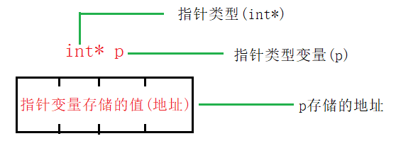

```c
int *p;
int *p1,*p2,*p3;	
```

同时定义多个指针变量时，每个标识符前面都要加*号，否则后面的会被定义成int型变量。

**根据指针获取对应的内存的数据**

&：取地址符。用于获取变量所在的首地址

\*：间接访问运算符，也叫作解引用运算符。用于获取地址对应的值。

理解:  &是锁*是钥匙

这两个运算符的优先级一样，结合起来使用也非常简单！(如果不理解，最好加上括号；如：*(&p))


------

**指针作为一个变量是有大小的，其大小在32位平台是4个字节，64位平台上是8个字节，大小与指针的类型无关。**


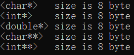

上图以64位平台为例，可以看到无论指针是整型、字符型、浮点型也无论一级指针还是二级指针，其在内存空间所占的大小都是4个字节。


**使用指针的好处：**

+ 1、直接访问硬件
+ 2、快速传递数据（指针表示地址）
+ 3、返回一个以上的值，返回一个（数组或者结构体的指针）
+ 4、方便处理字符串

### 9.4 指针的类型

指针使用来间接访问内存的，那么就需要知道指针指向的是什么样的数据类型，应该如何解析它。

所以我们需要一个**特定类型的指针变量来存放特定类型变量的地址。**

+ int*  ->  int
+ char* - > char
+ double* -> double
+ int* - >char   <font color=red>错误！错误！错误!</font>

为什么这么麻烦呢？指针不就是存储一个地址吗，为什么不能用一个通用的指针类型，来存储所有类型变量的地址呢？

因为，我们不仅仅使用指针来存储内存地址；同时也是用它来解引用那些地址的内容。这样我们就可以访问和修改这些地址对应的值了。

正如你所知，不同的数据类型有不同的大小，char 1个字节，int 4个字节，double 8个字节。不仅仅是大小方面的差异，这些变量或数据类型在存储信息的方式上也有所不同。


上图所示，如果是int类型，那么最高位表示符号位，剩下的31个位用来存储值。

现在如果声明一个指针p指向整型变量，然后用取地址符把a的地址存放在p中，然后打印p，p的值会是多少呢？0x200，也就是byte0的地址，也就是说整型变量a的起始地址是0x200；

如果我们想知道那个地址的内容(值)，就使用*p去解引用这个地址。然后编译器看到之后就会觉得没有问题，p是一个指向整型的指针，因此我们需要看4个字节。从地址0x200开始，编译器就知道如何去提取一个整型数据。所以，它从这四个字节中得到了1025这个值。

如果p是一个字符类型的指针，那么在解引用的时候编译器只会看一个字节，因为一个字符类型只有一个字节。如果p是一个浮点型指针，尽管浮点型也是4个字节，但是浮点数4字节的信息表示缺与整型不一样。打印出来的值也会是不一样的。

```c++
int a = 1025;
int *p1 = &a;          // 1025 -> 二进制
char *p2 = (char *)p1;  // char一个字节 //取出1025的二进制形式的一个字节 结果就是 1
```


##### 9.4.1  void指针

void* 类型的指针又叫万能指针，他可以指向任意的内存空间地址

+ 不能直接 解引用

+ 可以指向任何地址

  ```c
  int maye = 20;
  void* p = &maye;
  ```

+ 可以隐式自动转换为其他类型指针

  ```c
  int* pi = p;
  ```

+ 不能对void*取值操作，因为它没有类型，或者说不能判断存储的是什么类型，需要强转指定一个确定的类型才能使用

  ```c
  printf("%d\n",*p);		//error
  printf("%d\n",*(int*)p);//right
  ```


###  9.5  指针的特殊状态

我们在使用指针的时候，总是会遇到各种稀奇古怪的问题，但万变不离其宗，下面我们一起来学习指针的各种状态。

#### 9.5.1  野指针

野指针(wild pointer)就是没有被初始化过的指针。

【示例：】

```c
#include<stdio.h>
int main()
{
    int *p;
    printf("%d\n",*p);
    return 0;
}
```

如果用Vs编译，会直接报错`error C4700: 使用了未初始化的局部变量“p”`,还是比较人性的，从根本上避免了野指针。

####  9.5.2  空指针

空指针就是被赋值为NULL的指针，它不指向任何的对象或者函数。（坚决不能使用空指针，否则程序就会崩）

空指针的出现是为了避免错误的引用指针而导致的难以排查的问题，不过空指针也不能直接访问，但是可以用来判断。如果指针现在不想指向任何内存,就先指向NULL

【示例：】

```c
#include<stdio.h>
int main()
{
    int* p = NULL;
    //判断指针是否为NULL
    if (p != NULL)
    {
        printf("%d\n", *p);
    }
    return 0;
}
```

如果把指针值为空，则可以进行判断，就算没有判断，直接对空指针进行引用，产生的报错也非常好理解。

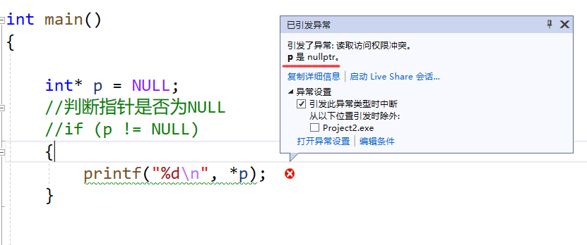

#### 9.5.3  悬空指针

悬空指针是指针最初指向的内存已经被释放了的一种指针。 

【示例：】从函数中返回临时变量的地址

```c
#include<stdio.h>

int* foo()
{
    int age = 18;   //函数执行完毕，age的内存会被自动释放
    return &age;   
}

int main()
{
    int* p = foo();
    //getchar();
    printf("%d\n", *p);
    return 0;
}
```

运行上面的代码，貌似没有任何问题，的确如此，但不代表这个代码是正确的。现在我们把main函数中的getchar的注释放开，然后重新运行程序，等待几秒之后按下任意键，发现输出的结果已经不对了。

为什么？一开始的时候我们没有getchar，foo函数返回之后，接着立马输出*p，这个时候函数里面的age还没有来得及释放，所以输出没问题，但是当我们使用getchar等待一段时间后，age有足够的时间释放了，所以就会输出垃圾值。

**注意：**悬空指针是编码过程中最容易出现问题的.


#### 9.5.4  const 与 指针

const是constant的简写，只要一个变量前面用const来修饰，就意味着该变量里的数据可以被访问，不能被修改。也就是说const意味着“只读”。任何修改该变量的尝试都会导致编译错误。const是通过编译器在编译的时候执行检查来确保实现的（也就是说const类型的变量不能改是编译错误，不是运行时错误。）所以我们只要想办法骗过编译器，就可以修改const定义的常量，而运行时不会报错。

const与指针可以搭配出三种不同的含义：

+ 指针指向的内存不可修改，但指针的指向可以修改

  ```c
  int age = 18;
  const int* ptr = &age;		//常量指针
  int const* ptr = &age;		//和上面一句是等价的
  
  *ptr = 20;					//err,不能修改
  ptr = NULL;					//ok,可以修改指向
  ```

+ 指针的指向不可以修改，但指向的内存可以修改

  ```c
  int* const ptr = &age;
  *ptr = 20;	//ok
  ptr = NULL;	//err
  ```

+ 指针的指向不可以修改，指向的内存也不可以修改

  ```c
  const int* const ptr = &age;
  *ptr = 20;	//err
  ptr = NULL;	//err
  ```

**常量指针**(`指向常量的指针`)是指指向常量的指针，顾名思义，就是指针指向的是常量，即，它不能指向变量，它指向的内容不能被改变，不能通过指针来修改它指向的内容，但是指针自身不是常量，它自身的值可以改变，从而指向另一个常量。

**指针常量**(`指针是常量`)是指指针本身是常量。它指向的地址是不可改变的，但地址里的内容可以通过指针改变。有一点需要注意的是，指针常量在定义时必须同时赋初值。


### 9.6   指针的运算

**算数运算：**

+ 指针是存储的地址，地址本质就是一个整数，因此，可以对指针执行四种算术运算：++、--、+、-(其他运算没有意义)。

  ```c
  // 解析是看类型解析
  char* pc = NULL;
  printf("%p %p\n",pc,pc+1);	//0 1
  int* pi = NULL;
  printf("%p %p\n",pi,pi+1);	//0 4
  double* pd = NULL;
  printf("%p %p\n",pd,pd+1);	//0 8
  ```

+ 总结:

  + 指针的每一次递增，它其实会指向下一个元素的存储单元。
  + 指针的每一次递减，它都会指向前一个元素的存储单元。
  + **指针在递增和递减时跳跃的字节数(步长)取决于指针所指向变量数据类型长度，**比如 int 就是 4 个字节
  + 不同类型的指针**所占内存大小都是一样**的(32位计算机4个字节，64位8个字节)

**关系运算：**

+ 一般只考虑== , >和<没什么意义

+ 指针可以用关系运算符进行比较，如 ==、< 和 >。如果 p1 和 p2 指向两个相关的变量，比如同一个数组中的不同元素，则可对 p1 和 p2 进行大小比较。

+ 总结：

  + 对相关变量的指针进行比较，才有意义

  + 大于小于常用在数组中，全等一般是判断指针是否为NULL

    

### 9.7  大、小端模式

+ 大端（Big-endian）和小端（Little-endian）是什么？
  + 在计算机业界，Endian表示数据在存储器中的存放顺序
+ **大端模式**：数据的高字节保存在内存的低地址中，而数据的低字节保存在内存的高地址中
  + 这样的存储模式有点儿类似于把数据当作字符串顺序处理：地址由小向大增加，而数据从高位往低位放；这种存放方式符合人类的正常思维

+ **小端模式**：数据的高字节保存在内存的高地址中，而数据的低字节保存在内存的低地址中
  + 这种存储模式将地址的高低和数据位权有效地结合起来，高地址部分权值高，低地址部分权值低，和我们的逻辑方法一致。

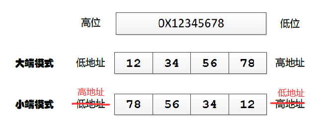

+ **总结**：采用大小模式对数据进行存放的主要区别在于在存放的字节顺序，大端方式将高位存放在低地址，小端方式将高位存放在高地址。采用大端方式进行数据存放符合人类的正常思维，而采用小端方式进行数据存放利于计算机处理。到目前为止，采用大端或者小端进行数据存放，其孰优孰劣也没有定论。

+ 小端模式：==高==位字节数据保存在内存的==高==地址中，==低==位字节数据保存在内存的==低==地址中

+ 大端模式：==高==位字节数据保存在内存的==低==地址中，==低==位字节数据保存在内存的==高==地址中


##  十、 指针进阶

### 10.1  二级指针

指针可以指向一个普通类型的数据，例如 int、double、char 等，也可以指向一个指针类型的数据，例如 int *、double *、char * 等。

如果一个指针指向的是另外一个指针，我们就称它为二级指针，或者指向指针的指针。

假设有一个 int 类型的变量 age，page是指向 age 的指针变量，ppage 又是指向 page 的指针变量，它们的关系如下图所示：


将这种关系转换为C语言代码：

```cpp
int age =28;
int *page = &age;
int **ppage = &page;
```

指针变量也是一种变量，也会占用存储空间，也可以使用`&`获取它的地址。C语言不限制指针的级数，每增加一级指针，在定义指针变量时就得增加一个星号`*`。page 是一级指针，指向普通类型的数据，定义时有一个`*`；ppage 是二级指针，指向一级指针 page，定义时有两个`*`。

如果我们希望再定义一个三级指针 p3age，让它指向 ppage，那么可以这样写：

```cpp
int ***p3age = &ppage;
```

四级指针也是类似的道理：

```cpp
int ****p4age = &p3age;
```

实际开发中会经常使用一级指针和二级指针，几乎用不到高级指针。

**根据指针获取对应的内存的数据 : **

+ 想要获取指针指向的数据时，一级指针加一个`*`，二级指针加两个`*`，三级指针加三个`*`，以此类推，请看代码：

```cpp
#include <stdio.h>
int main()
{
    int a =100;
    int *p1 = &a;
    int **p2 = &p1;
    int ***p3 = &p2;
    printf("%d, %d, %d, %d\n", a, *p1, **p2, ***p3);
    printf("&p2 = %#X, p3 = %#X\n", &p2, p3);
    printf("&p1 = %#X, p2 = %#X, *p3 = %#X\n", &p1, p2, *p3);
    printf(" &a = %#X, p1 = %#X, *p2 = %#X, **p3 = %#X\n", &a, p1, *p2, **p3);
    return 0;
}
```


### 10.2  一维数组指针

数组（Array）是一系列具有相同类型的数据的集合，每一份数据叫做一个数组元素（Element）。数组中的所有元素在内存中是连续排列的，整个数组占用的是一块内存。以`int arr[] = { 99, 15, 100, 888, 252 };`为例，该数组在内存中的分布如下图所示：


定义数组时，要给出数组名和数组长度**，数组名可以认为是一个`指针`**，它指向数组的第 0 个元素。在C语言中，我们将第 0 个元素的地址称为数组的首地址。以上面的数组为例，下图是 arr 的指向：


**数组下标为啥从0开始？**

+ 数组下标实际上是每个元素的地址相对于第一个元素地址的偏移量


访问数组元素除了可以通过*下标法*之外，还可以通过*指针法*访问。

+ 下标法

  ```cpp
  for(int i = 0;i < 6;i++)
  {
      printf("%d ",arr[i]);
      //printf("%d ",i[arr]);
  }
  ```

+ 指针法

  ```cpp
  for(int i = 0;i < 6;i++)
  {
      printf("%d ",*(arr + i));
  }
  ```

  这就是为什么在某些地方大家会看到 **i[arr]** 这种访问数组元素的方法的原因，实际上下标法就是通过指针法来实现的，只不过编译器帮助我们做了这个操作，简化了操作难度。

#### 10.2.1  指向数组的指针

我们也可以定义一个指向数组的指针，例如：

```cpp
int arr[] = { 99, 15, 100, 888, 252 };
int *p = arr;
```

**arr 本身可以看做是一个指针，**可以直接赋值给指针变量 p。arr 是数组第 0 个元素的地址，所以`int *p = arr;`也可以写作`int *p = &arr[0];`。也就是说**，arr、p、&arr[0] 这三种写法都是等价的，**它们都指向数组第 0 个元素，或者说指向数组的开头。

如果一个指针指向了数组，我们就称它为**数组指针（Array Pointer）**。

数组指针指向的是数组中的一个具体元素，而不是整个数组，所以数组指针的类型和数组元素的类型有关，上面的例子中，p 指向的数组元素是 int 类型，所以 p 的类型必须也是`int *`。

反过来想，p 并不知道它指向的是一个数组，p 只知道它指向的是一个整数，究竟如何使用 p 取决于程序员的编码。

使用指针访问数组元素和使用函数名没有任何区别，值得注意的是我们不能通过指针获得数组的大小，但是通过数组名却可以。

```cpp
printf("%d\n",sizeof(arr));		//数组所占字节数 20 Byte
printf("%d\n",sizeof(p));		//指针所占字节数 4 Byte
```

也就是说，根据数组指针不能逆推出整个数组元素的个数，以及数组从哪里开始、到哪里结束等信息。不像字符串，数组本身也没有特定的结束标志，如果不知道数组的长度，那么就无法遍历整个数组。


#### 10.2.2   关于数组指针的谜题

假设 p 是指向数组 arr 中第 n 个元素的指针，那么 \*p++、\*++p、(\*p)++ 分别是什么意思呢？

*p++ 等价于 *(p++)，表示先取得第 n 个元素的值，再将 p 指向下一个元素。

*++p 等价于 *(++p)，会先进行 ++p 运算，使得 p 的值增加，指向下一个元素，整体上相当于 *(p+1)，所以会获得第 n+1 个数组元素的值。

(*p)++ 就非常简单了，会先取得第 n 个元素的值，再对该元素的值加 1。假设 p 指向第 0  个元素，并且第 0 个元素的值为 99，执行完该语句后，第 0  个元素的值就会变为 100。


####  10.2.3   数组名和数组指针的区别

虽然说数组名可以当做指针使用，但实际上数组名并不等价于指针。

+ 数组名代表的是整个数组，具有确定数量的元素
+ 指针是一个标量，不能确定指向的是否是一个数组
+ 数组可以在某些情况下会自动转换为指针，当数组名在表达式中使用时，编译器会把数组名转换为一个指针常量，是数组中的第一个元素的地址，类型就是数组元素的地址类型(通过sizeof也可以看出来)


### 10.3  二维数组指针

**二维数组可以理解为每一个元素都是一个一维数组的数组**，这样就可以很好的理解二维数组与指针了。

下面定义了一个2行3列的二维数组，并画出了对应的内存模型。


我们可以使用arr[0]获得第0个一维数组，然后再加上一个小标就可以获取到对应的元素，如arr\[0][0]获取了第0行第0列的元素。

```c
void test01()
{
	int arr[3][3] = {  
		{1,2,3},
		{4,5,6},
		{7,8,9}
	};

	//int arr2[3][3] = { 1, 2, 3, 4, 5, 6, 7, 8, 9 };
	//int arr3[][3] = { 1, 2, 3, 4, 5, 6, 7, 8, 9 };    // 行数可以推导

	//二维数组名 等价与 一维数组的指针(int *arr = &ar)
	//除了对二维数组名 sizeof  或者  取地址以外，那么二维数组名 都是指向第一个一维数组的首地址 {1,2,3},

	int(*pArray)[3] = arr;

	//通过数组名 访问元素
	printf("arr[1][2] = %d\n", arr[1][2]);
	printf("arr[1][2] = %d\n", *(*(pArray + 1) + 2));
	printf("arr[1][2] = %d\n", *(*pArray + 5));
}


//二维数组做函数参数
//void printArray( int(*pArr)[3] ,int len1,int len2 )   // 推荐
//void printArray(int pArr[3][3], int len1, int len2)   // 推荐
void printArray(int pArr[][3], int len1, int len2)
{
	for (int i = 0; i < len1;i++)
	{
		for (int j = 0; j < len2;j++)
		{
			printf("%d ", pArr[i][j]);
			//printf("%d ",  *(*(pArr + i) + j) );
		}
		printf("\n");;
	}
}

void test02()
{
	int arr[3][3] = {
		{ 1, 2, 3 },
		{ 4, 5, 6 },
		{ 7, 8, 9 }
	};

	int row = sizeof(arr)/sizeof(arr[0]);
	int col = sizeof(arr[0]) / sizeof(int);
	printArray(arr, 3, 3);
    
/*
步长不同,  都是指向首地址
    &aar[0][0]  一个一个跳
    arr    跳一维 
    &arr   整个数组
*/    
}
```


### 10.4  动态内存分配

动态内存是相对静态内存而言的。所谓动态和静态就是指内存的分配方式。**动态内存是指在堆上分配的内存**，而**静态内存是指在栈上分配的内存。**

前面所写的程序大多数都是在栈上分配的，比如局部变量、形参、函数调用等。**栈上分配的内存是由系统分配和释放的，空间有限，**在复合语句或函数运行结束后就会被**系统自动释放**。而**堆上分配的内存**是由程序员通过编程**自己手动分配和释放的**，空间很大，存储自由。堆和栈后面还会专门讲，这里先了解一下。

**动态分配意义**

+ 定义数组时必须指定数组的大小，使用动态分配可以在运行时调整大小。
+ 突破函数内局部变量的作用域局限，函数结束之后，不希望变量的内存被释放。

### 10.5  库函数

那么动态内存是怎么造出来的？在讲如何动态地把一个数组造出来之前，我们必须要先介绍 malloc 函数的使用。

##### 10.5.1  malloc

malloc 是一个系统函数，它是 `memory allocate` 的缩写。其中memory是“内存”的意思，allocate是“分配”的意思。顾名思义 malloc 函数的功能就是“分配内存”。要调用它必须要包含头文件<stdlib.h>。

```cpp
void* malloc(size_t _Size);
int* parr = calloc(sizeof(int) * 10);
```

malloc 函数只有一个形参，并且是整型。该函数的功能是在内存的动态存储空间即堆中分配一个长度为size的连续空间。函数的返回值是一个指向所分配内存空间起始地址的指针，类型为 void*型。

简单的理解，malloc 函数的返回值是一个地址，这个地址就是动态分配的内存空间的起始地址。如果此函数未能成功地执行，如内存空间不足，则返回空指针 NULL。

“int i=5；”表示分配了 4 字节的“静态内存”。这里需要强调的是：“静态内存”和“静态变量”虽然都有“静态”两个字，但是它们没有任何关系。不要以为“静态”变量的内存就是“静态内存”。静态变量的关键字是 static，它与全局变量一样，都是在“静态存储区”中分配的。这块内存在程序编译的时候就已经分配好了，而且在程序的整个运行期间都存在；而静态内存是在栈中分配的，比如局部变量。

#####  10.5.2  calloc

calloc函数的功能与malloc函数的功能相似，都是从堆分配内存。最大的不同在于calloc会把申请的空间全部初始化为0。

```cpp
void* calloc(size_t _Count,size_t _Size);
int* parr = calloc(10,sizeof(int));

个数 每个的大小
```

##### 10.5.3   realloc

realloc函数的功能比malloc函数和calloc函数的功能更为丰富，**可以实现内存分配和内存释放的功能。**

应用:   **扩容**

```cpp
void* realloc(void*  _Block,size_t _Size);
int* pnew = realloc(parr,20);
```

+ _Block**是堆上已经存在空间的地址**
+ _Size是目标空间大小

重新分配堆上的void指针\_Block所指的空间为\_Size个字节，同时会复制原有内容到新分配的堆上存储空间。注意，若\_Size小于或等于原来空间的字节，则保持不变。否则会扩容。

##### 10.5.4  free

前面讲过，动态分配的内存空间是由程序员手动编程释放的。那么怎么释放呢？用 free 函数。

```cpp
void free(void* _Block);
```

free 函数无返回值，它的功能是释放指针变量 p 所指向的内存单元。此时 p 所指向的那块内存单元将会被释放并还给操作系统，不再归它使用。操作系统可以重新将它分配给其他变量使用。

需要注意的是，释放并不是指清空内存空间，而是指将该内存空间标记为“可用”状态，使操作系统在分配内存时可以将它重新分配给其他变量使用。

###  10.6 注意

动态创建的内存如果不用了必须要释放。**注意，一个动态内存只能释放一次。如果释放多次程序就会崩溃，因为已经释放了，不能再释放第二次。**

malloc 和 free 一定要成对存在，一一对应。有 malloc 就一定要有 free，有几个 malloc 就要有几个 free，**与此同时，每释放一个指向动态内存的指针变量后要立刻把它指向 NULL。**

```c
p = NULL;
```

最后需要强调的是，只有动态创建的内存才能用 free 把它释放掉，静态内存是不能用free释放的。静态内存只能由系统释放。比如：

```
int a = 10;
int *p = &a;
free(p);	//error
```

如果试图用 free(p) 把指针变量 p 所指向的内存空间释放掉，那么编译的时候不会出错，但程序执行的时候立刻就出错。


### 10.7  动态指针数组

每个元素都是指针的数组叫做指针数组，即存储指针的数组。

如：`int* parr[5] = {NULL};`

parr里面存的是int*型指针，同时我们把每个指针都初始化为了NULL。接下来我们让这个数组的每个元素都指向一块动态分配的空间。

```cpp
for(int i=0;i<5;i++)
{
    parr[i] = malloc(sizeof(int));
    *parr[i] = i;
}
```

```c
一维:
char *naem = malloc(sizeof(char)*10);


-----------------
二维:
int **name = malloc(sizeof(int *)*10);  // 10行  // 二级指针每个元素指向的是一级指针
// 每个指针都申请一个一维数组
for (int i = 0; i < 10; i++)
{
    name[i] = malloc(sizeof(int));  // int *
}

// each
for (int i = 0; i < 10; i++)
{
    for (int k = 0; k < 10; k++)
    {
        name[i][k];
    }
}

//释放
for ( int i = ; i < 3; i++)
{
 	free(name[i]);
}
free(name);

法二:
int a[3][4] = {1,2,3,4,5,6,7,8,9,10,11,12}; //定义二维数组a，并赋值从1-12.

int ** p = NULL;//定义二维指针。
int i, j;
p = (int **)malloc(sizeof(int *) *3);//要访问的数组有三行，所以申请三个一维指针变量。
for(i = 0; i < 3; i ++)
{
    p[i] = a[i]; //将二维数组行地址赋值到对应的一维指针上。
}

for(i = 0; i < 3; i ++)
{
    for(j = 0; j < 4; j ++)
        printf("%d ", p[i][j]); //用指针输出元素。p[i][j]这里也可以写作*(*(p+i) + j)。
    printf("\n"); //每行输出后加一个换行
}

free(p);//释放申请的内存。
```


补充例子:

1. 若有 `int a[5][5],**p;`下面赋值正确的是（d）

   A. p = a				B. p = *a				C. p = &a\[0][0]				D. 都不
   
   ```c
   a是int(*)[5]类型
   
   *a == a[0] // a[0]是一维数组
   
   a[0][0]是 int类型
   ```

1. 下列代码输出结果是多少（ ）

   ```c
   int a[5] = { 1,2,3,4,5 };
   
   int* ptr = (int*)(&a + 1);
   printf("%d %d", *(a + 1), *(ptr - 1));
   
   2 5			
   ```

   ```c
   &a + 1 // 起始位置是首地址,步长是整个数组
   ```

3. 以下代码输出结果是什么（ ）

   ```c
   char str[] = "I_Love_you_girl";
   
   int* ptr = (int*)(str + 2);   
   
   *ptr = 'maye';
   printf("%s", str);
   *ptr = '1234';
   printf("%s\n", str);
   
   // I_eyam_you_girl
   //I_4321_you_girl
   ```

   ```c
   str + 2 // 指向了L
   
   (int *)(str + 2)  // 步长是4字节   
   
   *ptr  // 解引用 4字节 Love
   
   然后把 love赋值成 maye  // 这里有一个大小端问题 
   ```

4. 以下代码输出结果是什么（ 3）

   ```c
   int a[3][2] = 
   { 
       (0,1),
       (2,3),
       (4,5) 
   };
   
   int* p = a[0];
   
   printf("%d", p[1]);
   ```

   ```c
   int* p = a[0];  // 拿到一维数组  //因为有逗号表达式所以一维数组能拿到的值是 1 3 5
   
   printf("%d", p[1]);  // 涉及到逗号表达式
   ```

   


###  10.8  指针高级

####   10.8.1   指针做函数参数

函数的参数都是值拷贝，在函数里面改变形参的值，实参并不会发生改变。


如果想要通过形参改变实参的值，就需要传入指针了。


注意：虽然指针能在函数里面改变实参的值，但是函数传参还是值拷贝。不过指针虽然是值拷贝，但是却指向的同一片内存空间。


#### 10.8.2  指针做函数返回值

返回指针的函数，也叫作指针函数。

和普通函数一样，只是返回值类型不同而已，先看一下下面这个函数，非常熟悉对不！

```cpp
int fun(int x,int y);
```

接下来看另外一个函数声明

```cpp
int* fun(int x,int y);
```

这样一对比，发现所谓的指针函数也没什么特别的。

**注意：**

+ 不要返回临时变量的地址
+ 可以返回动态申请的空间的地址
+ 可以返回静态变量的地址

#### 10.8.3  函数指针

如果在程序中定义了一个函数，那么在运行时系统就会为这个函数代码分配一段存储空间，这段存储空间的首地址称为这个函数的地址。而且函数名表示的就是这个地址。既然是地址我们就可以定义一个指针变量来存放，这个指针变量就叫作函数指针变量，简称函数指针。

#### 10.8.4  函数指针定义

`函数返回值类型  (* 指针变量名) (函数参数列表);`

+ “函数返回值类型”表示该指针变量所指向函数的 返回值类型；

+ “函数参数列表”表示该指针变量所指向函数的参数列表。

**那么怎么判断一个指针变量是指向变量的指针，还是指向函数的指针变量呢？**

+ 看变量名的后面有没有带有形参类型的圆括号，如果有就是指向函数的指针变量，即函数指针，如果没有就是指向变量的指针变量。

+ 函数指针没有++和 --运算

#### 10.8.5  函数指针使用

定义一个实现两个数相加的函数。

```cpp
int add(int a,int b)
{
    return a+b;
}
int main()
{
    int (*pfun)(int,int) = add;
    int res = pfun(5,3);
    printf("res:%d\n",res);
    
    return 0;
}
```

在给函数指针pfun赋值时，可以直接用add赋值，也可以用&add赋值，效果是一样的。

在使用函数指针时，同样也有两种方式，1，pfun(5,3);  2，(*pfun)(5,3)

**用函数指针实现一个简单的计算器，支持+、-、*、/、%**

```cpp
plus sub multi divide mod		//加 减 乘 除 取余
```

#### 10.8.6   回调函数

首先要明确的一点是，函数也可以作为函数的参数来传递。

当做函数参数传入的函数，称之为 回调函数（至于为什么要叫“回调函数”，不能叫别的呢？其实这只是人为规定的一个名字。你也可以叫“maye专属函数”，但是到时候你又会问为什么要叫“maye专属函数”，它特么的总的有个名字吧！所以叫“回调函数”就是王八的屁股：规定！）。


## 十一、 字符串与指针

在各种编程语言中，字符串的地位都十分重要，C语言中并没有提供“字符串”这个特定类型，而是以特殊字符数组的形式来存储和处理字符串，这种字符数组必须以空字符’\0’结尾，因此，也将这种特定字符数组称为C风格字符串， 如何声明创建一个C风格字符串时，如何使用C风格字符串，这是本节课要学习的内容。

**存储字符串有两种形式：**

+ 字符数组形式：char str[20];
+ 字符指针形式：char* pc;

**区别：**

+ str是一个字符数组，字符串中的每个字符逐个存放，且可以随意修改
+ pc是一个字符指针，指向的是常量区的字符串，不能修改，只能访问

```cpp
char  str[20];     str=“I love China!”;    //(X) str是常量不能改变指向
char   *pc;        pc=“I love China!”;     //(√) pc是变量，可以改变指向
```

### 11.1  字符串输入

+ pc接受输入字符串时，必须先开辟内存空间


###   11.2  储存多个字符串

需要存储多个字符串时可以用二维数组或指针数组。

+ 二维数组：每个元素为一维数组的数组，叫二维数组。可以用个一维数组存储一个字符串。

  ```cpp
  char str[5][10];
  for (int i = 0; i < 5; i++)
  {
  	gets_s(str[i], 10);
  }
  for (int i = 0; i < 5; i++)
  {
  	puts(str[i]);
  }
  ```

+ 指针数组

  ```cpp
  char* str1[5];
  for (int i = 0; i < 5; i++)
  {
  	str1[i] = malloc(10);
  	gets_s(str1[i],10);
  }
  
  for (int i = 0; i < 5; i++)
  {
  	puts(str1[i]);
  	free(str1[i]);
  	str1[0] = NULL;
  }
  ```

  

### 11.3   字符串操作函数

C语言提供了丰富的字符串处理函数，大致可分为字符串的输入、输出、合并、修改、比较、转换、复制、搜索几类。 使用这些函数可大大减轻编程的负担。用于输入输出的字符串函数，在使用前应包含头文件"stdio.h"，使用其它字符串函数则应包含头文件"string.h"。

+ strlen 求字符串字面量长度
+ strcpy 字符串拷贝
+ strcat 字符串连接
+ strcmp 字符串比较

**自己用指针实现这些函数：**


## 十二、 typedef

C语言允许用户使用 typedef 关键字来定义自己习惯的数据类型名称，来替代系统默认的基本类型名称、数组类型名称、指针类型名称与用户自定义的结构型名称、共用型名称、枚举型名称等

在使用复杂指针类型时，比如函数指针，可以用typedef取别名，不需要每次都写很长的指针定义。

**定义：typedef 类型 别名；**

+ typedef int INT；INT就是我们定义的新类型，此时可以用INT 代替int来定义整型变量
+ typedef void (*PFUNA)(int a); ———— 在语句开头加上typedef关键字，PFUNA就是我们定义的新类型


**一，typedef的一个重要用途是定义机器无关的类型。**

例如，定义一个叫REAL的浮点类型，该浮点类型在目标机器上可以获得最高的精度：

```c
typedef long double Real;
```

如果在不支持 long double 的机器上运行相关代码，只需要对对应的typedef语句进行修改，例如：

```c
typedef double Real;
```

或者：

```c
typedef float Real
```

**二，使用typedef为现有类型创建别名，给变量定义一个易于记忆且意义明确的新名字。**

+ 类型过长，用typedef可以简化一下

```c
typedef unsigned int UInt32
```

+ 还可以定义数组类型

```c
typedef int IntArray[10];
IntArray arr;				//相当于int arr[10]
```


**三、使用typedef简化一些比较复杂的类型声明。**

例如：

```c
typedef int (*CompareCallBack)(int,int);
```

上述声明引入了PFUN类型作为函数指针的同义字，该函数有两个类型分别为int、int、char参数，以及一个类型为int的返回值。通常，当某个函数的参数是一个回调函数时，可能会用到typedef简化声明。
例如，承接上面的示例，我们再列举下列示例：

```c
int callBackTest(int a,int b,CompareCallBack cmp);
```

callBackTest函数的参数有一个CompareCallBack类型的回调函数。在这个示例中，如果不用typedef，callBackTest函数声明如下：

```c
int callBackTest(int a,int b,int (*cmp)(int,int));
```


从上面两条函数声明可以看出，不使用typedef的情况下，callBackTest函数的声明复杂得多，不利于代码的理解，并且增加的出错风险。

所以，在某些复杂的类型声明中，使用typedef进行声明的简化是很有必要的。


### 11.4  小心陷阱

示例：

```c
typedef char* IntPtr;
cont IntPtr p;
```

**`const IntPtr` 相当于 `const char`” 呢？还是`char* const`呢？**

+ 答案是相当于`char* const`，原因很简单，typedef 是用来定义一种类型的新别名的，它不同于宏，不是简单的字符串替换。
+ 因此，`const IntPtr`中的 const 给予了整个指针本身常量性，也就是形成了常量指针`char* const`（一个指向char的常量指针），而不是`const char*`（指向常量 char 的指针）。
+ 当然，要想让 const IntPtr相当于 const char* 也很容易。如下面的代码所示：

```c
typedef const int* const_IntPtr;
const_IntPtr p;
```


还值得注意的是，虽然 typedef 并不真正影响对象的存储特性，但在语法上它还是一个存储类的关键字，就像 auto、extern、static 和 register 等关键字一样。因此，像下面这种声明方式是不可行的：

```c
typedef static int Static_Int;	//错误
```

不可行的原因是不能声明多个存储类关键字，由于 typedef 已经占据了存储类关键字的位置，因此，在 typedef 声明中就不能够再使用 static 或任何其他存储类关键字了。


## 十三、结构体

### 12.1   结构体概念

表示复杂的数据类型

比如学生信息：

| **学号** | **姓名** | **性别** | **年龄** | **总分数** |
| -------- | -------- | -------- | -------- | ---------- |
| 100      | maye     | 男       | 18       | 666        |
| 101      | 椰汁     | 女       | 19       | 555        |


定义5个数组，然后每个数组的长度都一致是否可行？

```c
int ids[N]={0};
char names[N][10]={0};
char sexs[N][3]={0};
int ages[N]={0};
int scores[N]={0};
```

看起来还不错，实际上有很多同学也是这么做的，在没有学习结构体之前这样还是不错的，从这节课开始有更好的方法来处理哦~

既然学生信息有很多，那么能不能定义一个学生类型呢？如果能，直接通过学生访问该学生的所有信息就很方便了!

答案是能！！

**数组：**可存储相同数据类型的变量。

**结构体：**用户自定义的数据类型，它允许存储不同类型的数据项。(数据项被称为"成员")

### 12.2   结构体的申明

为了定义结构体，您必须使用 **struct** 语句。struct 语句定义了一个包含多个成员的新的数据类型，struct 语句的格式如下：

```c
struct tag
{
    member1;
    member2;
    member3;
    ...
}
```

+ tag 是结构体标签；
+ member 是标准的变量定义，比如int i;char c;或者其他有效的变量定义。
+ 多个成员之间用分号分隔(不允许0成员结构体的定义)
+ 末尾的分号不可缺少。


那么对于上面的学生的信息，就可以用如下结构体表示学生结构体类型：

```c
struct Student	//学生结构体类型
{
    int id;			//学号
    char name[10];	//姓名
    char sex;		//性别
    int age;		//年龄
    int score;		//总分
}
```

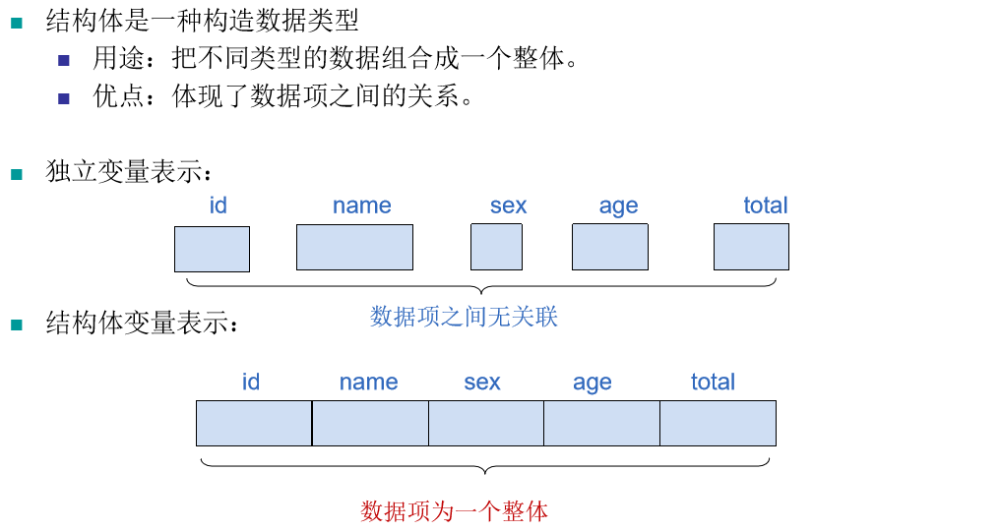

## 结构体变量定义

结构体类型已经声明，如何使用结构体类型定义结构体变量有三种方法：

1. 先声明结构体类型再定义结构体变量

```c
struct Student maye;
```

2. 在声明结构体类型的同时定义变量

```c
struct Student
{
    ...
}maye;
```

3. typedef取别名之后再定义变量

```c
typedef struct Student
{    
    ...
}Student;	//加了typedef之后，这里的Student就是struct Student 的别名了
Student maye;
```

+ 通过第一种方法定义结构体变量时，struct关键字不能省略。

## 结构体变量初始化

在定义结构体变量的同时通过{}的方式为每一个成员变量进行赋初值

+ 全部初始化

```c
struct Student maye = {100,"maye",1,18,666};
```

```c
c中如果是用起别名的方式
Student maye = {100,"maye",1,18,666};
```

+ 部分初始化：未初始化部分自动初始化为0

```c
struct Student maye = {100};
```

+ 全部初始化为0

```cpp
struct Student maye = {0};
```

+ 初始化指定的成员(可以初始化任意成员，不必遵循定义顺序)

```c
struct Student maye = {.id = 100,.age = 18};
```

+ 用另一个结构体变量初始化:

```c
struct Student zc = maye;
zc = (struct Student){200，"zc"};
```

+ 和数组初始化一样，只能从左边开始逐个初始化，不能跳过
+ 初始化时，类型及顺序要一一对应

## 结构体变量的使用

要通过结构体变量访问成员，就需要用到成员访问运算符(. 或 ->)~

+ 普通结构体变量访问成员使用 .

```c
struct Student hero = {007,"007特工"};
puts(hero.name);
```

+ 通过结构体指针访问成员使用 ->

```c
struct Student *ph = &hero;
(*ph).name;
ph->name;
```

## 结构体嵌套

在一个结构体内包含另一个结构体作为其成员，有两种写法。

比如，给学生增加一个出生日期，包含年月日.

1. 先定义好结构体，然后在另一个结构体中定义结构体变量

```c
struct Date
{
    short year;
    short month;
    short day;
};

struct Student
{
    int id;
    char name[10];
    struct Date birth;	//出生日期
};
```

2. 直接把结构体定义在另一个结构体内。

```c
struct Student
{
    int id;
    char name[10];
    struct Date
	{
    	short year;
    	short month;
    	short day;
	}birth;//出生日期
};
```

+ 当出现结构体嵌套时，必须以级联方式访问结构体成员，即通过成员访问运算符逐级找到最底层的成员。

```c
struct Student maye;
maye.birth.year = 2022;
maye.birth.month = 2;
maye.birth.day = 9;

struct Student zc = {2000,"顽石",{2021,5,14}};
```

## 结构体数组

一个结构体变量可以存放一个学生的一组信息，可是如果有 10 个学生呢？难道要定义 10 个结构体变量吗？难道上面的程序要复制和粘贴 10 次吗？

很明显不可能，这时就要使用数组。结构体中也有数组，称为结构体数组。它与前面讲的数值型数组几乎是一模一样的，只不过需要注意的是，结构体数组的每一个元素都是一个结构体类型的变量，都包含结构体中所有的成员项。

```c
struct Student stus[10];
```

这就定义了一个结构体数组，共有 10 个元素，每个元素都是一个结构体变量，都包含所有的结构体成员。

下面编写一个程序，编程要求：从键盘输入 5 个学生的基本信息，如学号、姓名、年龄、性别，然后将年龄最大的学生的基本信息输出到屏幕。

```c
#include <stdio.h>

struct Student
{
    int id;
    char name[10];
    int age;
    char sex;
};
/*
1001 小红 22 F
1002 小明 21 M
1003 小欣 23 F
1004 小天 20 F
1005 小黑 19 M
*/

int main()
{
    struct Student stus[10];
    for (int i = 0; i < 5; i++)
    {
        printf("input %d stu>",i+1);
        scanf("%d %s %d %c",&stus[i].id,stus[i].name,&stus[i].age,&stus[i].sex);
    }

    struct Student maxStu = stus[0];
    for (int i = 0; i < 5; i++)
    {
        if (maxStu.age < stus[i].age)
        {
            maxStu = stus[i];
        }         
    }
    printf("%d %s %d %c\n", maxStu.id,maxStu.name, maxStu.age, maxStu.sex);

    return 0;
}
```

input 1 stu>1001 小红 22 F
input 2 stu>1002 小明 21 M
input 3 stu>1003 小欣 23 F
input 4 stu>1004 小天 20 F
input 5 stu>1005 小黑 19 M
1003 小欣 23 F

结构体数组也是能够初始化的，我们将上面的程序修改一下：

```c
int main()
{
    struct Student stus[10] = {{1001, "小红", 22, 'F'},{1002,"小明" ,21,' M'},{1003,"小欣" ,23, 'F'},{1004, "小天", 20, 'F'},{1005, "小黑", 19, 'M'}};

    struct Student maxStu = stus[0];
    for (int i = 0; i < 5; i++)
    {
        if (maxStu.age < stus[i].age)
        {
            maxStu = stus[i];
        }         
    }
    printf("%d %s %d %c\n", maxStu.id,maxStu.name, maxStu.age, maxStu.sex);

    return 0;
}

// 结果:
1003 小欣 23 F
```

## 结构体字节对齐

每种类型在定义对象时，都会开辟内存，类型不同所占内存大小也不一样，用sizeof即可获取类型大小。

思考：结构体占用的内存大小是多少呢？

+ 是成员所占内存的总和吗？
+ 还是有其他的处理方式？

先来看几个例子吧：

```c
#include<stdio.h>

struct Node
{
    int a;
    int b;
};

int main()
{
    printf("%d\n",sizeof(struct Node));
    return 0;
}
```


```c
struct Node
{
    int a;
    int b;
};	//8
```

这个结构体大小为8个字节，看起来是成员大小的总和，实际上这只是个巧合：**当成员类型全部一样时，结构体大小就等于每个成员大小之和。**

```c
struct Node1
{
    int a;
    char b;
};	//8
```

这个结构体大小还是8个字节，为什么？这实际上是编译器对结构体的空间进行了优化，就是所谓的字节对齐。

### 什么是字节对齐？

从理论上讲，对于任何变量的访问都可以从任何地址开始访问，但是事实上不是如此，实际上访问特定类型的变量只能在特定的地址访问，这就需要各个变量在空间上按一定的规则排列，而不是简单地顺序排列，这就是内存对齐。

### 为什么要字节对齐？

原因：

+ 某些平台只能在特定的地址处访问特定类型的数据；

+ 提高存取数据的速度。比如有的平台每次都是从偶地址处读取数据，对于一个int型的变量，若从偶地址单元处存放，则只需一个读取周期即可读取该变量；但是若从奇地址单元处存放，则需要2个读取周期读取该变量。

### 字节对齐规则

C语言标准并没有规定内存对齐的细节，而是交给具体的编译器去实现，但是对齐的基本原则是一样的。

+ 1) 结构体变量的首地址能够被其最宽基本类型成员的大小所整除；

+ 2) 结构体每个成员相对于结构体首地址的偏移量都是成员大小的整数倍，如有需要编译器会在成员之间加上填充字节；
+ 结构体的总大小为结构体最宽基本类型成员大小的整数倍，如有需要编译器会在最末一个成员之后加上填充字节。


## 位段(位域)

### 位段是什么？

C语言允许在一个**结构体中以位为单位来指定其成员所占内存长度，这种以位为单位的成员称为位段。利用位段能够用较少的位数存储数据。**

**语法：**

```c
struct 结构体名
{
  	  整数类型 位段名1 : 位段大小;
      整数类型 位段名2 : 位段大小;
      整数类型 位段名3 : 位段大小;
      整数类型 位段名4 : 位段大小;
      ...
};
```

+ 整数类型：C语言标准规定，只有有限的几种数据类型可以用于位段。(所有整数类型以及char类型和_Bool类型)。
+ 位段名：即有效的标识符
+ 位段大小：此位段所占的位数，不能超过类型的最大位数。

**范例：**

```c
struct BitField
{
    unsigned char a:1;
    unsigned char b:4;
    unsigned char c:3;
};
int main()
{
    //初始化
    struct BitField bit = {1,2,3};
    //输出
    printf("first:%d %d %d\n",bit.a,bit.b,bit.c);
    //赋值
    bit.a = 2;
    bit.b = 20;
    bit.c = 8;
    //再次输出
    printf("last:%d %d %d\n",bit.a,bit.b,bit.c);
}
```

运行结果：

```text
fast:1 2 3
last:0 4 0
```

第一次的输出结果都是完整的，第二次输出的结果令人摸不着头脑。

+ **第一次输出时：**a、b、c的值分别为1、2、3，转换成二进制分别是0b1、0b10、0b11，都没有超出限定的位数，能正常输出。

+ **第二次输出时：**a、b、c的值分别为2、20、8，转换成二进制分别是0b10、0b10100、0b1000，所有位段都超出了限定的位数，不能正常输出。
  + 超出部分被直接截去(从高位开始截断，即从左往右)，截去之后的二进制分别为0b0、0b0100、0b000，换算成十进制分别为0、4、0


### 注意事项

1、**位段的内存分配：**位段占的二进制位数不能超过该基本类型所能表示的最大位数，即位段不能跨字节存储，比如char是占1个字节，那么最多只能是8位；

```c
struct Bit
{
  	char a:3;	//right
	char b:9;	//error C2034: “d”: 位域类型对位数太小
};
```

2、**位域的存储：**C语言标准并没有规定位域的具体存储方式，不同的编译器有不同的实现，但它们都尽量压缩存储空间。

当相邻成员的类型相同时，如果它们的位宽之和小于类型的 sizeof 大小，那么后面的成员紧邻前一个成员存储，直到不能容纳为止；如果它们的位宽之和大于类型的 sizeof 大小，那么后面的成员将从新的存储单元开始，其偏移量为类型大小的整数倍。

```c
struct Bf1
{
    char a:3:
    char b:3;
};
//sizeof(struct Bf1) == 1

struct Bf2
{
    char a:3:
    char b:3;
    char c:3;
};
//sizeof(struct Bf2) == 2
```

3、**禁止对位段取地址**：地址是字节（Byte）的编号，而不是位（Bit）的编号。

```c
&bit.a;		//error C2104: 位域上的“&”被忽略
```

4、**无名位段：**位域成员可以没有名称，只给出数据类型和位宽

```c
struct Bf
{
    int a:12;
    int :20;
    int b:4;
};
```

无名位域一般用来作填充或者调整成员位置。因为没有名称，无名位域不能使用。

上面的例子中，如果没有位宽为 20 的无名成员，a、b 将会挨着存储，sizeof(struct Bf) 的结果为 4；有了这 20 位作为填充，a、b 将分开存储，sizeof(struct Bf) 的结果为 8。

# 联合(共用体)

联合也是一种数据类型，用户可自定义。不同于结构体成员——它们在结构中都具有单独的内存位置，联合成员则共享同一个内存位置。也就是说，联合中的所有成员都是从相同的内存地址开始。因此，可以定义一个拥有许多成员的联合，但是同一时刻只能有一个成员允许含有一个值。联合让程序员可以方便地通过不同方式使用同一个内存位置。

## 联合的定义

联合的定义方式与结构是一样的，只是把关键字 struct 改成 union：

```c
union tag
{
   int member;
   struct 
   {
       ....
   }name;
    ...
};
```

下面的例子定义了一个名为Data的联合类型，它有 3 个成员：i、x 和 str：

```c
union Data
{
    int i;
    double x;
    char str[16];
};
```

这种类型的对象可以存储一个整数、一个浮点数或一个短字符串。如果想获得联合的空间大小，可以使用 sizeof 运算符。对上例来说，sizeof（union Data）会返回 16。

如下图所示：联合中所有成员都是从内存中同一个地址开始的。


为展示联合和结构的差异，看看下面定义的 struct Record，它具有成员 i、x 和 str：

```c
struct Record
{
    int i;
    double x;
    char str[16];
};
```

如下图所示：结构对象中每个成员使用内存中的不同位置。


获取联合成员的方式和获取结构成员的方式一样。唯一的差异在于，当改变一个联合成员的值时，实际上修改了该联合所有成员的值。

程序员要确保联合对象的内存内容被正确地解释和使用。联合内成员的类型不同，允许程序员采用不同的方式解释内存中的同一组字节值。例如，下面的循环使用联合来展示一个 double 值在内存中的存储形式：

```c
union Data var;
var.x = 3.14;
for(int i = sizeof(double)-1;i>=0;i--)
{
    printf("%02X ",(unsigned char)var.str[i]);
}
```

该循环从 var.x 的最高位字节开始，生成下面的输出：

```c
3F F4 00 00 00 00 00 00
```

# 枚举

枚举：具有有限个整型符号常量的集合，这些整型符号常量称为枚举常量。

枚举的定义很简单，和结构体差不多，只需要把关键字 struct 改成 enum：

```c
enum tag
{
   member,
   ...
};
```

枚举类型有什么用？

+ 在实际应用中,有些变量的取值范围是有限的,仅可能只有几个值,如一个星期7天, 一年12个月,一副扑克有4种花色,每一花色有13张牌等。
+ 整型数来表示：直观性差，如1，在别让看来可能就是数字1，或者星期一，或者一月份，难以区分！
+ 由此看出,为提高程序的可读性,引入非数值量即一些有意义的符号是非常必要的。

```c
enum week{ Mon, Tu, We, Th, Fr, Sa, Sun };
```

判断用户输入的是星期几：

```c
#include <stdio.h>
enum week{ Mon, Tu, We, Th, Fr, Sa, Sun };
int main()
{
    scanf("%d", &day);
    switch(day){
        case Mo: puts("Monday"); break;
        case Tu: puts("Tuesday"); break;
        case We: puts("Wednesday"); break;
        case Th: puts("Thursday"); break;
        case Fr: puts("Friday"); break;
        case Sa: puts("Saturday"); break;
        case Su: puts("Sunday"); break;
        default: puts("Error!");
    }
    return 0;
}
```


#  预处理指令

在编译和链接之前，还需要对源文件进行一些文本方面的操作，比如文本替换、文件包含、删除部分代码等，这个过程叫做预处理，由预处理程序完成。

较之其他编程语言，C/C++ 语言更依赖预处理器，所以在阅读或开发 C/C++ 程序过程中，可能会接触大量的预处理指令，比如 #include、#define 等。

在C语言中，凡是以“#”开头的行，都称为预编译指令，主要有

| 指令                                  | 作用                                                         |
| ------------------------------------- | ------------------------------------------------------------ |
| #define<br />#undef                   | 定义宏<br />取消宏定义                                       |
| #include                              | 包含头文件                                                   |
| #if<br />#else<br />#elif<br />#endif | 条件编译                                                     |
| #ifdef<br />#ifndef                   | 判断是否定义了某个宏                                         |
| #program                              | 设定编译器的状态或者是指示编译器完成一些特定的动作           |
| #error                                | 当预处理器预处理到*#error*命令时将停止编译并输出用户自定义的错误消息 |


## 预定义宏

预定义宏是C语言中标准编译器预先定义的宏，**在ANSI标准中C程序有5个预定义宏可以直接使用**。

| 宏            | 说明                   |
| ------------- | ---------------------- |
| \__LINE__     | 当前编译的代码的行号   |
| \__FILE__     | 当前编译文件的源文件名 |
| \__DATE__     | 当前源程序创建的日期   |
| \__TIME__     | 当前源程序创建的时间   |
| \__FUNCTION__ | 当前正在被访问的函数名 |


## #define宏定义

\#define 叫做宏定义命令，它也是C语言预处理命令的一种。所谓宏定义，就是用一个标识符来表示一个表达式，如果在后面的代码中出现了该标识符，那么就全部替换成指定的表达式。

宏定义形式：

```c
#define 宏名  stuff	//stuff为替换内容
```


【示例】

```c
#inlcude<stdio.h>
#define MAYE "顽石"
int main()
{
    printf("%s\n",MAYE);
    return 0;
}
```

运行结果：顽石

`#define MAYE "顽石"`就是宏定义，`MAYE`为宏名，`"顽石"`是宏的内容（宏所表示的字符串）。在预处理阶段，对程序中所有出现的“宏名”，预处理器都会用宏定义中的字符串去代换，这称为“宏替换”或“宏展开”。


值得注意的是，如果宏定义的是一个运算表达式，可能会出现歧义。

【示例】

```c
#include<stdio.h>
#define EXP 2*5+1

int main()
{
    int ret = 3 * EXP;
    printf("ret:%d\n", ret);

    return 0;
}
```

运行结果:ret:31

这显然是不正确的，我想要的结果是3*(EXP)，应该输出33才对，那为什么是31呢？

请记住宏只是简单地替换，根据这个规则我们来替换一下：

```c
int ret = 3*2*5+1;
```

原来宏替换不会自动计算值，而是直接复制过来，所以运算的顺序就对了，那如果想要宏作为一个整体怎么办呢？我们可以**在定义宏的时候把表达式用()括起来**，如下。

```c
#define EXP (2*5+1)
```

替换后代码如下:

```c
int ret = 3*(2*5+1);
```

这个就是我们想要的结果33了。

### 带参宏

Ｃ语言允许宏带有参数。在宏定义中的参数称为形式参数，在宏调用中的参数称为实际参数。

对带参数的宏，在调用中，**不仅要宏展开，而且要用实参去代换形参**。

带参宏定义的一般形式为:

```c
#define 宏名(形参表) stuff
```

+ 形参列表是一个由逗号分隔的符号列表，它们可能出现在stuff中。参数列表的左括号必须与name紧邻。如果两者之间有任何空白存在，参数列表就会被解释为stuff 的一部分。

【示例】下面是一个带参宏，它接受一个参数，用来计算数值的平方。

```c
#include<stdio.h>

#define SQUARE(number) (number*number)

int main()
{
    printf("%d\n", SQUARE(3));
    return 0;
}
```

预处理阶段会被替换为`printf("%d\n", (3*3);`输出结果为9, ok

那接着看下面的代码，你会发现就离谱！

```c
printf("%d\n",SQUARE(3+2));
```

我们想要计算(3+2)的平方，即5的平方，但是输出结果却是11，更具宏只是简单地替换原则，可以展开为如下样式

```c
printf("%d\n",(3+2*3+2));
```

上面的代码大家都懂，结果可不就是11嘛，但是计算的不是5的平方，要想达到需要的结果，**必须给每个参数都加上括号**，如下

```c
#define SQUARE(number) ((number)*(number))
```

这样修改之后，就不会出现任何问题了。


### 带参宏和函数的区别

**在带参宏定义中，不会为形式参数分配内存，因此不必指明数据类型。**

带参宏非常频繁的用于执行简单的计算,比如在两个表达式中寻找其中较大的一个:

```c
#define MAX(a,b) ((a)>(b)?(a):(b))
```

为什么不用函数来完成这个任务呢？原因有两个：

+ 函数的调用是需要开销的，在小型任务时，使用宏比使用函数在程序的规模和速度方面都更胜一筹.

+ 更为重要的是，函数的参数必须是一种特定的类型，所以他只能在类型合适的表达式上使用。而上面的带参宏可用于int、long int、float、double、char等。**就是说宏是与类型无关的。**

```c
printf("%d\n",MAX(3,6));
printf("%lf\n",MAX(3.14,5.20));
printf("%c\n",MAX('a','A'));
```

如果要用函数实现，则需要定义多个函数，而且函数名还不能重复，略显麻烦~

还有一些任务根本无法用函数实现，比如：下面这个宏，第一个参数是一种类型，它无法作为函数参数进行传递。

```c
#define MALLOC(type,size) malloc(sizeof(type)*size)
...
int*pn = MALLOC(int,10);
char*ps = MALLOC(char,20);
```

【示例】高难度：用宏定义实现一个foreach循环，用来快捷遍历数组。

```c
#include<stdio.h>

#define foreach(val,arr)  \
for (size_t i = 0, ctr = 0; i < sizeof(arr)/sizeof(arr[0]); i++,ctr = 0)\
    for (val = arr[i]; ctr < 1; ++ctr)

int main()
{
    int arr[10] = { 1,2,3,4,5,6,7,8,9,10 };
    foreach (int a, arr)
    {
        printf("%d ", a);
    }
    
    char* str[] = { "hello","world" };
    foreach(char* val, str)
    {
        puts(val);
    }
    return 0;
}
```

**宏和函数对比**

| **属性**     | #define                                                      | **函数**                                                     |
| ------------ | ------------------------------------------------------------ | ------------------------------------------------------------ |
| 代码长度     | 每次使用时，宏代码都被插入到程序中。除了非常小的宏之外，程序的长度将大幅度增长. | 函数代码只出现于一个地方;每次使用这个函数时, .都调用那个地方的同一份代码 |
| 执行速度     | 更快                                                         | 存在函数调用/返回的额外开销                                  |
| 操作符优先级 | 宏参数的求值是在所有周围表达式的上下文环境里，除.非它们加上括号,否则邻近操作符的优先级可能会产生不可预料的结果 | 函数参数只在函数调用时求值一次，它的结果值传递给函数。表达式的求值结果更容易预测 |
| 参数类型     | 宏与类型无关。只要对参数的操作是合法的，它可以使用于任何参数类型 | 函数的参数是与类型有关的。如果参数的类型不同，就需要使用不同的函数，即使它们执行的任务是相同的 |

### #undef

 这条预处理指令用于移除一一个宏定义。如果一个现存的名字需要被重新定义，那么它的旧定义首先必须用#undef移除。


### 宏定义中的特殊符号

#### # 参数转字符串

使用#可以把宏参数变成一个字符串。 // 变量是直接去转变量 名,局限性很大

```c
#define toString(value) #value
...
puts(toString(12334));    
```


#### ## 连接参数

使用##可以把宏参数连接在一起。

```c
#define VAL(val) val##_maye
...
int VAL(one) = 20;
printf("%d\n", one_maye);    
```

```c
//##符号
#define TelVal(name) name##_tell

int main()
{
    //_前面的是名字，后面的是标识
    int maye_tel = 123;
    int upstream_tel = 567;
    int wyww_tel = 789;
    //maye_tel upstream_tel  wyww_tel
    printf(_Format: "%d %d %d\n"，TelVal(maye)，Telval(upstream)，TelVal(wyww));
    
    int TelVal(祈盼)= 131111;
    printf(Format: "%d \n"，祈盼_tel);return 0;

}
```


#### #@ 参数转字符

使用#@可以吧宏参数变成一个字符。

```c
#define toChar(ch) #@ch
...
printf("%c", toChar(1));
```


## #if条件编译

一般情况下，源程序中所有的行都参加编译。但有时希望对其中一部分内容只在满足一定条件才进行编译，也就是对一部分内容指定编译的条件，这就是“条件编译”。有时，希望当满足某条件时对一组语句进行编译，而当条件不满足时则编译另一组语句。

条件编译功能可按不同的条件去编译不同的程序部分，从而产生不同的目标代码文件。这对于程序的移植和调试是很有用的。

先来学习一个别的指令，#error用来输出错误信息并终止编译。

```c
#error 亲，欢迎学习C语言！
```


**常见的条件编译指令**

| 条件编译指令 | 说 明                                          |
| ------------ | ---------------------------------------------- |
| #if          | 如果条件为真，则执行相应操作                   |
| #elif        | 如果前面条件为假，而该条件为真，则执行相应操作 |
| #else        | 如果前面条件均为假，则执行相应操作             |
| #endif       | 结束相应的条件编译指令                         |
| #ifdef       | 如果该宏已定义，则执行相应操作                 |
| #ifndef      | 如果该宏没有定义，则执行相应操作               |

调用格式为:

```c
#if 条件表达式   // 不加括号
    程序段1
#else
    程序段2
#endif
```

功能和C语言的条件语句类似，不同的是条件编译中的条件表达式必须为能够在编译期间计算出结果的。(不能为变量)

注意，==必须使用 #endif 结束该条件编译指令。==

```c
int main()
{
#if 1
    printf("#if\n");
#else
    printf("#else\n");
#endif

    
#ifdef SHOW     	//或者 #ifndef
    printf("#ifdef\n");
#else
    printf("#else\n");
#endif

    
#if defined(SHOW)   //或者 #if !defined(SHOW)
    printf("#if defined\n");
#else
    printf("#else\n");
#endif
    return 0;
}
```

```c
/判断程序是debug版本还是release版本_DEBUG
#if defined(_DEBUG)
printf(_Format : "debug \n" );
#else
printf( "release \n" );
#endif //efined(_DEBUG)
```


## #include头文件包含

#inlcude指令我们已经用过很多次了，它会把我们包含的文件全部复制到包含位置。实际上不仅能包含.h文件，.c文件也行，甚至任意文件都行。

**标准库文件包含**

+ 对于编译器已经提供好的库文件，我们可以用过下面这种语法。
  ``#include <filename>``
  对于filename，并不存在任何限制，不过根据约定，标准库文件以.h后缀结尾。编译器通过定义好的“库文件位置“查找头文件。

  

**本地文件包含**

+ 对于自定义的库文件，我们可以使用下面这种语法。
  ``#include “filename”``
  处理本地头文件首先是在源文件所在的当前目录进行查找，如果该头文件并未找到，编译器就像查找函数库头文件一样在标准位置查找本地头文件。

注意：你可以在所有的#include语句中使用双引号。但是，使用这种方法，编译器在查找函数库头文件时会浪费少许时间。而且，对函数库头文件使用尖括号可以很方便看出包含的是标准库文件还是自定义头文件，便于区分。


**重复包含头文件**

在一个文件中直接或间接多次包含同一文件，可能会导致问题，比如：

+ 当文件中有对变量或类型的定义时，多次包含该文件这个变量或类型就会被多次定义。


+ 当然，没有人会故意编写这样的代码。但下面的代码，会让你难以察觉。


多重包含在绝大多数情况下出现于大型程序中，它往往需要使用很多头文件，因此要发现这种情况并不容易。要解决这个问题，我们可以使用条件编译。如果所有的头文件都像下面这样编写:

【demo.h】

```c
#ifndef _DEMO_H_
#define _DEMO_h_
/*你的代码*/
#endif  
```

这样，多重包含的危险就被消除了，在第一次包含时头文件被正常替换，并且定义宏\_DEMO_H_。如果头文件被再次包含，通过条件编译，它的所有内容被忽略。

但是，你必须知道预处理器仍将读入整个头文件，即使这个文件的所有内容将被忽略。由于这种处理将拖慢编译速度，所以如果可能，应避免出现多重包含。


## #pragma

**用于指定计算机或操作系统特定的编译器功能**，#pragma指令是计算机或操作系统特定的，并且通常对于每个编译器而言都有所不同。

### 1.#pragma once

指定该文件在编译源代码文件时仅由编译器包含（打开）一次。

使用 #pragma once 和使用预处理宏定义来避免多次包含文件的内容的效果是一样的，但是需要键入的代码少，可减少错误率，例如：

```c
使用#progma once
#pragma once  
// 放置在这里的代码每个翻译单元只包含一次  

使用宏定义方式
#ifndef HEADER_H_ 
#define HEADER_H_  
// 放置在这里的代码每个翻译单元只包含一次
#endif // HEADER_H_
```


### 2.#pragma message(messageStr)

**不中断编译的情况下，发送一个字符串文字量到标准输出**。message编译指示的典型运用是在编译时显示信息，例如：

```c
#pragma message("hello world")
```


### 3.#pragma warning(...)

#### 修改编译器警告状态

```c
#pragma warning(warning-specifier : warning-number-list)
```

+ 警告参照表

| 警告说明   | 含义                                     |
| ---------- | ---------------------------------------- |
| `default`  | 将警告行为重置为默认值                   |
| `disable`  | 不发出指定的警告信息                     |
| `error`    | 将指定的警告视为错误                     |
| `once`     | 指定的警告只显示一次                     |
| `suppress` | 抑制下一行的指定警告生成(只对下一行生效) |

看这个表估计会头晕，举例说明吧！

```c
int num = 3.14;
int score = 59.5;
```

这行代码会出现两次警告：`warning C4244: “初始化”: 从“double”转换到“int”，可能丢失数据`，C4244为警告代码。

通过`#pragma warning`可以对这个警告的行为进行设置。

```c
#pragma warning(disable:4244)		//禁用4244警告
#pragma warning(once:4244)			//只显示一次4244警告
#pragma warning(error:4244)			//把4244警告视为错误
#pragma warning(default:4244)		//恢复4244警告的默认行为

#pragma warning(default:4244;once:4244;error:4244;default:4244)	//可以写在一个pragma指令里面
#pragma warning(disable:4244 4477)		//对于相同的行为可以更方便的表示
```

#### 保存和恢复警告状态

push和pop可以保存和恢复当前警告状态，语法为：

```c
#pragma warning(push [,n])    
#pragma warning(pop )
```

其中 n 表示警告等级（1 到 4）。

+ warning( push ) 指令存储每个警告的当前警告状态。
+ warning( push, n) 指令存储每个警告的当前状态并将全局警告级别设置为 n。
+ warning( pop ) 指令弹出推送到堆栈上的最后一个警告状态()。

**超出push和pop的范围，在 push 和 pop 之间对警告状态所做的任何更改都将失效**。

```c
#pragma warning(push)  
#pragma warning( disable : 4705 )  
#pragma warning( disable : 4706 )  
#pragma warning( disable : 4707 )  
// Some code  						//代码的书写，这里不会发出4705、4706、4707的警告
#pragma warning(pop)   				//会将每个警告（包括4705、4706、4707）的状态还原为代码开始的状态
```

当你编写头文件时，你能用push和pop来保证任何用户修改的警告状态不会影响正常编译你的头文件。在头文件开始的地方使用push，在结束地方使用pop。例如，假定你有一个不能顺利在4级警告下编译的头文件，下面的代码改变警告等级到3，然后在头文件的结束时恢复到原来的警告等级。

```c
#pragma warning( push, 3 )    
//Declarations/ definitions    		//要书写的代码
#pragma warning( pop )
```


### 4.#pragma comment（comment-type [,“commentstring”]）

该指令将一个注释记录放入一个对象文件或可执行文件中。

comment-type 是一个预定义的标识符，它指定了注释记录的类型。 可选 commentstring 是一个字符串，它提供了某些注释类型的附加信息。 由于 commentstring 是一个字符串，因此它遵循有关转义字符、嵌入的引号 (") 和串联的字符串的所有规则。

### 5.#pragma pack

**指定结构、联合和类成员的封装对齐。其实就是改变编译器的内存对齐方式**。

在没有参数的情况下调用pack会将n设置为编译器选项/zp中设置的值。**如果未设置编译器选项，windows默认为8，linux默认为4**。

具体的使用方法为，其中n的取值必须是2的幂次方，即1、2、4、8：

```c
#pragma pack(n) 	//设置以n个字节为对齐长度
struct 
{
	int  ia；
 	char cb；
}
#pragma pack ()  	//弹出n个字节对齐长度，设置默认值为对齐长度
```

