[TOC]


## C核心编程


##  1. 技术层次

| 基础     | 提高       | 实践  |
| -------- | ---------- | ----- |
| C提高    | Qt界面编程 | 项目1 |
| 数据结构 | Linux编程  | 项目2 |
| C++      | 数据库编程 | 项目3 |

--------------

## 2 内存分区

### 2.1 内存区域

C/C++编译的程序占用的内存分为以下几个区域

* 代码区
* 全局区/静态区
* 栈区
* 堆区

**划分：** 

​	程序运行前： 代码区、全局区/静态区

​	程序运行后：栈区、堆区

### 2.2  内存四区

#### 2.2.1  代码区

**作用：**存放CPU执行的二进制机器指令

**特点：** 

1. 只读
2. 共享

#### 2.2.2 栈区

**特点：**

* 栈是一种先进后出的内存结构，由编译器自动分配释放数据。
* 主要存放函数的形式参数值、局部变量等。
* 函数运行结束，相应栈变量会被自动释放
* 栈空间较小，不适合将大量数据存放在栈中

**总结：**

管理方式：编译器自动管理该区内存。
空间大小：提前规定、较小。
生命周期：函数使用完毕立即释放。

==实参 和 形参==

**注意事项：**

* **不要返回局部变量的地址**

以下是错误例子:

```C
//栈区上开辟的数据由系统进行管理，不需要程序员管理开辟和释放
int * func()
{
	int a = 10;
	return &a;
}
//不管结果是否正确，这个值已经被释放了，不可以操作一块非法的内存空间
void test01()
{
	int * p = func();

	printf("a = %d\n", *p);  // 可能是10
	printf("a = %d\n", *p);  // 非法

}
```


```C
char * getString()
{
	char str[] = "hello world";
	return str;
}

void test02()
{
	char * p = NULL;
	p = getString();

	printf("p = %s\n", p);   // 乱码
}
```

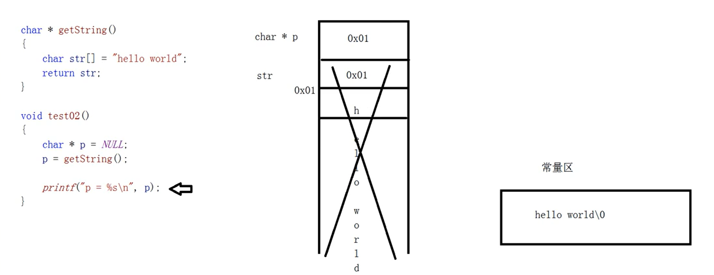

#### 2.2.3 堆区

##### 2.2.3.1 堆区基本概念

**特点：**

* 堆区由开发人员手动申请和释放，在释放之前，该块堆空间可一直使用。
* 由程序员分配和释放，**若程序员不释放，程序结束时由系统回收内存**。
* 堆空间一般没有软限制，只受限于硬件。会比栈空间更大，适宜存放较大数据。

**总结：**

管理方式：**开发人员手动申请和释放**。
空间大小：较大。
生命周期：手动释放之前一直存在，或程序结束由系统回收。

==new  和  malloc  和 常量区 就是用堆==

**堆区使用：**

```C
int * getSpace()
{
	int * p =  malloc(sizeof(int)* 5);
	if (p == NULL)
	{
		return;
	}
	for (int i = 0; i < 5;i++)
	{
		p[i] = i + 100;  //所有在连续空间上开辟的数据，都可以利用下标进行索引
	}
	return p;
}

void test01()
{
	int * p = getSpace();
	for (int i = 0; i < 5;i++)
	{
		printf("%d\n", p[i]);
	}
	//堆区的数据  自己开辟，自己管理释放
	free(p);
	p = NULL;
}
```


##### 2.2.3.2 堆区注意事项

**注意事项：**

**主调函数中没有给指针分配内存，被调函数需要利用高级指针进行操作**

+ 利用高级指针修饰低指针 (修改低指针的数据)  或者 利用返回值  //  例子1  // 实参和形参 都是低级指针相当于值传递了

+ 但是 低级指针是可以使用 低指针的数据   // 例子2

例子2:

```c
void allocateSpace(char *pp)
{
    pp = "hello world";
}

void test02()
{
    char *p;
    allocateSpace(p);
    printf("%s\n", p);
}

// 效果是无输出

// 解决
//利用高级指针修饰低指针 (修改低指针的数据)
void allocateSpace(char **pp)
{
    *pp = "hello world";    // 二级指针解完引用是一级指针
}

void test02()
{
    char *p = null;
    allocateSpace(&p);   // 把低级指针的地址传过去
    printf("%s\n", p);
}
// 输出"hello world"
//-------------------------------------
//利用返回值
char *allocateSpace3()
{
    char *temp = malloc(100);
    memset(temp, 0, 100);
    temp = "hello world";
    return temp;
}
void test03()
{
    char *p = NULL;
    p = allocateSpace3();
    printf("%s\n", p);
}
// 输出"hello world"
```


例子3

**同级指针 :   低级指针 是可以使用 低指针的数据** 

```c
void test02()
{
    char *p =  "hello world";
    allocateSpace(p);
}


void allocateSpace(char *p)
{
    printf("%s\n", p);
}

//// 输出"hello world"
```


-----------

分析以下代码运行的结果

```C
void allocateSpace(char * pp)
{
	char * temp = malloc(100);
	memset(temp, 0, 100);  //空间清零
	strcpy(temp, "hello world");
	pp = temp;
}

void test02()
{
	char * p = NULL;
	allocateSpace(p);  // 函数调用
	printf("%s\n", p);
}

// 效果是无输出
```

**形参也是建立在栈上的**


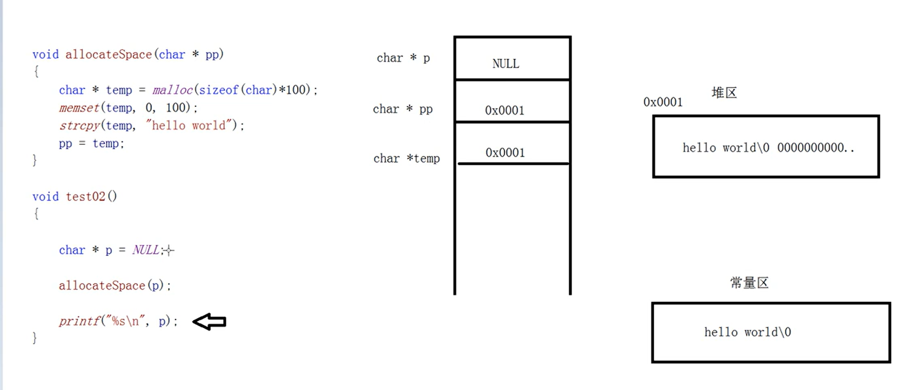


**解决方式1**

```C
//利用高级指针
void allocateSpac2(char ** pp)
{
	char * temp = malloc(100);
	memset(temp, 0, 100);
	strcpy(temp, "hello world");
	*pp = temp;
	printf("aaa%s\n", *pp);
}

void test03()
{
	char * p = NULL;
	allocateSpac2(&p);
	printf("%s\n", p);
}
```

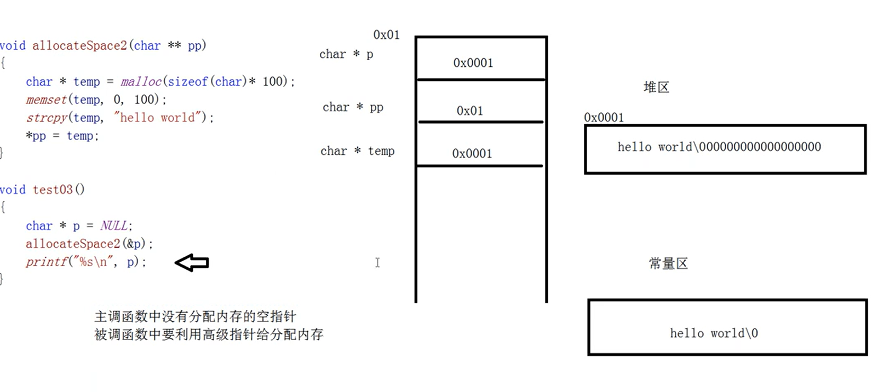


**解决方式2**

```C
//利用返回值
char* allocateSpace3()
{
	char *temp = malloc(100);
	memset(temp, 0, 100);
	
	strcpy(temp, "hello world");
	return temp;
}
void test04()
{
	char *p = NULL;
	p = allocateSpace3();
	printf("%s\n", p);
}
```

--------------


##### 2.2.3.3 calloc和realloc

内存申请可使用三个函数来完成，分别为：malloc、calloc、realloc，内存释放只需要使用 free 函数。 

1. **malloc 函数:---> 不会自动初始化0, 有系统随机设置**
   原型：`void *malloc(unsigned int num_bytes)` 
   用法：分配长度为 num_bytes 字节的内存块。
   说明：如果分配成功则返回指向被分配内存的指针，否则返回 NULL。
   
2. **calloc 函数: --->  会自动初始化0**
   原型：`void *calloc(int num_elems, int elem_size)`
   用法：为具有 num_elems 个长度为 elem_size 元素的数组分配内存。
   说明：如果分配成功则返回指向被分配内存的指针，否则返回 NULL。
   
3. **realloc 函数: ---> 重新分配内存(一定要赋值给原来的指针)-->扩展出来的新空间是 不会进行初始化操作的**  

   **// 可能是原地址,如果后面的空间不足以扩展就会cp到新地址,释放原来的地址**
   原型：`void *realloc(void *mem_address, unsigned int newsize)`
   作用：改变 mem_address 所指内存区域的大小为 newsize 长度。
   说明：如果重新分配成功则返回指向被分配内存的指针，否则返回 NULL。

4. **free 函数:----> 释放指针 所指向的的内存空间。**
   原型：`void free(void *p);`
   作用：释放指针 p 所指向的的内存空间。
   说明：p所指向的内存空间必须是用 calloc,malloc,realloc 所分配的内存。如果 p 为 NULL则不做任何操作。

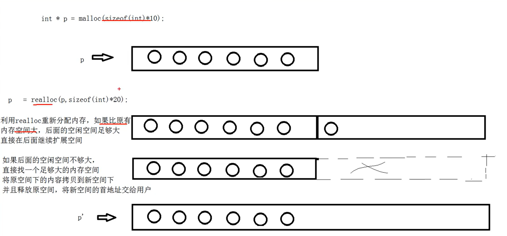

**calloc案例：**

```C
//1. calloc
void test01()
{
	int *p =  calloc(10,sizeof(int));  
	for (int i = 0; i < 10; ++i)
	{
		p[i] = i + 1;
	}
	for (int i = 0; i < 10; ++i)
	{
		printf("%d\n", p[i]);
	}
    
    // 有东西使用完 就手动释放
	if (p != NULL)
	{
		free(p);
		p = NULL;
	}
}
```


**realloc案例：**

```C
void test02()
{
	int *p = malloc(sizeof(int)* 10);
	for (int i = 0; i < 10; ++i)
	{
		p[i] = i + 1;
	}
    
	for (int i = 0; i < 10; ++i)
	{
		printf("%d ", p[i]);
	}
	printf("%d\n", p);  // 前地址
    
	p = realloc(p, sizeof(int)* 200);    // 扩展后的地址
	printf("%d\n",p);  // 可能是原地址,如果后面的空间不足以扩展就会cp到新地址,释放原来的地址

	for (int i = 0; i < 15; ++i)
	{
		printf("%d ", p[i]);
	}
}
```

##### malloc函数创建动态数组

```c
#include<stdio.h>
#include<stdlib.h>
//使用malloc函数动态创建一个数组
int main(){
	/*
		malloc 只是接收一个整型参数   // sizeof(int *) * 5 和 sizeof(int) * 5 表示相应的元素类型
									// 在32位系统中，所有指针都是4B...... 
		malloc(20)代表申请20个字节的内存空间
		返回申请内存空间的首地址
	*/
	/*申请一个4*3字节的内存，返回申请内存的首地址
	但是内存有了，还要说明用什么数据类型来解析
	这段内存。
	(char *)malloc(20);
	(int *)malloc(20);
	(double *)malloc(16);
	...
	*/
	
	//使用malloc函数创建一个动态数组
    int *p = (int *)malloc(sizeof(int) * 4);

    // 数组怎么用 动态数组就怎么使用
    //给数组赋值
    for (int temp = 0; temp < 4; temp++)
    {
        p[temp] = temp;
        printf("数组值%d\n", p[temp]);
    }

	free(p);
	return 0;
}

// 结果:
数组值0
数组值1
数组值2
数组值3
```


#### 2.2.4 全局/静态区

##### 2.2.4.1 基本概念

**特点：**

* 全局/静态区存储**全局变量、静态变量、常量**，该区变量在程序运行期间一直存在
* 程序结束由系统回收。
* 已初始化的数据放在data段，未初始化的数据放到bss段
* **该区变量当未初始化时，会有有默认值初始化 0。**


**总结：**

管理方式：编译器自动管理该区内存。
生命周期：程序结束释放。


##### 2.2.4.2 全局变量

==写在函数体外面的==

**c语言中 默认全局变量前 加了关键字 extern**

例子1:

```c
extern int g_a = 10;   //c语言中 默认全局变量前 加了关键字 extern // 属于外部连接属性
```


```C
void test01()
{
	extern int g_a;  // 告诉编译器, g_a在别的文件中,下面使用的时候去其他文件中找
	printf("g_a = %d\n", g_a);
}
```

--------------

例子2:

```C
extern int g_b;   //c语言中 默认全局变量前 加了关键字 extern 
void test02()
{
	printf("g_b = %d\n", g_b);
}
```

-----------------


##### 2.2.4.3 静态变

==由static定义的==

 **静态变量只初始化一次,  如果未初始化，默认为0 .  不会随着函数结束就进行重置.    共享的**

```C
void func()
{
	static int s_a = 10; //静态变量只初始化一次,不会进行重置  //如果未初始化，默认为0
	s_a++;
	printf("%d\n", s_a);
}

void test03()
{
	func();
	func();
	func();
}

//  11 12 13
```

---

不加static就属于局部变量

```c
void func()
{
	int s_a = 10; //局部变量
	s_a++;
	printf("%d\n", s_a);
}

void test03()
{
	func();
	func();
	func();
}

//  11 11 11
```

--------


##### 2.2.3.4 常量

1. const 修饰的变量
2. 字符串常量


**const 修饰的变量：**

**结论：** 

​	**直接修改失败,  全局常量间接修改失败，局部常量间接修改成功**

```C
//全局常量
const int a = 10; //全局常量存放到常量区，收到常量区的保护, 不可能修改

void test01()
{
    //a = 20; //直接修改失败
	int * p = &a;
	*p = 30;  //间接修改  语法通过，运行失败
	printf("a = %d ", a); 


	//局部常量
	const int b = 10; //b分配到了栈上,可以通过间接方式对其进行修改
	//b = 30; //直接修改失败
	int * p2 = &b;
	*p2 = 30;
	printf("b = %d\n", b); //间接修改成功，C语言下const修饰的局部常量为伪常量
}

```


---------------------

**字符串常量：**

1、**字符串常量 是可以共享的**  , **不可以修改**,   只能通过动态数组+strcpy的方式覆盖

**结论：字符串常量修改失败，但这不是绝对的, 尽量不要去修改字符串常量**

```C
//1、字符串常量 是可以共享的
void test01()
{
	char * p1= "hello world";
	char * p2 = "hello world";
	char * p3 = "hello world";
	printf("%d\n",&"hello world");
	printf("%d\n", p1);
	printf("%d\n", p2);
	printf("%d\n", p3);
}

//2、vs下 不可以修改字符串常量中的内存
void test02()
{
	char * p1 = "hello world";
	printf("%d\n", p1);    // 首地址 4210697 --可以得到--> hello world
    printf("%s\n", p1);    // 得到内容 hello world
	printf("%c\n", p1[0]);  // h
	//p1[0] = 'W'; //不允许修改 常量区内容
}
```


上述案例中字符串常量修改失败，但这不是绝对的

* ANSI C中规定：修改字符串常量，结果是未定义的
* 有些编译器把多个相同的字符串常量看成一个（节省空间），有些则不进行此优化
* 有些编译器可修改字符串常量，有些编译器则不可修改字符串常量

-------------


### 2.3 函数调用模型

#### 2.3.1 宏函数

**宏函数概念：**

* 宏函数和宏常量都是利用#define定义出来的内容
* 在项目中，经常把一些短小而又频繁使用的函数写成宏函数
* 这是由于宏函数没有普通函数参数压栈、跳转、返回等时间上的开销，可以调高程序的效率。


**注意事项：** ==宏函数通常 需要加括号，保证运算的完整==


```C
#define MYADD(x,y)  ((x) + (y))  //不是函数 ，宏函数, 加括号

//普通函数下的a、b都要进行入栈，函数执行后出栈
int  myAdd(int a ,int b)
{
	return a + b;
}
//宏函数  在一定的场景下  要比普通的函数效率高，把频繁使用并且短小的函数 可以写成宏函数
//宏函数在编译阶段就替换源码
//而没有普通函数入栈出栈的开销，以空间换时间
void test01()
{
	int a = 10;
	int b = 20;
	printf("a + b = %d\n", MYADD(a, b)); //  ((a) + (b))
}
```

**总结：将频繁短小的函数可以封装为宏函数，以空间换时间。**

----


#### 2.3.2 函数调用流程

普通函数执行的时候会有些时间的开销

下面我通过以下案例来分析下 ，一个简单的函数调用流程

```C
int func(int a,int b){
	int t_a = a;
	int t_b = b;
	return t_a + t_b;
}

int main(){
	int ret = 0;
	ret = func(10, 20);
	return EXIT_SUCCESS;
}
```

通过上面的案例，我们知道一个普通函数的调用流程

在此期间又引出两个问题

1. 被调函数func中的a、b入栈的顺序是从左到右，还是从右到左？
2. 当被调函数执行完毕后，a、b这两个参数是由  主调函数mian去管理释放还是被调函数func管理释放？

带着这两个问题来看**2.3.3 调用惯例**

结论:     **函数调用方  从右至左参数入栈**

-----


#### 2.3.3 调用惯例

**调用惯例概念：**

函数的调用方（主调函数）和   被调用方（被调函数）对于函数是如何调用的必须有一个明确的约定，

只有双方都遵循同样的约定，函数才能够被正确的调用，这样的约定被称为**调用惯例**


C/C++语言中存在多个调用惯例，默认使用的调用惯例为 **cdecl** 

**注: cdecl不是标准的关键字，在不同的编译器里可能有不同的写法，例如gcc里就不存在_cdecl这样的关键字**


调用惯例包含的内容有：

| 调用惯例 | 出栈方     | 参数传递                             | 名字修饰                   |
| -------- | ---------- | ------------------------------------ | -------------------------- |
| cdecl    | 函数调用方 | 从右至左参数入栈                     | 下划线+函数名              |
| stdcall  | 函数本身   | 从右至左参数入栈                     | 下划线+函数名+@+参数字节数 |
| fastcall | 函数本身   | 前两个参数由寄存器传递，后面从右到左 | @+函数名+@+参数的字节数    |
| pascal   | 函数本身   | 从左至右参数入栈                     | 较为复杂，参见相关文档     |


-------


#### 2.3.4 栈的生长方向


**作用：**了解栈中元素与元素之间的存储方式

```C
//栈的生长方向   自上而下  ，栈底高地址  栈顶低地址
void test01()
{
	int a = 10;
	int b = 20;
	int c = 30;
	int d = 40;

	printf("%d\n", &a);   // 栈低  // 相邻12字节  // 数组 相邻 4字节
	printf("%d\n", &b);
	printf("%d\n", &c);
	printf("%d\n", &d);  //栈顶
}
```

**结论：栈底高地址    栈顶低地址**---> 所有不能无限放东西


------------


#### 2.3.5 内存存储方式

**内存中的多字节数据相对于内存地址有大端和小端之分 : **

+ 小端模式：==高==位字节数据保存在内存的==高==地址中，==低==位字节数据保存在内存的==低==地址中

+ 大端模式：==高==位字节数据保存在内存的==低==地址中，==低==位字节数据保存在内存的==高==地址中


**验证方式：**

法1.

```C
	int a = 0x11223344;
	char * p = &a; //char * 改变指针步长，一次跳一个字节   // char一个字节8位

	printf("%x\n", *p);      // 44  低地址  -- 低位字节
	printf("%x\n", *(p+1));
	printf("%x\n", *(p+2));
	printf("%x\n", *(p+3));  // 11  高地址  --  高位字节
```

法2 .  **用结论:   一个16进制数  =  4个二进制的数  // 8个二进制数 =  1字节**


## 3 指针进阶

### 3.1 空指针和野指针

#### 3.1.1 空指针

​	含义：特殊的指针变量，表示**不指向任何东西**

​	作用：指针变量创建的时候，可以初始化为NULL, 本质上是0.

​	注意：不要对空指针进行解引用操作

```c
int *p = NULL;
*p = 100;              //错的
```


#### 3.1.2 野指针

​	含义：野指针**指向**一个**已释放的内存(空地址)** 或者 **未申请过的内存空间  (给他一个地址就是给他申请过的内存空间 )**

​	注意：不要对野指针进行解引用操作


```C
void test01(){
    
	char *p = NULL;
    
	//给p指向的内存区域拷贝内容
	strcpy(p, "1111"); //err
    p1 = "hello world";  // ok  // 以为字符串是地址  // 这个是字符串常量 一定不能修改

	char *q = 0x1122;   // 0x1122;没有申请过
	//给q指向的内存区域拷贝内容
	strcpy(q, "2222"); //err		
}
```


#### 3.1.3 常见的野指针

常见情况:

1. **指针变量未初始化**
2. **释放堆区的指针后未置空**
3. **指针操作超越了变量作用域,不要返回局部变量**

```C
int* func()
{
	int a = 10; 
	int * p = &a; 
	return p;
}

void test02()
{
	//1 指针变量未初始化
	int * p1;
	//printf("%d\n", *p1);

	//2 指针释放后未置空
	int * p2 = (int*)malloc(sizeof(int));
	*p2 = 100;
	free(p2);  // 最开始的申请的动态内存地址不属于你了,
	printf("%d\n", *p2); //乱码 已经释放了 // err
    free(p2);  // err
    
	//3 指针操作超越变量作用域
	int * p3 = func();
	printf("%d\n", *p3);
}
```

注意： **空指针可以连续free，但是野指针不可以**

------------


-------------


### 3.2 指针步长的意义(重要)

核心:  **不同类型的指针有的意义  :  **

* 指针变量 +1 后 跳跃字节数量不同
* 解引用的时候，取出字节数量不同
* 注意数据本身是不会改变的,   按照相应的解析,  就能还原数据
* 传递过程中如果是void * 那么什么指针接无所谓 , 最后按照相应的解析,  就能的到想要的数据
* 针对指针之间的强转,. 数值强转成指针只能得到地址

```C
void test01()
{
    // 1. 不同类型的指针, 指针变量+1后 跳跃字节数量不同
	char * p = NULL;
	printf("%d\n", p);//0    
	printf("%d\n", p+1);   // 1

	int * p1 = NULL;
	printf("%d\n", p1); //0
	printf("%d\n", p1 + 1); // 4
    
    double *p2 = NULL;
    printf("%d\n", p2);//0
	printf("%d\n", p2 + 1); // 8
}

//2、解引用时候  取多少字节数不同
void test02()
{
	char buf[1024] = { 0 }; //全零数组, 1024字节
	int a = 1000;  //4字节
    
    // 1
    memcpy(buf, &a, sizeof(int));         //从前开始覆盖原有部分数据:
    char * p = buf;  // 每一步只能取1节数
    printf("%d\n",  *(int*)p );  // 1000
    
    --------------------
    // 2    
    char buf[1024] = { 0 }; //全零数组, 1024字节
	int a = 1000;  //4字节
    
    memcpy(buf+1, &a, sizeof(int));
    char * p = buf;
    printf("%d\n",  *(int*)(p+1) ); // 100
}
```

1

2

---------

练习：在下面结构体中利用地址偏移，找到结构体中d属性的位置以及打印该属性

```C
struct Person
{
	char a; //0 ~ 3
	int b;  //4 ~ 7
	char buf[64];  //8 ~ 71  // char buf[64]-->64个字节
	int d;   //72 ~ 75  // int 4字节
};

void test03()
{
	struct Person  p = { 'A', 10, "hello world", 10000 };

	//自定义数据类型找偏移量 可以通过函数寻找
	printf("%d\n", offsetof(struct Person, d)); // 72 //#include <stddef.h>   // std标准  def宏
												// 返回的是： 结构体成员 在内存中的偏移量
    
	//打印d的数字
	printf("d = %d\n", *(int*)( (char *)&p + offsetof(struct Person, d) ));  // 10000
    // &p <---  struct Person*  // 强转(char *)--->可以得到跳跃字节为1, 强转(int *)--->可以得到跳跃字节为4   //解引用 *(int*) --> 步长为4
    
    printf("d = %d\n", *(int*)( (int *)&p + 18));  // 10000
    
    printf("buff = %s\n", ( (char *)&p + offsetof(struct Person, buff) ));  //"hello world"
    
}
```

效果:

```c
72
d = 10000
d = 10000
buff = hello world
```

--------


### 3.3 普通类型 指针的间接赋值

**变量的修改方式有两种：直接修改、间接修改**

通过指针可以进行间接赋值，间接赋值成立的条件为：

**指针间接赋值:** 

1. 两个变量（普通变量+指针变量） 或者  (实参+形参)
2. 建立关系
3. 通过*操作指针指向的内存


```C
void changeValue(int *p)
{
	*p = 1000;
}

void test01()
{
	//1 、一个普通变量 和一个指针变量  构成指针的间接赋值
	int a = 10;
	int * p = &a;
	*p = 100;
	printf("a = %d\n", a);

	//2、通过实参和形参 进行间接赋值
	int a2 = 0;
	changeValue(&a2);
	printf("a2 = %d\n", a2);
}
```

可以提前知道变量的地址编号，也可以修改内存空间  **如下:** 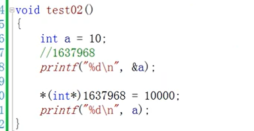

-------------------


### 3.4 指针做函数参数输入输出特性

输入特性：主调函数分配内存，被调函数使用

输出特性：被调函数分配内存，主调函数使用

==基底  被调函数==

#### 3.4.1 输入特性

```C
//栈区分配
void fun(char *p)
{
	//给p指向的内存区域拷贝内容
	strcpy(p, "helloabcde");
}

void test02(void)
{
	//栈上分配内存
	//输入，主调函数分配内存
	char buf[1024] = { 0 };
	fun(buf);
	printf("buf  = %s\n", buf);
}

//堆区分配
void printString(char * str)
{
	printf("%s\n", str);  
}
void test01()
{
	//堆区分配内存
	char * p = malloc(sizeof(char)* 64);
	memset(p, 0, 64);
	strcpy(p, "hello world");
	printString(p);
}
```


#### 3.4.2 输出特性


```C
void allocteSpace( char  ** p)
{
	char  * tempP =  malloc(sizeof(char)* 64);

	memset(tempP, 0, 64);
	strcpy(tempP, "hello world!!!");
	*p = tempP;

}

void test03()
{
	char *p = NULL;
	allocteSpace(&p);
	printf("%s\n", p);
	if (p!=NULL)
	{
		free(p);
	}
	p = NULL;
}
```


### 3.5 指针易错点

#### 3.5.1 指针越界

```C
void test01(){
	char buf[8] = "zhangtao";
	printf("buf:%s\n",buf);
}
```


#### 3.5.2 返回局部变量地址

```C
char *getString()
{
	char str[] = "abcdedsgads"; // 栈区，
	printf("getString - str = %s\n", str);
	return str;
}
void test02()
{
    char * str = getString();
    printf("test - str = %s\n", str);
}
```


#### 3.5.3 同一块内存释放多次

```C
void test03()
{
    char *p = malloc(sizeof(char) * 64);
	free(p);    // 野指针
	free(p);
}
```


#### 3.5.4 释放偏移后的指针

```C
void test04()
{
	char str[] = "hello world";
	char *p = malloc(64);
	for (int i = 0; i <= strlen(str); i++)
	{
		*p = str[i];
		++p;          
	}
	free(p);  // p已经不是指向堆中开辟的那一片地址的首地址了
}
```

解决方法:   **操作临时变量**

```c
void test05()
{
    char *p = malloc(sizeof(char *) * 64);
    char *temp = p;
    for (int i = 0; i < 10; i++)
    {
        *temp = i + 97;
        printf("%c\n", *temp);
        temp++;
    }
    if (p)
    {
        free(p);
        p = NULL;
    }
}

//结果:
a       b       c       d       e       f       g       h       i       j
```

**常见ascill码 :   a 97   A65    048**


### 3.6 二级指针输出输出特性

#### 3.6.1 二级指针输入特性

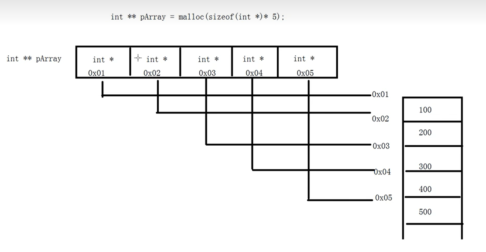

```C
// 打印数组
void printArray(int **arr , int len)
{
	
	for (int i = 0; i < len; i++)
	{
		printf("数组中第%d个元素的值为%d \n", i + 1, *arr[i]);  //值
	}
}

//堆区开辟空间
void test01()
{
	int ** pArray = (int **)malloc(sizeof(int *)* 5); //堆区开辟空间  
    												// 二级指针分配内存
    												// malloc(sizeof(int *)* 5)表示
										            // 开辟的是一维数组指针
	//在栈中分配数据
	int  a1 = 100;
	int  a2 = 200;
	int  a3 = 300;
	int  a4 = 400;
	int  a5 = 500;

	pArray[0] = &a1;
	pArray[1] = &a2;
	pArray[2] = &a3;
	pArray[3] = &a4;
	pArray[4] = &a5;

    // int len = sizeof(pArray)/ sizeof(int *)  err 4/ 4 = 1 // sizeof(pArray)-->计算int * 大小
	int len = 5; 
	printArray(pArray, len);
/*
void printArray(int **arr , int len)  // 二级传二级 相当于按值传递 //此时 aar 就相当于一个二级指针
									  // int ** p[]=  [int* int* int* int* int*]
{
	
	for (int i = 0; i < len; i++)
	{
		printf("数组中第%d个元素的值为%d \n", i + 1, *arr[i]);    //  arr[i] 是 int* 类型
	}
}
*/

	//释放堆区空间
	if (pArray != NULL)
	{
		free(pArray);
		pArray = NULL;
	}

}
```


int *p:一级指针，表示p所指向的地址里面存放的是一个int类型的值

int **p:二级指针，表示p所指向的地址里面存放的是一个指向int类型的指针（即p指向的地址里面存放的是一个指向int的一级指针）

```c
int a = 10;
int   * q; //指针p指向 int类型      // 一级指针 指向 普通类型的地址 或者 一级指针指向一级
int * * p; //指针p指向int * 类型    // 二级指针 指向 一级指针的地址 或者 二级指针指向二级
								  // 同级指向 有时不用解引用 --> 相当于不考虑实参的类型

q = &a;  //q 指向 a
p = &q;   //p 指向q， q是一个int类型指针

// 一级指针解引用等于值   
// 二级指针解引用等于一级指针
```


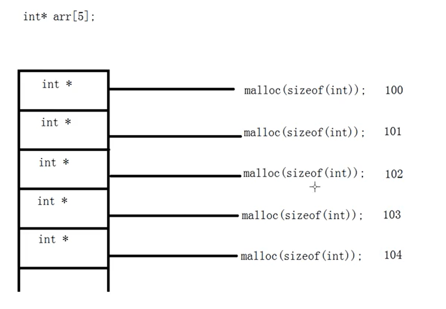

```c
//在栈上开辟空间
void test02()
{
	int * pArray[5]; //开辟到栈中    //表示 指针类型的数组  [int* int* int* int* int*]

 	for (int i = 0, j = 0; i < 5; i++, j++)
    {
        if (j < 4)
        {
            pArray[j] = (int *)malloc(4); //代表申请4个字节的内存空间
            *(pArray[j]) = j + 100;
        }
        else
            pArray[j] = &a;
    }

    // int len = sizeof(pArray)/ sizeof(int *) ok 20 / 4 = 5  //sizeof(pArray)-->计算整个数组大小
	// 打印数组  
    printArray(pArray, len); ok   // 数组名就表示首地址 
/*
void printArray(int **arr, int len)   // 一级传二级 相当于按指针传递  //此时 aar 就相当于 一个一级指针 // int * p[] =  [int* int* int* int* int*]

    for (int i = 0; i < len; i++)   
    
        printf("数组中第%d个元素的值为%d \n", i + 1, *arr[i]); //arr也是个int* , arr[i] 存的的 int * 一级指针解引用等于值
    }
}
*/
	//释放堆区空间
	for (int i = 0; i < 5;i++)
	{
		if (pArray[i] != NULL)
		{
			free(pArray[i]);
			pArray[i] = NULL;
		}
	}
}
```

--------

```c
int a = 15;
int *pArray[5]; //开辟到栈中  // 指针类型的数组  [int* int* int* int* int*]
pArray[1] = &a;  // 一级指针指向 一般类型的地址
printf("数组元素:%d\n", *pArray[1]); //值   // 一级指针解引用等于值   // 二级指针解引用等于一级指针

// 输出 15
```


------


#### 3.6.2 二级指针输出特性

```C
void allocateSpace(int ** p)
{
	int *arr = malloc(sizeof(int)* 10);
	for (int i = 0; i < 10;i++)
	{
		arr[i] = i;
	}
	*p = arr;
}

// 堆区 
void printArray(int ** arr, int len) //  一级传二级 相当于按指针传递   // int *p[] = [1 2 3 4 5 ]
{
	for (int i = 0; i < len;i++)
	{
		printf("%d\n", (*arr)[i]);  // *arr表示解引用 // arr[i] 存储的是 int //[]的优级高于* //  先解引用 找到数组 再 取出元素   // 一级指针得到自身数据解引用是必须的,再考虑优先级问题
	}
}
/*
// 或者  直接用同级指针, 不考虑实参类型
void printArray(int * arr, int len)
{
	for (int i = 0; i < len;i++)
	{
		printf("%d\n", arr[i]); 
	}
}
*/

void freeSpace(int ** arr)
{
	if (*arr!=NULL)
	{
		free(*arr);
		*arr = NULL;
	}
}


//  直接用同级指针
void  freeSpace2(int * arr)
{
    if (arr!=NULL)
	{
		free(arr);
		arr = NULL;
	}
}

void test01()
{
	int * p = NULL;
	allocateSpace(&p);    //得到动态 int *p[] = [1 2 3 4 5]


	printArray(&p, 10);  

	freeSpace(&p);      // 空指针
	//freeSpace2(p);    // 野指针  // 因为是按值传递的
	if (p == NULL)
	{
		printf("数组指针已经置空\n");
	}
}
```

------

#### 二维指针创建数组储存数据

```c
//一级指针可以存放多个普通变量int*p-->p[i];
//二级指针可以存放多个一级指针int **p-->(*p)[j]，次方型增长 
#include<stdio.h>
#include<string.h>
#include<stdlib.h>
int **createArray2D(int row, int cols)
{
	//int *parray = (int*)malloc(sizeof(int*)*cols);  //一级指针分配内存
	int **pArray = (int**)malloc(sizeof(int*)*row);//二级指针分配内存
	if (pArray == NULL)
		return NULL;
	for (int i = 0; i < row; i++)
	{
		//一级指针
		pArray[i] = (int*)malloc(sizeof(int)*cols);
	}
	return pArray;
}
int main()
{
	int **p = createArray2D(4,3);//制作出三行四列的数组
	for (int i = 0; i < 4; i++)
	{
		for (int j = 0; j < 3; j++)
		{
           p[i][j] = i*j;
		   printf("%d\t",p[i][j]);
		}
		printf("\n");
 
	}
 
	//int *pArray=(指针的类型)malloc(sizeof(指针指向的类型)*创建量)
	//指针类型：去除变量名+*：int*;
	//指针指向类型，去除变量名：int
	int(*pp)[4] = (int(*)[4])malloc(sizeof(int[4]) * 3);
	for (int i = 0; i < 3; i++)
	{
		for (int j = 0; j < 4; j++)
		{
			pp[i][j] = i*j;
			printf("%d\t", pp[i][j]);
		}
		printf("\n");

	}
	return 0;
}
```

**总结:  **

**同级传递 因为不是传的地址,所以不一定需要解引用,     如果是动态数组看元素是什么类型,不考虑实参类型了**

-----


###  3.7指针总结

```c
// 一级指针 指向 普通类型的地址 或者 一级指针指向一级
// 二级指针 指向 一级指针的地址 或者 二级指针指向二级
// 同级指向 用不用解引用看具体情况 --> 如果是动态数组看元素是什么类型,不考虑实参类型了
// 一级指针解引用等于值   
// 二级指针解引用等于一级指针

// 指针名 表示地址  //字符串指针名表示首地址但是直接输出指针名输出就是字符串
--------------
指针初始化 : int *p = 必须是地址;   // 普通类型必须是间接 .  数组和字符串常量可以直接
指针赋值: 必须是已分配了内存的指针(给他一个地址就是给他申请过的内存空间)   *p = 10;
指针置空: p = NULL;
-------------
形参类型设置:
对  int(取地址 &int) ---> int*
对  int * (取地址 &int *) -----> int **

数组:
数组名一般情况下是 首地址, 指针类型 及 arr <--> int * 类型
int arr[] = {1,2,3,4,5};
int *p = arr;  -----> p 就是arr   p[1] = arr[1]
对 &p  ----> &arr 可以推出 arr是数组指针-----> *p 就是 arr    (*p)[1] = arr[1]
    
字符串:
char * p = "dsgja";
```


--------------


## 4 位运算


### 4.1 数据的存储方式


#### 4.1.1 printf格式化输出

作用：利用printf输出不同进制下的数字

```C
void test01()
{
	int a = 10;

	printf("十进制：%d\n", a);
	printf("八进制：%#o\n", a);
	printf("十六进制：%#x\n", a);
	printf("十六进制：%#X\n", a);
}

void test02()
{
	int a = 123;		//十进制方式赋值
	int b = 0123;		//八进制方式赋值， 以数字0开头
	int c = 0xabc;	    //十六进制方式赋值

	printf("十进制：%d\n", a);
	printf("八进制：%#o\n", b);	//%o,为字母o,不是数字
	printf("十六进制：%#x\n", c);
}
```


#### 4.1.2  存储方式

##### 4.1.2.1存数据

在计算机中，数据有三种表现形式，分别为：原码、反码、补码

* 原码：最高位为符号位，0代表正，1代表负
* 反码：无符号或正数，原码 = 反码；负数反码 = 原码符号位不变，其余为取反
* 补码：无符号或正数，原码 = 反码； 负数补码 = 反码+1

**注：计算机存放数据都是用补码形式**


**总结：**

* 无符号数以及有符号数的正数  源码 = 反码 = 补码
* 符号数 **负数  反码 = 原码取反（不包括符号位）   补码 = 反码 + 1**  


##### 4.4.2.2 补码意义

* 统一了零的编码

| **十进制数** | **原码**  |
| ------------ | --------- |
| +0           | 0000 0000 |
| -0           | 1000 0000 |

| **十进制数** | **反码**  |
| ------------ | --------- |
| +0           | 0000 0000 |
| -0           | 1111 1111 |

| **十进制数** | **补码**                                              |
| ------------ | ----------------------------------------------------- |
| +0           | 0000 0000                                             |
| -0           | 10000 0000由于只用8位描述，最高位1丢弃，变为0000 0000 |


* 将减法运算转变为加法运算

  例如： 9 - 6

| **十进制数** | **原码**  |
| ------------ | --------- |
| 9            | 0000 1001 |
| -6           | 1000 0110 |

如果用原码计算：

| 0000 1001   |
| ----------- |
| 1000 0100 + |
| 1000 1111   |

结果： 9 - 6 = -15不正确


利用补码进行计算

| **十进制数** | 补码       |
| ------------ | ---------- |
| 9            | 0000  1001 |
| -6           | 1111  1010 |

| 0000 1001   |
| ----------- |
| 1111 1010 + |
| 10000 0011  |

最高位的1溢出，剩余8位二进制表示为3，结果正确


##### 4.1.2.3 取数据

1. 无符号取数据： %u %lu   %llu  %o  %x  ...
2. 有符号取数据： %d  %ld  %lld  %f  %llf ...


**取数据步骤：**

* 高位如果是0， 代表正数   原码 = 反码 = 补码 ，原样输出
* 高位如果是1， 代表**负数 补码的 符号位不变，其余位取反 + 1**


注：**程序中的八进制和十六进制的数据，不用考虑正负，按照无符号对待**

相关案例：

  **结论:   一个16进制数  =  4个二进制的数  // 8个二进制数 =  1字节**


```C
void test01()
{
	char num = -15;
	//原码  1000 1111
	//反码  1111 0000
	//补码  1111 0001
    
	//有符号输出 
    //补码  1111 0001
    //原码  1000 1111
	printf("%d\n", num);   // -15

	//无符号输出
    //补码  1111 0001
    //原码  1111 0001
	printf("%u\n", num & 0x000000ff);
	//编译器自动让结果与 前3个字节为1 的数字 做了按位或操作
	/*
		0000 0000 0000 0000 0000 0000 1111 0001  反码
		1111 1111 1111 1111 1111 1111 0000 0000 |
		1111 1111 1111 1111 1111 1111 1111 0001  结果
	*/
}

void test02()
{

	char num = 0x9b;  // 16转2进制 这个就是 1001  1011  就是补码 
	//计算机原样存储  
    
	// 有符号取
	// 补码 1001  1011
	//变回去 原码 1110  0101  =  -（64 + 32 + 4 + 1） = - 101
	printf("%d\n", num);

	//无符号取
	printf("%x\n", num & 0x000000ff); //9b
	printf("%u\n", num & 0x000000ff); // 128 + 16 + 8 + 2 + 1 = 155
}
```

---------------------


#####  总结

一共有多少二进制位数要看具体情况   如: 类型 char 1位 --->8个二进制个数

```c
负数(高位1):   反码(符号位不变) + 1;
无符号取/正数/八进制 十六进制的数据:  原反补都相同
如果八进制,十六进制的数据 要用有符号取, 就需要考虑正负了
```

**使用计算器:**

+ 有符号去看高位,0用最高位判断正负, 按在计算机上最高位都用0
+ 无符号最高位是多少, 按在计算机上最高位就用多少


-----------


### 4.2 位运算

#### 4.2. 1 重要公式

+ 将X最右边的n位清零：x & (~0 << n)
+ **获取x的第n位值：(x >> n) & 1**   (要把出输出位以外 及左边变成0, 因为 0000 0001 ---> 1 , 0000 0000 -->0 从而达到输出 )
+ 获取x的第n位的幂值：x & (1 << n)
+ 仅将第n位置为1：x | (1 << n)     （要置1的位, 用1置1）
+ 仅将第n位置为0：x & (~(1 << n))  (要清零的位, 用0清0)
+ 将x最高位至第n位（含）清零：x & ((1 << n) - 1)
+ 将第n位至第0位（含）清零：x & (~((1 << (n + 1)) - 1))

--------------

**扩展:** 

寄存器特定位改变而不影响其他位，构造合适的1和0组成的数和这个寄存器原来的值位与、位或、位取反

- 特定位清零用 & （用0清零）

  - 与1位与无变化、与0位与变为0

  - **要清零的位为0，其他位为1，然后这个数与原数位与**

  - 举例：原32位寄存器的值位0xAAAAAAAA,对bit2~bit8清零

  - **不变的四位为F,    F---> 1111 结果要写成16进制**

    0xAAAAAAAA & 0xFFFFF  E03

- 特定位置1用 | （用1置1）

  - 与1位或为1，与0位或无变化

  - **要置1的位为1，其他位为0，然后这个数与原数位或**

  - 举例：原32位寄存器的值位0xAAAAAAAA,对bit8~bit15置1

    0xAAAAAAAA | 0x0000FF00

- 特定位取反用^ (用1取反)

  - 与1位异或为会取反，与0位异或无变化

  - **要取反的位为1，其他位为0，然后这个数与原数位异或**

  - 举例：原32位寄存器的值位0xAAAAAAAA,对bit8~bit15取反

    0xAAAAAAAA ^ 0x0000FF00

----

判断奇偶
(x & 1) == 1 ---等价---> (x % 2 == 1)    奇数
(x & 1) == 0 ---等价---> (x % 2 == 0)    偶数

x / 2 ---等价---> x >> 1
x &= (x - 1) ------> 把x最低位的二进制1给去掉
x & -x -----> 得到最低位的1
x & ~x -----> 0

1. 除：n / (2^i) 等价于 n >> i, 右移
2. **乘**：n * (2^i) 等价于 n << i 其中^代表幂  , **左移**    //  顶掉一些位
3. 取模：a % (2^n) 等价于 a & (2^n - 1)

---------------------

#### 4.2.2 位运算符

1. 按位取反 ==~==，对每个二进制位进行取反，**0变1,1变0**
2. 位与 ==&==，   同真为真，其余为假    **有0则0**
3. 位或 ==|==，    同假为假，其余为真  ,   **有1就1**
4. 位抑或 ==^==，相同为假，不同为真    **相同为0，不同为**1：

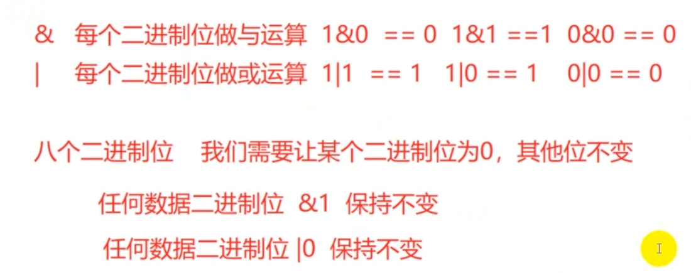

```C
//1. 按位取反 ~
void test01()
{
	int number = 2;
    //源码 0000 .... 010
    // 补码  0000 .... 010
    //取反  1...101  
    // 有符号取
    // 补码 1...101  负
    // 源码  1...011 ---> -3
	printf("~number : %d\n", ~number);   -3

        
	int num = -2;
    // 补 1110
    // 取反 0001
	// 有符号取
    // 原码 0001 ---> 1
	printf("%d\n", ~num);  1
}

//2. 位与 &
void test02()
{
	int number = 332;
	if ((number & 1) == 0)
	{
		printf("%d是偶数!\n",number);
	}
	else
	{
		printf("%d是奇数!\n",number);
	}

	//number = number & 0;
	number &= 0;
	printf("number:%d\n", number);
}

//3. 位或 |
void test03()
{
	int num1 = 5;
	int num2 = 3;

	printf("num1 | num2 = %d\n", num1 | num2);
}

//4 位抑或 ^
void test04()
{
	int num1 = 5;
	int num2 = 10;
    
	printf("num1:%d num2:%d\n", num1, num2);

	num1 = num1 ^ num2;
	num2 = num1 ^ num2;
	num1 = num1 ^ num2;

	printf("num1:%d num2:%d\n",num1,num2);
}
```


#### 4.2.3 移位运算符

1. **左移 <<**，**移位右边补0**,   按二进制形式把所有的数字向左移动对应的位数，高位移出(舍弃)，低位的空位补 0。

2. **右移 >>**，  **移位左边补0**, 按二进制形式把所有的数字向右移动对应位移位数，低位移出(舍弃)，高位的空位补符号位

   **左移运算符 左移几位就相当于乘以2的几次方  **
   
   **正数右移操作的效果是这个数除以2的几次方**

```C
//左移运算符 左移几位就相当于乘以2的几次方  
void test05()
{
	int number = 30;
	printf("number = %d\n", number <<= 2);  // 120
	printf("number = %d\n", number >>= 1);  // 右移除
}
```

注： 右移运算，对于无符号数据，高位用0填补，有符号正数用0，负数有些计算机系统用0，有些用1，不是绝对

----------


## 5 数组进阶

### 5.1 一维数组与数组名

数组定义：一片**连续内存空间里，放相同类型的数据元素**

结论： **一维数组数组名除了两种特殊情况外，其余时候可以理解为指向第一个元素的指针**

特殊情况：

* sizeof数组名 :          1、当sizeof数组名时候，统计是整个数组的大小
* 对数组名取地址:    2、当对数组名 取地址的时候,  步长跳越的整个数组长度. 但是开始指向也是首地址  // &arr专属名词 数组指针

```C
void printArray( int arr[] , int len)   // int arr[] ====  int * arr 前者可读性高
{
	for (int i = 0; i < len;i++)
	{
		printf("%d\n", arr[i]); 
	}
}

void test01()
{

	int arr[5] = { 1, 2, 3, 4, 5 };

	//1、当sizeof数组名时候，统计是整个数组的大小
	printf("sizeof(arr) = %d\n", sizeof(arr));

	//2、当对数组名 取地址的时候
	printf("%d\n", &arr);    // arr --> int*  ---> &arr --> int** 
	printf("%d\n", &arr + 1); //步长 跳越的整个数组长度

	//除了以上两种情况外 ， 数组名都指向数组中的首地址
	int * p = arr; // 直接对int*p进行赋值，也不会报错
	
	//数组名 是个指针常量  // 故指向针不能改, 指向的值可以改
	//arr = NULL;  //err
    // *arr = 10;  //ok
    
	int len = sizeof(arr) / sizeof(int);
	printArray(arr, len);
   // printArray(p, len);  // 一样的
    
	//数组下标是否可以为负数?
	p = p + 3;
	printf("p[-1] = %d\n", p[-1]);
	//上述代码等价于
	printf("p[-1] = %d\n",  *(p-1) );
}
```


### 5.2 数组指针 定义方式

**对于数组取地址**

数组指针的定义方式：

1. 先定义出数组的类型，再定义数组指针变量
2. 先定义数组指针的类型，再定义数组指针变量
3. 直接定义数组指针变量


```C
//1、先定义出数组的类型，再定义数组指针变量
void test01()
{
	int arr[] = { 1, 2, 3, 4, 5 };

	typedef int(ARRAY_TYPE)[5]; //ARRAY_TYPE是一个数据类型，存放5个int元素的数组的类型
	ARRAY_TYPE * arrP = &arr; //arrP就是数组指针  // &arr数组指针

	// *arrP 就是是 arr

	for (int i = 0; i < 5;i++)
	{
		printf("%d\n", (*arrP)[i]);
		// 本质printf("%d\n", *((*arrP)+i)  );
	}
}

//2、先定义数组指针的类型，再定义数组指针变量
void test02()
{
	int arr[] = { 1, 2, 3, 4, 5 };

	typedef int(*ARRAY_TYPE)[5];

	// *arrP 是 arr
	ARRAY_TYPE arrP = &arr;

	for (int i = 0; i < 5; i++)
	{
		printf("%d\n", (*arrP)[i]);
		printf("%d\n", *((*arrP) + i));
	}
}

//3、直接定义数组指针变量
void test03()
{
	int arr[] = { 1, 2, 3, 4, 5 };

	int(*p)[5]  = &arr;   // 数组指针

	//*p -> arr
	for (int i = 0; i < 5; i++)
	{
		printf("%d\n", (*p)[i]);
	}
}
```


---------------

### 5.3 二维数组与数组名

知道一维数组数组名的意义后，我们应该能够推到出二维数组数组名的意义了

**二维数组名 等价于 一维数组的指针**
**除了对二维数组名 sizeof  或者  取地址以外，那么二维数组名 都是指向第一个一维数组的首地址**

```C
void test01()
{
	int arr[3][3] = {  
		{1,2,3},
		{4,5,6},
		{7,8,9}
	};

	//int arr2[3][3] = { 1, 2, 3, 4, 5, 6, 7, 8, 9 };
	//int arr3[][3] = { 1, 2, 3, 4, 5, 6, 7, 8, 9 };    // 行数可以推导

	//二维数组名 等价与 一维数组的指针
	//除了对二维数组名 sizeof  或者  取地址以外，那么二维数组名 都是指向第一个一维数组的首地址 {1,2,3},

	int(*pArray)[3] = arr;

	//通过数组名 访问元素
	printf("arr[1][2] = %d\n", arr[1][2]);
	printf("arr[1][2] = %d\n", *(*(pArray + 1) + 2));
	printf("arr[1][2] = %d\n", *(*pArray + 5));
}


//二维数组做函数参数
//void printArray( int(*pArr)[3] ,int len1,int len2 )   // 推荐
//void printArray(int pArr[3][3], int len1, int len2)   // 推荐
void printArray(int pArr[][3], int len1, int len2)
{
	for (int i = 0; i < len1;i++)
	{
		for (int j = 0; j < len2;j++)
		{
			printf("%d ", pArr[i][j]);
			//printf("%d ",  *(*(pArr + i) + j) );
		}
		printf("\n");;
	}
}

void test02()
{
	int arr[3][3] = {
		{ 1, 2, 3 },
		{ 4, 5, 6 },
		{ 7, 8, 9 }
	};

	int row = sizeof(arr)/sizeof(arr[0]);
	int col = sizeof(arr[0]) / sizeof(int);
	printArray(arr, 3, 3);
    
/*
步长不同,  都是指向首地址
    &aar[0][0]  一个一个跳
    arr    跳一维 
    &arr   整个数组
*/    
}
```


## 6 结构体进阶

### 6.1 结构体基本使用

**结构体作用：**内置数据类型不够用的时候，我们可以利用**结构体创建自定义的数据类型**

下面案例中可以看出结构体的基本使用

```C
//推荐  // c++没必要的
typedef struct Person1
{
	char name[64];               //不要给自定义数据类型赋初始值，因为只是在做定义自定义数据类型  // 不可以放函数
	int age;              
}myPerson;  //给类型起别名

void test01()
{
	myPerson p1 = {"aaa",10};
}


----------------------------------------------------------
    
    

//在定义结构体的时候  顺便定义了一个结构体变量
struct Person2
{
	char name[64];
	int age;
}person2 = {"bbb",40};  //如果是变量 可以给初始化

void test02()
{
	person2.age = 20;
	strcpy(person2.name, "bbb");
}


----------------------------------------------------------


struct
{
	char name[64];
	int age;
}person3 = {"ddd",100};  
//定义一个结构体变量 person3，后面无法使用这个类型，而这个类型只有一个变量 

void test03()
{
	person3.age = 30;
	strcpy(person3.name, "ccc");
}


-----------------------------------------------------------
    

//结构体使用
struct Person
{
	char name[64];
	int age; //不要给自定义数据类型赋初始值，因为只是在做定义 自定义数据类型
};  

void test04()
{
	//在栈上使用
	struct Person p1 = { "aaa", 10 };
	printf("p1 姓名： %s  , 年龄:  %d \n", p1.name, p1.age);

	//在堆区使用   指针
	struct Person * p2 = malloc(sizeof(struct Person));
	p2->age = 20;
	strcpy(p2->name, "bbb");
	printf("p2 姓名： %s  , 年龄:  %d \n", p2->name, p2->age);

	free(p2);
	p2 = NULL;

}


-----------------------------------------------------------


void printPerson( struct Person personArr[], int len)
{
	for (int i = 0; i < len;i++)
	{
		printf("姓名： %s  , 年龄:  %d \n", personArr[i].name, personArr[i].age);
	}
}

//结构体变量数组 ----> 是数组, 不要用->取指向成员
void test05()
{
	//栈上分配内存
	struct Person persons[] =
	{
		{ "aaa", 10 },
		{ "bbb", 20 },
		{ "ccc", 30 },
		{ "ddd", 40 },
	};
	int len = sizeof(persons) / sizeof(struct Person);
	printPerson(persons, len);

    
	//堆区分配内存
	struct Person * personPoint = malloc(sizeof(struct Person) * 4);
	for (int i = 0; i < 4;i++)
	{
		sprintf(personPoint[].name, "name_%d", i);
		personPoint[i].age = i + 10;
	}

	printPerson(personPoint, 4);

	free(personPoint);
	personPoint = NULL;
}
```


### 6.2 结构体赋值问题以及解决

这设计到一个深浅拷贝的问题

#### 6.2.1 结构体不包含指针的情况

```C
struct Person
{
	char name[64];
	int age;
};

void test01()
{
	struct Person p1 = { "Tom", 18 };

	struct Person p2 = { "Jerry", 20 };

	p1 = p2; //逐字节的进行拷贝

	printf("P1 姓名 ： %s, 年龄： %d\n", p1.name, p1.age);
	printf("P2 姓名 ： %s, 年龄： %d\n", p2.name, p2.age);
}

```


6.2.2 结构体包含指针的情况

```C
struct Person2
{
	char * name;
	int age;
};

void test02()
{
	struct Person2 p1;
	p1.name =  malloc(sizeof(char)* 64);
	strcpy(p1.name, "Tom");
	p1.age = 18;

	struct Person2 p2;
	p2.name = malloc(sizeof(char)* 128);
	strcpy(p2.name, "Jerry");
	p2.age = 20;

	//赋值
	//p1 = p2;  // 会出错

	//解决方式  手动进行赋值操作
    //核心
	///////////////////////////////////  
	if (p1.name!=NULL)
	{
		free(p1.name);
		p1.name = NULL;
	}

	p1.name = malloc(strlen(p2.name) + 1);
	strcpy(p1.name, p2.name);

	p1.age = p2.age;

	////////////////////////////////////

	printf("P1 姓名 ： %s  年龄： %d\n", p1.name, p1.age);
	printf("P2 姓名 ： %s, 年龄： %d\n", p2.name, p2.age);

	//堆区开辟的内容 自己管理释放
	if (p1.name != NULL)
	{
		free(p1.name);
		p1.name = NULL;
	}

	if (p2.name != NULL)
	{
		free(p2.name);
		p2.name = NULL;
	}

}
```

**总结：当结构体中包含堆区的指针，要利用深拷贝解决浅拷贝的问题**


### 6.3 结构体偏移量

意义：**能够计算出结构体中属性相对于首地址的偏移量**

案例：

```C
#include <stddef.h>
struct Teacher
{
	char a;
	int b;
};

void test01(){

	struct Teacher  t1;
	struct Teacher*p = &t1;


	int offsize1 = (int)&(p->b) - (int)p;  //通过地址查看成员b 相对于结构体 Teacher的偏移量
	int offsize2 = offsetof(struct Teacher, b);//通过宏函数查看

	printf("offsize1:%d \n", offsize1); //打印b属性对于首地址的偏移量
	printf("offsize2:%d \n", offsize2);
}


-------------------------------------

//通过偏移量 打印成员数据
void test02()
{
	struct Teacher a = { 'a', 10 };
	//打印c2的数据
	printf("t.b = %d\n", *(int *)((char*)&a + offsetof(struct Teacher, b)));

	printf("t.b = %d\n", *(int*)((int *)&a + 1 ));
}


-----------------------------------------
    
    
    
//结构体嵌套结构体 计算偏移量方法
struct Teacher2
{
	char a;
	int  b;
	struct Teacher c;   // char a; int  b;
};

void test03()
{
	struct Teacher2 t = { 'a', 10, 'b', 20 };
	
    // t.c.a ----> 访问到 struct Teacher c 的 a
    // 通过地址偏移
	int offset1 = offsetof(struct Teacher2, c);
	int offset2 = offsetof(struct Teacher, b);

	printf("%d\n", *(int *)(((char*)&t + offset1) + offset2)); // 先找c再找c中的b

	printf("%d\n", ((struct Teacher2 *)((char *)&t + offset1))->b);
}
```


### 6.4 内存对齐

#### 6.4.1 内存对齐意义

==内存的最小单元是一个字节==

**CPU实际上将内存当成多个块，每次从内存中读取一个块，这个块的大小可能是2、4、8、16等**，

我们来分析下非内存对齐和内存对齐的优缺点在哪？

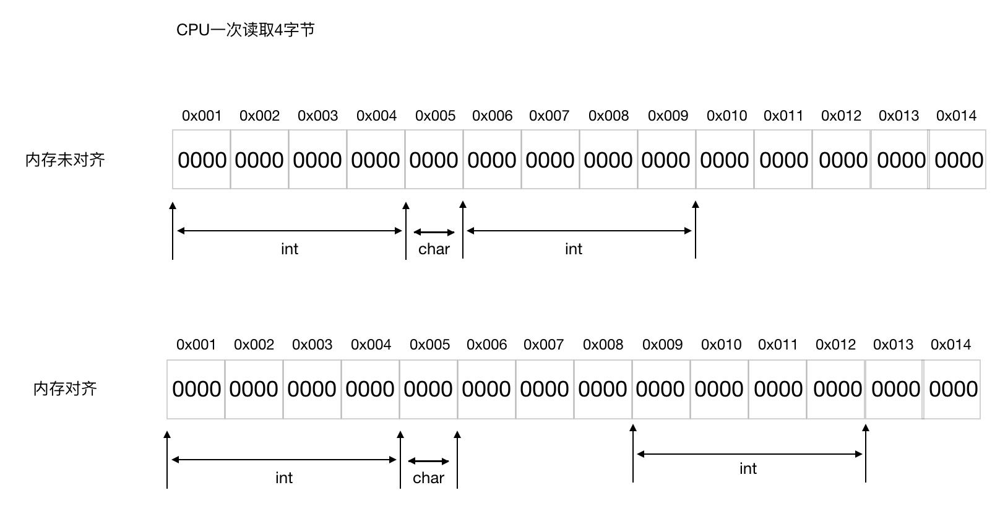


如果没有对齐，为了访问一个变量可能产生二次访问。

**有了内存对齐，可以提高操作系统访问内存的效率。  以空间换时间**

----------------------


#### 6.4.2 自定义类型(结构体)对齐计算规则

原则:

1.  第一个属性 从偏移量0位置开始存储
2. 第二个属性开始，放在 min( 该类型的大小 ,对齐模数) 的整数倍上
3. 整体计算完毕后算总大小，结构体总大小必须是 min( 该结构体中最大数据类型 , 对齐模数) 整数倍,不足要补齐

`#pragma pack(show) `可以查看对齐模数默认8

练习：

```C
struct Student{
	int a;       // 0 -3
	char b;      // 4-7
	double c;    // 8-15
	float d;     //16-19     --23
};

void test01()
{
	printf("sizeof = %d\n", sizeof(struct Student));   // 大小是 24
}


//2、结构体嵌套结构体， 按照子结构体最大的类型计算
struct Student2
{
	char a; 
	struct Student b;  //找struct Student最大的类型  8 - 31
	double c; 
};

void test02()
{
	printf("sizeof = %d\n", sizeof(struct Student2));
}
```


在用sizeof[运算符](https://so.csdn.net/so/search?q=运算符&spm=1001.2101.3001.7020)求算某结构体所占空间时，并不是简单地将结构体中所有元素各自占的空间相加，这里涉及到内存字节对齐的问题。从理论上讲，对于任何变量的访问都可以从任何地址开始访问，但是事实上不是如此，实际上访问特定类型的变量只能在特定的地址访问，这就需要各个变量在空间上按一定的规则排列，而不是简单地顺序排列，这就是内存对齐。

   内存对齐的原因：

   1)某些平台只能在特定的地址处访问特定类型的数据；

   2)提高存取数据的速度。比如有的平台每次都是从偶地址处读取数据，对于一个int型的变量，若从偶地址单元处存放，则只需一个读取周期即可读取该变量；但是若从奇地址单元处存放，则需要2个读取周期读取该变量。

　　在C99标准中，对于内存对齐的细节没有作过多的描述，具体的实现交由编译器去处理，所以在不同的编译环境下，内存对齐可能略有不同，但是对齐的最基本原则是一致的，对于[结构体](https://so.csdn.net/so/search?q=结构体&spm=1001.2101.3001.7020)的字节对齐主要有下面两点：

   1)结构体每个成员相对结构体首地址的偏移量(offset)是对齐参数的整数倍，如有需要会在成员之间填充字节。编译器在为结构体成员开辟空间时，首先检查预开辟空间的地址相对于结构体首地址的偏移量是否为对齐参数的整数倍，若是，则存放该成员；若不是，则填充若干字节，以达到整数倍的要求。

   2)结构体变量所占空间的大小是对齐参数大小的整数倍。如有需要会在最后一个成员末尾填充若干字节使得所占空间大小是对齐参数大小的整数倍。

 　注意：在看这两条原则之前，先了解一下对齐参数这个概念。对于每个变量，它自身有对齐参数，这个自身对齐参数在不同编译环境下不同。下面列举的是两种最常见的编译环境下各种类型变量的自身对齐参数


　　从上面可以发现，在windows(32)/VC6.0下各种类型的变量的自身对齐参数就是该类型变量所占字节数的大小，而在linux(32)/GCC下double类型的变量自身对齐参数是4，是因为linux(32)/GCC下如果该类型变量的长度没有超过CPU的字长，则以该类型变量的长度作为自身对齐参数，如果该类型变量的长度超过CPU字长，则自身对齐参数为CPU字长，而32位系统其CPU字长是4，所以linux(32)/GCC下double类型的变量自身对齐参数是4，如果是在Linux(64)下，则double类型的自身对齐参数是8。

　　除了变量的自身对齐参数外，还有一个对齐参数，就是每个编译器默认的对齐参数#pragmapack(n)，这个值可以通过代码去设定，如果没有设定，则取系统的默认值。在windows(32)/VC6.0下，n的取值可以为1、2、4、8，默认情况下为8。在linux(32)/GCC下，n的取值只能为1、2、4，默认情况下为4。注意像DEV-CPP、MinGW等在windows下n的取值和VC的相同。

　　了解了这2个概念之后，可以理解上面2条原则了。对于第一条原则，每个变量相对于结构体的首地址的偏移量必须是对齐参数的整数倍，这句话中的对齐参数是取每个变量自身对齐参数和系统默认对齐参数#pragma pack(n)中较小的一个。举个简单的例子，比如在结构体A中有变量int a，a的自身对齐参数为4（环境为windows/vc），而VC默认的对齐参数为8，取较小者，则对于a，它相对于结构体A的起始地址的偏移量必须是4的倍数。

　　对于第二条原则，结构体变量所占空间的大小是对齐参数的整数倍。这句话中的对齐参数有点复杂，它是取结构体中所有变量的对齐参数的最大值和系统默认对齐参数#pragma pack(n)比较，较小者作为对齐参数。举个例子假如在结构体A中先后定义了两个变量int a;double b;对于变量a，它的自身对齐参数为4，而#pragma pack(n)值默认为8，则a的对齐参数为4；b的自身对齐参数为8，而#pragma pack(n)的默认值为8，则b的对齐参数为8。即结构体内的每个遍历也要取自身的对齐参数和默认对齐参数比较，取较小者作为这个变量的对齐参数。由于a的最终对齐参数为4，b的最终对齐参数为8，那么两者较大者是8，然后再拿8和#pragma pack(n)作比较，取较小者作为对齐参数，也就是8，即意味着结构体最终的大小必须能被8整除。

下面是测试例子：

注意：以下例子的测试结果均在windows(32)/VC下测试的，其默认对齐参数为8 


```cpp
#include <iostream>
using namespace std;
//#pragma pack(4)    //设置4字节对齐 
//#pragma pack()     //取消4字节对齐 
 
typedef struct node1
{
	int a; // 0-3
	char b; //  min(1, 8) = 1    // n * 1 > 3 // 4 
	short c; // min(2, 8) = 2    // n * 2 > // 6 - 7
}S1;
//  min(4, 8) = 4   // n * 4 > 7 所以 8
 
typedef struct node2
{
	char a; // 0
	int b;  // 4/8=4  //4-7
	short c; // 2/8=2 // 8-9
}S2;
// 4/8=4 // n * 4 > 9 所以 12
 
typedef struct node3
{
	int a;  // 0 - 3
	short b;  // 2/8=2 // 2*n > 3 // 4 - 6 
	static int c; // 4/8=4 // 4*n > 4 // 8 - 11 
}S3;
// 4/8=4   // 4*n > 11  所以 12
 
typedef struct node4
{
	bool a;
	S1 s1;
	short b;
}S4;
 
typedef struct node5
{
	bool a;
	S1 s1;
	double b;
	int c;
}S5;
 
 
 
int main(int argc, char *argv[])
{
	cout<<sizeof(char)<<" "<<sizeof(short)<<" "<<sizeof(int)<<" "<<sizeof(float)<<" "<<sizeof(double)<<endl;
	S1 s1;
	S2 s2;
	S3 s3;
	S4 s4;
	S5 s5;
	cout<<sizeof(s1)<<" "<<sizeof(s2)<<" "<<sizeof(s3)<<" "<<sizeof(s4)<<" "<<sizeof(s5)<<endl;
	return 0;
}
```

```cpp
1 2 4 4 8
8 12 8 16 32
下面解释一下其中的几个结构体字节分配的情况
```

比如对于node2

```cpp
typedef struct node2
{
    chara;
    intb;
    shortc;

}S2;
```


sizeof(S2)=12;

对于变量a，它的自身对齐参数为1，#pragma pack(n)默认值为8，则最终a的对齐参数为1，为其分配1字节的空间，它相对于结构体起始地址的偏移量为0，能被4整除；

　　对于变量b，它的自身对齐参数为4，#pragma pack(n)默认值为8，则最终b的对齐参数为4，接下来的地址相对于结构体的起始地址的偏移量为1，1不能够整除4，所以需要在a后面填充3字节使得偏移量达到4，然后再为b分配4字节的空间；

　　对于变量c，它的自身对齐参数为2，#pragma pack(n)默认值为8，则最终c的对齐参数为2，而接下来的地址相对于结构体的起始地址的偏移量为8，能整除2，所以直接为c分配2字节的空间。

　　此时结构体所占的字节数为1+3+4+2=10字节

　　最后由于a，b，c的最终对齐参数分别为1，4，2，最大为4，#pragmapack(n)的默认值为8，则结构体变量最后的大小必须能被4整除。而10不能够整除4，所以需要在后面填充2字节达到12字节。其存储如下：

```cpp
　 |char|----|----|----|  4字节

   |--------int--------|  4字节

   |--short--|----|----|  4字节
```

总共占12个字节

对于node3，含有静态数据成员 

```cpp
typedef struct node3
{
    int a;
    short b;
    static int c;
}S3;
```

　则sizeof(S3)=8.这里结构体中包含静态数据成员，而静态数据成员的存放位置与结构体实例的存储地址无关(注意只有在C++中结构体中才能含有静态数据成员，而C中结构体中是不允许含有静态数据成员的)。其在内存中存储方式如下：

```cpp
　　|--------int--------|   4字节


　　|--short-|----|----|    4字节
```

　而 变量 c 是单独存放在静态数据区的，因此用 siezof 计算其大小时没有将 c 所占的空间计算进来。

而对于node5，里面含有结构体变量


```cpp
typedef struct node5
{
    bool a;
    S1 s1;
    double b;
    int c;
}S5;
 
```

sizeof(S5)=32。

　　对于变量a，其自身对齐参数为1，#pragma pack(n)为8，则a的最终对齐参数为1，为它分配1字节的空间，它相对于结构体起始地址的偏移量为0，能被1整除；

　　对于s1，它的自身对齐参数为4（对于结构体变量，它的自身对齐参数为它里面各个变量最终对齐参数的最大值），#pragma pack(n)为8，所以s1的最终对齐参数为4，接下来的地址相对于结构体起始地址的偏移量为1，不能被4整除，所以需要在a后面填充3字节达到4，为其分配8字节的空间；

　　对于变量b，它的自身对齐参数为8，#pragma pack(n)的默认值为8，则b的最终对齐参数为8，接下来的地址相对于结构体起始地址的偏移量为12，不能被8整除，所以需要在s1后面填充4字节达到16，再为b分配8字节的空间；

　　对于变量c，它的自身对齐参数为4，#pragma pack(n)的默认值为8，则c的最终对齐参数为4，接下来相对于结构体其实地址的偏移量为24，能够被4整除，所以直接为c分配4字节的空间。

　　此时结构体所占字节数为1+3+8+4+8+4=28字节。

　　对于整个结构体来说，各个变量的最终对齐参数为1，4，8，4，最大值为8，#pragma pack(n)默认值为8，所以最终结构体的大小必须是8的倍数，因此需要在最后面填充4字节达到32字节。其存储如下：


```cpp
 　　|--------bool--------|   4字节
 　　|---------s1---------|   8字节
 　　|--------------------|    4字节
 　　|--------double------|   8字节
 　　|----int----|---------|    8字节 
```


　　另外可以显示地在程序中使用#pragma pack(n)来设置系统默认的对齐参数，在显示设置之后，则以设置的值作为标准，其它的和上面所讲的类似，就不再赘述了，读者可以自行上机试验一下。如果需要取消设置，可以用#pragma pack()来取消。

当把系统默认对齐参数设置为4时，即#pragma pack(n)

输出结果是：

```cpp
1 2 4 4 8
8 12 8 16 24 
```


---------------

## 7 文件读写

### 7.1 文件基本概念

#### 7.1.1 文件的 IO 基本概念  

数据源的一种，最主要的作用是保存数据，如word、txt、头文件、源文件、exe等

| 文件的IO操作 |        |      |        |
| ------------ | ------ | ---- | ------ |
| 文件中的   I | input  | 输入 | 读文件 |
| 文件中的   O | output | 输出 | 写文件 |

#### 7.1.2 文件的分类

文件可以分为

* 磁盘文件
* 设备文件

**磁盘文件：** 

* 磁盘文件是计算机里的文件。存储信息不受断电的影响，存取速度相对于内存慢得多了

**设备文件：**

 * 操作系统中把每一个与主机相连的输入、输出设备看作是一个文件
 * 例如 显示器称为标准输出文件, 键盘称为标准输入文件

#### 7.1.3 磁盘文件的分类

计算机的存储在物理上是二进制的，所以物理上所有的磁盘文件本质上都是一样的：以字节为单位进行顺序存储。

从用户或操作系统的角度，将文件分为：

* 文本文件
* 二进制文件

**文本文件：**

* 基于字符编码，常见的编码有ASCII、UNICODE等
* 一般可以使用文本编辑器直接打开
* 如数字5678的存储形式 (ASCII码)为： 00110101 00110110 00110111 00111000

**二进制文件：**

* 基于值编码,自己根据具体应用,指定某个值是什么意思
* 把内存中的数据按其在内存中的存储形式原样输出到磁盘上
* 如数5678的存储形式(二进制码)为：00010110  00101110

### 7.2 文件指针

在C语言中，操作文件之前必须先打开文件；所谓“打开文件”，就是让程序和文件建立连接的过程。

打开文件之后，程序可以得到文件的相关信息，例如大小、类型、权限、创建者、更新时间等。

操作系统为了操作文件，提供了一堆文件的操作函数，而函数通过文件指针识别不同的文件

文件指针如下：

```C
typedef struct
{
	short           level;	//缓冲区"满"或者"空"的程度 
	unsigned        flags;	//文件状态标志 
	char            fd;		//文件描述符
	unsigned char   hold;	//如无缓冲区不读取字符
	short           bsize;	//缓冲区的大小
	unsigned char   *buffer;//数据缓冲区的位置 
	unsigned        ar;	 //指针，当前的指向 
	unsigned        istemp;	//临时文件，指示器
	short           token;	//用于有效性的检查 
}FILE;
```

FILE是系统使用typedef定义出来的有关文件信息的一种结构体类型

总结：如果我们想利用C语言操作一个文件，首先要获取到文件指针


### 7.3 文件打开与关闭

#### 7.3.1 fopen函数

函数原型： `FILE *fopen(char *filename, char *mode);`

功能：打开文件

参数：

​	filename - 需要打开的文件名，根据需要加上路径

​	mode - 打开文件的模式设置

返回值：

  	成功：文件指针

​	失败：NULL


| **打开模式** | **含义**                                                     |
| ------------ | ------------------------------------------------------------ |
| r或rb        | 以只读方式打开一个文本文件（若文件不存在则报错, 不创建文件） |
| w或wb        | 以写方式打开文件(如果文件存在则清空文件，文件不存在则创建一个文件) |
| a或ab        | 以追加方式打开文件，在末尾添加内容，若文件不存在则创建文件   |
| r+或rb+      | 以可读、可写的方式打开文件(不创建新文件)                     |
| w+或wb+      | 以可读、可写的方式打开文件(如果文件存在则清空文件，文件不存在则创建一个文件) |
| a+或ab+      | 以添加方式打开文件，打开文件并在末尾更改文件,若文件不存在则创建文件 |

注：b是二进制模式的意思，b只是在Windows有效，在Linux用r和rb的结果是一样的


#### 7.3.2 fclose函数

函数原型：`int fclose(FILE *fp);`

* 打开的文件会占用内存资源，如果总是打开不关闭，会消耗很多内存
* 一个进程同时打开的文件数是有限制的，超过最大同时打开文件数，再次调用fopen打开文件会失败
* 如果没有明确的调用fclose关闭打开的文件，那么程序在退出的时候，操作系统会统一关闭


#### 7.3.3 文件打开关闭案例

```C
void test01()
{
	FILE *fp = NULL;
	fp = fopen("a.txt", "r"); 
	if (fp == NULL)
	{
		printf("打开失败\n");
		return;
	}

	printf("打开成功\n");

	fclose(fp);
}
```


### 7.4 文件读写

#### 7.4.1 按字符方式读写

**读文件 fgetc**

​	函数原型：`int fgetc(FILE * stream)`

**写文件 fputc**

​	函数原型： `int fputc(int ch, FILE *stream)`

**案例：**

```C
void test01()
{
	//打开文件
	FILE *fp = NULL;
	fp = fopen("a.txt", "w");
	if (fp == NULL)
	{
		printf("打开失败\n");
		return;
	}
	//操作文件
	char buf[] = "hello world\n";
	int i = 0;
	while (buf[i] != 0)
	{
		fputc(buf[i], fp);    // 写入
		i++;
	}
	//关闭文件
	fclose(fp);
}
```


```C
void test02()
{
	//打开文件
	FILE *fp = NULL;
	fp = fopen("a.txt", "r");
	if (fp == NULL)
	{
		printf("打开失败\n");
		return;
	}

	//操作文件
	char ch = 0;
	while(  (ch = fgetc(fp)) != EOF)
	{
		printf("ch = %c\n", ch);
	}

	//关闭文件
	fclose(fp);
}

```

注：读文件用  :  ==EOF==为文件结束标志，可以用来判断文件是否   读取到文件尾


#### 7.4.2 按行方式读写

**读文件 fgets**

​	函数原型：`int fgets(char *str, int size, FILE *stream)`

​    如:  	fgets(buf, 1024, stdin);        // 绑定键盘

**写文件 fputs**

​	函数原型： `int fputs(const char *str, FILE *stream)`

**案例：**

```c++
//读
void test02()
{
	FILE *fp = NULL;
	fp = fopen("a.txt", "r");
	if (fp == NULL)
	{
		printf("打开失败\n");
		return;
	}

	char buf[1024] = { 0 };
    char temp[1024] = { 0 };
/**
    while (!feof(fp)){
	    
		fgets(buf, 1024, fp);           // 写到文件中
        
		if(feof(file_read))          // 判断是否读到文件尾
		{
			break;
		}
		temp[strlen(buf)-1] = '\0';   // 最后 一个\n 改为  \0
		printf("%s", buf);
	}
**/
    // 或者
    while (fgets(buf, 1024, fp))
    {
        temp[strlen(buf)-1] = '\0';   // 最后 一个\n 改为  \0
		printf("%s", buf);
    } 
    
	fclose(fp);
}
```


```C
// 写
void test01()
{
	char *buf[] = { 
        "床前明月光\n",
        "疑似地上霜\n",
        "举头望明月\n",
        "低头思故乡\n" 
    };

	FILE *fp = NULL;
	fp = fopen("a.txt", "w");
	if (fp == NULL)
	{
		printf("打开失败\n");
		return;
	}
	for (int i = 0; i < sizeof(buf) / sizeof(buf[0]); i++)
	{
		fputs(buf[i], fp);
	}

	fclose(fp);
}
```


注：

* feof函数可以判断文件是否读取到了文件尾。如果是返回的值是1（真），否则为0（假）
* **使用 feof 常用的逻辑结构是先读在判断**


#### 7.4.3 按格式化方式读写

**读文件 fscanf   // 参数是地址**

​	函数原型：`int fscanf(FILE * stream, const char * format, ...);`

**写文件 fprintf**

​	函数原型： `int fprintf(FILE * stream, const char * format, ...);`

**案例：**

```c++
//格式化读
void test02()
{
	struct Hero hero[5];
	memset(hero, 0, sizeof(hero));

	FILE *fp = fopen("test1.txt", "r");
	if (fp == NULL)
	{
		printf("文件打开失败\n");
		return;
	}
	int i = 0;
	while (!feof(fp))    //
	{
		fscanf(fp, "%s %d %d\n", hero[i].name, &hero[i].atk, &hero[i].def);
                                                    // 参数是地址
		i++;
	}
	int n = i;

	for (int i = 0; i < n; i++)
	{
		printf("name = %s atk = %d  def = %d\n", hero[i].name, hero[i].atk, hero[i].def);
	}

	fclose(fp);
}
```


```C
//格式化写
struct Hero
{
	char name[16];
	int atk;
	int def;
};

void test01()
{
	struct Hero hero[5] = {
	{ "亚瑟",110, 200 },
	{ "赵云",150, 150 },
	{ "韩信",170, 130 },
	{ "蔡文姬",100, 180 },
	{ "斧头帮帮主",999, 999 }
	};

	FILE *fp = fopen("test1.txt", "w");
	if (fp == NULL)
	{
		printf("文件打开失败\n");
		return;
	}

	for (int i = 0; i < sizeof(hero) / sizeof(struct Hero); i++)
	{
		//1个中文两个字节
		int len = fprintf(fp, "%s %d %d\n", hero[i].name, hero[i].atk, hero[i].def); 
		
        printf("第%d行写入字节数：%d\n",i+1, len);   //返回写入字符数
	}

	fclose(fp);

}
```


#### 7.4.4 二进制方式读写

​     **用  wb 二进制方式写**

**读文件** 

```c
fread(&temps, sizeof(struct Hero), 4, fp_read);
r = fread(&c, sizeof(char), 1, fp);  // 从文件读取一个字符
```

​	函数原型： `size_t fread(void *ptr, size_t size, size_t nmemb, FILE *stream);`

**写文件	**

	参数1  数据写入的地址  
	参数2  块大小   
	参数3  块数  
	参数4  文件指针
	fwrite(&teachers[i], sizeof(struct Hero), 1, file_write);

​	函数原型： `size_t fwrite(const void *ptr, size_t size, size_t nmemb, FILE *stream);;`

**案例：**

```C
//块读写回顾
struct Hero{
	char name[64];
	int age;
};

void test01(){

	//写文件
	FILE* file_write = NULL;
	//写方式打开文件
	file_write = fopen("./test3.txt", "wb"); //wb 二进制方式写
	if (file_write == NULL){
		return;
	}

	struct Hero heros[4] = {
		{ "孙悟空", 33 },
		{ "韩信", 28 },
		{ "赵云", 45 },
		{ "亚瑟", 35 }
	};

	for (int i = 0; i < 4; i++){
		//参数1 数据地址  参数2  块大小   参数3  块数  参数4  文件指针
		fwrite(&teachers[i], sizeof(struct Hero), 1, file_write);
	}
	//关闭文件
	fclose(file_write);
}
```

```C
void test02()
{
	//读文件
	FILE* fp_read = NULL;
	fp_read = fopen("./test3.txt", "rb"); //二进制方式读
	if (fp_read == NULL){
		return;
	}

	struct Hero temps[4];
	fread(&temps, sizeof(struct Hero), 4, fp_read);
    
	for (int i = 0; i < 4; i++){
		printf("Name:%s\t Age:%d\n", temps[i].name, temps[i].age);
	}

	fclose(fp_read);
}
```


### 7.5 文件指针移动

文件指针移动这里主要介绍3个函数

* rewind


* fseek
* ftell      


#### 7.5.1 rewind

函数原型：`void rewind(FILE *stream );`

功能：把文件流（文件光标）的读写位置**移动到文件开头**


#### 7.5.2 fseek

函数原型： `int fseek(FILE *stream, long offset, int fromwhere);`

功能：**移动文件流（文件光标）的读写位置。**

fromwhere：取值如下：

​		SEEK_SET：从文件开头移动offset个字节

​		SEEK_CUR：从当前位置移动offset个字节

​		SEEK_END：从文件末尾移动offset个字节. 一般往前移动

fseek相关案例：

```C
struct Hero{
	char name[64];
	int age;
};

void test01(){

	//写文件
	FILE* file_write = NULL;
	//写方式打开文件
	file_write = fopen("./test4.txt", "wb"); //wb 二进制方式写
	if (file_write == NULL){
		return;
	}

	struct Hero heros[4] = {
		{ "孙悟空", 33 },
		{ "韩信", 28 },
		{ "赵云", 45 },
		{ "亚瑟", 35 }
	};

	for (int i = 0; i < 4; i++){
		//参数1 数据地址  参数2  块大小   参数3  块数  参数4  文件指针
		fwrite(&teachers[i], sizeof(struct Hero), 1, file_write);
	}
	//关闭文件
	fclose(file_write);
    
    
    
    //随机位置读取
    FILE* file_read = NULL;
	file_read = fopen("./test4.txt", "rb");
	if (file_read == NULL){
		return;
	}
	//创建临时的结构体 
	struct Hero temp;
    
    
	//读文件  

	fseek(file_read, sizeof(Heros)* 2, SEEK_SET);  //移动到第三个结构体位置//SEEK_SET从文件开始移动
	fread(&temp, sizeof(Heros), 1, file_read);
    
	printf("Name:%s Age:%d\n", temp.name, temp.age);

	memset(&temp, 0, sizeof(Heros));

    
    
	fseek(file_read, -(long)sizeof(Heros)* 2, SEEK_END); //SEEK_END从文件末尾移动  // sizeof是无符号的
	fread(&temp, sizeof(Heros), 1, file_read);
    
	printf("Name:%s Age:%d\n", temp.name, temp.age);
    
    
	rewind(file_read); //把文件流（文件光标）的读写位置移动到文件开头，读第一个结构体
	fread(&temp, sizeof(Heros), 1, file_read);
	printf("Name:%s Age:%d\n", temp.name, temp.age);
    
	fclose(file_read);
}
```


#### 7.5.3 ftell

函数原型：`long ftell(FILE *stream);`

功能： **获取文件流（文件光标）的读写位置**

ftell相关案例

```C
void test03()
{
	FILE *fp = fopen("test1.txt", "w"); 
	fputs("hello,斧头帮帮主", fp);
	fclose(fp);

	fp = fopen("test1.txt", "r");
	//将文件流指针定位到文件尾部
	fseek(fp, 0, SEEK_END);
	//得到文件流指针的偏移量
	int len = ftell(fp);             // 可以看文件光标跑到哪里了
	printf("len = %d\n", len); 

	fclose(fp);
}
```


#### 7.5.4 常用的 FILE *stream


### 7.6 解析配置文件案例

案例需求：

* **游戏中有个配置文件，其中带`$`开头的代表注释信息，以`:`分隔的为正文内容**
* `:` 左侧的起到索引作用，称为key值
* `:` 右侧的起到实值作用，称为value
* 将数据进行解析，并以键值对形式维护每组数据
* 创建一个数组，维护所有的键值对结构体
* 提供一个函数，可以通过key返回对应的value值


配置文件config.txt 内容如下：

```c
$英雄的Id
heroId:1
$英雄的姓名
heroName:琦玉
$英雄的攻击力
heroAtk:99999
$英雄的防御力
heroDef:99999
$英雄的简介
heroInfo:无敌
```


提示:   键值对的结构体设计可以如下

```C
// 用结构体解析config的数据
struct ConfigInfo
{
	char key[64];
	char value[64];
};
```


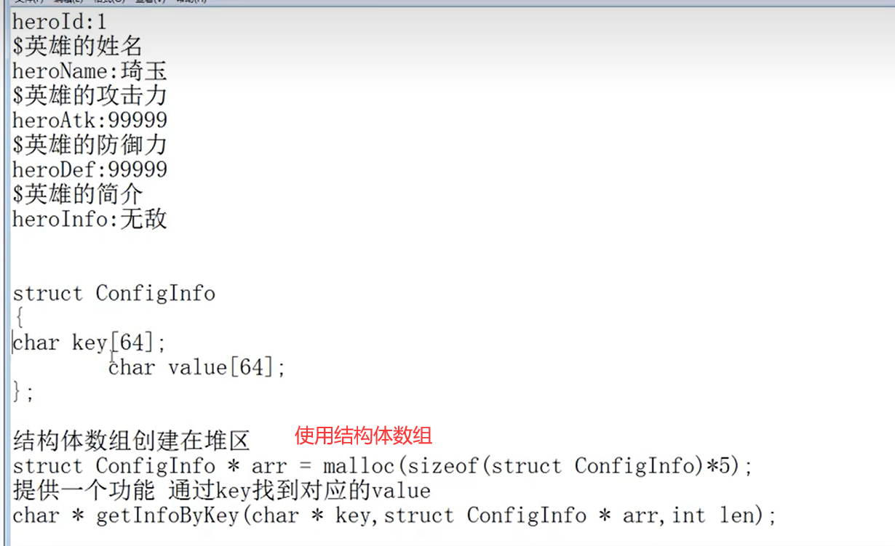

-------------


代码:

```c++
#ifndef CONFIG_H_
#define  CONFIG_H_

// 用结构体解析config的数据
struct ConfigInfo
{
	char key[64];
	char value[64];
};

// 统计有效行数
int getFileLine(char * path);
// 验证传入的行是否是有效行
int isValidLine(char * str);

// 解析文件
void parseFile(char *fi1ePath，int lines，struct ConfigInfo **arr); 

//通过key返回对应的value
char * getInfoByKey(char * key，struct ConfigInfo * arr，int len)

#endif
```

```c++
#include "config.h"

// 统计有效行数
int getFileLine(char * path)
{
    FILE *pf = fopen(path, "r");
    char buf[1024];
    
    int lines = 0;
    while (fgets(buf, 1024, fp))
    {
        if (isValidLine(buf)
        	lines++;
    }
    fclose(fp);
    retrun lines;
}

// 验证传入的行是否是有效行
int isValidLine(char * str)
{
	if (str[0] = ' ' || str[0]  == '\n' || strchar(str, ':') == NULL)
        return 0;
    else
        return 1;
}   
            
 // 解析文件           
void parseFile(char *fi1ePath，int lines，struct ConfigInfo **arr)
{
    struct ConfigInfo *config = malloc(sizeof(struct ConfigInfo)*lines);  // 数组
    if (config == NULL)
    {
        
   	 	printf("分配内存失败\n");
    	return;
    }
    FILE* fp = fopen(filePath，"r");
    if (fp==NULL)
    {
   	 	printf("文件打开失败\n");
    	return;
    }
    
    char buf[1024] = { 0 };
    while (fgets(buf,1024,fp))
    {
    	if (isValidLine(buf)) //有效行才去解析
        {
            //heroId: 100
            // 清空
			memset(config[index].key，0，64);
            memset(config[index].value，0，64);

            char *  pos = strchar(buf, ":");
            strncpy(config[index].key, buf, pos - buf)  // buf-->heroId: 100\n  // pos-->: 100
            strncpy(config[index].key, pos+1, strlen(pos + 1) - 1) // pos--> 100  //-1不要换行
			index++;
        }    
        memset(buf, 0, 1024) // 清空数据      
    }
	*arr = config;                
}
            
            
//通过key返回对应的value
char * getInfoByKey(char * key，struct ConfigInfo * arr，int len)
{
	for (int i = 0; i < len;i++)
    {
    	if (strcmp(arr[i].key，key) == o)
           	return arr[i].value;
    }
} 
            
//释放堆区数组
void freeConfigInfo(struct ConfigInfo *arr)
{
    if (arr ==NULL)
    {
    	return;
    }
    free(arr);
    arr =NULL; I
}       
```

```c++
#include "config.h"

int main(void)
{
	//文件的有效行数统计
	char * filePath = "config.txt";
    int lines = getFileLine(filePath) ;
	printf("文件的有效行数为: %d\n"，lines);
    
    struct ConfigInfo *arr = NULL;
	parseFile(fi1ePath，lines，&arr);   // 主调函数没有开辟内存,用高级指针修饰
    
    //遍历数组
    for (int i = 0; i < lines ;i++)
    {
   	 	printf("key = %s vlaue = %s \n", arr[i].key，arr[i].value);
    }
    
    printf("------------------------\n");
	printf("英雄的id为:%s\n"，getInfoByKey("heroId", arr，lines)) :
    printf("英雄的姓名为: %s\n"，getInfoByKey("heroName", arr，lines));
    printf("英雄的攻击力为: %s \n"，getInfoByKey("heroAtk", arr，lines); 
    printf("英雄的防御力为: %s \n"，getInfoByKey("heroDef", arr，lines));
    printf("英雄的简介为: %s\n"，getInfoByKey("heroInfo"， arr， lines)) ;
           
    //释放堆区数组 
	freeConfigInfo(arr);   // 同级指针,
    arr = IULLI   // 防止野指针
}
```

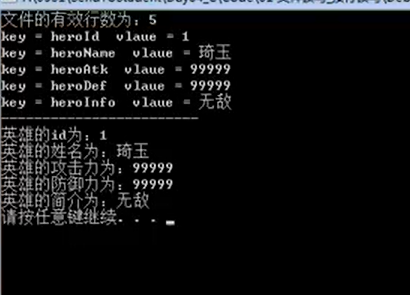


------------

### 7.7文件加密


```c
void codeFile(char *sourcePath，char *destPath)
{
    FILE* fp1 = fopen(sourcePath，"r");
    FILE* fp2 = fopen(destPath,"w");
    
    if (!fp1 || !fp2)
    {
        printf("文件打开失败\n");
        return;
    }
    
    char ch;
    while ( (ch = fgetc(fp1) ) != EOF)   // 读文件要用 EOF
    {
        //加密过程 : 
        // $ ascll 36
        //0010 0100  --> 十进制36
        short temp = (short)ch;
        //0000 0000 0010 0100 << 4;
        temp <<= 4;
        //0000 0010 0100 0000
        //1000 0000 0000 0000
        temp |= 0x8000;  // 变成负数 高位置1
        
        //1000 0010 0100 0000  + 0000`1111  // 0-15的随机数
        temp += rand() % 16;     //得  -31106 -30939 ....
        
        fprintf(fp2, "%hd", temp); // 格式化  十六进制写入
    }
     
    fclose(fp1);
    fc1oce(fn2)·
}
```


```c
void deCodeFile(char *sourcePath,char * destPath)
{
    FILE *fp1 = fopen(sourcePath,"r");
    FILE *fp2 = fopen(destPath，"w");
   
    if (!fp1 |l !fp2)
    {
    	printf("文件打开失败\n");return;
    }
    
    short temp;
    
    while (!feof(fp1))
    {
           fscanf(fp1，"%hd"， &temp);
           //1000 0010 0100 1110 << 1;
           temp <<= 1;
		   //000 0010 0100 11100>>5;
           temp >>= 5;
		   //0000 0000 0010 0100
           char ch = (char) temp;
           //0010 0100
    	   fputc(ch, p2)
    }
     fclose(fp1);
     fc1oce(fn2)·
}
```


-------------

## 8 函数指针

### 8.1 函数指针概念

函数指针：**函数名称就是函数的入口地址，可以通过函数指针去指向函数的入口地址**

**可以看 笔记  17. 函数指针**

```C
void func()
{
	printf("hello world\n");
}

int main() {

	printf("%p\n", func);
    
	system("pause");
	return EXIT_SUCCESS;
}
```


### 8.2 函数指针定义方式


函数指针定义方式有三种：

**结合数组指针记忆**

* 先定义函数类型，通过函数类型定义函数指针变量
* 先定义函数指针类型，再通过函数指针类型定义函数指针变量
* 直接定义函数指针变量


代码如下：

```C
void func(int a ,char b)
{
	printf("hello world\n");
}

void test01()
{
	//1、先定义函数类型，通过函数类型定义函数指针变量
	typedef void(FUNC_TYPE)(int,char);
	FUNC_TYPE * pFunc = func;
	pFunc(10,'a');


	//2、先定义函数指针类型，再通过函数指针类型定义函数指针变量
	typedef void(*FUNC_TYPE2) (int, char);
	FUNC_TYPE2 pFunc2 = func;
	pFunc2(10, 'a');

	//3、直接定义函数指针变量
	void(*pFunc3)(int, char) = func;
	pFunc3(10, 'a');

	//4、函数指针 和 指针函数区别
	//函数指针是指向函数的指针；
 	//指针函数是返回类型为指针的函数；
}

//函数指针的数组
void func1()
{
	printf("func1调用\n");
}
void func2()
{
	printf("func2调用\n");
}
void func3()
{
	printf("func3调用\n");
}

void test02()
{
	//函数指针数组---->调用多个数组
	void(*fun_array[3])();

	fun_array[0] = func1;
	fun_array[1] = func2;
	fun_array[2] = func3;

	for (int i = 0; i < 3;i++)
	{
		fun_array[i]();
	}
}
```


### 8.3 回调函数案例

当**函数指针做函数参数**的时候，利用函数指针调用所指的函数时，**称为回调函数**


**案例1 ：提供一个函数，实现可以打印任何类型的元素(其实就是自己设计不同类型的函数实现)**

```C
// 回调函数
void printText(void * data, void(*func)(void *))    //void *万能指针接任意类型的地址
{                                            // 使用函数指针交给用户自己
	func(data);   // 回调
}

void myPrintInt(void * data) //参数就是每个元素的地址
{
	int * num = data;     // 交给用户自己设计
	printf("%d\n", *num);
}


void test01()
{
	int a = 10;
	printText(&a, myPrintInt);     //使用回调函数
}


-----------
    
struct Person
{
	char name[64];
	int age;
};

void myPrintPerson(void * data) //参数就是每个元素的地址
{
	struct Person * p = data;
	printf("姓名：%s 年龄： %d \n", p->name,p->age);
}

void test02()
{
	struct Person p = { "Tom", 100 };      
	printText(&p, myPrintPerson);               //使用回调函数
}
```


**案例2 ：提供一个函数，可以打印任意类型的数组**

```C
// 回调函数   可以用来打印任意类型的数组
void printALLArray(void *arr, int eleSize, int len , void(*myFunc)(void *))
{
	char * p = arr;
	for (int i = 0; i < len;i++)
	{
		char * eleAddr = p + eleSize* i; // 计算出每个元素的地址
		myFunc(eleAddr);      // 交给用户
	}
}

/**
//分析:
//1.
void printAllArray (void *arr, int len)
{
    
    for (int i = 0; i< len;i++)
    {
        printf("%d\n"，arr[i];    //void a = 10; err
    }
}

//2.
void printA11Array (void *arr, int len)
{
    char * p = arr;
    for (int i = 0; i < len; i++)
    {
   		printf("%d\n"，*(int*)(p + 4 * i) ) ;   // 因为现在的数据的 int 4字节
    }
}
**/


 
void myPrintInt(void * data) 
{
	int * num = data;			// 交给用户自己设计
	printf("%d\n", *num);
}


---------------
    
    
    
struct Person
{
	char name[64];
	int age;
};

void myPrintPerson(void * data)
{
	struct Person * p = data;
	printf("姓名： %s  年龄： %d \n", p->name, p->age);
}

void test01()
{
	int arr[] = { 1, 2, 3, 4, 5 };

	int len = sizeof(arr) / sizeof(int);
	printALLArray(arr, sizeof(int), len, myPrintInt);

    
    -------------
        
        
	struct Person personArr[] = 
	{
		{ "aaa", 10 },
		{ "bbb", 20 },
		{ "ccc", 30 },
		{ "ddd", 40 }
	};

	len = sizeof(personArr)/ sizeof(struct Person);
	printALLArray(personArr, sizeof(struct Person), len, myPrintPerson);
}
```


**案例3 ：查找数组中的某个元素是否存在**

```C
//回调函数
//查找数组中的元素是否存在
int findArrayEle(void *arr, int eleSize, int len, int(*myFunc)(void * , void *) , void * data)
{
	char * p = arr;             // 用指针接不等于在进行强转
	for (int i = 0; i < len; i++)
	{
		char * eleAddr = p + eleSize* i; //计算每个元素的地址
        
		if (myFunc(eleAddr , data))  // 交给用户自己设计
		{
			return 1;
		}
	}
	return 0;
}


int myFindPerson(void * data1, void * data2)     // 交给用户自己设计
{
	struct Person * p1 = data1;
	struct Person * p2 = data2;
	if (strcmp(p1->name,p2->name) == 0  && p1->age == p2->age )
	{
		return 1;
	}
	return 0;
}

void test02()
{
	struct Person personArr[] =
	{
		{ "aaa", 10 },
		{ "bbb", 20 },
		{ "ccc", 30 },
		{ "ddd", 40 }
	};

	int len = sizeof(personArr) / sizeof(struct Person);

	struct Person p = { "aaa", 10 };
    
    // 从personArr[]查找 p
	int ret = findArrayEle(personArr, sizeof(struct Person), len, myFindPerson , &p);

	if (ret)
	{
		printf("找到了！\n");
	}
	else
	{
		printf("未找到!\n");
	}
}
```


**案例4 ：对任意类型数组进行排序**

// **使用排序算法**

```c++
#include <iostream>
#include <vector>
#include <cstring>

using namespace std;

struct Person
{
	char name[64];
	int age;
};


void bubbleSort(void *arr, int eleSize, int len, int(*myCompare)(void *, void *))
{

    char * p = (char *)arr;
    char * temp = new char[eleSize];   //用char * temp = new char会报错   
    //注意 1. new和new[]的区别
    // new 用于单个对象或实例的创建，就是调用类的构造函数。
    // new [] 用于创建对象或实例的数组实例，并且地址是连续的。(内存分配的时候有可能不连续，但地址链表是连续的。)
    for (int i = len - 1; i > 0; i--)
    {
        for (int j = 0; j < i; j++)
        {
         
            //if (arr[j + 1] > arr[j])   // void * 是不能直接解引用
            char * pJPlus = p + (j + 1)*eleSize;   // 得到数组中下标 j+1的首地址
            char * pJ = p + j*eleSize;   // 得到数组中下标 j+1的首地址


            if (myCompare(pJ, pJPlus))    // 使用回调函数让用户决定  // 从大到小排还是从小到大排
            {
                // 交换元素
                // memcpy 用于内存之间的拷贝
                memcpy(temp, pJPlus, eleSize);
                memcpy(pJPlus, pJ, eleSize);
                memcpy(pJ, temp, eleSize);
            }
        }
    }
}


int CompareInt(void *data1, void *data2)          // 用户决定 
{
    int * num1 = (int *)data1;   // 前一个数
    int * num2 = (int *)data2;   // 后一个数

    // // 降序   5 4 3 2 
    // if (*num1 < *num2)    // 升序 if (*num1 < *num2)    
    //     return 1;
    // else
    //     return 0;
    // 优化
    return *num1 < *num2;
}


int ComparePerson(void *data1, void *data2)
{
    struct Person *p1 = (struct Person *)data1;   // 前一个数
    struct Person *p2 = (struct Person *)data2;   // 后一个数

    // 升序
    return p1->age > p2->age;
}


void test01()
{
    int arr[] = {1,  3, 5, 2, 4};
    int len = sizeof(arr) / sizeof(int);
    bubbleSort(arr, sizeof(int), len, CompareInt);

    for (int n : arr)
    {
        cout << n << endl;
    }
}


void test02()
{
	struct Person personArr[] =
	{
		{ "aaa", 10 },
		{ "bbb", 40 },
		{ "ccc", 30 },
		{ "ddd", 20 }
	};

    // 按照年龄 升序
	int len = sizeof(personArr) / sizeof(struct Person);
    bubbleSort(personArr, sizeof(struct Person), len,  ComparePerson);
    
    for (int i = 0; i< len; i++)
    {
        cout << personArr[i].name  << personArr[i].age << endl;
    }

}


int main(void)
{
    cout << "test01的测试" << endl;
    test01();
    cout << endl;
    cout << "test02的测试" << endl;
    test02();
    return 0;
}
```


-----------


## 9 预处理指令

### c编译过程


### 9.1  预处理概念

* 预处理是在程序源代码被编译之前，由预处理器对程序源代码进行的处理。
* 这个阶段并不对程序的源代码语法进行解析，为下一步的编译做准备工作。


### 9.2 文件包含指令

* 文件包含是指一个源文件可以将另外一个文件的全部内容包含进来。
* Ｃ语言提供了#include命令用来实现“文件包含”的操作


**图示：**


**\#incude<>  #include""区别**

`< >` 表示包含系统头文件

`" "` 表示包含自定义头文件


### 9.3 宏定义

#### 9.3.1 宏常量

**语法：** `#define 名称  值`

**实例：** `#define MAX  1024`

```C
void test(){
	double r = 10.0;
	double s = PI * r * r;
	printf("s = %lf\n", s);
}
```


**总结：**

* **宏名一般用大写**，以便于与变量区别
* 宏定义可以是常数(宏常量)、表达式（宏函数）
* **宏定义不作语法检查，只有在编译被宏展开后的源程序才会报错**
*  宏名从定义到本源文件结束都可以使用
* 可以用#undef命令终止宏定义的作用域


#### 9.3.2 宏函数

**语法：** `#define 宏函数名(参数)  表达式` 

**实例：** `define SUM(x,y) (( x )+( y ))`

```C
#define SUM(x,y) (( x )+( y ))

void test(){
	int ret = SUM(10, 20);
	printf("ret:%d\n",ret);
}
```


**总结：**

* 在项目中，可以把一些短小而又频繁使用的函数写成宏函数

* 宏函数没有普通函数参数压栈、出栈上的开销，可以调高程序的效率

* **宏的名字中不能有空格**，但是在替换的字符串中可以有空格

* 用括号括住每一个参数，并括住宏的整体定义。

* **用大写字母表示宏的函数名。**

  


### 9.4 条件编译

* 一般情况下，源程序中所有的行都参加编译
* 但有时希望对部分源程序行只在满足一定条件时才编译，即对这部分源程序行指定编译条件

**条件编译三种使用**：

1. 测试存在   `#ifdef`
2. 测试不存在  `#ifndef`
3. 自定义条件 `#if`

示例：

`#ifdef`

```C
#define debug 
#ifdef debug
void func1()
{
	printf("Debug版本\n");
}
#else
void func1()
{
	printf("Release版本\n");
}
#endif 
```

`#ifndef`

```C
//防止头文件被重复包含引用；
#ifndef _SOMEFILE_H
#define _SOMEFILE_H

...

#endif
```

`#if`

```C
//做注释用
#if 0
    void myAdd()
    {
        printf("第一种写法\n");
    }
#else 
	void myAdd()
    {
        printf("第二种写法\n");
    }
#endif
```

补充

编译器根据条件的真假决定是否编译相关的代码

 **一、根据宏是否定义，其语法如下：**

```c
#ifdef  <macro>
……
#else
……
#endif
```

例子

```c
#define _DEBUG_
#ifdef  _DEBUG_
     printf(“The macro _DEBUG_ is defined\n”);
#else
	printf(“The macro _DEBUG_ is not defined\n”);
#endif
```

 **二、根据宏的值，其语法如下：**

```c
#if  <macro>
……
#else
……
#endif
```

例子

```c
#define  _DEBUG_   1
#if  _DEBUG_
printf(“The macro _DEBUG_ is defined\n”);
#else
printf(“The macro _DEBUG_ is not defined\n”);
#endif
```

### 9.5 特殊宏

```C
//	__FILE__			宏所在文件的源文件名 
//	__LINE__			宏所在行的行号
//	__DATE__			代码编译的日期
//	__TIME__			代码编译的时间

void test()
{
	printf("%s\n", __FILE__);
	printf("%d\n", __LINE__);
	printf("%s\n", __DATE__);
	printf("%s\n", __TIME__);
}
```


## 10 动态库的配置与使用

### 10.1 库的基本概念

* **库是已经写好的、成熟的、可复用的代码**
* 每个程序都需要依赖很多底层库，不可能每个人的代码从零开始编写代码
* **我们的开发的应用中经常有一些公共代码是需要反复使用的，就把这些代码编译为库文件(别人是看不见源码的)。**
* 库可以简单看成一组**目标文件(.o文件)的集合**，将这些目标文件经过压缩打包之后形成的一个文件。


### 10.2 静态库的配置与使用

window下静态库配置步骤如下：

1. 创建新项目，编写库文件
2. 修改项目配置属性
3. 生成库文件
4. 测试并使用库


具体流程如下：


**1 创建项目**

* 创建一个空项目，项目名称例如：静态库
* 创建头文件和头文件，例如staticLib.h和staticLib.c

头文件添加如下代码：

```C
#pragma once

//加法运算，实现两个整型数字相加，并返回结果
int myadd(int a, int b);
```


源文件添加如下代码：

```C
#include "staticLib.h"

int myadd(int a, int b)
{
	return a + b;
}
```


**2 修改项目配置属性**

右键项目点击属性

在属性页面中选择  配置属性 - 常规 -配置类型 - 静态库 - 确定


**3 生成库文件**

此时，不需要运行程序，这里也没有写程序的入口

点击生成菜单，选择生成项目即可


**成功后，在staticLib.c的==上层==的Debug目录中会有静态库.lib文件**

**注：**

* **通常将生成的.lib文件和.h文件交给用户**

  

* **.h本身不需要，但是只有lib文件用户看不懂里面内容**

* .h中写的库函数功能尽量描述清晰，起到说明作用


**4 测试并使用库**

创建新项目，**导入生成的.lib和.h文件导入到项目中  进行测试**


运行查看结果，成功实现后，会打印出1 + 1 = 2 


### 10.3 动态库的配置与使用

#### 10.3.1 静态库优缺点

静态库缺点明显，利小于弊

优点：

* **静态库**在程序的链接阶段被复制到了程序中


* 程序在运行时与库再无瓜葛，**移植方便**

缺点：

* 浪费空间和资源
  * 静态库所有内容都放在了程序中
  * 假设1个程序占用1MB，如果磁盘中有2000个程序，将近浪费了2GB空间
  
* 更新部署麻烦
  * 假设库文件为第三方厂商提供
  
    + **如果库文件有所改动，需要更新，那么整个程序需要重新编译发布给用户**
  
    + **用户也需要重新安装整个程序**


#### 10.3.2 动态库简介

为了解决静态库浪费空间和更新困难的两个问题，诞生了动态库

动态库链接思想：

* 将整个链接过程推迟到运行时候在进行
* 程序中用到了库函数，再从库中使用
* 更新时候，只需要替换库文件


#### 10.3.3  动态库配置和使用

window下动态库配置步骤如下：

1. 创建新项目，编写库文件
2. 修改项目配置属性
3. 生成库文件
4. 测试并使用库

具体流程如下：


**1 创建项目**

- 创建一个空项目，项目名称例如：动态库
- 创建头文件和头文件，例如dynamicLib.h和dynamicLib.c

头文件添加如下代码：

```c
#pragma once

//减法运算，实现两个整型数字相减，并返回结果
__declspec(dllexport) int mysub(int a, int b);
```

注：

* `__declspec(dllexport)` 为导出函数，只有导出函数才可以被外部程序使用


源文件添加如下代码：

```c
#include "dynamicLib.h"

int mysub(int a, int b)
{
	return a - b;
}
```


**2 修改项目配置属性**

右键项目点击属性

在属性页面中选择  配置属性 - 常规 -配置类型 - 动态库 - 确定


**3 生成库文件**

不需要运行程序，点击生成菜单，选择生成项目即可

成功后，在staticLib.c的==上层==的Debug目录中会有核心文件：动态库.lib 文件 以及 动态库.dll文件

**注：**

- 通常将生成的 .dll文件   .lib文件和   .h文件交给用户

  

- .h中写的库函数功能尽量描述清晰，起到说明作用

- 本案例演示库程序为中文，实际开发中最好用英文

- 动态库中的lib文件中存**放导出函数的声明**，**具体实现在dll**中，这与静态库中的lib是不同的


**4 测试并使用库**

创建新项目**，导入生成的.dll 、 .lib和 .h文件导入到项目中进行测试**


运行查看结果，成功实现后，会打印出1 - 1 = -1

注： **如果不把文件导入项目中，也可以采用代码中添加 `#pragma comment(lib,"./动态库.lib")` 使用动态库**

## 11 递归函数

### 11.1 普通函数调用

学习递归函数前，我们先要搞清楚普通函数的调用流程

```C
#define _CRT_SECURE_NO_WARNINGS
#include<stdio.h>
#include<string.h>
#include<stdlib.h>

void funB(int a) 
{
	printf("funB中的 a = %d\n", a);
}

void funA(int a) 
{
	funB(a - 1);
	printf("funA中的 a = %d\n", a);
}

int main() {

	funA(2);
	printf("main\n");

	system("pause");
	return EXIT_SUCCESS;
}
```

思考上面代码运行的结果，理解代码的执行流程

**流程分析图：**


执行结果为：

```C
funcB中的 a = 1;
funcA中的 a = 2;
main
请按任意键继续...
```


### 11.2 递归函数调用

如果11.1已经看懂，那么接下来分析以下代码的运行结果：

```C
#define _CRT_SECURE_NO_WARNINGS
#include<stdio.h>
#include<string.h>
#include<stdlib.h>

void funA(int a) 
{
	if (a == 1)
	{
		printf("funA中的 a = %d\n", a);
		return;
	}

	funA(a - 1);
	printf("funA中的 a = %d\n", a);
}

int main() {

	funA(2);
	printf("main\n");

	system("pause");
	return EXIT_SUCCESS;
}
```

**流程分析图：**


执行结果为：

```c
funcA中的 a = 1;
funcA中的 a = 2;
main
请按任意键继续...
```

上面这种，在函数中调用自身，就属于递归函数

注：

* 递归函数必须有退出条件，否则出现无限递归


### 11.3 递归函数案例

案例1：逆序遍历字符串

```C
void reversePrint(char * p)
{
	if (*p == '\0')
	{
		return;
	}

	reversePrint(p + 1);
	printf("%c", *p);
}

void test01()
{
	char * str = "abcdefgh";
	reversePrint(str);
}
```


案例2：获取斐波那契数列指定位置元素

斐波那契数列：1、1、2、3、5、8...

```C
int fibonacci(int pos)   
{
	if (pos == 1 || pos == 2)
	{
		return 1;
	}

	return fibonacci(pos - 1) + fibonacci(pos - 2);
}

void test02()
{
	int num = fibonacci(10);
	printf("斐波那契数列中第十个元素为：%d\n", num);
}
```

