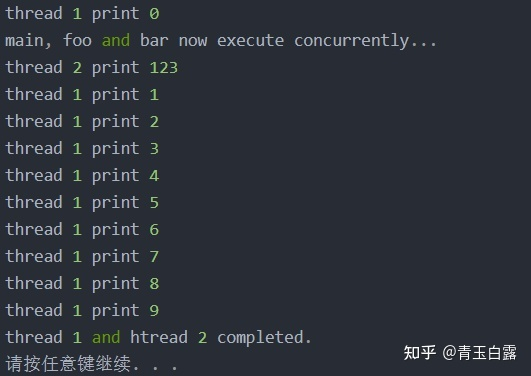
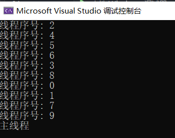
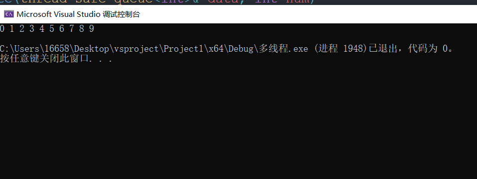
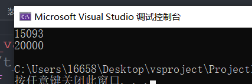

# **一、进程、线程、并发**

**基本概念:**

- 进程：简而言之就是一个运行的程序，如点开一个exe文件就打开了一个进程；
- 线程：就是一个代码的运行通道, 进程中的不同执行路径，即在一个进程中运行了多个功能；（一个进程中至少有一个线程，并且主线程是唯一的，即主线程，主线程与进程的关系是相互依存）
- 并发：分为多线程和多进程，顾名思义就是多个进程同时运行和多个线程同时运行，如同时打开两个QQ客户端就是多进程，VStudio中多个窗口线程就是多线程并发；

**并发实现:**

+ 多个进程实现并发
  + 主要解决进程间通信问题:
    + 同一台电脑上行，主要提供过管道，文件，消息队列，内 存共享实现
    + 不同电脑主要网络编程实现

+ 单进程，多个线程实现并发
  + 主要解决进程间通信问题:
    + 一个进程中所有线程共享内存空间的方式
    + 资源竞争

**C++中的多线程:**

+ #include <thread>
+ 创建线程, 线程处理函数
+ 创建的线程未做任何处理,会调用abort终止程序
+ jion();        加入/汇合一个线程, 阻塞主线程
+ detach():   分离 , 驻留后台

```c++
#include <iostream>
#include <thread>
#include <windows.h>

using namespace std;

void print()
{
	cout << "干活\n";
}

void printDate()
{
	Sleep(1000);
	cout << "睡觉\n";
}

int main(void)
{
	thread t1(printDate);   //创建主线程
	t1.join();
	//t1.detach();
	print();
	return 0;
}
```


# 二、创建线程的几种方式

```c++
#include <iostream>
#include <thread>

using namespace std;

//第一种情况,无参普通函数充当线程处理函数
void print()
{
	cout << "无参普通函数充当线程处理函数\n";
}

void test01()
{
	thread t1(print);
	t1.join();
}

//第二种情况,采用lamba表达式充当线程处理函数
void test02()
{
	thread t1([](){ cout << "amba表达式充当线程处理函数\n"; });
	t1.join();
}

//第三种,带参数创建线程(普通参数和只能指针当作参数)
//3.1 传普通参数
void printDate(int num)
{
	cout << "id:" << num << endl;
}


void test03()
{
	int num = 1;
	thread t1(printDate, num);
	t1.join();
}

//3.1.1 传引用
//使用std::ref可以在模板传参的时候传入引用，thread的方法传递引用的时候，否则无法传递。
void printRefrence(int& num)
{
	num = 1001;
	cout << "子线程" << num << endl;
}

void test04()
{
	int num = 0;
	thread t1(printRefrence, ref(num));   // ref: 包装引用作为传递的值
	t1.join();
	cout << "主进程" << num << endl;
}

//3.1.2 指针当作参数
void printPtr(unique_ptr<int> ptr)
{
	cout << "智能指针:" << ptr.get() << endl;
}

void test05()
{
	unique_ptr<int> ptr(new int(100));
	cout << ptr.get() << endl;

	thread t1(printPtr, move(ptr));    // move
	t1.join();

	cout << "test05:" << ptr.get() << endl;   // 已经没有所有权
}


// 第四种,通过类中的成员函数去实现
// 4.1 仿函数的形式:类名的方式调用
class function
{
public:
	void operator()()
	{
		cout << "重载()\n";
	}
};

void test06()
{
	//第一种,对象
	function object;
	thread t1(object);
	t1.join();
	//第二种,匿名对象
	thread t2((function()));
	t2.join();
}

//4.2 普通类中的成员函数
class MM
{
public:
	void print(int& num)
	{
		cout << "id" << num << endl;
	}
};


void test07()
{
	MM m;
	int id = 1;
	thread t1(&MM::print, m, ref(id));  // 创建方式不太一样
	t1.join();
}


int main(void)
{
	//test01();
	//test02();
	//test03();
	//test04();
	//test05();
	//test06();
	test07();
	return 0;
}
```

运行结果:


# **三、thread库**

看看thread类，它是thread库多线程实现的基础。

## **构造函数**

从构造函数可以窥见“多线程”的一些实现思想。

**thread()默认构造函数**，创建一个空的 std::thread 执行对象（在线程池的实现中就需要提前创建一定数量的线程对象）；

**thread(Fn&& fn, Args&&...)**初始化构造函数，创建一个 **std::thread** 对象，该 std::thread 对象可被 joinable，新产生的线程**会调用 fn 函数（即可调用对象）**，该函数的参数由 args 给出。

**thread(const thread&) = delete**拷贝构造函数(被禁用)，意味着 std::thread 对象不可拷贝构造，这也可以理解，“线程”这个概念在同一时刻仅能由一个线程对象运行，所以不存在拷贝赋值之类的；

**thread(thread&& x)**转移/移动构造函数，，调用成功之后 x 不代表任何 std::thread 执行对象，相当于将“线程”的所有权转给了另外的线程对象。

下面这个例子就展示了如何创建线程：

```c++
//参考并稍加修改自博客：  https://blog.csdn.net/coolwriter/article/details/79883253
//example 1_1
#include <iostream>       // std::cout  
#include <thread>         // std::thread  
void func1()  
{  
    for (int i = 0; i != 10; ++i)  
    {  
        std::cout << "thread 1 print " << i << std::endl;  
    }  
}  

void func2(int n)  
{  
    std::cout << "thread 2 print " << n << std::endl;  
}  

int main()  
{  
    std::thread t1(func1);     
    std::thread t2(func2, 123);   
    std::cout << "main, foo and bar now execute concurrently...\n";  
    // synchronize threads:  
    t1.join();                // pauses until first finishes  
    t2.join();               // pauses until second finishes  
    std::cout << "thread 1 and htread 2 completed.\n";  
    system("pause");
    return 0;  
}
```

结果：




上述代码中，使用**两个重要成员函数。**

## **重要函数**

**join**，它可以阻塞主线程直到子线程执行完毕，即必须等待A.join()执行完毕，才会接着执行之后的代码；

**detach**，表示该线程和主线程分离，该线程被运行时库给接管，若是在linux环境下运行，会发现即便Ctrl+C退出了主线程，但是子线程依旧还在运行。一旦线程执行完毕，它所分配的资源将会被释放。另外，调用 detach 函数之后this不再代表任何的线程执行实例。

PS：值得一提的是，**多线程的调度机制可能会造成先创建的线程还未执行，而后面的线程就已经开始执行了**，比如上述例子在代码中的顺序应该是thread1 thread2 而后打印出main，但实际效果却并非如此，因此在多线程程序的编写要注意变量的互斥性，以及代码的鲁棒性。

## 处理函数

1. **get id**
2. **sleep for**
3. **yield**
4. **sleep_until**

代码:

```c++
#include <iostream>
#include <thread>
#include <ctime>   // 时间函数
#include <chrono>  // c++新标准的时间函数
#include <iomanip>  //io流格式控制

using namespace std;


// 第一个 获取线程id
void threadfun()
{
	//this_thread 命名空间
	cout << "子线程id = " << this_thread::get_id() << endl;
}

void test01()
{
	cout << "主线程id = " << this_thread::get_id() << endl;
	thread t1(threadfun);
	t1.join();
}


//第二个 延时函数 sleep_for //新标准的函数
void threadSleep_for()
{
	cout << "Sleep_for 子线程id = " << this_thread::get_id() << " 启动" << endl;
	this_thread::sleep_for(2s);  //2秒
	this_thread::sleep_for(chrono::seconds(2)); //2秒
	cout << "Sleep_for 子线程id = " << this_thread::get_id() << " 结束" << endl;
}

void test02()
{
	thread t1(threadSleep_for);
	t1.join();
}


// 第三个 让线程放弃执行,让操作系统调用另一个线程执行 yield
void threadYield(chrono::microseconds duration)  // 毫秒
{
	cout << "yield 子线程id = " << this_thread::get_id() << " 启动" << endl;
	auto startTime = chrono::high_resolution_clock::now();
	auto endTime = startTime + duration;
	do
	{
		this_thread::yield();
		cout << 1 << endl;

	} while (chrono::high_resolution_clock::now() < endTime);
	cout << "yield 子线程id = " << this_thread::get_id() << " 结束" << endl;
}

void test03()
{
	thread t1(threadYield, chrono::microseconds(200));
	t1.join();
}

//第四个 sleep_until
void threadSlee_until()
{
	//this_thread: :sleep_until(chrono: : system_clock::from_time_t(100)) ;
	time_t t = chrono::system_clock::to_time_t(chrono::system_clock::now());
	tm* ptm = new tm;
	localtime_s(ptm, &t); //获取本地时间
	if (ptm != nullptr)
	{
		this_thread::sleep_until(chrono::system_clock::from_time_t(mktime(ptm)));
	}
	cout << put_time(ptm, "%X") << endl;
}


int main(void)
{
	//test01();
	//test02();
	//test03();
	threadSlee_until();

	return 0;
}
```


**详细说明 :**

get_id：获取线程 ID，返回一个类型为 std::thread::id 的对象。


joinable():检查线程是否可被 join。检查当前的线程对象是否表示了一个**活动的执行线程**，**由默认构造函数创建的线程是不能被 join 的**。

swap():Swap 线程，交换两个线程对象所代表的底层句柄即ID等资源，见下：

```c++
#include <iostream>
#include <thread>
#include <chrono>

void foo()
{
  std::this_thread::sleep_for(std::chrono::seconds(1));
}

void bar()
{
  std::this_thread::sleep_for(std::chrono::seconds(1));
}

int main()
{
  std::thread t1(foo);
  std::thread t2(bar);

  std::cout << "thread 1 id: " << t1.get_id() << std::endl;
  std::cout << "thread 2 id: " << t2.get_id() << std::endl;

  std::swap(t1, t2);

  std::cout << "after std::swap(t1, t2):" << std::endl;
  std::cout << "thread 1 id: " << t1.get_id() << std::endl;
  std::cout << "thread 2 id: " << t2.get_id() << std::endl;

  t1.swap(t2);

  std::cout << "after t1.swap(t2):" << std::endl;
  std::cout << "thread 1 id: " << t1.get_id() << std::endl;
  std::cout << "thread 2 id: " << t2.get_id() << std::endl;

  t1.join();
  t2.join();
}
```

结果如下：


yield: 当前线程放弃执行，操作系统调度另一线程继续执行。

sleep_until: 线程休眠至某个指定的时刻(time point)，该线程才被重新唤醒，详见[连接](https://link.zhihu.com/?target=https%3A//blog.csdn.net/huhaoxuan2010/article/details/76034520)。

sleep_for: 线程休眠某个指定的时间片(time span)，该线程才被重新唤醒，不过由于线程调度等原因，实际休眠时间可能比 sleep_duration 所表示的时间片更长。

```c++
#include <iostream>
#include <chrono>
#include <thread>

int main()
{
  std::cout << "Hello waiter" << std::endl;
  std::chrono::milliseconds dura( 2000 );
  std::this_thread::sleep_for( dura );
  std::cout << "Waited 2000 ms\n";
}
```

## **异步调用future**

在上文的代码中基本都用到的thread对象，它是C++11中提供同步创建多线程的工具。但是我们想要从线程中**返回异步任务结果**，一般需要**依靠全局变量**；从安全角度看，有些不妥；为此C++11提供了std::future类模板，**future对象提供访问异步操作结果的机制**，很轻松解决从异步任务中返回结果。

创建方法如下：

```text
auto futureFunction = std::async(helloFunction, “function”);
//参考博客：https://blog.csdn.net/y396397735/article/details/82381874
```

跟线程的创建一样：一个可调用的对象以及可选的入口参数；

运行futureFunction.get()即可获取该调用对象的返回值；

这个时候需要了解两种策略：**Eager or lazy evaluation（急速或惰性求值） 是计算表达式结果的两种策略**。

在急速求值的情况下，**将立即计算评估表达式**。

在惰性求值的情况下，**只会在需要的情况下评估表达式**。

通常惰性求值被称为call-by-need,按需调用。

值得注意的是，通常情况下, std::async 立即开始执行它的工作包。

C++运行时会决定, 计算是发生在同一个线程还是一个新的线程。

使用std::launch::async参数的话，**std::async 将在一个新线程中运行它**。

相反，使用参数 std::launch::deferred, **std::async将在同一个线程中运行它的工作包，这属于惰性求值**。

这意味着，急速求值是立即执行的，惰性求值的策略std::launch::deferred是随着future调用get()后才开始执行。

参考如下代码：

```text
//example 1-8
#include <future>
#include <iostream>
#include<string>
using namespace std;
bool is_prime(int x)
{
    for (int i = 1; i<x; i++)
    {
        if (x % i == 0)
            return false;
    }
    return true;
}
int main()
{
    std::future<bool> fut = std::async(is_prime, 700020007);
    std::cout << "please wait";
    std::chrono::milliseconds span(1);
    while (fut.wait_for(span) != std::future_status::ready)
        std::cout << ".";
    std::cout << std::endl;

    bool ret = fut.get();
    std::cout << "final result: " << std::to_string(ret) << std::endl;
    system("pause");
    return 0;
}
```

std::async会首先创建线程执行is_prime(700020007)， 任务创建之后，std::async立即返回一个std::future对象。

主线程既可使用std::future::get获取结果，如果调用过程中，任务尚未完成，则主线程阻塞至任务完成。

主线程也可使用std::future::wait_for等待结果返回，wait_for可设置超时时间，如果在超时时间之内任务完成，则返回std::future_status::ready状态；如果在超时时间之内任务尚未完成，则返回std::future_status::timeout状态。（参考[https://www.cnblogs.com/taiyang-li/p/5914167.html](https://link.zhihu.com/?target=https%3A//www.cnblogs.com/taiyang-li/p/5914167.html)）

**Std::promise**

std::promise是C++11并发编程中常用的一个类，常配合std::future使用。其作用是在一个线程t1中保存一个类型typename T的值，可供相绑定的std::future对象在另一线程t2中获取。

Std::launch是枚举类型，用于启动异步任务时，传递给函数async的参数，它的定义如下：

```text
enum class launch {
async = 0x1,创建线程的时候就开始调用（创建新线程）
deferred = 0x2延迟调用，等到wait或者get的时候才进行调用（直接在原有的线程进行）；
};
```

补充：async与thread的区别：关于系统资源紧张与否、返回值获取的难易程度；thread必定会创建线程，而这可能会造成系统崩溃；


# 四、带返回值的线程处理函数

**三种方式 :   **

+ 采用 async
+ 采用 thread
+ 采用 promise

```c++
#include <iostream>
#include <thread>
#include <future>
#include <chrono>

using namespace std;
/*
带返回值的线程处理函数的方法:
第一步: 采用async: 启动一个异步任务,(创建线程,并且执行线程处理函数),返回future对象.
第二步: 通过future对象中的get()方法获取线程处理函数返回值.
*/

//No.1 带返回值的普通函数充当线程处理函数
int testThreadOne()
{
	return 1001;
}

//No.2 带返回值的类成员函数充当线程处理函数
class MM
{
public:
	int mmthread(int num)
	{
		cout << "MM对象的id: " << this_thread::get_id() << endl;
		num *= 2;
		chrono::milliseconds duration(5000);
		this_thread::sleep_for(duration);
		return num;
	}
};

void testAsync()
{
    //No.1
	future<int> result = async(testThreadOne);
	cout << result.get() << endl;
	
    //No.2
	MM mm;
	auto temp = async(&MM::mmthread, &mm, 1999);
	cout << temp.get() << endl;

	//async其他参数
	//launch::async    : 创建线程, 执行线程处理函数(默认)
	//launch::deferred : 线程处理函数延迟到我们调用wait和get方法时候才会执行.本质是没有创建线程的
	auto testDerred1 = async(launch::deferred, &MM::mmthread, &mm, 1000);
	cout << testDerred1.get() << endl;  //才创建线程
	auto testDerred2 = async(launch::async, &MM::mmthread, &mm, 1000);  //会创建线程

}

int main(void)
{
	testAsync();
	return 0;
}
```


```c++
//No.3用thread处理带返回值的线程处理函数
//第一步: 通过类模板packaged_task包装线程处理函数
//第二步: 通过packaged_task的对象调用get_future获取future对象，再通过get()方法得到子线程处理函数的返回值
void testPackaged_task()
{
	//No.1打包带返回值的普通函数充当线程处理函数
	packaged_task<int(void)> taskOne(testThreadOne);
	thread testOne(ref(taskOne));
	testOne.join();
	cout << taskOne.get_future().get() << endl;

	//No.2 打包带返回值的类成员函数充当线程处理函数
	MM mm;
	packaged_task<int(int)> taskTwo(bind(&MM::mmthread, mm, placeholders::_1)); //placeholders::_1占位符
	thread testTwo(ref(taskTwo), 20);
	testTwo.join();
	cout << taskTwo.get_future().get() << endl;

	//No.3打包Lambda表达式
	packaged_task<int(int)> taskThree([](int num){

		cout << "thread_id: " << this_thread::get_id() << endl;
		num *= 10;
		return num;
		});
	thread testTree(ref(taskThree), 7);
	testTree.join();
	cout << taskThree.get_future().get() << endl;

}

int main(void)
{
	//testAsync();
	testPackaged_task();
	//testPromise();
	return 0;
}
```

运行结果:


```c++
//No.4 promise获取线程处理函数返回值
//第一步: 通过promise类模板构建对象,通过调用set_value是存储函数需要返回的值
//第二步: 通过get_future获取future对象，再通过get()方法获取线程处理中的值
void testPromiseThread(promise<int>& temp, int data)
{
	cout << "thread_id" << this_thread::get_id() << endl;
	data *= 3;
	temp.set_value(data);
}
void testPromise()
{
	promise<int> temp;
	thread testp(testPromiseThread, ref(temp), 18);
	testp.join();
	cout << temp.get_future().get() << endl;
}
int main(void)
{
	//testAsync();
	//testPackaged_task();
	testPromise();
	return 0;
}
```

运行结果:


总代码:

```c++
#include <iostream>
#include <thread>
#include <future>
#include <chrono>

using namespace std;
/*
带返回值的线程处理函数的方法:
第一步: 采用async: 启动一个异步任务,(创建线程,并且执行线程处理函数),返回future对象.
第二步: 通过future对象中的get()方法获取线程处理函数返回值. // 注意get()方法只能获取一次
*/

//N0.1 带返回值的普通函数充当线程处理函数
int testThreadOne()
{
	return 1001;
}

//No.2 带返回值的类成员函数充当线程处理函数
class MM
{
public:
	int mmthread(int num)
	{
		cout << "MM对象的id: " << this_thread::get_id() << endl;
		num *= 2;
		chrono::milliseconds duration(5000);
		this_thread::sleep_for(duration);
		return num;
	}
};

void testAsync()
{
	future<int> result = async(testThreadOne);
	cout << result.get() << endl;

	MM mm;
	auto temp = async(&MM::mmthread, mm, 1999);
	cout << temp.get() << endl;

	//async其他参数
	//launch::async    : 创建线程, 执行线程处理函数(默认)
	//launch::deferred : 线程处理函数延迟到我们调用wait和get方法时候才会执行.本质是没有创建线程的
	auto testDerred1 = async(launch::deferred, &MM::mmthread, mm, 1000);
	cout << testDerred1.get() << endl;  //才创建线程
	auto testDerred2 = async(launch::async, &MM::mmthread, mm, 1000);

}

//No.3用thread处理带返回值的线程处理函数
//第一步: 通过类模板packaged_task包装线程处理函数
//第二步: 通过packaged_task的对象调用get_future获取future对象，再通过get()方法得到子线程处理函数的返回值
void testPackaged_task()
{
	//No.1打包带返回值的普通函数充当线程处理函数
	packaged_task<int(void)> taskOne(testThreadOne);
	thread testOne(ref(taskOne));
	testOne.join();
	cout << taskOne.get_future().get() << endl;

	//No.2 打包带返回值的类成员函数充当线程处理函数
	MM mm;
	packaged_task<int(int)> taskTwo(bind(&MM::mmthread, mm, placeholders::_1)); //placeholders::_1占位符
	thread testTwo(ref(taskTwo), 20);
	testTwo.join();
	cout << taskTwo.get_future().get() << endl;

	//No.3打包Lambda表达式
	packaged_task<int(int)> taskThree([](int num){

		cout << "thread_id: " << this_thread::get_id() << endl;
		num *= 10;
		return num;
		});
	thread testTree(ref(taskThree), 7);
	testTree.join();
	cout << taskThree.get_future().get() << endl;

}


//No.4 promise获取线程处理函数返回值
//第一步: 通过promise类模板构建对象,通过调用set_value是存储函数需要返回的值
//第二步: 通过get_future获取future对象，再通过get()方法获取线程处理中的值
void testPromiseThread(promise<int>& temp, int data)
{
	cout << "thread_id" << this_thread::get_id() << endl;
	data *= 3;
	temp.set_value(data);
}
void testPromise()
{
	promise<int> temp;
	thread testp(testPromiseThread, ref(temp), 18);
	testp.join();
	cout << temp.get_future().get() << endl;
}

int main(void)
{
	//testAsync();
	//testPackaged_task();
	testPromise();
	return 0;
}
```


# 五、数据共享问题

1. 通过容器批量创建线程
2. 数据共享问题

通过容器批量创建线程:

```c++
//No.1 通过容器创建多个线程
void print(int index)
{
	//cout << "线程序号: " << index << endl;  // cout是重载输出有点乱,不好区分.换成printf()
	printf("线程序号: %d\n", index);
}

void testThread()
{
	vector<thread*> test;
	// 创建多个线程
	for (int i = 0; i < 10; i++)
	{
		test.push_back(new thread(print, i));
	}

	//汇合线程
	for (auto v : test)
	{
		v->join();
	}
	cout << "主线程\n";
}
```




数据共享问题:

```c++

//No.2数据共享问题分析
//2.1 只读数据:稳定安全，不需要特殊处理，直接读取即可
vector<int> g_data = {1,2,3};
void printTest(int num)
{
	printf("子线程序号:%d \n", num);
	for (auto v : g_data)
	{
		printf("%d\t", v);
	}
	cout << endl;
}

void visiteDate()
{
	vector<thread*> test;
	// 创建多个线程
	for (int i = 0; i < 10; i++)
	{
		test.push_back(new thread(printTest, i));
	}

	//汇合线程
	for (auto v : test)
	{
		v->join();
	}
	cout << "主线程\n";
}

//2.2 有读有写: 需要特殊处理,让程序只对数据进行单一操作
class Seaking
{
public:
	void makeFriend()  // 写
	{
		for (int i = 0; i < 100000; i++)
		{
			cout << "女朋友增加一个\n";
			mm.push_back(i);
		}
	}

	void breakUp()   // 读
	{

		for (int i = 0; i < 100000; i++)
		{
			if (!mm.empty())
			{
				cout << "女朋友减少一个\n";
				mm.pop_back();
			}
			else
			{
				cout << "单身状态\n";
			}

		}
	}
protected:
	list<int> mm;   //读写
};

void testSeaking()
{
	Seaking seaman;
	thread t1(&Seaking::makeFriend, seaman);
	thread t2(&Seaking::breakUp, seaman);
	t1.join();
	t2.join();
}
```

运行结果: 


总代码:

```c++
#include <iostream>
#include <thread>
#include <vector>
#include <cstdio>
#include <list>

using namespace std;

//No.1 通过容器创建多个线程
void print(int index)
{
	//cout << "线程序号: " << index << endl;  // cout是重载输出有点乱,不好区分.换成printf()
	printf("线程序号: %d\n", index);
}

void testThread()
{
	vector<thread*> test;
	// 创建多个线程
	for (int i = 0; i < 10; i++)
	{
		test.push_back(new thread(print, i));
	}

	//汇合线程
	for (auto v : test)
	{
		v->join();
	}
	cout << "主线程\n";
}

//No.2数据共享问题分析
//2.1 只读数据:稳定安全，不需要特殊处理，直接读取即可
vector<int> g_data = {1,2,3};
void printTest(int num)
{
	printf("子线程序号:%d \n", num);
	for (auto v : g_data)
	{
		printf("%d\t", v);
	}
	cout << endl;
}

void visiteDate()
{
	vector<thread*> test;
	// 创建多个线程
	for (int i = 0; i < 10; i++)
	{
		test.push_back(new thread(printTest, i));
	}

	//汇合线程
	for (auto v : test)
	{
		v->join();
	}
	cout << "主线程\n";
}

//2.2 有读有写: 需要特殊处理,让程序只对数据进行单一操作
class Seaking
{
public:
	void makeFriend()  // 写
	{
		for (int i = 0; i < 100000; i++)
		{
			cout << "女朋友增加一个\n";
			mm.push_back(i);
		}
	}

	void breakUp()   // 读
	{

		for (int i = 0; i < 100000; i++)
		{
			if (!mm.empty())
			{
				cout << "女朋友减少一个\n";
				mm.pop_back();
			}
			else
			{
				cout << "单身状态\n";
			}

		}
	}
protected:
	list<int> mm;   //读写
};

void testSeaking()
{
	Seaking seaman;
	thread t1(&Seaking::makeFriend, seaman);
	thread t2(&Seaking::breakUp, seaman);
	t1.join();
	t2.join();
}


int main(void)
{
	//testThread();
	//visiteDate();
	testSeaking();
	return 0;
}
```


# **六、mutex库**

## **互斥**

互斥是指散布在不同任务之间的**若干程序片断，当某个任务运行其中一个程序片段时，其它任务就不能运行它们之中的任一程序片段，只能等到该任务运行完这个程序片段后才可以运行。**

最基本的场景就是：**一个公共资源同一时刻只能被一个进程或线程使用，多个进程或线程不能同时使用公共资源。**

mutex主要是对临界区进行互斥操作，防止多线程同时访问该资源，造成系统错误。

## **常用函数**

该库中所要使用的类及函数有以下这些：

```text
mutex类4种
       std::mutex，最基本的 Mutex 类。 
       std::recursive_mutex，支持递归的 Mutex类。 
       std::time_mutex，定时 Mutex 类。 
       std::recursive_timed_mutex，定时递归Mutex 类。 

Lock类（两种） 
       std::lock_guard，方便线程对互斥量上锁；
       std::unique_lock，比unique更灵活；
       std::try_to_lock_t ，尝试同时对多个互斥量上锁。
       std::lock，可以同时对多个互斥量上锁。 
       std::call_once，如果多个线程需要同时调用某个函数，可以保证多个线程对该函数只调用一次。
```

**概念——“锁”。**

——简单的理解就是，谁拿到了锁，谁就资源去拿屋子的东西！

==体现在多线程之中则是：只有某个线程拿到锁时，它才能访问和修改锁对应的资源，其他的任何线程都只有等待！==

### **mutex类**

**std::mutex** 是最基本的互斥量，不支持递归地对 std::mutex 对象上锁，而 std::recursive_lock 则可以。

mutxe的成员函数：

1、构造函数，std::mutex**不允许拷贝构造**，不允许 move 拷贝，**开始产生的 mutex 对象是处于 unlocked 状态的**。

2、lock()，该线程将锁住互斥量。会发生下面 3 种情况：

- 如果该互斥量不被锁住，则调用线程将该互斥量锁住，直到调用 unlock之前，该线程一直拥有该锁。
- 如果当前互斥量被其他线程锁住，则当前的调用线程被阻塞。
- 如果当前互斥量被当前调用线程锁住，则会产生死锁。

**PS：死锁:**

多个线程各占据了一部分资源的锁，但是需要所有资源才可以继续运行，但是大家都不放所，如此相持的局面。——就好比江湖人士各有一片神功秘籍残片，但是人人都不愿意交给其他人，所有人都死盯着对方放手。

3、unlock()， 解锁，释放对互斥量的所有权。

4、try_lock()，尝试锁住互斥量，如果互斥量被其他线程占有，**则当前线程也不会被阻塞。**线程调用该函数也会出现下面 3 种情况：

- 如果当前互斥量没有被其他线程占有，则该线程锁住互斥量，直到该线程调用 unlock 释放互斥量。
- 如果当前互斥量被其他线程锁住，则当前调用线程返回 false，而并不会被阻塞掉。
- 如果当前互斥量被当前调用线程锁住，则会产生死锁。

**std::recursive_mutex** 与 std::mutex 一样，也是一种可以被上锁的对象，但是和 std::mutex 不同的是，recursive_mutex 允许**同一个线程对互斥量多次上锁（即递归上锁）**，来获得对互斥量对象的**多层所有权，**std::recursive_mutex **释放互斥量时需要调用与该锁层次深度相同次数的 unlock()**，可理解为 lock() 次数和 unlock() 次数相同，除此之外，std::recursive_mutex 的特性和 std::mutex 大致相同。

**std::time_mutex** 比 std::mutex 多了两个成员函数， try_lock_for()，try_lock_until()。

- try_lock_for 函数接受一个时间范围，**表示在这一段时间范围之内线程如果没有获得锁则被阻塞住**（与 std::mutex 的 try_lock() 不同，**try_lock 如果被调用时没有获得锁则直接返回 false**），如果在此期间其他线程释放了锁，则该线程可以获得对互斥量的锁，如果超时（即在指定时间内还是没有获得锁），**则返回 false**。
- try_lock_until 函数则接受一个时间点作为参数，**在指定时间点未到来之前线程如果没有获得锁则被阻塞住**，如果在此期间其他线程释放了锁，则该线程可以获得对互斥量的锁，**如果超时（即在指定时间内还是没有获得锁）**，则返回 false。

### **lock类**

std::lock_gurad 是 C++11 中定义的模板类。

lock_guard 对象通常用于管理某个锁(Lock)对象，因此与 Mutex RAII 相关，方便线程对互斥量上锁，**即在某个 lock_guard 对象的声明周期内，它所管理的锁对象会一直保持上锁状态；而 lock_guard 的生命周期结束之后，它所管理的锁对象会被解锁**(注：类似 shared_ptr 等智能指针管理动态分配的内存资源)。

**在 lock_guard 对象构造时，传入的 Mutex 对象会被当前线程锁住。在lock_guard 对象被析构时，它所管理的 Mutex 对象会自动解锁，即不需要程序员手动调用 lock 和 unlock 对 Mutex 进行上锁和解锁操作**，这种情况下在程序抛出异常后先前已被上锁的 Mutex 对象可以正确进行解锁操作，极大地简化了程序员编写与 Mutex 相关的异常处理代码。

值得注意的是，lock_guard 对象并不负责管理 Mutex 对象的生命周期，lock_guard 对象只是简化了 Mutex 对象的上锁和解锁操作：即在某个 lock_guard 对象的声明周期内，它所管理的锁对象会一直保持上锁状态；而 lock_guard 的生命周期结束之后，它所管理的锁对象会被解锁。（一般是以{}来作为一个生命周期）

例如以下代码：

```text
// 参考https://blog.csdn.net/coolwriter/article/details/79884298
// example  1-4 
#include <iostream>       // std::cout  
#include <thread>         // std::thread  
#include <mutex>          // std::mutex, std::lock_guard  
#include <stdexcept>      // std::logic_error  
std::mutex mtx;
void print_even(int x) {
    if (x % 2 == 0) std::cout << x << " is even\n";
    else throw (std::logic_error("not even"));
}
void print_thread_id(int id) {
    try {
        // using a local lock_guard to lock mtx guarantees unlocking on destruction / exception:  
        std::lock_guard<std::mutex> lck(mtx);
        print_even(id);
    }
    catch (std::logic_error&) {
        std::cout << "[exception caught]\n";
    }
}

int main()
{
    std::thread threads[10];
    // spawn 10 threads:  
    for (int i = 0; i<10; ++i)
        threads[i] = std::thread(print_thread_id, i + 1);

    for (auto& th : threads) th.join();
    system("pause");
    return 0;
}
```

最后的输出为：

```text
[exception caught]
2 is even
[exception caught]
4 is even
[exception caught]
6 is even
[exception caught]
8 is even
[exception caught]
10 is even
请按任意键继续. . .
```

综上所述：lock_guard 最大的特点就是**安全易于使用**，在异常抛出的时候通过 lock_guard 对象管理的 Mutex 可以得到正确地解锁。**但它的缺点也很明显：那就是过于简单，不具有灵活性**。

针对这一缺点，C++11有如下新特性：**unique_lock**

unique_lock 对象以独占所有权的方式管理 mutex 对象的上锁和解锁操作，**所谓独占所有权**，即该mutex 对象的所有权只能由该unique_lock占有。

在构造(或移动(move)赋值)时，unique_lock 对象需要传递一个 Mutex 对象作为它的参数，新创建的 unique_lock 对象负责传入的 Mutex 对象的上锁和解锁操作。

std::unique_lock **对象也能保证在其自身析构时它所管理的 Mutex 对象能够被正确地解锁（即使没有显式地调用 unlock 函数）**。因此，和 lock_guard 一样，这也是一种简单而又安全的上锁和解锁方式，尤其是在程序抛出异常后先前已被上锁的 Mutex 对象可以正确进行解锁操作，极大地简化了程序员编写与 Mutex 相关的异常处理代码。

值得注意的是，unique_lock 对象同样也不负责管理 Mutex 对象的生命周期，unique_lock 对象只是简化了 Mutex 对象的上锁和解锁操作。unique_lock 的生命周期结束之后，它所管理的锁对象会被解锁，这一点和 lock_guard 类似，但 unique_lock 给程序员提供了更多的自由。


## 共享锁

>**lock 和 lock_guard**

mutex类(互斥量)创建mutex类的对象

**No.1 第一种加锁方法:**

+  1.1 通过调用1ock函数进行加锁
+  1.2 通过调用un1ock函数进行解锁
+  注意: lock和unlock必须成对出现

**No.2 第二种加锁方法:**

+ 2.1 通过 lock_guard 对象实现加锁(相当于自动门)
+ 2.2 通过 lock_guard类的构造函数中调用1ock函数
+ 2.3 通过 lock_gurad类的析构函数调用了unlock函数

```c++
#include <iostream>
#include <thread>
#include <list>
#include <cstdio>
#include <mutex>

using namespace std;

/*

No.1 第一种加锁方法:
mutex类(互斥量)创建mutex类的对象
	1.1通过调用1ock函数进行加锁
	1.2通过调用un1ock函数进行解锁
	注意: lock和unlock必须成对出现

No.2 第二种加锁方法:
	lock_guard 对象实现加锁(相当于自动门)
	lock_guard类的构造函数中调用1ock函数
	lock_gurad类的析构函数调用了unlock函数
*/

class Seaking
{
public:
	void makeFriend()  // 写
	{
		lock_guard<mutex> lgObject(m_mutex);   	// 第二种方式
		for (int i = 0; i < 100000; i++)
		{
			//m_mutex.lock();  // 加锁
			printf("女朋友增加一个%d\n", i);
			mm.push_back(i);
			//m_mutex.unlock(); // 解锁
		}
	}

	void breakUp()   // 读
	{
        lock_guard<mutex> lgObject(m_mutex);  	// 第二种方式
		for (int i = 0; i < 100000; i++)
		{
			if (!mm.empty())
			{
				//m_mutex.lock();  // 加锁
				printf("女朋友减少一个%d\n", mm.back());
				mm.pop_back();
				//m_mutex.unlock(); // 解锁
			}
			else
			{
				printf("单身状态\n");
			}

		}
	}
protected:
	list<int> mm;   //读写
	mutex m_mutex;   // 互斥量
};


int main(void)
{
	Seaking man;
	thread t1(&Seaking::makeFriend, &man);
	thread t2(&Seaking::breakUp, &man);
	t1.join();
	t2.join();
	return 0;
}
```

## 独享锁

> unique_lock加锁 , unique_lock其他参数 和 unique_lock成员函数

**unique_lock加锁**

```c++
#include <iostream>
#include <thread>
#include <mutex>
#include <string>
#include <list>

using namespace std;

class DoSomeThing
{
public:
	void wc()
	{
		for (int i = 0; i < 10000; i++)
		{
			unique_lock<mutex> unique(mtx);  //
			cout << "上厕所!" << endl;
			num.push_back(i);
		}
	}

	void bath()
	{
		for (int i = 0; i < 10000; i++)
		{
			if (!num.empty())
			{
				unique_lock<mutex>  unique(mtx);   //
				cout << "洗澡!" << endl;
				num.pop_back();
			}
			else
			{
				cout << "正在做事" << endl;
			}
		}
	}

protected:
	list<int> num;
	mutex mtx;
};


int main(void)
{
	DoSomeThing people;
	thread t1(&DoSomeThing::wc, &people);
	thread t2(&DoSomeThing::bath, &people);
	t1.join();
	t2.join();
	return 0;
}
```


**unique_lock的参数介绍 :**

**No.1 unique_lock加锁过程**

+ unique_lock<mutex> unique(mtx);

**No.2 unique_lock其他参数**

+ 2.1 adopt_lock 先进行lock操作,不使用的话，程序会调用abort函数终止程序

  ```
  mtx.lock();
  unique_lock<mutex> unique(mtx, adopt_lock);
  ```

+ 2.2 defer_lock, 需要自己手动lock，创建是一个没有lock的锁
  	

  ```
  unique_lock<mutex> unique(mtx, defer_lock);
  unique.lock();
  ```

+ 2.3 try_to_lock 调用 owns_lock()判定

----------------

代码:

```c++
#include <iostream>
#include <thread>
#include <mutex>
#include <string>
#include <list>

using namespace std;

class DoSomeThing
{
public:
	void wc()
	{
		for (int i = 0; i < 10000; i++)
		{
			//No.1 unique_lock加锁过程
			// unique_lock<mutex> unique(mtx);
			//No.2 unique_lock其他参数
			//2.1 adopt_lock 先进行lock操作,不使用的话，程序会调用abort函数终止程序
			// mtx.lock();
			// unique_lock<mutex> unique(mtx, adopt_lock);
			//2.2 defer_lock, 需要自己手动lock，创建是一个没有lock的锁
			//unique_lock<mutex> unique(mtx, defer_lock);
			//unique.lock();
			// 2.3 try_to_lock 调用 owns_lock()判定
			unique_lock<mutex> unique(mtx, try_to_lock);
			cout << "上厕所!" << endl;
			if (unique.owns_lock())
			{
				num.push_back(i);
			}
		}
	}

	void bath()
	{
		for (int i = 0; i < 10000; i++)
		{
			if (!num.empty())
			{
				unique_lock<mutex>  unique(mtx);
				cout << "洗澡!" << endl;
				num.pop_back();
			}
			else
			{
				cout << "正在做事" << endl;
			}
		}
	}

protected:
	list<int> num;
	mutex mtx;
};


int main(void)
{
	DoSomeThing people;
	thread t1(&DoSomeThing::wc, &people);
	thread t2(&DoSomeThing::bath, &people);
	t1.join();
	t2.join();
	return 0;
}
```


# **七、条件变量condition_variable**

条件变量(Condtion Variable)是在多线程程序中用来实现**“等待->唤醒”逻辑常用的方法。**

举个简单的例子，**应用程序A中包含两个线程t1和t2。t1需要在bool变量test_cond为true时才能继续执行**，而test_cond的值是由t2来改变的，这种情况下，如何来写程序呢？可供选择的方案有两种：

- 第一种是t1定时的去轮询变量test_cond，如果test_cond为false，则继续休眠；如果test_cond为true，则开始执行。
- 第二种就是使用条件变量，t1在test_cond为false时调用cond_wait进行等待，t2在改变test_cond的值后，调用cond_signal，唤醒在等待中的t1，告诉t1 test_cond的值变了，这样t1便可继续往下执行。

很明显，上面两种方案中，第二种方案是比较优的。在第一种方案中，**在每次轮询时，如果t1休眠的时间比较短，会导致cpu资源浪费很厉害**；如果t1休眠的时间比较长，又会导致应用逻辑处理不够及时，致使应用程序性能下降。第二种方案就是为了解决轮询的弊端而生的。

请看如下例子：(类似java里的信号灯法)

```c++
#include <thread>                
#include <mutex>                
#include <condition_variable>   
#include<iostream>

std::mutex mtx; // 全局互斥锁.
std::condition_variable cv; // 全局条件变量.
bool ready = false;         // 全局标志位.

void do_print_id(int id)
{
    std::unique_lock <std::mutex> lck(mtx);
    while (!ready) // 如果标志位不为 true, 则等待...
        cv.wait(lck); // 当前线程被阻塞, 当全局标志位变为 true 之后,
                      // 线程被唤醒, 继续往下执行打印线程编号id.
    std::cout << "thread " << id << '\n';
}

void go()
{
    std ::unique_lock <std::mutex> lck(mtx);
    ready = true; // 设置全局标志位为 true.
    cv.notify_all(); // 唤醒所有线程.
}

int main()
{
    std::thread threads[10];
    // spawn 10 threads: 产生10个线程:
    for (int i = 0; i < 10; ++i)
        threads[i] = std::thread(do_print_id, i);

    std::cout << "10 threads ready to race...\n";
    go(); // go!

    for (auto & th : threads)
        th.join();
    system("pause");
    return 0;
}
```

结果为：

```text
10 threads ready to race...
thread 9
thread 6
thread 8
thread 5
thread 7
thread 2
thread 1
thread 4
thread 3
thread 0
请按任意键继续. . .
```

代码中判断是否ready的时候，**使用的是while()，而不是 if(q.empty())，这是因为wait()从阻塞到返回，不一定就是由于notify_one()函数造成的**，还有可能由于系统的不确定原因唤醒（可能和条件变量的实现机制有关），这个的时机和频率都是不确定的，**被称作伪唤醒**，如果在错误的时候被唤醒了，执行后面的语句就会错误，**所以需要再次判断队列是否为空，如果还是为空，就继续wait()阻塞**。

std::condition_variable提供了两种 wait() 函数。一是当前线程调用 wait() 后将被阻塞(此时当前线程应该获得了锁（mutex），不妨设获得锁 lck)，直到另外某个线程调用 notify_* 唤醒了当前线程。

在线程被阻塞时，该函数会自动调用 lck.unlock() 释放锁，使得其他被阻塞在锁竞争上的线程得以继续执行。另外，一旦当前线程获得通知(notified，通常是另外某个线程调用 notify_ 唤醒了当前线程)*，wait()函数也是自动调用 lck.lock()，使得lck的状态和 wait 函数被调用时相同。

在第二种情况下（即设置了 Predicate），**只有当 pred 条件为false 时调用 wait() 才会阻塞当前线程，并且在收到其他线程的通知后只有当 pred 为 true 时才会被解除阻塞。**请注意以下代码跟之前的区别：

```c++
#include <thread>                
#include <mutex>               
#include <condition_variable>  
#include <iostream>
std::mutex mtx;
std::condition_variable cv;
int cargo = 0;
bool shipment_available()
{
    return cargo != 0;
}

// 消费者线程.
void consume(int n)
{
    for (int i = 0; i < n; ++i) {
        std::unique_lock <std::mutex> lck(mtx);
        cv.wait(lck, shipment_available);
        std::cout << cargo << '\n';
        cargo = 0;
    }
}
int main()
{
    std::thread consumer_thread(consume, 10); // 消费者线程.
                                              // 主线程为生产者线程, 生产 10 个物品.
    for (int i = 0; i < 10; ++i) {
        while (shipment_available())
            std::this_thread::yield();//当前线程“放弃”执行（在一个时间拍片的时间内），让操作系统调度另一线程继续执行,也就是主线程放弃执行，让子线程先进行
        std::unique_lock <std::mutex> lck(mtx);
        cargo = i + 1;
        cv.notify_one();
    }

    consumer_thread.join();
    system("pause");
    return 0;
}
```

结果为：

```text
1
2
3
4
5
6
7
8
9
10
请按任意键继续. . .
```

与std::condition_variable::wait() 类似，**不过 wait_for可以指定一个时间段，在当前线程收到通知或者指定的时间 rel_time 超时之前，该线程都会处于阻塞状态。**而一旦超时或者收到了其他线程的通知，wait_for返回，剩下的处理步骤和 wait()类似。

另外，wait_for 的重载版本的最后一个参数pred表示 wait_for的预测条件，**只有当 pred条件为false时调用 wait()才会阻塞当前线程**，**并且在收到其他线程的通知后只有当 pred为 true时才会被解除阻塞**。

**值得注意的是：**

在C++的condition_variable中，当 std::condition_variable对象的**某个wait函数被调用的时候**，它使用 std::unique_lock(通过 std::mutex) **来锁住当前线程**。**当前线程会一直被阻塞**，直到另外一个线程在相同的 std::condition_variable 对象上调用了 **notification 函数来唤醒当前线程**。

std::condition_variable 对象通常使用 std::unique_lock 来等待，如果需要使用另外的 lockable 类型，可以使用std::condition_variable_any类。

这里需要注意，在管理互斥锁的时候，使用的是std::unique_lock而不是std::lock_guard，而且事实上也不能使用std::lock_guard，**这需要先解释下wait()函数所做的事情。**

可以看到，在wait()函数之前，使用互斥锁保护了，如果wait的时候什么都没做？那生产者也会一直卡住，不能够将数据放入队列中了。所以，wait()函数会先调用互斥锁的unlock()函数，然后再将自己睡眠，在被唤醒后，又会继续持有锁，保护后面变量。而lock_guard没有lock和unlock接口，而unique_lock提供了。**这就是必须使用unique_lock的原因**。

## 两种唤醒线程方式

代码:

**notify_one唤醒线程**

```c++
#include <iostream>
#include <thread>
#include <condition_variable>
#include <mutex>
#include <chrono>

using namespace std;


/*
condition_variable类
	1.调用wait函数阻塞线程
	2.unique_lock加锁线程
	3.notify_one唤醒线程  notify_all唤醒所有线程
	 //当存在多个阻塞线程时候，notify_one会存在阻塞问题。程序是不稳定
*/

condition_variable cv;
mutex cv_m;  //互斥量
int i = 0;    // 描述的唤醒条件
bool done = false;  //充当开关

void waits()
{
	unique_lock<mutex> lk(cv_m);  // 加锁
	cout << "等待中...\n";
	cv.wait(lk, []{return i == 1; });  //调用wait函数阻塞线程  参数1:锁 参数2:条件
	cout << "运行结束...\n";
	done = true;
}

// 发出信号测试
void singnals()
{
	this_thread::sleep_for(chrono::seconds(2)); // 延时操作
	cout << "不做条件变量唤醒操作" << endl;   // 目的是查看是否有效, 结果是无效的
	cv.notify_one(); 

	//
	unique_lock<mutex> lk(cv_m);
	i = 1;
	while (!done)
	{
		cout << "条件变量满足唤醒操作" << endl;
		lk.unlock();
		cv.notify_one();
		this_thread::sleep_for(1s);
		lk.lock();
	}
}

void test01()
{
	thread t1(waits);
	thread t2(singnals);
	t1.join();
	t2.join();
    //当存在多个阻塞线程时候，notify_one会存在阻塞问题。程序是不稳定
}

int main(void)
{
	test01();
	return 0;
}
```


**notify_all唤醒所有线程:**

```c++

void waits_thread(int id)
{
	unique_lock<mutex> lk(cv_m);  // 加锁
	cout << id << " 等待中...\n";
	cv.wait(lk, []{return i == 1; });  //调用wait函数阻塞线程  参数1:锁 参数2:条件
	cout << id << " 运行结束...\n";
	done = true;
}

void singnalsAll()
{
	this_thread::sleep_for(1s);
	{

		unique_lock<mutex> lk(cv_m);
		cout << "无条件变量改变的唤醒" << endl;
		cv.notify_all();
	}

	this_thread::sleep_for(1s);
	{
		unique_lock<mutex> lk(cv_m);
		cout << "带条件变量改变的唤醒操作" << endl;
		i = 1;
		cv.notify_all();
	}

}

void test02()
{
	thread t1(waits_thread, 1), t2(waits_thread, 2), t3(waits_thread, 3);
	thread t4(singnalsAll);
	t1.join();
	t2.join();
	t3.join();
	t4.join();
}
```

运行结果:  结束顺序是不一定(和操作系统的调度有关)


总代码:

```c++
#include <iostream>
#include <thread>
#include <condition_variable>
#include <mutex>
#include <chrono>

using namespace std;


/*
condition_variable类
	1.调用wait函数阻塞线程
	2.unique_lock加锁线程
	3.notify_one唤醒线程  notify_all唤醒所有线程
*/

condition_variable cv;
mutex cv_m;  //互斥量
int i = 0;    // 描述的唤醒条件
bool done = false;  //充当开关

void waits()
{
	unique_lock<mutex> lk(cv_m);  // 加锁
	cout << "等待中...\n";
	cv.wait(lk, []{return i == 1; });  //调用wait函数阻塞线程  参数1:锁 参数2:条件
	cout << "运行结束...\n";
	done = true;
}


void singnals()
{
	this_thread::sleep_for(chrono::seconds(2)); // 延时操作
	cout << "不做条件变量唤醒操作" << endl;   // 目的是查看是否有效, 结果是无效的
	cv.notify_one();

	//
	unique_lock<mutex> lk(cv_m);
	i = 1;
	while (!done)
	{
		cout << "条件变量满足唤醒操作" << endl;
		lk.unlock();
		cv.notify_one();
		this_thread::sleep_for(1s);
		lk.lock();
	}
}

void test01()
{
	thread t1(waits);
	thread t2(singnals);
	t1.join();
	t2.join();
}


void waits_thread(int id)
{
	unique_lock<mutex> lk(cv_m);  // 加锁
	cout << id << " 等待中...\n";
	cv.wait(lk, []{return i == 1; });  //调用wait函数阻塞线程  参数1:锁 参数2:条件
	cout << id << " 运行结束...\n";
	done = true;
}

void singnalsAll()
{
	this_thread::sleep_for(1s);
	{

		unique_lock<mutex> lk(cv_m);
		cout << "无条件变量改变的唤醒" << endl;
		cv.notify_all();
	}

	this_thread::sleep_for(1s);
	{
		unique_lock<mutex> lk(cv_m);
		cout << "带条件变量改变的唤醒操作" << endl;
		i = 1;
		cv.notify_all();
	}

}

void test02()
{
	thread t1(waits_thread, 1), t2(waits_thread, 2), t3(waits_thread, 3);
	thread t4(singnalsAll);
	t1.join();
	t2.join();
	t3.join();
	t4.join();
}


int main(void)
{
	//test01();
	test02();
	return 0;
}
```


# 八、封装线程安全队列

**不安全的队列:**

```c++
#include <iostream>
#include <thread>
#include <queue>

using namespace std;


void insertDate(queue<int>& data, int num)
{
	data.push(num);
}

void testQuque()
{
	queue<int> data;
	for (int i = 0; i < 10; i++)
	{
		thread t(insertDate, ref(data), i);
		t.join();
		// 用detach() 可能有问题
	}

	this_thread::sleep_for(1s);
	while (!data.empty())
	{
		cout << data.front() << " ";
		data.pop();
	}
	cout << endl;
}


int main(void)
{
	testQuque();
	return 0;
}

```


**封装一个线程安全队列**

```c++
// 封装一个线程安全队列
template <class T>
class thread_safe_queue
{
protected:
	mutable mutex mut;
	queue<T> data_queue;
	condition_variable data_cond;
public:
	thread_safe_queue()
	{}
	// 拷贝构造
	thread_safe_queue(thread_safe_queue const& other)
	{
		// 加锁
		lock_guard<mutex> lk(other.mut);
		data_queue = other.data_queue;
	}

	// 录数据
	void push(T new_value)
	{
		//加锁 
		lock_guard<mutex> lk(mut);
		data_queue.push(new_value);
		// 数据存储完成后唤醒另一个线程
		data_cond.notify_one();
	}

	// 等待线程存储数据结束后在做一个数据的出队
	void wait_add_pop(T& value)
	{
		unique_lock<mutex> lk(mut);
		// 等待数据不为空
		data_cond.wait(lk, [this](){return !data_queue.empty(); });

		// 当不为空的时候在做出队列的操作
		value = data_queue.front();
		data_queue.pop();
	}

	// 智能指针
	shared_ptr<T> wait_add_pop()
	{
		unique_lock<mutex> lk(mut);
		// 等待数据不为空
		data_cond.wait(lk, [this](){return !data_queue.empty(); });

		// 当不为空的时候在做出队列的操作
		shared_ptr<T> res(make_shared<T>(data_queue.front()));
		data_queue.pop();
		return res;
	}

	bool empty() const
	{
		// 加锁
		lock_guard<mutex> lk(mut);
		return data_queue.empty();
	}
};

void insertDate(thread_safe_queue<int>& data, int num)
{
	data.push(num);
}

void threadSafeQueue()
{
	thread_safe_queue<int> data;
	for (int i = 0; i < 10; i++)
	{
		thread t(insertDate, ref(data), i);
		t.detach();
		// 用detach() 可能有问题
	}

	this_thread::sleep_for(1s);
	int num = 0;
	while (!data.empty())
	{
		data.wait_add_pop(num);
		cout << num << " ";
	}
	cout << endl;
}

int main(void)
{
	threadSafeQueue();
	return 0;
}

```




# 九、 消费者生产者模式

```c++
#include <iostream>
#include <thread>
#include <deque>
#include <condition_variable>
#include <mutex>

using namespace std;

const int KProduceItems = 20;   // 产品个数
const int KPrositorySize = 5;   // 仓库大小

// 仓库类
template <class T>
class Repository
{
public:
	deque<T> items_buff;	//存储产品

	mutex mtx;				//生产者和消费者的互斥量
	mutex produce_mutex;	//生产计数互斥量
	mutex consume_mutex;	//消费计数互斥量

	condition_variable repo_not_full;     //仓库不满状态条件变量
	condition_variable repo_not_empty;    //仓库不空的条件

	size_t produce_item_count;  // 生产者记数
	size_t consume_item_count;  // 消费者记数

	size_t produce_position;     //  生成者个数
	size_t consume_position;     //  消费者个数

	Repository()
	{
		produce_item_count = 0;
		consume_item_count = 0;

		produce_position = 0;
		consume_position = 0;
	}

};


// 工厂类
template <class T>
class Factory
{

protected:
	Repository<T> repo;   // 创建仓库对象
	//产品放到仓库
	void ProductItem(Repository<T>& repo, T item)
	{
		unique_lock<mutex> lock(repo.mtx);  // 加锁
		repo.items_buff.push_back(item);

		if (repo.produce_position == KPrositorySize)
		{
			repo.produce_position = 0;   // 满了以后生产者=0
		}
		// 不空的时候唤醒别的线程
		repo.repo_not_empty.notify_all();
		lock.unlock(); //可以不做
	}

	//从创库取产品
	T ConsuneItem(Repository<T>& repo)
	{
		unique_lock<mutex> lock(repo.mtx);  // 加锁 
		while (repo.items_buff.empty())
		{
			cout << "无货源,等待..." << endl;
			repo.repo_not_empty.wait(lock);   // 空就等待
		}
		// 有货源之后进行
		T data = repo.items_buff.front();   // 取出数据
		repo.items_buff.pop_front();
		// 判断是否不满
		if (repo.consume_position == KPrositorySize)
		{
			repo.consume_position = 0;  // 满了以后消费者=0
		}
		// 不满的时候唤醒线程
		repo.repo_not_full.notify_all();
		lock.unlock();
		return data;
	}


public:
	//生产者操作
	void ProduceTask()
	{
		bool ready_to_exit = false;  // 条件变量
		while (true)
		{
			unique_lock<mutex> lock(repo.produce_mutex);  //加锁
			//线程结束条件
			if (repo.produce_item_count < KProduceItems)
			{
				repo.produce_item_count++;

				//生产产品的代码块
				this_thread::sleep_for(1s);  // 实际开发不用
				T item = repo.produce_item_count;
				//cout << "生产者id: " << this_thread::get_id << "货源编号: [" << item << "]" << endl;
				printf("生产者id:%d\t货源编号:[%d]\n", this_thread::get_id(), item);

				ProductItem(repo, item);
			}
			else
			{
				ready_to_exit = true;
			}
			lock.unlock();

			if (ready_to_exit)  // 跳出生产
			{
				break;
			}

		}

	}

	// 消费者操作
	void consumeTask()
	{
		bool ready_to_exit = false;  // 条件变量
		while (true)
		{
			unique_lock<mutex> lock(repo.consume_mutex);
			if (repo.consume_item_count < KProduceItems)
			{
				T item = ConsuneItem(repo);
				//消费商品代码
				this_thread::sleep_for(1s);
				//cout << "消费者id: " << this_thread::get_id() << "货源编号: [" << item << "]" << endl;
				printf("消费者id:%d\t货源编号:[%d]\n", this_thread::get_id(), item);
				repo.consume_item_count++;
			}
			else
			{
				ready_to_exit = true;
			}
			lock.unlock();

			if (ready_to_exit)  // 跳出生产
			{
				break;
			}
		}
	}

};


int main(void)
{
	cout << "主函数线程id: " << this_thread::get_id() << endl;

	Factory<int>myFactory;
	thread produce1(&Factory<int>::ProduceTask, &myFactory);
	thread produce2(&Factory<int>::ProduceTask, &myFactory);

	thread consumer1(&Factory<int>::consumeTask, &myFactory);
	thread consumer2(&Factory<int>::consumeTask, &myFactory);
	thread consumer3(&Factory<int>::consumeTask, &myFactory);
	produce1.join();
	produce2.join();
	consumer1.join();
	consumer2.join();
	consumer3.join();


	return 0;
}
```


# 十、原子操作

## **atomic基本概念**

std::atomic为C++11封装的原子数据类型。

从功能上看，简单地说，原子数据类型不会发生数据竞争，能直接用在多线程中而不必我们用户对其进行添加互斥资源锁的类型。从实现上，大家可以理解为这些原子类型内部自己加了锁。

atomic的变量支持–,++,+=等对本体的操作，**但是类似于=+1的操作就会出错（相当于调用了两次）**;

std::atomic_flag

std::atomic_flag是一个原子的布尔类型，可支持两种原子操作：

- test_and_set, 如果atomic_flag对象被设置，则返回true; 如果atomic_flag对象未被设置，则设置之，返回false
- clear, 清楚atomic_flag对象

std::atomic_flag可用于多线程之间的同步操作，类似于linux中的信号量。使用atomic_flag可实现mutex，请参考如下代码.

```text
//来自https://www.cnblogs.com/taiyang-li/p/5914331.html
#include <iostream>
#include <atomic>
#include <vector>
#include <thread>
#include <sstream>

std::atomic_flag lock = ATOMIC_FLAG_INIT;
std::stringstream stream;
void append_numer(int x)
{
  while (lock.test_and_set());
  stream << "thread#" << x << "\n";
  lock.clear();
}

int main()
{
  std::vector<std::thread> ths;
  for (int i=0; i<10; i++)
    ths.push_back(std::thread(append_numer, i));
  for (int i=0; i<10; i++)
    ths[i].join();
  std::cout << stream.str();
  return 0;
}
```

std::atomic对int, char, bool等数据结构进行原子性封装，在多线程环境中，对std::atomic对象的访问不会造成竞争-冒险。利用std::atomic可实现数据结构的无锁设计。如下列代码：

```text
//来自https://www.cnblogs.com/taiyang-li/p/5914331.html
#include <iostream>
#include <atomic>
#include <vector>
#include <thread>
#include <sstream>

std::atomic<bool> ready(false);
std::atomic_flag winner = ATOMIC_FLAG_INIT;

void count1m(int i)
{
  while (!ready);
  for (int i=0; i<1000000; i++);
  if (!winner.test_and_set())
    std::cout << "winner: " << i << std::endl;
}

int main()
{
  std::vector<std::thread> ths;
  for (int i=0; i<10; i++)
    ths.push_back(std::thread(count1m, i));
  ready = true;
  for (int i=0; i<10; i++)
    ths[i].join();
  return 0;
}
```

## 基本使用

```c++
#include <iostream>
#include <thread>

using namespace std;
/*
	原子操作: 对变量的读写操作不可分隔
*/

int value = 0;

void testFunc()
{
	for (int i = 0; i < 10000; i++)
	{
		value++;
	}
}


int main(void)
{
	thread t1(testFunc);
	thread t2(testFunc);
	t1.join();
	t2.join();

	cout << value << endl;
	return 0;
}
```

运行结果:  并不是20000


**使用原子操作:**

头文件

```c++
#include <atomic>    // atomi
```

```c++
/*
	原子操作: 对变量的读写操作不可分隔
	atomic: 模板类
	atomic<int> foo(0);
	//拷贝构造和赋值运算被删除了atomic( const atomic&) = delete;  atomic& operator=( const atomic&) = delete;

*/

int value = 0;
atomic<int> a_value = 0;
atomic <int> t_value = 0;

void testFunc()
{
	for (int i = 0; i < 10000; i++)
	{
		value++;
		a_value++;   // += 是符合的而=是不行的
		//t_value = t_value + 1;  // 不满足会报错
		if (t_value != 0)
		{
			t_value = 1;
		}

	}
}

int main(void)
{
	thread t1(testFunc);
	thread t2(testFunc);
	t1.join();
	t2.join();
	cout << value << endl;
	cout << a_value << endl;

	return 0;
}
```




## 原子类型

```c++
/*
	原子类型
	using atomic_bool = atomic<bool>;
	using atomic_char   = atomic<char>;
	using atomic_schar  = atomic<signed char>;
	using atomic_uchar  = atomic<unsigned char>;
	using atomic_short  = atomic<short>;
	using atomic_ushort = atomic<unsigned short>;
	using atomic_int    = atomic<int>;
	using atomic_uint   = atomic<unsigned int>;
	using atomic_long   = atomic<long>;
	using atomic_ulong  = atomic<unsigned long>;
	using atomic_llong  = atomic<long long>;
	using atomic_ullong = atomic<unsigned long long>;

	// 写操作
	iNum.store(2,memory_order::memory_order_relaxed);
	// 读操作(加载数据)
	iNum.load(memory_order::memory_order_release);
	//修改
	iNum.exchange(2, memory_order::memory_order_relaxed);

	// 内存模型顺序
	enum memory_order{
		imemory_order_relaxed,        	//有效的 //对于执行顺序不做保证
		memory_order_release,           //有效的 //本线程中，后续原子 写操作 必须在本原子类型操作结束后才开始
		memory_order_seq_cst            //有效的 //全部的读写按照顺序来做

		memory_order_consume,           //本线程中,后续原子操作必须在本原子类型操作结束后在开始
		memory_order_acquire,           //本线程中，后续原子 读操作 必须在本原子类型操作结束后才开始
		memory_order_acq_rel,           //memory_order_release和memory_order_acquire综合

	}
	强顺序:代码顺序和执行顺序是一样的
	弱顺序:代码执行顺序会被处理器做适当调整

	比如:
	atomic<int>a;
	atomic<int> b;
	void threadFunc()
	{
		int t = 1;
		a = t;
		b = 1;   //这行代码不依赖上面的任何,执行过程，b=1可能比上面的代码执行更早点
	}

	注意:
	并不能使用 (memory_order_consume  case memory_order_acquire  case memory_order_acq_rel)

*/

```

测试1:

```c++

using namespace std;

atomic<int> a;
atomic<int> b;

void setValue()
{
	int t = 1;
	a.store(t, memory_order::memory_order_release);   // 读 //等价于 a = t;
	b.store(2, memory_order::memory_order_relaxed);   // 写 //b=1
}

void printAtomic()
{
	cout << a << "\t" << b << endl;

	//cout << a.load(memory_order_release) << endl;
}

int main(void)
{
	thread t1(setValue);
	thread t2(printAtomic);
	t1.join();
	t2.join();

	return 0;
}
```

运行结果:  不一定打印1和2


测试2:

```c++

using namespace std;

atomic<int> a;
atomic<int> b;

void setValue()
{
	int t = 1;
	a.store(t, memory_order::memory_order_release);   // 针对后续写操作 //保证当前顺序优先 //当前的等价于 a = t;  //  memory_order_release 这里表示b的操作必续在a操作后进行
	b.store(2, memory_order::memory_order_relaxed);   // 对于执行顺序不做保证 //b=1
}

void printAtomic()
{
	//cout << a << "\t" << b << endl;
	cout << a.load(memory_order_relaxed) << endl;
	b.exchange(111, memory_order_relaxed);
}

int main(void)
{
	thread t1(setValue);
	thread t2(printAtomic);
	t1.join();
	t2.join();
	cout << b.load(memory_order_relaxed);
	return 0;
}
```

运行结果:


测试3:

不传入参数

```c++

using namespace std;

atomic<int> a;
atomic<int> b;

void setValue()
{
	int t = 1;
	a.store(t);   // 针对后续写操作 //保证当前顺序优先 //当前的等价于 a = t; 
    				//  memory_order_release 这里表示b的操作必续在a操作后进行
	b.store(2);   // 对于执行顺序不做保证 //b=1
}

void printAtomic()
{
	//cout << a << "\t" << b << endl;
	cout << a.load() << endl;
	b.exchange(111);
}

int main(void)
{
	thread t1(setValue);
	thread t2(printAtomic);
	t1.join();
	t2.join();
	cout << b.load();
	return 0;
}
```

运行结果: 和上述差不多

##  自旋锁

```c++
#include <iostream>
#include <thread>
#include <atomic>
using namespace std;

/*
	atomic_flag:无锁的
		<1>. test_and_set()  //如果没有被设置就设置一下，如果设置了返回true
		<2>. clear()         //清除标记,让下一次调用test_and_set()返回false
	其他原子类型 : is_lock_free()判断是否无锁

	注意区分:互斥锁和自旋锁
	 1. 互斥锁的特点是资源申请者只能进入睡眠状态。
	 2. 自旋锁不会引起调用者的休眠，调用者一致循环在哪里，等待锁的释放。


*/

atomic_flag lock = ATOMIC_FLAG_INIT;   // ATOMIC_FLAG_INIT 就是有一个 {}

void func1(int n)
{
	while (lock.test_and_set(memory_order_acquire))
	{
		printf("等待中....%d\n", n);
	}
	printf("线程完成:%d \n", n);

}

void func2(int n)
{
	printf("线程开始启动:%d \n", n);
	this_thread::sleep_for(10ms);
	lock.clear();                 // clear()清除后, func1里的循环才不满足条件.完成自然的去调用另一个线程
	printf("线程运行结束:%d\n", n);
}

int main(void)
{
	lock.test_and_set();
	thread t1(func1, 1);
	thread t2(func2, 2);
	t1.join();
	t2.join();

	return 0;
}
```


#  十一、封装线程安全栈

```c++
#include <iostream>
#include <thread>
#include <stack>
#include <vector>
#include <mutex>
#include <exception>  // 异常处理头文件

using namespace std;


struct empty_satck : public exception
{
	// 重写what方法
	const char* what() const noexcept
	{
		return "栈为空!!";
	}
};

// 封装线程安全栈
template <class T>
class threadSafe_stack
{
public:
	// 构造函数
	threadSafe_stack() {}
	threadSafe_stack(const threadSafe_stack& other)
	{
		lock_guard<mutex> lock(other.m);   // 互斥量用拷贝构成
		data = other.data;
	}
	// 删除赋值操作
	threadSafe_stack& operator=(const threadSafe_stack&) = delete;
	~threadSafe_stack() {}

	// 万金油函数
	bool empty() const
	{
		lock_guard<mutex> lock(m);
		return data.empty();
	}

	size_t size() const
	{
		lock_guard<mutex> lock(m);
		return data.size();
	}


	// 存数据
	void push(T value)
	{
		lock_guard<mutex> lock(m);
		data.push(move(value));
	}

	// 取数据
	void pop(T& value)
	{
		lock_guard<mutex> lock(m);
		if (data.empty())
		{
			throw empty_satck();
		}
		value = move(data.top());
		data.pop();
	}

private:
	mutable mutex m;   //mutable可以修改的互斥量
	stack<T> data;
};


// 封装线程处理函数
void insertData(threadSafe_stack<int>& stack, int value)
{
	stack.push(value);
}

void deleteData(threadSafe_stack < int> stack)
{
	try
	{
		int value = 0;
		stack.pop(value);
		printf("data: %d\n", value);

	} catch (empty_satck re)
	{
		printf("%s\n", re.what());
	}
}

int main(void)
{
	vector<thread> t;
	threadSafe_stack<int> test;
	for (int i = 0; i < 5; i++)
	{
		t.push_back(thread(insertData, ref(test), i));
		t.push_back(thread(deleteData, ref(test)));
	}
	for (auto& v : t)
	{
		v.join();
	}

	cout << "size: " << test.size() << endl;
	return 0;
}
```


# 十二、细粒度锁队列

```c++
#include <iostream>
#include <mutex>
#include <thread>
#include <new>
#include <memory>
#include <vector>

using namespace std;

template <class T>
class threadsafe_queue
{
private:
	struct node
	{
		shared_ptr<T> data;
		unique_ptr<node> next;
	};
	//FIFO 先入先出
	mutex head_mutex;
	unique_ptr<node> head; // 表示整个队列的容量(链表)
	mutex tail_mutex;
	node* tail;

	node* get_tail()
	{
		lock_guard<mutex> tail_lock(tail_mutex);
		return tail;
	}
	unique_ptr<node> pop_head()
	{
		lock_guard<mutex> head_lock(head_mutex);
		if (head.get() == get_tail())
		{
			return nullptr;
		}
		unique_ptr<node> old_head = move(head);  // unique_ptr只能通过move()得到另一个的所有权
		head = move(old_head->next);
		return old_head;
	}
public:
	threadsafe_queue() : head(new node), tail(head.get()) {}
	threadsafe_queue(const threadsafe_queue& other) = delete;
	threadsafe_queue& operator=(const threadsafe_queue& other) = delete;
	// 入队
	void push(T new_value)
	{
		shared_ptr<T> new_data(make_shared<T>(move(new_value)));
		unique_ptr<node>  p(new node);
		node* const new_tail = p.get();
		lock_guard<mutex> tail_lock(tail_mutex);
		tail->data = new_data;
		tail->next = move(p);
		tail = new_tail;
	}
	// 出队
	shared_ptr<T> try_pop()
	{
		unique_ptr<node> old_head = pop_head();
		return old_head ? old_head->data : shared_ptr<T>();
	}
};

void insertData(threadsafe_queue<int>& test, int data)
{
	test.push(data);
}

void deleteData(threadsafe_queue<int>& test)
{
	shared_ptr<int> result = test.try_pop();
	if (result == nullptr)
	{
		printf("队列为空!! ! \n");
	}
	else
	{
		printf("%d\n", *result);
	}
}

int main(void)
{
	vector<thread> t;
	threadsafe_queue<int> test;
	for (int i = 0; i < 5; i++)
	{
		t.push_back(thread(insertData, ref(test), i));
		t.push_back(thread(deleteData, ref(test)));

	}

	for (auto& v : t)
	{
		v.join();
	}

	return 0;
}
```


# 十三、CAS与ABA问题

No.1什么是CAS

原子操作实现根本
1.1 CAS( compare and swap)
1.2 CAS 基本形式(addr, oldValue , newValue)

​		地址addr中存放的值是oldValue，用这个newValue替换

No.2 ABA问题
2.1简单版本:ABA 操作

1. 线程1从内存V中取出A

2. 线程2从内存v中取出A

3. 线程2往内存V写入B

4. 线程2A写入内存V中
5. 线程1进行cAS操作V中依旧是A操作成功
   虽然cAS操作没问题，但是线程2对于数据的修改已经丢失

2.2结合内存再来分析ABA问题

1. 线程1从内存V中取出A，A是指向w内存

2. 线程2从内存v中取出A

3. 线程2做了一些操作后，一不小心，做了释放操作

4. 线程2给A重新申请内存，重新申请内存也是指向w内存
5. 线程2在把内存写到v当中

6. 线程1 CAS操作，A依旧是指w，操作还是成功
   如果线程2只是释放了A指向的内存，线程1在cAS之前还要访问A中内容，导致线程1访问一个野指针


## 无锁线程安全链表


需要使用函数: 

```c++
compare_exchange_weak (oldvalue, newValue)
```

+ 当前值与期望值相等时，修改当前值为设置值，返回true

+ 当前值与期望值不等时，讲期望值修改当前值，返回false
+ 一般在循环中使用，不然就需要使用strong版本

```c++
#include <atomic>  // 原子
#include <iostream>
#include <vector>
#include <thread>

using namespace std;

//template <class T>
class threadsafe_list
{
protected:
	struct Node
	{
		int value;
		Node* next;
		Node(int value, Node* next) : value(value), next(next) {}
	};
	atomic<Node*> list_head;  // 表头(相当于虚拟节点)

public:
	~threadsafe_list()
	{
		Node* cur;
		while (cur = list_head)
		{
			list_head = cur->next;
			delete cur;
		}
	}

	void push_front(int value)
	{
		Node* oldHead = list_head;
		Node* newNode = new Node(value, oldHead);
		while (!list_head.compare_exchange_weak(oldHead, newNode))
		{
			newNode->next = oldHead;
		}
	}

	void printList()
	{
		Node* cur = list_head;
		while (cur)
		{
			cout << cur->value << endl;
			cur = cur->next;

		}
	}
};


int main()
{
	vector<thread> t;
	threadsafe_list test;
	for (int i = 0; i < 5; i++)
	{
		t.push_back(thread(&threadsafe_list::push_front, &test, i));
	}

	for (auto& v : t)
	{
		v.join();
	}

	test.printList();

	return 0;
}
```


# 十五、STL算法中的并行版本使用

	增加参数: sequenced_policy  提供相应并行版算法
	execution::seq          并行算法执行可以不并行化
	execution::par           并行算法执行可以并行化
	execution::par_unseq     并行算法执行的可以并行以及向量化

```c++
#include <algorithm>  // 算法头文件
#include <numeric>    // 算法头文件
#include <chrono>    // 时间
#include <vector>
#include <random>    // 随机数
#include <iostream>
#include <execution>  // 并发版本  // c++17

/*
	增加参数: sequenced_policy  提供相应并行版算法
	execution::seq          并行算法执行可以不并行化
	execution::par           并行算法执行可以并行化
	execution::par_unseq     并行算法执行的可以并行以及向量化
*/

using namespace std;

void randomData(vector<double>& data, int size)
{
	// 随机数
	random_device rd;
	mt19937 mt(rd());
	uniform_real_distribution<double> dist(1.0, 100.0);

	for (int i = 0; i < size; i++)
	{
		data.push_back(dist(mt));
	}
}

int main()
{
	vector<double> data;
	randomData(data, 10e6);

	vector<double> test1(data);
	vector<double> test2(data);
	vector<double> test3(data);
	vector<double> test4(data);

	auto stime = chrono::steady_clock::now();
	sort(execution::seq, test1.begin(), test1.end());
	auto etime = chrono::steady_clock::now();
	// 打印时间
	auto duration1 = chrono::duration_cast<chrono::microseconds>(etime - stime).count();
	cout << "execution::seq: " << duration1 << endl;

	// ----------------

	stime = chrono::steady_clock::now();
	sort(execution::par, test2.begin(), test2.end());
	etime = chrono::steady_clock::now();
	// 打印时间
	auto duration2 = chrono::duration_cast<chrono::microseconds>(etime - stime).count();
	cout << "execution::par: " << duration2 << endl;

	// ----------------
	stime = chrono::steady_clock::now();
	sort(execution::par_unseq, test3.begin(), test3.end());
	etime = chrono::steady_clock::now();
	// 打印时间
	auto duration3 = chrono::duration_cast<chrono::microseconds>(etime - stime).count();
	cout << "execution::par_unseq: " << duration3 << endl;

	// 普通版----------------
	stime = chrono::steady_clock::now();
	sort(execution::par_unseq, test4.begin(), test4.end());
	etime = chrono::steady_clock::now();
	// 打印时间
	auto duration4 = chrono::duration_cast<chrono::microseconds>(etime - stime).count();
	cout << "sort: " << duration4 << endl;


	return 0;
}
```


# 十六、 线程池

## 线程池基础

**基本概念:**

+ 线程的容器,具有派发和回收线程的功能
+ 线程池:   有限个创建好的线程，开始时空闲的，当有任务需要线程处理，从空闲线程中取出线程去处理，处理好后，放回原线程队列中。


##  线程池简单实现

**设计线程池的关键问题**

1. 可使用的线程数量。  ---> vector

2. 高效的分配任务的方式。

3. 如何等待任务完成。 ------> 条件变量

所需知识:  **1.数据结构队列   2.C++泛型编程   3.函数包装器  4.函数适配器  5.异步线程  6.智能指针**

**案例:**

```c++
#include <queue>
#include <thread>
#include <mutex>
#include <condition_variable>
#include <functional>
#include <future>
#include <iostream>
#include <exception>

using namespace std;

class ThreadPool
{
public:
	ThreadPool(size_t size);
	~ThreadPool();
	// 泛型编程
	template <class F, class ...Args>
	auto enqueue(F&& f, Args&& ...args)->future<decltype(f(args...))>;    // future包装

protected:
	queue<function<void()>> tasks;   //任务列表
	vector<thread> workers;          //工作线程
	mutex queue_mutex;
	condition_variable condition;   // 条件变量 一般结合开关使用
	bool stop;  // 开关

};

ThreadPool::ThreadPool(size_t size) : stop(false)
{
	for (int i = 0; i < size; i++)
	{
		workers.emplace_back(

			[this]()
			{
				while (true)
				{
					function<void()> task;   // 包装
					{
						unique_lock<mutex> lock(this->queue_mutex);  // 加锁
						this->condition.wait(lock, [this]()  // 条件变量wait操作
							{
								return this->stop || !this->tasks.empty();
							}
						);

						// 防止死循环
						if (this->stop && this->tasks.empty())  // stop做了改变, 并且不为空
						{
							return;
						}

						// 出队操作
						task = move(this->tasks.front());
						this->tasks.pop();
					}
					task();
				}
			}
		);
	}

}

ThreadPool::~ThreadPool()
{
	// 第一部分 锁的处理
	{

		unique_lock<mutex> lock(queue_mutex);
		stop = true;
	}

	condition.notify_all();

	for (auto& t : workers)
	{
		t.join();
	}
}


// 第二部分 
template<class F, class ...Args>
auto ThreadPool::enqueue(F&& f, Args&& ...args)->future<decltype(f(args...))>
{
	using Type = decltype(f(args...));  // 重命名
	// 打包成无参的
	auto task = make_shared<packaged_task<Type()>>(bind(forward<F>(f), forward<Args>(args)...));
	future<Type> res = task->get_future();
	{
		unique_lock<mutex>(queue_mutex);
		if (stop)
		{
			throw runtime_error("停止....");
		}

		tasks.emplace(
			[task]()
			{
				(*task)();
			}
		);
	}

	// 唤醒线程
	condition.notify_one();

	return res;
}

int func(int i)
{
	printf("线程干活:%d \n", i);
	this_thread::sleep_for(1s);
	printf("线程结束:%d \n", i);
	return i * i;
}


int main(void)
{
	ThreadPool pool(4);
	vector <future<int>> results;

	for (int i = 0; i < 8; i++)
	{
		results.emplace_back(pool.enqueue(func, i));
	}

	for (auto&& t : results)
	{
		printf("结果:%d\n", t.get());   // get()获取值
	}

	return 0;
}
```


