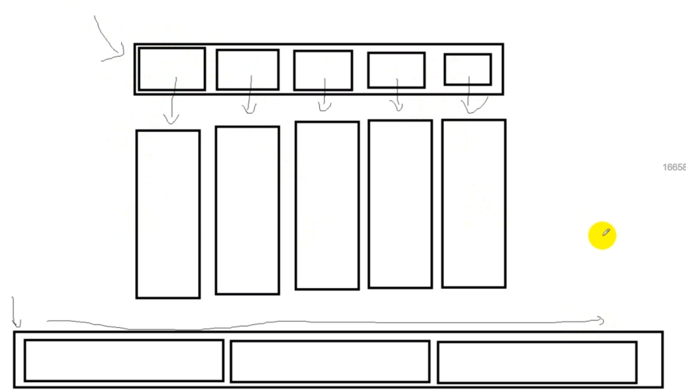

# 一、数组与指针

## 1.1 一维数组

### **1.1.1  数组名**

一维数组名指向第一个元素的指针(指向数组的首地址)

```c++
int a[4];
a 是 int类型
```

特殊情况：

* sizeof(数组名) :        计算整个数组的大小

* 对数组名取地址:     指向首地址但是步长跳越是整个数组长度. 

  ```c++
  int arr[5] = { 1, 2, 3, 4, 5 };
  
  int len = sizeof(arr)   //  5
      
  &arr   // 指向首地址
  arr    // 指向首地址
  &arr + 1      //  步长跳越的整个数组长度
  ```


### **1.1.2  指向一维数组的指针**

```c++
int arr[] = { 99, 15, 100, 888, 252 };

// 相同的都是指向数组首地址
int *p = arr;      
int *p = &arr[0]
```

==p  等价  arr==

**访问数组元素**

+ 下标法

  ```c++
  cout << arr[i]);
  ```

+ 指针法

  ```c++
  cout << *(arr + i));
  ```

###  技巧1.1.3一维数组表示二维数组

逻辑上是多维的，但存储在一维的数据结构中。**（计算机的内存结构是一维的）**

二维数组i][j]表示为一维数组：

- 行优先原则：a[i*N+j] i是行下标，N是一行的元素个数，j是列下标

  + ```c++
    const int row = MAX_SIZE * MAX_SIZE;    // 矩阵行
    /const int column = MAX_SIZE * MAX_SIZE + 1; // 矩阵列
    ```

- 列优先原则：a[i*M+j] i是列下标，M是一列的元素个数，j**是行下标**

将二维数组按行存储在一维数组中的方式

```c++
const int M = 3;
const int N = 4;

int main() {
    int a[M][N] = {{1, 2, 3, 4},
                   {5, 6, 7, 8},
                   {9, 10, 11, 12}};
    
    int b[M * N]; // 行优先存储的一维数组
    
    for (int i = 0; i < M; i++) {
        for (int j = 0; j < N; j++) {
            b[i * N + j] = a[i][j]; // 将a[i][j]存入b中对应的位置
        }
    }
    
    // 遍历b数组，输出其元素
    for (int i = 0; i < M * N; i++) {
        std::cout << b[i] << " ";
    }
    
    return 0;
}
```


例子:

```c
// 1. 创建10个箱子, 并且初始化为-1 
int* pTemp = new int[len * 10];  // 一维数组表示二维数组

//pTemp[idx] [j]:
(pTemp + (idx * 10) + j)
```


## **1.2   数组指针**

```c++
int arr[] = { 1, 2, 3, 4, 5 };

// 数组指针
int(*p)[5]  = &arr;   
```

==*p  等价   arr==

**访问数组元素**

+ 下标法

  ```c++
  cout << (*P)[i];
  ```

+ 指针法

  ```c++
  cout <<  *( (*P) + i) );
  ```

## 1.3  二维数组

### **1.3.1  数组名**

二维数组名是指向第一个一维数组指针(指向第一个一维数组首地址)

```c++
int a[5][5];

a        是 int(*)[列数] 类型(一维数组指针)
*a       是 *a  是一维数组地址
a[0]     是 a[0]是一维数组地址(相当于一维数组名)
a[0][0]  是 int类型i
```

特殊情况：

* sizeof(数组名) :        计算整个数组的大小

* 对数组名取地址:     指向指向第一个一维数组的首地址但是步长跳越是整个数组长度. 

  ```c++
  int row = sizeof(arr)/sizeof(arr[0]);
  int col = sizeof(arr[0]) / sizeof(int);
  ```

  

### **1.3.2  指向二维数组的指针**

```c++
int arr[3][3] =
{
    { 1, 2, 3 },    // 数组名指向的首地址
    { 4, 5, 6 },
    { 7, 8, 9 }
};

int(*p)[3] = arr;   // arr就是数组指针 , int (*p) 是数组指针
```

==*(p + i) 等价 p[i]==

**访问数组元素**

+ 下标法

  ```c++
  cout << p[1][2];   // 5
  ```

+ 指针法

  ```c++
  cout <<   *( *(p + 1) + 2);   // 5
  ```

注意:  并不是使用的是二级指针

## 1.4    数组在函数中的传递

**相当于按引用传递**。再往本质上讲，数组（数组名）作为函数参数传递时，退化为指针。

 对于普通的数组

```c++
int array(int arr[], int n);
int array(int *arr, int n);    // 法二
-------------------
//二维数组
 int array(int arr2[][4], int n);
 int array(int (*arr2)[4], int n);   //二维数组名 等价与 一维数组的指针
```

对char型数组

```c++
void func(const char* s);
void func(char *s)            // 当想修改字符串实参 的内容时
```

# 二、动态数组

##  2.1   一维动态数组

c:

```c
char *naem = malloc(sizeof(char)*10);
free(name);
```

c++:

```c++
char *name = new char[10];
int *dp = new int[10]; // 每个元素都没有初始化（值随机）
int *dp = new int[10] ();  // 每个元素初始化为0
int *dp = new int[10] = {1};  // 初始化第一个元素为1
delete[] dp;  // 动态释放
```

数组怎么用上面的指针就怎么使用

例子:

```c++
int arr[4] = {1, 2, 3, 4};

int* pArrNew = new int[4];
pArrNew = arr;

// each动态数组
for (int i = 0; i < 4; i++)
{
	cout << pArrNew[i];
}

delete [] pArrNew; // 会报错

//
int* pArr = new int[5];
for (int i = 0; i < 5; i++)
{
    pArr[i] = i;
}
delete [] pArr; // 不会报错
```

<font color = red>delete 动态数组前需将指针拨回第一个元素</font>

## 2.2   二维动态数组

c

```c
char ** naem = malloc(sizeof(char *)*10);
```

c++

```c++
int** pArr = new int*[4];   // 4行
for (int i = 0; i < 4; i++)
{
    parr[i] = new int[10];   // 每行10列
}
```

例子:

```c
// 申请:
char ** naem =  malloc(sizeof(int *)*10);  // 10行  //二级指针每个元素指向的是一级指针

for (int i = 0; i < 10; i++)   // 每行 // 每个一级指针都申请一个一维数组
{
    name[i] = malloc(sizeof(int));  // int *    // 行去申请一维的指针
}


//释放: 
for ( int i = ; i < 3; i++)
{
 	free(name[i]);
}
free(name);
```

例子:

**二维动态数组初始化:**

```c++
int a[3][4] = 
{
    {1, 2, 3, 4},
    {5, 6, 7, 8},
    {9, 10, 11, 12}
}; //定义二维数组a，并赋值从1-12.

int ** p = NULL;  //定义二维指针。
int i, j;
p = (int **)malloc(sizeof(int *) *3);  //要访问的数组有三行，所以申请三个一维指针变量。
for(i = 0; i < 3; i ++)
{
    p[i] = a[i];  //将二维数组行地址赋值到对应的一维指针上。 // 实质就分配内存空间
}

for(i = 0; i < 3; i ++)
{
    for(j = 0; j < 4; j ++)
        printf("%d ", p[i][j]); //用指针输出元素。p[i][j]这里也可以写作*(*(p+i) + j)。
    printf("\n");  
}

free(p);//释放申请的内存。
```

int、char、string三种指针数组的初始化

```c++
int **a = new int *[10];
char **c = new char *[10];
string *str = new string[10];

char temp[20] = "偶稀饭你！";


//两层循环，int数组和char数组一并赋值了
for (int i = 0; i < 10; i++)
{
    a[i] = new int[10];    // 每行都申请一个一维数组
    c[i] = new char[20];
    for (int j = 0; j < 10; j++)
    {
        a[i][j] = 520;
    }
    memcpy(c[i], temp, sizeof(temp));
    c[i][sizeof(temp) + 1] = '\0';
}

//string数组赋值
for (int j = 0; j < 10; j++)
{
    str[j] = "稀饭你";
}

//输出
for (int k = 0; k < 10; k++)
{
    cout << *a[k] << endl
        << c[k] << endl
        << str[k] << endl
        << endl;
}
return 0;


520
偶稀饭你！
稀饭你
```

**单纯的二级指针指向一级:**

```
#include <iostream>
int main(int argc, char const* argv[])
{
    char test[10][10] = { {"一天"}, {"一夜"} };
    
    char* testp [10];
    for (int i = 0; i < 10; i++) {
        testp[i] = test[i];
    }
    
    char** temp = testp;
    
    std::cout << temp[0] <<  temp[1]  << std::endl;
    return 0;
}

一天	一夜
```

//




# 三、大小

```c
数组长度:  arr只能是数组名
一维:
int len = sizeof(arr) / sizeof(int);
二维:
int row = sizeof(arr)/sizeof(arr[0]);
int col = sizeof(arr[0]) / sizeof(int);
//记忆 二维数组名的是 一维指针数组的大小 理解成 一行
```

# 四、形参的类型设置

数组 --->指针,  又分为 字符串(字符数组)  和 普通的数组(其他整型数组)

**对char型数组:**

```c++
void func(const char* s);
void func(char *s)        // 当想修改字符串实参 的内容时
```

   **对于普通的数组:**

```c++
int array(int arr[], int n);
int array(int *arr, int n);
-------------------
//二维数组
 int array(int arr2[][4],  int m, int n);
 int array(int (*arr2)[4], int m, int n);   //二维数组名 等价与 一维数组的指针
 int array(int **a, int m, int n ;       // a也是当作数组名
```

# 五、返回类型

c语言/C++中函数是不能直接返回一个数组的，但是数组其实就是指针，所以可以让函数返回指针来实现。

`不能直接返回函数中定义的数组，会被释放掉`

**1.返回int ***

```c++
float* add(float a[3], float b[3])
{
    float* sum = new float[3];   // 不能返回一个普通的数组
    sum[0] = a[0] + b[0];
    sum[1] = a[1] + b[1];
    sum[2] = a[2] + b[2];
    return sum;  // 返回数组
}

int main()
{
    float A[3] = { 1, 1, 1};
    float B[3] = { 1, 2,3};
    float *M = add(A, B);   // 接受数组
    cout << M[0] << " " << M[1] << "  "<<M[2]<<endl;
    cout << M[0] << " " << M[1] << "  " << M[2] << endl;
    delete[] M;   //增加
    system("pause");
    return 0;
}
```

**2 . 返回vector< int > **

```c++
class Solution {
public:
    vector<int> twoSum(vector<int>& nums, int target) {
        int n = nums.size();
        for (int i = 0; i < n; ++i) {
            for (int j = i + 1; j < n; ++j) {
                if (nums[i] + nums[j] == target) {
                    return {i, j};   // 返回数组
                }
            }
        }
        return {};  // 返回空
    }
};

int main()
{
    int target = 9;
    vector<int> nums = {2,7,11,15},  result;  // result 定义成一个vector
    result = twoSum(nums,target);   /// result 接受 twoSum返回的值
}
```
