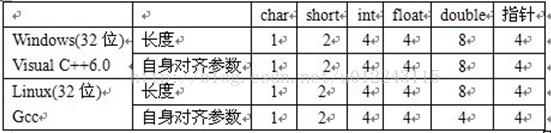

# 一、结构体

## 1.1 结构体变量声明

c

```c++
typedef struct Student
{    
    ...
}Student;	//加了typedef之后，这里的Student就是struct Student 的别名了

// 定义
Student maye;
```

c++

```c++
struct Student
{
    ...
}

// 定义
Student maye;
```

C++的结构体也具有类的功能，与 class 不同的是，结构体包含的函数默认为 public，而不是 private。

例子:

```c
typedef struct
{
    char id[MAX_LEN];
    char name[MAX_LEN];
    double price;
    char seller_id[MAX_LEN];
    char date[MAX_LEN];
    char description[MAX_LEN];
    
} Good;
```

## 1.2 结构体变量定义

1. 先声明结构体类型再定义结构体变量

```c
struct Student maye;
```

2. 在声明结构体类型的同时定义变量

```c
struct Student
{
    ...
}maye;
```

3. typedef取别名之后再定义变量

```c
typedef struct Student
{    
    ...
}Student;	//加了typedef之后，这里的Student就是struct Student 的别名了
Student maye;
```

+ 通过第一种方法定义结构体变量时，struct关键字不能省略。

## 1.3 结构体变量初始化

在定义结构体变量的同时通过{}的方式为每一个成员变量进行赋初值

+ **和数组初始化一样**，只能从左边开始逐个初始化，不能跳过
+ 初始化时，类型及顺序要一一对应

创建结构体类型:

```c
typedef struct 
{
	//这里写Student的属性
	unsigned long long stuno;	//学号
	char name[20];				//姓名
	char age;					//年龄	
}Student;     //结尾的分号不能少，Student是类型名(别名)
```

1. 全部初始化

```c
Student maye = {100,"maye",1,18,666};
```

```c
//c中如果不是用起别名的方式
struct Student maye = {100,"maye",1,18,666};
```


2. 部分初始化：未初始化部分自动初始化为0, 按顺序的

```c
Student maye = {100};
```

3. 全部初始化为0

```cpp
Student maye = {0};
```

4. **初始化指定的成员(可以初始化任意成员，不必遵循定义顺序), c语言特有**

```c
Student maye = {.id = 100,.age = 18};
```

5. 用另一个结构体变量初始化: 

```c
Student zc = maye;
zc = (struct Student){200，"zc"};
```

## 1.4 结构体变量的使用

要通过结构体变量访问成员，就需要用到成员访问运算符(. 或 ->)~

+ 普通结构体变量访问成员使用 .

```c
struct Student hero = {007,"007特工"};
hero.name;
```

+ 通过结构体指针访问成员使用 ->

```c
struct Student *ph = &hero;
(*ph).name;
ph->name;


//动态在堆区使用指针
struct Student * p2 = malloc(sizeof(struct Person));
p2->age = 20;
strcpy(p2->name, "bbb");
printf("p2 姓名： %s  , 年龄:  %d \n", p2->name, p2->age);
```

##  1.5 结构体嵌套

在一个结构体内包含另一个结构体作为其成员，有两种写法。

比如，给学生增加一个出生日期，包含年月日.

**定义 : **

1. 先定义好结构体，然后在另一个结构体中定义结构体变量

```c
struct Date
{
    short year;
    short month;
    short day;
};

struct Student
{
    int id;
    char name[10];
    struct Date birth;	//出生日期
};
```

2. 直接把结构体定义在另一个结构体内。

```c
struct Student
{
    int id;
    char name[10];
    struct Date
	{
    	short year;
    	short month;
    	short day;
	}birth;//出生日期
};
```

**使用:**

+ 当出现结构体嵌套时，必须以级联方式访问结构体成员，即通过成员访问运算符逐级找到最底层的成员。

```c
struct Student maye;
maye.birth.year = 2022;
maye.birth.month = 2;
maye.birth.day = 9;

struct Student zc = {2000,"顽石",{2021,5,14}};
```

## 1.6 C++中的结构体内的函数

 在C++中除了类中可以有构造函数和析构函数外，结构体中也可以包含构造函数和析构函数，这是因为结构体和类基本雷同，唯一区别是，类中成员变量默认为私有，而结构体中则为公有。

注意，C++中的结构体是可以有析构函数和构造函数，而C则不允许。而共用体，它是不可能有析构函数和构造函数的。

结构体变量所占内存长度是各成员占的内存长度之和，每个成员分别占有自己的内存单元。共用体变量所占的内存长度等于最长的成员的长度。即它是一种内存覆盖，也就是说，同一块内存在不同的时刻存储不同的值（可以是不同的类型）。

## 1.7 结构体赋值问题以及解决

这涉及到一个深浅拷贝的问题

### 1.7.1 结构体不包含指针的情况

```C
struct Person
{
	char name[64];
	int age;
};

void test01()
{
	struct Person p1 = { "Tom", 18 };

	struct Person p2 = { "Jerry", 20 };

	p1 = p2; //逐字节的进行拷贝

	printf("P1 姓名 ： %s, 年龄： %d\n", p1.name, p1.age);
	printf("P2 姓名 ： %s, 年龄： %d\n", p2.name, p2.age);
}
```

### 1.7.2 结构体包含指针的情况

```C
struct Person2
{
	char * name;
	int age;
};

void test02()
{
	struct Person2 p1;
	p1.name =  malloc(sizeof(char)* 64);
	strcpy(p1.name, "Tom");
	p1.age = 18;

	struct Person2 p2;
	p2.name = malloc(sizeof(char)* 128);
	strcpy(p2.name, "Jerry");
	p2.age = 20;

	//赋值
	//p1 = p2;  // 会出错

	//解决方式  手动进行赋值操作
    //核心
	///////////////////////////////////  
	if (p1.name!=NULL)
	{
		free(p1.name);
		p1.name = NULL;
	}

	p1.name = malloc(strlen(p2.name) + 1);
	strcpy(p1.name, p2.name);

	p1.age = p2.age;

	////////////////////////////////////

	printf("P1 姓名 ： %s  年龄： %d\n", p1.name, p1.age);
	printf("P2 姓名 ： %s, 年龄： %d\n", p2.name, p2.age);

	//堆区开辟的内容 自己管理释放
	if (p1.name != NULL)
	{
		free(p1.name);
		p1.name = NULL;
	}

	if (p2.name != NULL)
	{
		free(p2.name);
		p2.name = NULL;
	}

}
```

**总结：当结构体中包含堆区的指针，要利用深拷贝解决浅拷贝的问题**

# 二、结构体指针

**注意事项**

+ 当结构体中有指针类型,  必须逐个元素取赋值(涉及到深浅拷贝的问题)
+ **可以指向 ①另一个结构体  ②先动态开辟内存   ③某个函数(返回值是结构体指针的) 。反正不能直接初始化**    

例子:

```c
struct Student hero = {007,"007特工"};
struct Student *ph = &hero;

//访问结构体属性
ph->name;
```

## 2.1 动态结构体

**动态开辟内存** 

c:

```c
struct Person * p2 = malloc(sizeof(struct Person));
```

c++:

```c++
name *p = new name;
```

例子:

```c++
struct name
{
    int a;
    char b[122];
    int c[10];
};

void test05()
{
    name *p = new name;
    
    p->a = 10;
    strcpy(p->b, "bbb");     // char字符串只能用strcpy();
    int a[10] = {0};
 	
    // each
    for (int i = 0; i < 10; i++)
    {
        p->c[i] = a[i];
    }
}
```

## 2.2 memset使用

memset可以方便的清空一个结构类型的变量或数组。如：

```cpp
struct sample_struct
{
    char csName[16];
    int iSeq;
    int iType;
};
```

结构体

```cpp
memset(&stTest,0,sizeof(struct sample_struct));
```

结构体数组：

```cpp
struct sample_struct TEST[10];
```

则

```c
memset(TEST,0,sizeof(struct sample_struct)*10); 
```

**注意事项**

+ memset初始化 int型 数组的时候只支持将数组中的所有元素初始化为 0 或 -1

+ memset() 可以初始化一个 bool数组 memset(b, true或false, sizeof(b));

```c++
#include<algorithm> 的 fill() 函数，可以方便快捷的初始化数组元素为规约范围内的任意值~
```

```c++
//例子：将数组元素全部初始化为233
int a[5]={0};
fill(a,a+5,233);
```


## 2.3 深浅拷贝问题

<font color = red>如果两个都是直接初始化结构体, 那么无论结构体内是否包含指针, 都可以直接赋值</font>

```c++
#include <stdio.h>
#include <string.h>
#include <stdlib.h>
struct Person2
{
	char * name;
	int age;
};

void test02()
{
	struct Person2 p1;
	p1.name =  malloc(sizeof(char)* 64);
	strcpy(p1.name, "Tom");
	p1.age = 18;

	struct Person2 p2;
	p2.name = malloc(sizeof(char)* 128);
	strcpy(p2.name, "Jerry");
	p2.age = 20;

	//赋值
	// p1 = p2;  // 会出错

	//解决方式  手动进行赋值操作
    //核心
	///////////////////////////////////  
	if (p1.name!=NULL)
	{
		free(p1.name);
		p1.name = NULL;
	}

	p1.name = malloc(strlen(p2.name) + 1);
	strcpy(p1.name, p2.name);

	p1.age = p2.age;

	////////////////////////////////////

	printf("P1 姓名 : %s  年龄:  %d\n", p1.name, p1.age);
	printf("P2 姓名 : %s, 年龄:  %d\n", p2.name, p2.age);


  // 除了两结构体都是通过初始化赋值外
   struct Person2 p3 = {"p3", 10};
   struct Person2 p4 = {0};
   struct Person2 p5 = {"p5", 100};
   printf("P3 姓名 : %s, 年龄: %d\n", p3.name, p3.age);
   p4 = p3;
   printf("P4 姓名 : %s, 年龄:  %d\n", p4.name, p4.age);
   p5 = p3;
   printf("P5 姓名 : %s, 年龄:  %d\n", p5.name, p5.age);


//    p2 = p5;  // 报错
//    p5 = p2;  // 报错


	//堆区开辟的内容 自己管理释放
	if (p1.name != NULL)
	{
		free(p1.name);
		p1.name = NULL;
	}

	if (p2.name != NULL)
	{
		free(p2.name);
		p2.name = NULL;
	}

}

int main()
{
    test02();    
    return 0;
}
```

运行结果

```
P1姓名: Jerry, 年龄:20
P2姓名: Jerry，年龄:20
P3姓名: p3, 年龄:10
P4姓名: p3，年龄:10
P5姓名: p3，年龄:10
```

# 三、结构体数组

==理解:  当作数组用就行==

**结构体数组的大小: 	int len = sizeof(结构体对象名) / sizeof(struct 结构体名);**

```c
结构体数组
作用：将自定义的结构体放入数组中方便维护
语法：
struct 结构体名 数组名[元素个数] = {{},{},{},.....};
    
    
实例：
#include<iostream>
#include<string>
using namespace std;

//结构体数组
//1.创建一个结构体
struct Student {
	//姓名
	string name;
	//年龄
	int age;
	//分数
	int score;
};
int main() {
	//2.创建一个结构体的数组
	struct Student stuArray[3] = {
		{"张三",78,89},
		{"李四",45,99},
		{"王五",45,88}
	};
	//3.给结构体中数组中的元素赋值
	stuArray[2].name = "赵六";
	stuArray[2].age = 11;
	stuArray[2].score = 99;
	//4.遍历结构体数组
	for (int i = 0; i < 3; i++) {
		cout << "姓名：" << stuArray[i].name << " 年龄：" << stuArray[i].age << " 分数：" << stuArray[i].score << endl;
	}
	system("pause");
	return 0;
}

姓名：张三 年龄：78 分数：89
姓名：李四 年龄：45 分数：99
姓名：赵六 年龄：11 分数：99
请按任意键继续. . .
```

例子:

```c
#include <stdio.h>

struct Student
{
    int id;
    char name[10];
    int age;
    char sex;
};
/*
1001 小红 22 F
1002 小明 21 M
1003 小欣 23 F
1004 小天 20 F
1005 小黑 19 M
*/

int main()
{
    struct Student stus[10];
    for (int i = 0; i < 5; i++)
    {
        printf("input %d stu>",i+1);
        scanf("%d %s %d %c",&stus[i].id,stus[i].name,&stus[i].age,&stus[i].sex);
    }

    struct Student maxStu = stus[0];
    for (int i = 0; i < 5; i++)
    {
        if (maxStu.age < stus[i].age)
        {
            maxStu = stus[i];
        }         
    }
    printf("%d %s %d %c\n", maxStu.id,maxStu.name, maxStu.age, maxStu.sex);

    return 0;
}

//结果
input 1 stu>1001 小红 22 F
input 2 stu>1002 小明 21 M
input 3 stu>1003 小欣 23 F
input 4 stu>1004 小天 20 F
input 5 stu>1005 小黑 19 M
1003 小欣 23 F
```

例子:

```c
int main()
{
    struct Student stus[10] = 
    {
        {1001, "小红", 22, 'F'},
        {1002,"小明" ,21,' M'},
        {1003,"小欣" ,23, 'F'},
        {1004, "小天", 20, 'F'},
        {1005, "小黑", 19, 'M'}
    };

    struct Student maxStu = stus[0];
    for (int i = 0; i < 5; i++)
    {
        if (maxStu.age < stus[i].age)
        {
            maxStu = stus[i];
        }         
    }
    printf("%d %s %d %c\n", maxStu.id,maxStu.name, maxStu.age, maxStu.sex);

    return 0;
}

// 结果:
1003 小欣 23 F
```

#  四、动态结构体数组

c:

```c
struct Person * personPoint = malloc(sizeof(struct Person) * 4);
```

c++:

```
Person * personPoint = new Person[4];
```

例子:

```c
struct Person * personPoint = malloc(sizeof(struct Person) * 4);
sprintf(personPoint[].name, "name_%d", i);
personPoint[i].age = i + 10;
```

#  五、结构体偏移量

意义：**能够计算出结构体中属性相对于首地址的偏移量**

案例：

```C
#include <stddef.h>
struct Teacher
{
	char a;
	int b;
};

void test01(){

	struct Teacher  t1;
	struct Teacher*p = &t1;


	int offsize1 = (int)&(p->b) - (int)p;  //通过地址查看成员b 相对于结构体 Teacher的偏移量
	int offsize2 = offsetof(struct Teacher, b);//通过宏函数查看

	printf("offsize1:%d \n", offsize1); //打印b属性对于首地址的偏移量
	printf("offsize2:%d \n", offsize2);
}


-------------------------------------

//通过偏移量 打印成员数据
void test02()
{
	struct Teacher a = { 'a', 10 };
	//打印c2的数据
	printf("t.b = %d\n", *(int *)((char*)&a + offsetof(struct Teacher, b)));

	printf("t.b = %d\n", *(int*)((int *)&a + 1 ));
}


-----------------------------------------
   
    
//结构体嵌套结构体 计算偏移量方法
struct Teacher2
{
	char a;
	int  b;
	struct Teacher c;   // char a; int  b;
};

void test03()
{
	struct Teacher2 t = { 'a', 10, 'b', 20 };
	
    // t.c.a ----> 访问到 struct Teacher c 的 a
    // 通过地址偏移
	int offset1 = offsetof(struct Teacher2, c);
	int offset2 = offsetof(struct Teacher, b);

	printf("%d\n", *(int *)(((char*)&t + offset1) + offset2)); // 先找c再找c中的b

	printf("%d\n", ((struct Teacher2 *)((char *)&t + offset1))->b);
}
```


# 六、 结构体对齐

## 6.1 对齐规则

对齐:



对齐计算原则:

1.  第一个属性 从偏移量0位置开始存储
2.  第二个属性开始，放在 min( 该类型的大小 ,  对齐模数) 的整数倍上
3.  整体计算完毕后算总大小，结构体总大小必须是 min( 该结构体中最大数据类型 , 对齐模数) 整数倍,不足要补齐

```c++
typedef struct node1
{
	int a; // 0-3
	char b; //  min(1, 8) = 1    // n * 1 > 3 // 4 
	short c; // min(2, 8) = 2    // n * 2 > 4 // 6 - 7
}S1;
//  min(4, 8) = 4  //4*n > 7 所以 8
 
typedef struct node2
{
	char a; // 0
	int b;  // 4/8=4  //4-7
	short c; // 2/8=2 // 8-9
}S2;
// 4/8=4 // n*4 > 9 所以 12
 
typedef struct node3
{
	int a;  // 0 - 3
	short b;  // 2/8=2 // 2*n > 3 // 4 - 6 
	static int c; // 4/8=4 //4*n > 4 // 8 - 11 
}S3;
// 4/8=4   // 4*n > 11  所以 12

//2、结构体嵌套结构体， 按照子结构体最大的类型计算
struct Student2
{
	char a;  // 0 
    //找struct Student最大的类型  double 8
	struct Student b {      
        int a;       // 4/8=4  // 4*n > 8  // 8 - 12
        char b;      // 1/8=1  // 1*n > 12 // 13
        double c;    // 8/8=1  // 8*n > 13 // 16 - 23
        float d;     // 4/8=4  // 4*n > 23 // 24 - 27
    };  
	double c; // 8/8=8 //8*n > 27 // 27 - 31 
};
```

## 6.2 设计结构体时的技巧

**将占用空间小的成员尽量集中在一起**

```c++
struct S1
{
	char a;
	char b;
	int c;
};//结构体1      8
struct S2
{
	char a;
	int c;
	char b;
};//结构体2     12
```

## 6.3 修改默认对齐数

```c++
#pragma pack(1)//设置默认对齐数为1
struct S2
{
	char a;//1/1->1
	int b;//4/1->1
	char c;//1/1->1
};//6
#pragma pack()//取消设置的默认对齐数，还原为默认
```

**这样设置到结构体的大小就等于sizeof(S2)方便操作**

# 七、位结构

有些信息在存储时，并不需要占用一个完整的字节， 而只需占几个或一个二进制位。
例如在存放一个开关量时，只有0和1 两种状态， 用一位二进位即可。
为了节省存储空间，并使处理简便，C语言又提供了一种数据结构，称为“位域”或“位段”。
所谓“位域”是把一个字节中的二进位划分为几个不同的区域， 并说明每个区域的位数。每个域有一个域名，允许在程序中按域名进行操作。 这样就可以把几个不同的对象用一个字节的二进制位域来表示。

位结构体是一种特殊的结构, 在需按位访问一个字节或字的多个位时, 位结构体比按[位运算](https://so.csdn.net/so/search?q=位运算&spm=1001.2101.3001.7020)符更加方便。

##  7.1 声明

一般形式具体如下：

```c
struct 结构体名
{
  	  整数类型 位段名1 : 位段大小;  
      整数类型 位段名2 : 位段大小;
      整数类型 位段名3 : 位段大小;
      整数类型 位段名4 : 位段大小;
      ...
};
```

## 7.2 定义

```c
struct bit
{
	int a:1;//第0位
	int b:2;//第1,2位
	int c:3;//第3,4,5位
	int d:4;//第6,7,8,9位
	int e:6;//第10,11,12,13,14位
};

//定义
bit temp;
```

**注意：**

1. 位结构中的成员可以定义为unsigned, 也可定义为signed, 但当成员长度为1时, 会被认为是unsigned类型。因为单个位不可能具有符号。
2. 位结构中的成员不能使用数组和指针, 但位结构变量可以是数组和指针, 如果是指针, 其成员访问方式同结构指针。
3. 位结构成员可以与其它结构成员一起使用。

## 7.3 使用

位结构体变量的赋值和一般结构体赋值的方法是一样的。
**初始化定义时—赋值**

```c
struct bit
{
	int a:1;//第0位
	int b:2;//第1,2位
	int c:3;//第3,4,5位
	int d:4;//第6,7,8,9位
	int e:6;//第10,11,12,13,14位
}temp={1,3,6,10,26};
```

**初始化后—赋值**

```c
	temp.a=1;
	temp.b=3;
	temp.c=6;
	temp.d=10;
	temp.e=26;
```

**例子1:**

```c
#include <stdio.h>

struct bit
{
	int a:1;//第0位
	int b:2;//第1,2位
	int c:3;//第3,4,5位
	int d:4;//第6,7,8,9位
	int e:6;//第10,11,12,13,14,15位
}temp={1,3,6,10,26};

int main(int argc, char *argv[])
{
	int i = *((int*)&temp);
	printf("0x%x\n",i);
	return 0;
}
```

运行结果如下：

```c
0x6ab7
```

解释说明：

| 变量  | 15 14 13 12 11 10 | 9 8 7 6 | 5 4 3 | 2 1  | 0    |
| ----- | ----------------- | ------- | ----- | ---- | ---- |
| a(1)  |                   |         |       |      | 1    |
| b(3)  |                   |         |       | 1 1  |      |
| c(6)  |                   |         | 110   |      |      |
| d(10) |                   | 1010    |       |      |      |
| e(26) | 011010            |         |       |      |      |

```c
结果是0b0110101010110111 = 0x6ab7
```

**例子2:**

```c
#include <iostream>
#include <memory.h>

using namespace std;

struct A
{
    int a:5;  //0,1,2,3,4
    int b:3;  //5,6,7
};
// 4字节

int main(void)
{
    char str[100] = "0134324324afsadfsdlfjlsdjfl";
    struct A d;
    memcpy(&d, str, sizeof(A));
    cout << d.a << endl;
    cout << d.b << endl;
    return 0;
}
```

在32位x86机器上输出：

```c
-16
1
```

上例程序中定义了位域结构A，两个个位域为a（占用5位），b（占用3位），所以a和b总共占用了结构A一个字节（低位的一个字节）。

当程序运行到14行时，d内存分配情况：

```
 高位 00110100 00110011   00110001    00110000 低位
       '4'       '3'       '1'          '0'  
 其中d.a和d.b占用d低位一个字节（00110000）,d.a : 10000, d.b : 001
```

 d.a内存中二进制表示为10000，由于d.a为有符号的整型变量，输出时要对符号位进行扩展，所以结果为-16（二进制为11111111111111111111111111110000）

 d.b内存中二进制表示为001，由于d.b为有符号的整型变量，输出时要对符号位进行扩展，所以结果为1（二进制为00000000000000000000000000000001）

**例子3**

```c
struct BitField
{
    unsigned char a:1;
    unsigned char b:4;
    unsigned char c:3;
};

//说明BitField的变量，共占1个字节。其中位域a占1位，位域b占4位，位域c占3位。
    
int main()
{
    //初始化
    struct BitField bit = {1,2,3};
    //输出
    printf("first:%d %d %d\n",bit.a,bit.b,bit.c);
    //赋值
    bit.a = 2;
    bit.b = 20;
    bit.c = 8;
    //再次输出
    printf("last:%d %d %d\n",bit.a,bit.b,bit.c);
}
```

运行结果：

```text
fast:1 2 3
last:0 4 0
```

第一次的输出结果都是完整的，第二次输出的结果令人摸不着头脑。

+ **第一次输出时：**a、b、c的值分别为1、2、3，转换成二进制分别是0b1、0b10、0b11，都没有超出限定的位数，能正常输出。

+ **第二次输出时：**a、b、c的值分别为2、20、8，转换成二进制分别是0b10、0b10100、0b1000，所有位段都超出了限定的位数，不能正常输出。
  + 超出部分被直接截去(从高位开始截断，即从左往右)，截去之后的二进制分别为0b0、0b0100、0b000，换算成十进制分别为0、4、0

## 7.4 注意事项

1、**位段的内存分配：**位段占的二进制位数不能超过该基本类型所能表示的最大位数，**即位段不能跨字节存储**，比如char是占1个字节，那么最多只能是8位；

```c
struct Bit
{
  	char a:3;	//right
	char b:9;	//error C2034: “d”: 位域类型对位数太小
};
```

2、**位结构大小**

**位域的存储：**C语言标准并没有规定位域的具体存储方式，不同的编译器有不同的实现，但**它们都尽量压缩存储空间。**

当相邻成员的类型相同时，如果它们的位宽之和小于类型的 sizeof 大小，那么后面的成员紧邻前一个成员存储，直到不能容纳为止；如果它们的位宽之和大于类型的 sizeof 大小，那么后面的成员将从新的存储单元开始，其偏移量为类型大小的整数倍。

```c
struct Bf1
{
    char a:3:
    char b:3;
};
//sizeof(struct Bf1) == 1


//一个字节所剩空间不够存放另一位域时，应从下一单元起存放该位域。也可以有意使某位域从下一单元开始
struct Bf2
{
    char a:3:
    char b:3;
    char c:3; /*从下一单元开始存放*/
};
//sizeof(struct Bf2) == 2
```

3、**禁止对位段取地址**：地址是字节（Byte）的编号，而不是位（Bit）的编号。

```c
&bit.a;		//error C2104: 位域上的“&”被忽略
```

4、**无名位段：**位域成员可以没有名称，只给出数据类型和位宽

```c
struct Bf
{
    int a:12;
    int :20;  /*无位域名，该20位不能使用*/
    int b:4;
};
```

+ 无名位域一般用来作填充或者调整成员位置。因为没有名称，无名位域不能使用。

+ 上面的例子中，如果没有位宽为 20 的无名成员，a、b 将会挨着存储，sizeof(struct Bf) 的结果为 4；有了这 20 位作为填充，a、b 将分开存储，sizeof(struct Bf) 的结果为 8。

## 7.5 位结构和共用体联合使用

具体程序如下：

```c
#include <stdio.h>

typedef union 
{
	int  data;
	struct 
	{
		int a:1;//第0位
		int b:2;//第1,2位
		int c:3;//第3,4,5位
		int d:4;//第6,7,8,9位
		int e:6;//第10,11,12,13,14,15位
	}bit;
}_MQ; 

_MQ mq=
{
   .bit.a = 1,
   .bit.b = 3,
   .bit.c = 6,
   .bit.d = 10,
   .bit.e = 26
};

int main(int argc, char *argv[])
{
	printf("data=0x%x\n",mq.data);
	return 0;
}
```

运行结果如下：

```
data=Ox6ab7
```

# 八、大小

**结构体大小:**

```c
sizeof(struct Person)
注意: memcpy时用sizeof(结构体具体对象名字)
```

**结构体数组长度:**

```c
int len = sizeof(personArr) / sizeof(struct Person);
```

# 九 、形参的类型设置

**结构体:**

```c
结构体---->引用或指针(数据结构常用), 后者访问成员数据的时候用箭头(结构体数组除外)
```

**结构体数组:**

```c++
void printPerson( struct Person personArr[], int len)
```

# 十、 返回类型

**不要返回指向局部变量 或 临时变量的引用/指针**