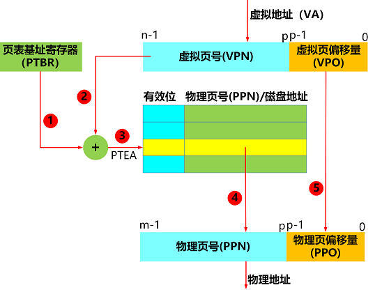

#  逻辑地址和物理地址

**逻辑地址:**

现在程序运行时由中央处理单元生成的内容的地址称为逻辑地址(虚拟地址)。谈论逻辑地址时，我们指的是CPU分配给每个进程的地址，一个进程在内存中所处的实际地址与进程认为它所处的地址是不一样的。每当 CPU 运行一个进程时，它都会为该进程分配一个特定的内存。此分配的内存空间位于 CPU 为进程生成逻辑地址。

**物理地址:**

物理地址是进程及其内容放置在主内存或硬盘中的地址，是内存中的内存单元实际地址。用户从不直接处理物理地址, 该地址不能直接由用户程序访问或查看，因此需要将逻辑地址映射到该地址，以便借助显示位置而不是代码的指针进行访问(逻辑地址必须通过MMU映射到物理地址才能使用)


**简易理解：**

+ 逻辑地址就是相对地址
+ 比如在1G的内存里分配1M的空间这1M空间中的第一个字节,就算是逻辑地址在1G内存的100M的地方开始分配1M的空间,这时101M的第一个字节,这个就是指的物理地址,
+ 比如：有四个人要租房 ，房子的地址是XX街道XX号,这个地址就是实际的地址，是物理地址。房东将这四间房子进行编号1 2 3 4 号 。  这四人平时聊天会说自己住在几号房，这个就是逻辑地址，但实际地址还是XX街道XX号。

**区别:**


# 虚拟内存，虚拟地址，虚拟地址空间

程序经过编译后，变成了可执行的文件，可执行文件主要包括代码和数据两部分，代码是只读的，数据则是可读可写的。

**CPU访问代码和数据方式经历过四个阶段:**

1. 直接访问

2. 段基址+段偏移地址

3. 段选择子+段偏移地址

4. 虚拟地址

现代操作系统采用的是虚拟地址,但虚拟地址是由1~3 阶段发展而来的，所以也有必要阐述1~3三种访问方式。

## 直接访问

直接访问: 程序经过编译后,生成了可执行文件，编译器给每行数据和代码分配了一个唯一的地址，如下图


如上图可执行文件中1000 ~ 1024之间的地址，加载到内存后，内存的地址也是1000~1024，**在可执行文件中分配的唯一地址就是内存中的物理地址**，这就叫直接访问

**缺点:**

+ 当时问题也不少，例如同一个可执行文件不能同时执行，它们的物理地址一样，冲突了，必须一个接一个，还有就是可执行文件的物理地址已经固定了，如果想在其它物理地址运行，必须地重新编译，生成新的物理地址。

**优点:**

+ 直接定位是计算机发展早期的产物，早期没有那么多的程序要运行，程序都是一个接一个地去执行的，因此早期这种定位比较简单，直接高效。

## 段基址+段偏移地址

随着多任务需求的来临，现在内存中要并发运行多个程序，虽然采用直接定位把每个不同的程序放在不同的内存段中，勉强可以满足，但是一个可执行文件不能同时运行多个，另外程序必须在固定的物理地址运行，灵活性大大减弱，调度起来也是非常麻烦，因此CPU设计师和操作系统开发人员发明了段基址+段偏移地址。

Inter 8086处理器就是采用这种定位方式，我们知道可执行文件主要分为数据段和内存段，如下图


由上图红色部分可知，**0,4,8就是相对于数据段的偏移地址，0，4,8,12是相对于代码段的偏移地址。**

在可执行文件中，一个段的偏移地址是固定的，无论可执行文件加载到内存的什么位置,这个偏移地址是固定的。

当可执行文件加载到内存时,先在内存中分配一个数据段和代码段，这两个段理论上可以不挨着，一般情况下，代码段和数据段是挨着的，**代码段和数据段在内存中都有一个起始地址，这个起始地址就叫做段基址,**这个段基址是放在段寄存器里，例如代码段基址放在CS寄存器,数据段基址放在DS寄存器,当然还有其他的段例如栈段,栈段刚开始大小为0，随着程序的运行入栈,出栈，这个栈段在不断扩展

假设可执行文件被加载到了内存中，如下图


如上图所示,代码段被布局到以**0x00600000**为起始地址的内存中,数据段被布局到以**0x00601000**为起始地址的内存中。

==**【段基址+段偏移地址】**的定位方式:==

把起始地址加入到寄存器中，也是为了后续再执行指令或者获取数据时，可以直接从寄存器获取，加快CPU执行的速度。

①当CPU开始执行代码段的第一条指令时,会将代码段的起始地址放入到段寄存器中,此时CS代码段寄存器中存储的就是**0x00600000**,然后开始从起始地址处开始执行第一条代码指令，此时把代码指令的偏移地址放入到IP寄存器中,IP寄存器存储的就是0，所以CPU要定位一条代码指令时通过CS:IP的方式定位的，如下图所示 定位指令


②当CPU执行到**0x00600000**处的代码指令时，该指令为**MOV AX,[0]**，该指令的意思是把地址0处的数据存储到AX寄存器，**这个0就是数据段的偏移地址**，**此时CPU会将数据段的起始地址加入到DS段寄存器中**,然后将数据段寄存器的值+偏移地址即**0x00601000+0=0x00601000**定位到了数据123，然后将123存储到AX寄存器中。如下图所示 定位数据


## 段选择子+段偏移地址

**【段选择子+段偏移地址】**与【段基址+段偏移地址】有些相似之处，之所以采用【段选择子+段偏移地址】主要是为了安全，原来的【段基址+段偏移地址】方式，程序员可以直接跳转到其他代码段和数据段，没有任何限制，安全性全依赖于程序员的职业操守和水平，因此CPU设计者就发明了**【段选择子+段偏移地址】。**

【**段选择子+段偏移地址】**中的**段选择子**可以认为是一个索引，这个索引**指向了全局段描述符表中的一项，全局段描述表存储在内存中，它的起始地址存储在全局段描述符寄存器中。**

全局段描述符表有很多个段描述符，每个段描述占用8个字节，这个段描述符里面就包括了段基址，另外还有一些安全性相关的描述信息例如段的可读，可写，可执行，段的大小等。

段选择子存储在了段寄存器中，总共16位,其中高13位就是全局段描述表的索引。

==【**段选择子+段偏移地址】**的定位方式:==

①当CPU开始执行代码段的第一条指令时,会将代码段的选择子放入到CS段寄存器中,然后CPU从段寄存器中的获取段选择子，然后截取选择子的高13位获取索引，然后根据全局描述符表寄存器的地址找到全局描述符表的起始地址(根据起始地址+索引*8找到段描述符), 然后根据段描述符获取段的基址，**段的基址加上ip寄存器中的偏移地址就是指令的物理地址，**如下图所示1~6步骤所示


②当CPU执行到**0x00600000**处的代码指令时，该指令为**MOV AX,[0]**，**该指令的意思是把地址0处的数据存储到AX寄存器，这个0就是数据段的偏移地址，**此时CPU会将数据段的选择子加入到DS段寄存器中,然后CPU获取段选择的高13位获取索引，然后根据全局描述符表寄存器的地址找到全局描述符表的起始地址，根据起始地址+索引*8找到段描述符,然后根据段描述符获取段的基址，**段的基址加上数据段的偏移地址就是数据的物理地址，**如下图1~6步骤所示


## 虚拟地址

==现代的操作系统和CPU==未打开分页时采用的是【**段选择子+段偏移地址】**访问代码和数据，而一旦打开分页时，经过【**段选择子+段偏移地址】**得到的地址不再是物理地址了，而是叫做虚拟地址，==默认则是打开分页的。==

现代的操作系统和CPU采用的平坦模型，平坦模型就是整个内存就一个段，因此段基址就是0，段偏移地址就等于虚拟地址了。

### 虚拟地址，物理地址，虚拟地址空间，物理地址空间，虚拟内存，物理内存

**虚拟地址空间 :** 是虚拟地址的集合,假设虚拟地址空间是N位的，它的地址范围为{0 ~ 2的N次方-1}即它有2的N次方个虚拟地址, 

```c
例如16位的虚拟地址空间,它的地址范围为{0~65535},这意味着16位的虚拟地址空间有65536个虚拟地址。
```

**物理地址空间 : **是物理地址的集合,假设物理地址空间有M个字节,它的地址范围为{0~ M-1},==M不一定是2的多少次幂==

```c
例如 M=100，表示物理地址空间大小为100个字节,它的地址范围为{0~99},
通常情况下物理地址空间是2的幂次方，例如 65536,这也是为了计算机方便处理而已，并不是强制要求的。
```

**物理内存: **可以认为是一个的物理字节数组，每个物理地址指向这个物理字节数组中的一项。

**虚拟内存: **也可以认为是一个**物理字节数组**，不过**这个字节数组是存储在磁盘上**。

物理地址空间是物理内存的范围，虚拟地址空间是虚拟内存的范围

+ **物理地址空间中的每个物理地址都是实打实地指向了具体的存储单元，**

+ 虚拟地址空间中每个虚拟地址指向哪里有3种情况:
  1. 未分配,这个虚拟地址仅仅是个数字而已，没有任何指向。
  2. 未缓冲,这个虚拟地址指向了磁盘的某个字节存储单元，里面存储了指令或者数据。
  3. 已缓冲,这个虚拟地址指向了物理内存的某个字节存储单元，里面存储了指令或者数据。

###  进程的虚拟地址空间

操作系统加载可执行文件后，**创建了一个进程，这个进程就有了自己的虚拟地址空间，每个进程的虚拟地址空间都一样**，如下图所示


如上图所示，进程的虚拟地址空间被统一划分成了多个固定区域，例如代码区，数据区，堆区，共享区，栈区，内核区。

+ 代码区和数据区域：来自于可执行文件，代码区和数据区挨着，代码区总是在0x0040000地址以上，0x0040000地址以下另有它用。

+ 运行时堆区域：它初始化大小为0，随着动态分配内存(malloc),运行时堆不断往高地址方向扩展，有个指针brk指向了堆的最高地址。

+ 共享库的内存映射区域：这个区域是一些标准的系统库，这个共享库在物理内存中只存储一份，每个进程将这个区域的虚拟地址映射到同一份共享库物理内存上。

+ 用户栈区域:这个区域紧挨着内核区域，处于高地址处，随着用户栈的出栈，入栈，动态扩展，入栈向低地址方向扩展，出栈则向高地址方向收缩，栈顶指针存储在栈寄存器(ESP)中。

+ 内核区域：这个区域是操作系统自己代码，数据，栈空间，内核在物理内存中只存储一份，每个进程将这个区域的虚拟地址映射到同一份内核物理内存上。  

  

###  虚拟页，物理页

**物理页:**  现代操作操作和CPU将物理内存按照固定的页大小分成很多份,每一份叫做物理页(PP)，每一份有一个编号叫做物理页号(PPN), 这个物理页大小通常是4KB

```c
例如一个物理内存大小为20KB，这个物理内存可以分成5个物理页，那么物理页号(PPN)就是0,1,2,3,4。
```

**虚拟页:** 它的页大小与物理内存的页大小相同，虚拟内存也被分成了很多份,每一份叫做虚拟页(VP),每一份的编号叫做虚拟页号(VPN)

```c
例如假设虚拟页大小为4KB，一个虚拟内存大小为10KB，这个虚拟内存可以分成2个虚拟页(VP),虚拟页号(VPN)就是0,1
```

每个物理页存储在物理内存上，每个虚拟页存储在磁盘上，如下图所示


上图的虚拟内存有8个虚拟页,物理内存有6个物理内存页，虚拟页存储在磁盘上，物理页则存储在DRARM上。

**通常操作系统加载可执行文件后，创建了一个进程，这个进程就有了虚拟地址空间，但是并不意味着可执行文件已经从磁盘加载到内存中了，操作系统只是为了进程虚拟地址空间的每个区域分配了虚拟页。**

**每个虚拟页可以有三种状态，未分配,已缓冲，未缓冲: **

+ 未分配: 虚拟页还没有分配磁盘空间
  + 用户栈，运行时堆的虚拟页没有任何分配，不占用任何空间，此时这些**虚拟页的状态为未分配**。
+ 未缓冲: 虚拟页分配了磁盘空间，但没有在物理页上缓冲。
  + 代码和数据区域的虚拟页被分配到了可执行文件的适当位置，虚拟页==指向了磁盘地址==, 此时**虚拟页状态为未缓冲**。

+ 已缓冲: 虚拟页缓冲或者映射在了物理页上。
  + 操作系统和共享库的虚拟页被==映射到了物理内存==(操作系统和共享库已经在物理内存了)此时这些**虚拟页状态为已缓冲。**

上述的进程虚拟地址空间的代码和数据，用户栈，运行时堆的物理内存**在处理器用虚拟地址执行代码，读取数据**时  进行分配

### 虚拟地址访问物理内存

**VPO即虚拟页偏移量：**

虚拟地址由虚拟页号+虚拟页偏移量组成，虚拟页偏移量是相对某个虚拟页的偏移量。

**PPO即物理页偏移量:**

物理地址由物理页号+物理页偏移量组成，物理页偏移量是相对某个物理页的偏移量，VPO等于PPO

**页表(Page Table)PT：**

页表是建立虚拟页号和物理页号映射关系的表结构，每个页表项(PTE)包括了有效位，物理页号，磁盘地址等信息

**页表与物理内存，虚拟内存的关系如下图:**


由上图可以得知，操作系统可以根据页表项的有效位和地址信息判断出虚拟页目前所处的状态即未分配，已缓冲，未缓冲

如上图所示，页表有8个页表项，每个页表项里包含一个有效位和地址信息。

①当页表项 PTE n的页表项有效位为0时,表示虚拟页 n没有缓冲在物理内存，可能在磁盘或者未分配

```c
例如PTE 0页表项里存储的是null，表明虚拟页0即VP0是未分配状态，
PTE 3里存储的是磁盘地址，表明虚拟页 3即VP3在磁盘里，但没有缓冲，VP3状态为未缓冲。
```

②当页表项PTE n的页表项的有效位为1时,表示虚拟页n缓冲在物理内存,PTE n存储了物理页号,虚拟页 n的状态为已缓冲

```c
例如PTE 1的页表项，有效位为1，则虚拟页VP1缓冲在了物理页中。
```

**页表基址寄存器(PTBR）：**

每个进程都有自己的页表，CPU执行某个进程时，**PTBR会先把该进程的一级页表起始地址存储到页表基址寄存器**，这样CPU查找一级页表起始地址可以直接从寄存器查找，加快了查找效率。

虚拟地址翻译物理地址的过程,按照一级页表来演示，如下图所示:



+ 上图为虚拟地址翻译物理地址的示意图，可以看出VPO等于PPO。

下面看看计算机各个部件是怎么通过虚拟地址访问物理内存的:

处理器根据虚拟地址访问物理内存的分为页表项命中和页表项未命中两种情况

+ 页表项命中意味着页表项的有效位为1，页表项存储的是物理页号，虚拟页缓冲在物理页中，
+ 未命中意味着页表项有效位为0，此时需要发送缺页中断。

①**页表项命中  的步骤如下图:**


1. CPU将虚拟地址(VA)送入MMU,MMU根据页表基址寄存器中页表的起始地址加上虚拟页号，找到了页表项的物理地址PTEA。

2. MMU将PTEA送入到高速缓冲或者内存。

3. 从高速缓冲或者内存中找到页表项(PTE)，返回页表项(PTE)给MMU。

4. MMU根据PTE找出物理页号，然后加上虚拟页偏移量形成物理地址(PA),送入到高速缓冲或者内存。

5. 高速缓冲或者内存获取数据，返回数据给处理器。

②**页表项未命中  的步骤如下图:**


1. CPU将虚拟地址(VA)送入MMU,MMU根据页表基址寄存器中页表的起始地址加上虚拟页号，找到了页表项的物理地址PTEA。

2. MMU将PTEA送入到高速缓冲或者内存。

3. 从高速缓冲或者内存中找到页表项(PTE)，返回页表项(PTE)给MMU。

4. **MMU根据PTE,发现页不在内存中，未命中，因此MMU发送一个缺页中断，交由缺页异常处理程序处理。**

5. 缺页异常处理程序根据页置换算法，选择出一个牺牲页，如果这个页面已经被修改了，则写出到磁盘上，最后将这个牺牲页的页表项有效位设置为0，存入磁盘地址。

6. 缺页异常程序处理程序调入新的页面，如果该虚拟页尚未分配磁盘空间，则分配磁盘空间，然后磁盘空间的页数据拷贝到空闲的物理页上，并更新PTE的有效位为1，更新物理页号，缺页异常处理程序返回后，再回到发生缺页中断的指令处，重新按照页表项命中的步骤执行。

**现代的CPU和操作系统为了加快虚拟地址翻译物理地址的过程，做了以下两点优化:**

1. 建立了虚拟号(VPN)和页表项（PTE）的映射关系,存储在TLB中，当MMU根据虚拟地址获取页表项时，先查询TLB,在TLB找到了页表项后，就不需要从高速缓冲或者内存中获取了，找不到了才会计算页表项地址PTEA，然后再从高速缓冲或者内存中获取页表项(PTE)。

2. 某些热点物理地址对应的数据，存储在L1缓冲中，MMU根据物理地址获取页表项或者代码数据时，先从L1缓冲中获取，找不到再从内存中获取。

上述的翻译过程是通过一级页表来翻译，**现在操作系统支持多级页表，多级页表与一级页表比较类似**，如下图所示:


上图为K级页表，页表基址寄存器存储的是一级页表的地址，1到K-1的页表的每一项存储的下一级页表的起始地址，K级页表的每一项存储的是物理页号或者磁盘地址。

