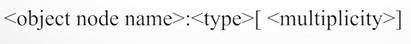
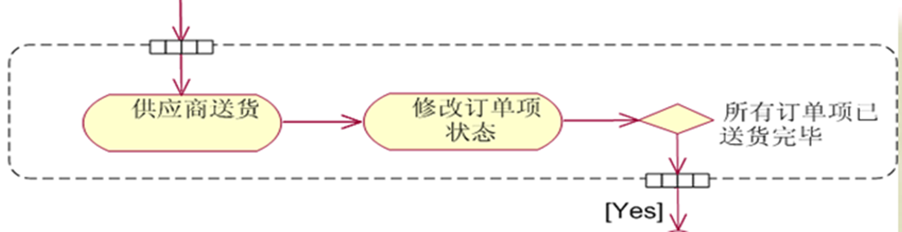
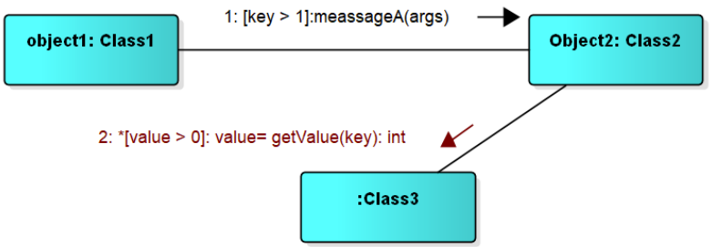
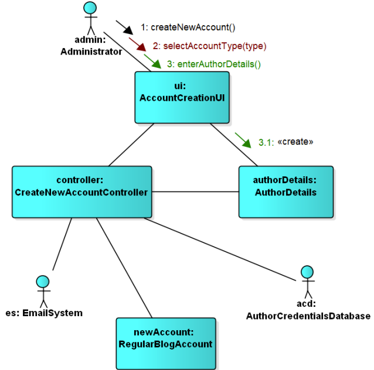
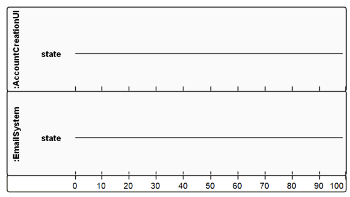
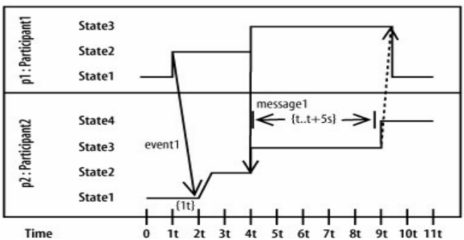
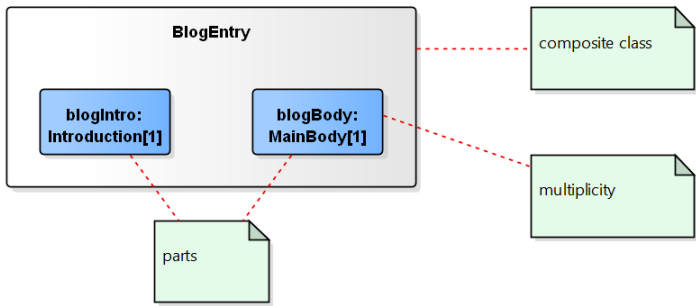
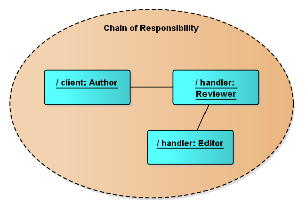
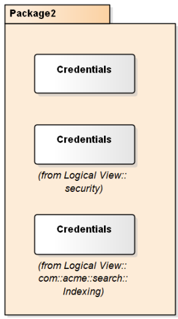

# 总览

## 1. 作为Object的表现形式的模型技术

进入UML技术的说明之前，我们首先来谈谈Object指向技术。Object指向是软件开发的一种先进技术，正如[Object]名字所暗示的，该技术的所有考虑出发点都是Object.

使用Object可以提高大型软件项目的开发效率和速度。

所谓的Object指向，就是说要把复杂的问题细化分解，用图表的方式表达出来。比如下图：


如上图所示，一个好的模型能够正确的合理的表达复杂的意思。上图中复杂的路径信息经过简化之后就会变成清晰可见的模型图。

## 2.  作为统一表达模型的UML技术

如上所示，用图形来表达复杂的逻辑和需求是个很好的选择和做法。

但是每个人的思路都不一样，每个人画出来的图也都不一样，怎么样才能让大家都能听得懂对方的思路呢。


在这个时候，UML登场了。UML是1997年由OMG组织推出来的，全球统一的模型图形技术。

## 3. UML技术可以提高分析和设计的精度

在没有UML技术的时候，大家都知道随口乱说。

+ 需求分析的时候，客户随口说说需求。
+ 系统设计的时候，架构师随口说说设计。
+ 程序开发的时候，开发者随口编写程序。

一切都是无序和混乱的，但是，有了UML就不会再出现这种问题了。所有的交流和文档都能够有一种大家都能听得懂的好方法传递，这就是UML。


##  4. UML的内容


可以这样使用UML技术并且在很多自动开发工具之中，可以根据以上图形自动生成代码。

| 软件开发阶段 | UML图                | 用途                 |
| ------------ | -------------------- | -------------------- |
| 需求分析阶段 | 用例图               | 搞清楚系统服务的要求 |
| 类图         | 搞清楚具体的技术概念 |                      |
| 系统设计阶段 | 类图                 | 表达系统的构造       |
| 时序图       | 表达对象的动作       |                      |

## 5. UML是必须的知识

对于现代软件开发和管理而言，UML是必需的知识，无论是外包还是内包，UML都是不可或缺的技术。


# 类图：对系统的逻辑结构建模:crossed_swords:

##  注释(comment)


## 接口（Interface）

接口表示法

- 构造型的类符号表示

- 接口图标表示

  

+ 例子

  

## 抽象类（abstract class）

抽象类用斜体书写类名称来表示


## 模板（template）

**图标符号: **


**模板参数绑定: **

- 显式模板参数绑定
  - `<<bind>>`依赖
          
- 隐式模板参数绑定
  - 类名中加绑定表达式
                                 

## 类（class）

### 四种表示方式


注意:  

+ 在语境中, 操作的对象就是类
+  角色类+用户类就可以表示系统用户,普通用户之类的

假如我现在定义了这么一个类：

```c++
class Persion
{
public:
    string getName()
    {
    	return name;
    }
    void setName(string name)
    {
    	this->name = name;
    }
protected:
    void playBasketball()
    {
    	pass();
    }
private:
    void pass()
    {
    }
private:
    string name = "Jack";
};
```

那么此类对应的UML为：


看到该图分为三层：最顶层的为类名，中间层的为属性，最底层的为方法。
属性的表示方式为：【可见性】【属性名称】：【类型】= {缺省值，可选}
方法的表示方式为：【可见性】【方法名称】（【参数列表】）：【类型】
可见性都是一样的，"-"表示private、"+"表示public、"#"表示protected。

### 可见性（visibility）

- 可见性特征用于控制对属性、操作甚至整个类的访问，以有效地实施封装
- UML 的四种不同的可见性分类
  

### 类的属性（attribute）

属性的完整语法 `visibility name : type multiplicity = default {property-string}`

​                          【可见性】【属性名称:类型】= {缺省值，可选}

内联属性和关联属性


### 类的方法（operation）

操作的完整表示语法 `visibility name (parameter-list) : return-type {property-string}`

​                                    【可见性】方法名称(【参数:类型】）：【返回类型】

​      

### static属性和操作

UML中的操作和属性可以声明为static

表示法：加下画线


### 关联的修饰

#### 名字（name）

- 关联名描述关联的性质
- 读名字的方向，无歧义的情况下不需要


#### 导航（navigation）

- 给定一个 User对象，能够找到相应的Password对象；
- 给定一个Password对象，不能找到对应的User


#### 角色（role）

- 参与关联的类在关联中扮演的角色
- 角色可以命名，也叫做end name


#### 重数（multiplicity）

- 一个属性可以表示任意数量的该类型的对象；在程序中，这就像声明一个属性是一个数组
- 重数指定一个属性实际上代表一个对象的集合，可以应用于内联属性和关联属性
- 通常在关联、聚合、组合中使用, UML 中的依赖关系本身不包含重数

常用属性重数值

| 表示方式 | 简写 | 多重性说明(针对自身而言)                                    |
| -------- | ---- | ----------------------------------------------------------- |
| 1..1     | 1    | 表示另一个类的一个对象只与一个该类对象有关系                |
| 0..*     | 0..n | 表示另一个类的一个对象与零个或多个该类对象有关系            |
| 1..*     | 1..n | 表示另一个类的一个对象与一个或多个该类对象有关系            |
| 0..1     |      | 表示另一个类的一个对象没有或只与一个该类对象有关系          |
| m..n     |      | 表示另一个类的一个对象与最少m、最多n个该类对象有关系 (m<=n) |
| *        |      | 表示有多个关联数目类似于 0..n                               |

注意: 另一个类的一个对象与一个该类对象都是1对1就省略不写

例如：


例如：汽车和司机，一辆车对应一个特定的司机，一个司机可以开多辆汽车。


#### 可见性（visibility）

- 给定一个User对象，可以访问Password
- 给定一个 UserGroup 对象，可以导航到它的 User 对象，反之亦然；但无法从这个链查看 User 对象的 Password 对象； 因为它们是User私有的。


#### 聚合（aggregation）

- 有时想要对“整体/部分”关系建模，其中一个类代表一个更大的事物（“整体”），它由较小的事物（“部分”）组成。
- 这种关系称为聚合，代表一种“has-a”关系，意思是整体的对象有部分的对象。
- 聚合实际上只是一种特殊的关联


#### 组合（composition）

- 简单聚合是概念性的，只是区分“整体”和“部分”，不会改变整体和部分之间关联的导航含义，也不会链接整体和部分的生命周期。
- 组合是一种更强的聚合形式，一个部分对象只能属于一个整体复合对象；在复合对象中，整体对象必须管理其部分的创建和销毁


#### 限定（qualification）

- 限定符（qualifier）


#### 约束（constraint）

约束用来表示各种限制，如关联路径上的限制，和属性特征检测（存在、所有、或者）


#### 关联类（Association Class）

关联类

- 在两个类之间的关联中，关联本身可能具有属性


关联类同时具有关联和类的特性          


### 类图中的关系（relationship）

- 关联、聚合、组合
- 泛化（generalization）
- 依赖（dependency）
- 实现（realization）


#### UML 的5种不同的类关系

- 类关系的强度取决于关系涉及的类彼此之间的依赖程度
- 两个相互强烈依赖的类被认为是紧密耦合的； 对一个类的更改很可能会影响另一个类


#### 依赖关系

依赖（Dependency）：表示一个类依赖另一个类，大多数情况下依赖关系体现在某个类的方法使用另一个类
的对象作为参数。

==表现形式：虚线+箭头，箭头指向被依赖的类/方法中的类==

<font color = red>依赖关系通常通过三种方式来实现：</font>

1. 在一个类的方法中将一个类的对象作为其方法的参数(被依赖的类)
2. 在一个类的方法中将另一个类的对象作为其对象的局部变量(被依赖的类)
3. 在一个类的方法中调用另一个类的静态方法(被依赖的类)
3. UML 中的依赖关系本身不包含重数
3. 没有整体与部分的关系
3. **记忆:  方法中**

比如，驾驶员（Driver）开车，Driver类的drive()方法将车（Car）的对象作为一个参数传递(可以通过构造函数参数，方法参数，方法返回值，方法内局部变量的形式存在于Driver类中)，以便在drive()方法中能够调用car的move()方法，且驾驶员的drive()方法依赖车的move()方法，因此也可以说Driver依赖Car，C++代码为：

```c++
class Car
{
public:
	void move();
};
```

```c++
class Driver
{
public:
    void drive(Car car)
    { 
    	car.move();
    }
};
```

其UML的画法为：


比如，选课管理系统中抽取的类：从 CourseSchedule (课程计划)到 Course (课程)的依赖关系，其中 Course 用于 CourseSchedule 的添加和删除操作。

```c++
class Course
{
public:    
    void add();
    void remove();
};
```

```c++
class CourseSchedule
{
public:
    void add(Course c)
    { 
    	c.add();
    }
    void remove(Course c)
    { 
    	c.remove();
    }
};
```

其UML的画法为：
                                                   

比如，人与手机的关系图，人通过手机的语音传送方法打电话。其UML的画法为：


#### 关联关系

关联（Assocition）关系是类与类之间最常见的一种关系，它是一种结构化的关系，表示一类对象与另一类对象之间有联系，如汽车和轮胎、师傅和徒弟、班级和学生等。在UML类图中，用实线连接有关联关系的对象所对应的类，在C++中通常将一个类的对象作为另一个类的成员变量。

==表现形式：实线+箭头，箭头指向被使用的类\成员属性中的类==

<font color = red>关联关系通常通过一种方式来实现：</font>

1. 将一个类的对象作为另一个类的成员变量(被使用的类)
1. **记忆: 成员属性中**

关联的类型:  自关联，二元关联，n元关联（一对一（员工->工牌），一对多（部门->员工），多对多（商店->商品）比如:


##### 单向关联关系

单向关联指的是关联只有一个方向，比如顾客（Customer）拥有地址（Address），其代码实现为：

```c++
// 地址类
class Address
{
};
```

```c++
// 顾客类
class Customer
{
private:
	Address address; // 作为成员变量
};
```

其UML的画法为：


##### 双向关联关系

默认情况下的关联都是双向的，比如顾客（Customer）购买商品（Product），反之，卖出去的商品总是与
某个顾客与之相关联，这就是双向关联。c++ 类的写法为：

```c++
// 商品类
class Product
{
private:
	Customer customer; // 该商品属于哪一位顾客, 作为成员变量
};
```

```c++
// 顾客类
class Customer
{
private:
	Product product[64]; // 给顾客购买了哪些商品, 作为成员变量
};
```

其UML的画法为：(注:  双向关联用一个不带箭头的线来表示)


比如老师和学生的关系图，每个老师可以教多个学生，每个学生也可向多个老师学，他们是双向关联。UML的画法为：


#####  自关联关系

自关联，指的就是对象中的属性为对象本身，这在链表中非常常见，单向链表Node中会维护一个它的前驱
Node，双向链表Node中会维护一个它的前驱Node和一个它的后继Node。就以单向链表为例，它的C++写
法为：

```c++
// 链表节点
class Node
{
private:
	Node* nextNode; // 指向后继节点的指针, 作为成员变量
};
```

其UML的画法为：


#### 聚合关系

聚合（Aggregation）：是关联关系的一种，是强的关联关系。聚合关系是整体(总体)和个体(部分)的关系。一般关联关系的两个类处于同一个层次上，**聚合关系中的两个类处于不同的层次，一个是整体，一个是部分**。

==表现形式：空心菱形+实线+箭头(可省)，箭头指向个体\成员属性中的类==

在UML中，聚合关系用带空心菱形的直线表示，比如图书馆与图书的关系，图书可以存在于图书馆中，也可以被借出给读者，不依赖于图书馆的存在。

比如，大学和教师的关系图UML的画法为：


例如，公交车司机和工作服和帽子是整体关系的一部分，但它们可以分开。工作服和帽子可以穿在其他司机身上。公交车司机也可以穿其他工作服和帽子。


比如，汽车（Car）与引擎（Engine）、轮胎（Wheel）、车灯（Light），注意这个例子其实并不准确，它更想是组合关系, C++ 表示为：

```c++
class Engine
{
};
```

```c++
class Wheel
{
};
```

```c++
class Light
{
};
```

```c++
class Car
{
public:
    Car(Engine engine, Light light, Wheel wheel)
    {
        this->engine = engine;
        this->light = light;
        this->wheel = wheel;
    }
    void drive()
    {
    }
private:
    Engine engine;
    Light light;
    Wheel wheel;
};
```

其UML的画法为：


代码实现聚合关系，成员对象通常以构造方法、Setter方法的方式注入到整体对象之中。

#### 组合关系

组合（Composition）：是关联关系的一种，是比聚合关系更强的关系。要求普通的聚合关系中代表整体的对像负责代表个体的对象的生命周期。**当删除整体对象时也要级联删除个体对象**(在组合关系中整体对象可以控制成员对象的生命周期，一旦整体对象不存在，成员对象也不存在，整体对象和成员对象之间具有同生共死的关系)

==表现形式：实心菱形+实线+箭头(可省)，箭头指向个体\成员属性中的类==

比如，人的头（Head）和嘴巴（Mouth）、鼻子（Nose），嘴巴和鼻子是头的组成部分之一，一旦头没了，
嘴巴也没了，因此头和嘴巴、鼻子是组合关系，C++ 表示为：

```c++
class Mouth
{
};
```

```c++
class Nose
{
};
```

```c++
class Head
{
public:
    Head()
    {
        mouth = new Mouth();
        nose = new Nose();
    }
    void shake()
    {
    }
private:
    Mouth *mouth;
    Nose *nose;
};
```

其UML的画法为：


代码实现组合关系，通常在整体类的构造方法中直接实例化成员类，因为组合关系的整体和部分是共生关
系，如果通过外部注入，那么即使整体不存在，那么部分还是存在的，这就相当于变成了一种聚合关系了。

#### 实现关系

实现：表示类与接口之间的上下级关系。当类A实现自接口B时，就说类A是接口B的实现类，接口B是类A的接口。

==表现形式：虚线+空心三角形，三角形指向接口==

- 实现接口的类和接口之间的关系
- 实现关系的表示法
  - 构造型：空心三角箭头+虚线
    
  - 图标表示：实线
    

#### 继承关系

继承也叫作泛化（Generalization），用于描述父子类之间的关系，父类又称为基类或者超类，子类又称作
派生类。

==表现形式：实线+空心三角形，三角形指向父类==

<font color = red>泛化关系通常通过一种方式来实现：</font>

+ 分类

##### 普通继承关系

假如现在我又定义了一个Student和一个Teacher：

```c++
class Student : public Persion
{
public:
    void study()
    {
    }
private:
    string studentNo;
};  
```

```c++
class Teacher : public Persion
{
public:
	void teach()
    {
    }
private:
    string teacherNo;
};
```

其UML的画法为：


比如,  公共汽车、出租车、汽车都是汽车，它们都有名字，都可以在路上。


##### 抽象继承关系

上面的继承是普通的继承，在C++中，除了普通的继承之外，众所周知的还有一种抽象的继承关系，因此就
再讲讲抽象继承关系，作为上面的继承的补充。
比方说我想实现一个链表（Link），插入（insert）与删除（remove）动作我想让子类去实现，链表本身只
实现统计链表中元素个数的动作（count），然后有一个子类单向链表（OneWayLink）去实现父类没有实现
的动作，C++代码为：

```c++
// 抽象类(含有纯虚函数的类)
class Link
{
    public:
    virtual void insert() = 0;
    virtual void remove() = 0;
    int count()
    {
    	return 0;
    }
};
```

```c++
// 子类
class OneWayLink : public Link
{
public:
    void insert()
    {
    }
    void remove()
    {
    }
};
```

其UML的画法为：


在UML中，抽象类无论类名还是抽象方法名，都以斜体的方式表示，因为这也是一种继承关系，所以子类与
父类通过带空心三角形的实线来联系。

#### 关联关系、聚合关系、组合关系的区别

+ 关联关系: 没有整体跟部分的关系,只是单纯当做另一个类的成员属性
+ 聚合关系:  整体跟部分的关系, 可以独立存在  
+ 组合关系:   整体跟部分且同生共死的关系,不能独立存在

**看语境分析, 比如:**

+ **关联**
  1. **老师和课程**
+ **聚合（Aggregation）**
  1. **学校和学生：** 学生可以存在独立于学校而存在。学校可以包含多个学生，但学生可以在学校之外存在，这是一种弱关系，适合用聚合表示。
  2. **公司和员工：** 员工可以离开公司而存在，公司可以包含多个员工，但员工不依赖于公司的存在。
  3. **部门和员工：** 一个部门可以包含多个员工，但员工可以在没有部门的情况下存在。
  4. **商店和顾客：** 一个商店可以有多个顾客，但顾客可以在商店之外购物，商店和顾客之间是一种弱关系，适合用聚合表示。
  5. **音乐播放器和播放列表：** 播放器可以包含多个播放列表，但播放列表可以独立于播放器存在。
  6. **图书馆与图书**:  图书可以存在于图书馆中，也可以被借出给读者，不依赖于图书馆的存在。
+ **组合（Composition）**
  1. **汽车和引擎：** 一辆汽车由引擎、轮胎、座位等多个组件组成。如果汽车不存在了，引擎也就不存在了。
  2. **电脑和内存条：** 电脑包含内存条、CPU、硬盘等组件，如果电脑被销毁，内存条也就不存在了。
  3. **图书和章节：** 一本书由多个章节组成。如果书不存在了，章节也就不存在了。
  4. **家庭和成员：** 一个家庭由父母、子女等成员组成，如果家庭解散，成员也随之不存在，适合使用组合。
  5. **建筑和房间：** 一座建筑包含多个房间，如果建筑被拆除，房间也就不存在。
  6. **公司和部门**
  7. **部门和产品**

## 例子

### 示例

#### 类图也可能附有类或关系的注释


#### 具有用户定义约束的类图


### 示例

```
李小平是一个爱书之人，家里各类书籍已过千册，而平时又时常有朋友外借，因此需要一个个人图书管理系统。该系统应该能够将书籍的基本信息按计算机类、非计算机类分别建档，实现按书名、作者、类别、出版社等关键字的组合查询功能。在使用该系统录入新书籍时系统会自动按规则生成书号，可以修改信息，但一经创建就不允许删除。该系统还应该能够对书籍的外借情况进行记录，可对外借情况列表打印。另外，还希望能够对书籍的购买金额、册数按特定时限、周期进行统计。
```


```
汽车和自行车都是交通工具(vehicle)。 一辆自行车(bicycle)只归一个人(person)所有， 但一辆汽车(auto)可归一个人或两个人所有。 一个人可能没有自行车或汽车， 也可能有多辆自行车或汽车。 人分为男人(male)和女人(female)。 每个人都有年龄(age)和名字(name)。 每辆交通工具都有自己的颜色(color)和商标(brand)。 每辆汽车都只有两个前灯(headlight)和一台发动机(motor)。
```


### 示例


### 示例


### 示例

下面的类图对来自零售目录的客户订单进行建模。中心类是**Order**。与之相关的是进行购买和**付款的**客户**。**付款**是以下四种之一：现金**、**支票**、**信用卡**或电汇**。订单包含**OrderDetails**（行项目），每个项目都有关联的**Item


# 对象图

## 概念

对于复杂的数据结构，有时候很难对其进行抽象成类表达之间的关系，一般就会使用对象图。


## 对象图的组成元素

### 实例（instance）

类在编译时定义，对象在运行时作为类的实例创建

创建一个新Part对象的Java语句

```java
Part myScrew = new Part("screw", 28834, 0.02) ;
```

Part对象的UML表示
                                                         

- 对象是类的实例

         

- UML中实例的图形表示

  - 命名实例

     

  - 匿名实例

        

#### 对象状态

带属性值的实例
                            

带显式状态的实例
                           

#### 对象的特性

- 对象是具有状态、行为和唯一标识的某事物

- 状态（state）

  - 包含在对象属性中的数据值通常称为对象的状态
  - 这些数据值会随系统变化而改变，结果是对象的状态可以改变
  - 在OOPL中，对象的状态由对象所属类定义的域指定，在UML中由类的属性指定

- 行为

  - 在OOPL中，对象的操作在类中定义为一组方法，即接口
  - 在UML中，操作不出现在对象图标中

- 唯一标识（identity）

  - 对象模型假定为每个对象提供唯一标识，作为区别于其他对象的标志。

  - 每个对象和其他所有对象都是可区别的，即使两个对象保存完全相同的数据，并在接口中提供完全相同的操作集合。

    - 下面的代码创建两个状态相同的对象，但它们是不同的对象。

      ```java
      Part screw1 = new Part("screw", 28834, 0.02) ;
      Part screw2 = new Part("screw", 28834, 0.02) ;
      ```

  - 对象的标识是对象模型固有的一部分，不同于对象中存储的任何其他数据项。 设计人员不需要定义一个特殊数据来区分类的各个实例。

    - 有时应用领域会包含对每个对象都不相同的真实数据项，例如各种识别号码，这些数据项通常作为属性建模。

### 链（link）

- 对象之间的链
  - 对象图上的对象之间的链表明这两个对象可以相互通信。
    
- 链和关联
  - 不能将任意两个对象链接在一起。
  - 如果在两个对象之间创建链接，则类之间必须有相应的关联。
  - 对象之间的链接对应于对象的类之间的关联： 应用于关联上的约束规则，链接必须遵守。

```java
public class CatalogueEntry {
    private String name ;
    private long number ;
    private double cost ;
    public CatalogueEntry(String nm, long num, double cst) {
        name = nm ; number = num ; cost = cst ;
    }
    public String getName() { return name ; }
    public long getNumber() { return number ; }
    public double getCost() { return cost ; }
}

public class Part {
    private CatalogueEntry entry ;  //关联关系
    public Part(CatalogueEntry e) { entry = e ; }
}

//-----------------------------------------------
CatalogueEntry screw = new CatalogueEntry("screw", 28834, 0.02) ;
Part s1 = new Part(screw) ;
Part s2 = new Part(screw) ;
```

链的UML表示法

- 对象保存另一对象的引用，在这两个对象之间画一个链来表示
- 链表示为从保存引用的对象指向被引用对象的箭头，箭头表示只能在一个方向上遍历或导航；
- 在箭头上可以标示保存引用的域的名字；


### 消息传递(函数调用)

面向对象程序中的数据是分布在系统的对象之中的

- 一些数据作为属性值保存
- 对象之间的链接也含有信息，描述对象之间保持的关系

信息分布意味着为了完成系统的任何功能，一般而言都需要多个对象进行交互

- 假设想要为Part类增加一个方法cost来查询一个零件的成本；
- 表示零件成本的数据值并没有保存在零件对象中，而是保存在零件引用的目录条目对象中
- 新方法必须调用目录条目类中的getCost()方法

```java
public class Part {
    public double cost() { return entry.getCost(); }
    private CatalogueEntry entry ;  //关联
}
//如果客户持有一个Part的引用并要查询它的成本
//可以如下调用cost方法。
Part s1 = new Part(screw);
double s1cost = s1.cost();
```

UML将方法调用表示为从一个对象发送到另一对象的消息

- 当对象调用另一对象的方法时，可以看作是请求被调用的对象执行某些处理，这个请求作为消息建模。
- 上面的代码中调用s1.cost()的消息如图
  

对象在接收到消息时，通常会以某种方式响应
          

 例子:  **层次中的消息传递**


## 例子


## 总结


# 用例图：对系统需求建模:crossed_swords:

用例图主要用来描述“用户、需求、系统功能单元”之间的关系。它展示了一个外部用户能够观察到的系统功能模型图。【用途】：帮助开发团队以一种可视化的方式理解系统的功能需求。

与用例相关的关键概念

- Actors（参与者、施动者、行事者）
  - 可能与主体交互的用户和其他系统被表示为参与者
  - 参与者对系统外部的实体建模
- Use cases（用例）
  - 所需的主体行为由一个或多个用例规定
  - 用例根据参与者的需要而定义
- Subject（主题、主体）
  - 正在被开发的系统，用例应用于该系统


用例图所包含的元素如下：

##  1. 参与者(Actor)

### 参与者表示方法

表示与应用程序或系统进行交互的用户、组织或外部系统。用一个小人表示。

参与者的UML表示法


注意:  参与者可以是人也可以是物,  如顾客、管理员、自动贩卖机、打印机这些都可以是参与者

### 参与者的泛化关系

参与者相互之间可能有泛化关系


## 2. 用例(Use Case)

用例就是外部可见的系统功能，对系统提供的服务进行描述

用例的UML表示法

- 椭圆
- 构造型


## 3. 子系统(Subsystem)

在用例图中用一个方框表示系统边界

- 方框上部标示有系统的名字

- 用例在方框中，参与者在方框外

  

## 4.  关系

用例图中涉及的关系有：关联、泛化、包含、扩展。


总结:   前包含/都需要包含,  后继承/同一类继承,  if扩展

### a. 关联(Association)

表示参与者与用例之间的通信，任何一方都可发送或接受消息。

【箭头指向】：指向消息接收方, 箭头可以省略


### b. 泛化(Inheritance)

就是通常理解的继承关系，子用例和父用例相似，但表现出更特别的行为；子用例将继承父用例的所有结构、行为和关系。子用例可以使用父用例的一段行为，也可以重载它。父用例通常是抽象的

【箭头指向】：指向父用例


### c. 包含(Include)

包含关系用来把一个较复杂用例所表示的功能分解成较小的步骤。

【箭头指向】：基用例指向子用例/都需要的


### d. 扩展(Extend)

扩展关系是指用例功能的延伸，相当于为基础用例提供一个**附加功能**。

【箭头指向】：指向基础用例/if


### e. 依赖(Dependency)

以上4种关系，是UML定义的标准关系。但VS2010的用例模型图中，添加了依赖关系，用带箭头的虚线表示，表示源用例依赖于目标用例。

【箭头指向】：指向被依赖项(可以去掉箭头)

​                                          

## 5. 项目(Artifact)

用例图虽然是用来帮助人们形象地理解功能需求，但却没多少人能够通看懂它。很多时候跟用户交流甚至用Excel都比用例图强，VS2010中引入了“项目”这样一个元素，以便让开发人员能够在用例图中链接一个普通文档。

用依赖关系把某个用例依赖到项目上：


然后把项目-》属性 的Hyperlink设置到你的文档上；

这样当你在用例图上双击项目时，就会打开相关联的文档。

## 6. 注释(Comment)

 

　　

**包含(include)、扩展(extend)、泛化(Inheritance)** **的区别：**

+ 条件性：泛化中的子用例和include中的被包含的用例会无条件发生，而extend中的延伸用例的发生是有条件的
+ 直接性：泛化中的子用例和extend中的延伸用例为参与者提供直接服务，而include中被包含的用例为参与者提供间接服务。
  + 对extend而言，延伸用例并不包含基础用例的内容，基础用例也不包含延伸用例的内容
  + 对Inheritance而言，子用例包含基础用例的所有内容及其和其他用例或参与者之间的关系

**一个用例图示例：**                                                                                             

**用例描述表：**

鉴于用列图并不能清楚地表达功能需求，开发中大家通常用描述表来补充某些不易表达的用例


## 7. 用例描述

| **用例名称**：网站公告发布                                   |
| ------------------------------------------------------------ |
| **用例标识号**：202                                          |
| **用例描述：  **负责人用来填写和修改家教网站首页的公告，公告最终显示在家教网站的首页上。 |
| **参与者**：负责人                                           |
| **前置条件：**  负责人已经登陆家教网站管理系统               |
| **后置条件**：  网站首页的公告信息被修改                     |
| **(基流)基本事件流：** <br/>   1．负责人鼠标点击“修改公告”按钮  <br/>   2．系统出现一个文本框，显示着原来的公告内容   <br/>   3．负责人可以在文本框上修改公告，也可以完全删除，重新写新的公告 <br/>   4．负责人编辑完文本框，按“提交”按钮，首页公告就被修改  5．用例终止 |
| **(代替流)异常事件流**： <br/>  1．提示错误信息，负责人确认 <br/>  2．返回到管理系统主页面 |
| 注释：无                                                     |


## 8. 例子

### 示例

+ 如果用例B是用例A的某项子功能，并且建模者确切的知道A对应的动作序列中何时调用B，则用例A和B是什么关系?
+ 如果用例A和用例B相似，但A的动作序列是通过改写B的部分或者扩展B的动作获得的，则用例A和B是什么关系?
+ 如果用例A和用例B相似，但A的功能比B的多，A的动作序列是3通过在B的动作序列中的某些执行点上插入附加的动作序列松成的，则用例A和B是什么关系?


### 示例

1. **试画出学院班级管理系统的用例图**

```
用例：登陆；找回密码；查看、修改、删除、录入班级基本信息。
参与者：管理员与系院领导。
```


2. **试画出学生成绩管理的用例图**

```
用例:登陆；找回密码；录入、修改、保存、查询、删除成绩。
参与者：教师和学生。
```


3. **试画出网上选课系统的用例图**

```
用例：登陆；找回密码；查看课程信息；按课程编号查询；按课程名查询；选择课程；删除已选课程；维护课程信息。
参与者：系统管理员与学生。
```


4. **试画出账号管理的用例图**

```
用例：创建新的账户；设置账户；设置账户基本信息；设置账户权限；删除账户；查询账户。
参与者：系统管理员。
```


5. **试画出自动饮料售货机的用例图**

```
一台自动饮料售货机共有6中饮料，售货机上有6个按钮，分别对应6种饮料，顾客可以通过按钮来选择所要购买的饮料。每个按钮旁有一个指示灯，用来表示该售货机中是否还有这种饮料可售，售货机有一个硬币槽，用来收钱和找钱，假设一位顾客购买矿泉水，不用找零钱，请给出描述上述场景的用例图。
```


下面附上几张图，帮助理解一下


### 示例


### 示例

广播系统用例图


ATM 用例图示例


用例图：具有系统边界的多个项目


用例图：在线考试系统


用例图示例：乘客服务


用例图示例：软件开发


用例图示例：停车场系统


## 总结


# 活动图：对系统工作流建模:crossed_swords:

- 基本元素
- 活动和动作
- 分支和并发
- 活动图建模


## 活动图的组成

**1. 活动节点（结点）ActivityNode**

+ 可执行节点
  + 动作节点
  + 活动节点

+ 控制节点
  + 初始节点、终止节点
  + 判断、合并（ decision 、merge）
  + 分叉、汇合

+ 对象节点

**2. 活动边ActivityEdge**

+ 控制流

+ 对象流

**3. 活动分区（泳道）**

**4. 扩展区域**

## 可执行结点

**动作结点是一种特殊的活动结点**：动作结点一般用于描述简短的操作，而活动结点用于描述持续事件或复杂计算。

**表示：平滑的圆角矩形**


注意: 

+ 在xxx这样的语句他不是可执行结点
+ 输入xxx这样的语句他是可执行结点
+ 需要界面的一般需要设置这个可执行结点

### 动作结点

动作结点代表一个**原子**操作，是构造活动图的**最小单位**，通常用于对工作流执行过程中的步骤进行建模。

**注意：**

- 动作结点要么不执行，要么完全执行，不可中断。
- 动作结点是**瞬时**的行为，占用处理时间短。
- **动作结点不能有入口动作、出口动作和内部转换。**
- 在一张活动图中，**同一动作结点允许多处出现**。

**常见动作：**

- 创建或删除对象
- 发送消息
- 调用操作
- 数学运算
- 返回表达式的值。

### 活动结点

活动结点是**一系列动作**，主要用于实现动作序列的简化，显然活动节点是**非原子性**的。

**注意：**

- 活动结点是**可被中断的**。
- **活动结点的内部活动可以用另一个活动图表示。**
- 活动结点可以有入口动作、出口动作和内部转换，**至少有一个输出完成转换**。

**因此动作结点是一种特殊的活动结点：** 动作结点一般用于描述简短的操作，而活动结点用于描述持续事件或复杂计算。


## 控制结点

### 初始结点和终止结点


**初始结点：**
标记活动图的开始，表示业务处理过程的开始；
一个活动图中必须**有且仅有一个**初始结点(嵌套情况除外)。

**终止结点：**
标记活动图的结束，表示业务处理流程完成；
一个活动图中**一般**至少有一个结束标记。（存在一些特殊的无穷过程不存在终止标记）

### 判断与合并

判定（decision）

- 类似于 if-else 语句
- 离开判断结点的边上可以标记条件（guard condition）
  - 语法格式：`[布尔表达式]`
- 条件为真的边被执行
  - 注意条件的互斥、完备
  - 可以在一条边上标记`[else]`以保证完备
- 用空心的菱形表示:
                                         

合并（merge）

- 合并从判断结点出发的边，表示条件行为的结束

- `监护条件要有中括号[]`
- 在所有输出控制流中，其监护条件应**互斥**，且应**覆盖所有可能**。


### 分叉与汇合

>对**并发**运行的控制流建模


**注意：分叉与汇合不是必须有监护条件**

**分叉**

表示把一个单独的控制流分成两个或多个并发的控制流。
一个分叉可以有一个进入控制流和两个或多个输出控制流。

**汇合**

表示两个或多个并发控制流的**同步完成**，收束回同一流程。

一个汇合可以有两个或多个进入控制流和一个输出控制流。


### 总结

1. 条件选择

  + 在系统中存在多个条件选择的情况时,可以使用分支技巧来描述这种情况。
  + **关键词: 如果**

  + 例如,在一个在线教育系统中,根据学生的年级和科目的不同,可以选择不同的教学
    资源和教学方式,可以使用分支技巧来表示这些条件选择。

2. 并行处理

  + 在系统中存在多个并行的任务需要同时进行时，可以使用并行技巧来描述这种
    情况。
  + **必须满足同一对象,  关键词: 并、和、同时**

  + 例如,在一个电商系统中,同时进行库存管理、订单处理和支付处理等任务,
    可以使用并行技巧来表示这些任务的并行执行。

3. 数据合并

  + 在系统中存在多个活动的结果需要合并为一个结果的情况时,可以使用合并技
    巧来描述这种情况。
  + **一般更并行连用最终合并为一个结果**

  + 例加在一个报销系统中,多个部门的报销申请需要经过审批
    后才能最终合并为一个结果，可以使用合并技巧来表示这个过程。

## [对象节点](https://www.cnblogs.com/kingwz/p/16729719.html#对象)

数据对象有时候是过程的重要方面

- 例如过程处理的表单、订单、文件等

活动图提供了几种对过程中的数据对象建模的方法

- Object node（对象结点）
- Pin（别针、大头针）
- Transformation（转换）
- 对象状态变化
- 注意：objects 不一定是 software objects

当活动图中描述的过程具有一些对关键对象的要求时，通过添加对象节点的方法可以在活动图中呈现操作的对象。

活动图中的对象节点除了对象名称， 还可以带有**状态**。
**表示：**





### 对象在动作之间传递

- 完整的活动图


### 动作的输入和输出

Pins（别针，大头针）说明一个对象是动作的输入或输出

- input pin：指定的对象是动作的输入
- output pin：指定的对象是动作的输出

Pin强调一个对象是动作需要的输入或输出，而对象结点则强调活动中的数据流


### Transformation

- 用途
  - 如果一个动作只需要某个对象的一部分，而不是整个对象，可以使用 transformation 来表示所需要的部分
  - 可以用来表示一个动作输出为另一个动作提供输入


### 对象状态

可以说明对象在活动中流动时的状态变化

- 状态用`[状态]`表示
- 例如，下图的焦点是Order对象在整个过程中的状态变化
  


## 活动边

活动边是活动图中的**关系元素**，包括控制流和对象流。
*活动边就是类似于关系*
**表示：**

- 控制流（转换）：用一条带箭头的实线段表示。
- 对象流：UML1.x中，用带箭头的虚线段表示； UML2.x中，用带箭头的实线段表示。

### 控制流

控制流(Control Flow) ，曾称为转换，是活动图中用于标识**控制路径**的一种符号，描述**活动与活动之间的关系**。

**注意：**

- 与状态机图中的转换不同，活动图的控制流**不需要特定事件的触发**，一个活动执行完成后**会自发转换**到另一个活动。
- 控制流从活动图的初始结点开始运行，经过顺序、分支等结构引导着各个活动的连续执行。

**表示：** <font color='red'>用一条带箭头的实线段表示。要么连接结束结点要么连接其他活动</font>


### 对象流

对象流(Object Flow) 是将对象结点作为**输入或输出**的控制流，描述**活动与对象之间的关系**，以及相互的影响。
（依赖关系）

**表示：**
UML1.x中，用带箭头的虚线段表示； UML2.x中，用带箭头的实线段表示。


### 活动输入和输出

- 对象结点可以用来强调一个活动的输入和输出

  - 活动输入输出用活动边框上的对象结点表示
    - 例如，下图表示Order对象是Approve Payment 活动的输入和输出
  - 这种表示法强调一个活动需要输入并提供输出
    - 这时可以省略活动的起始结点和结束结点

  

### 发送和接收信号

- 信号（signal）

  - 活动可能与外部的人、系统或过程交互
  - 在活动图中，用信号表示与外部参与者的交互

- 信号是可以被发送和接收的消息

  - 例如，某软件向信用卡公司发送一个批准信用卡事务的请求，该软件收到信用卡公司的响应；从信用卡批准活动的角度看，有发送信号和接收信号
  - 例如，系统通知顾客其送货被延迟，从订单送货活动的角度看，是发送信号

- 接收信号（Receive signal）

  - 是接收到的来自一个外部过程的信号
  - 可以激起活动图中的一个动作
  - 信号的接收者知道如何对信号作出反应，并预期信号到达，只是不知道何时

- 发送信号（Send signal）

  - 是发送给某个外部参与者（participant）的信号
  - 当外部的人或系统收到这个消息时，他/它可能做某些事情进行响应，但是这不在本活动图中建模

- 发送信号结点和接收信号结点表示与外部参与者（participants）的交互
  

- 接收信号结点

  - 有进入边：只是在上一个动作完成时才开始等待信号到达
  - 没有进入边：该节点在所处的活动激活时总是等待一个信号的到达
    - 可以作为一个活动的开始节点，如下图：每当接收到一个信号时活动就起动

  

### 活动的开始和结束

开始活动:

- 最简单常用的方法：起始结点
- 收到输入数据（对象结点）
- 响应时间事件
- 由信号激起


活动的结束和流程的结束:

- 实际的业务过程建模中可能遇到复杂的流程结束情况，活动图提供了两种结束结点
- Activity final node
- Flow final node


#### 活动结束

- Activity final node（活动终止结点）

  - 例如，下图中只有一条到活动终止节点的路径，活动中的每个动作都可以完成

  

- 一个活动图中也可以有多个活动终止结点

  - 当流程到达活动终止结点时，活动中的所有其他动作都终止，包括终止结点之前的动作
  - 不清晰

  

- 在fork节点后使用活动结束时要注意

  - 如果希望所有分叉的动作都可以执行完成，要加join节点

  

#### 结束流程（flow）

- Flow final node

  - 流程终止结点结束自己的路径，而不是结束整个活动
  - 例如，右图中，当2秒时限到时，返回搜索结果，整个活动结束，包括 Improve Search Results 动作
  - 如果2秒之内 Improve Search Results 结束了，它不会终止整个活动

  

#### 活动结束vs.流程结束


## 中断活动

- 如何表示过程被某个事件中断？

  - 例如，一个长时间运行的过程被用户提前终止，订单处理活动中订单被取消

- Interruption regions

  - **表示法：虚线圆角矩形**
  - 中断区域中包围的动作可以被中断事件终止

- 中断区域只与其中包含的动作有关

  - 如果是在Process Order 动作激活时接收到取消信号，那么 Process Order 会被中断，控制转到 Cancel Order 动作
  - 如果是在 Ship Order 激活时收到取消信号，Ship Order 不会被中断，因为它不在该区域

  

## 活动分区（泳道）

> 活动图能够将元素的行为顺序表现出来,但 **元素的行为是有交互的**。到目前为止,我们 所学到的活动图,暂时还无法表示出这样一种交互关系。

为了对活动的职责进行组织，可以在活动图中**按负责对象(活动的执行者)** 将活动分为不同的组，称为活动分区(Activity Partition)，也称为泳道(Swimlane)。

**作用：**
描述每个活动是由哪个对象负责完成。

**注意：**

- **每个活动只能明确地属于一个泳道，活动不允许跨越泳道。**
- 只有转换、动作流、 和对象流,能够穿越泳道的分隔线。

**表示：**

每个泳道通过垂直或水平实线与它的邻居泳道分隔，泳道上方或左侧是它的名称。

 **例子1：**

**例子2**  **无泳道**
 
 **有泳道**
                     

## 扩展区域（循环）

**循环一般不用扩展区域，而是使用判断后在连一条回去的控制流**

是表示业务过程中的某个活动片段的模型，在活动图中通常用来表示活动的**循环过程**。
扩展区可以标识一个或多个活动需要多次执行的情况。

**表示：**
循环一个结点


循环多个结点


## 其他

### 时间事件（Time event）

- 时间有时是活动图的一个要素

  - 等待一段时间后进行某个动作，例如三天后发出账单
  - 一个过程在固定的时间间隔开始，例如每过一星期系统备份一次

- 时间事件用沙漏符号表示
  

- 有进入边的时间事件

  - 时间事件激活一次，因而其后的动作只发生一次
  - 文本Wait 3 Days，表示等待的时间量

  

- 没有进入边的时间事件是 recurring time event

  - 时间事件以沙漏旁边文本所标示的时间频率被激活
    - 图中的进度条每秒更新一次
  - 对重复时间事件建模

  

- 时间事件也可以开始一个活动

  - 图中没有开始结点
  - 可以用来对周期性发起的活动建模

### 调用活动结点

- 调用其他活动
  - 避免在一个图中出现过多的细节，提高图的可读性
  - 将动作在一个活动图中给出，更高层的活动图中可以调用该活动
  - 用于复杂动作的分解
- Call activity node 调用对应结点名字的活动
  - **用一个带叉子标志的动作表示**
  - 被调用的活动最好不要省略activity frame，因为要给出活动的名字以便调用


### Connectors

- 连接器可以提高包含很多动作的活动图的可读性

  

### 异常处理


### 活动图的应用

活动图建模，通常应用在以下两个方面：

- 对业务流程建模
- 对用例交互流程建模

#### **对业务流程建模**

选择一个将要描述的重要过程，过程中尽量涉及数量少但是关键的对象或参与者，将无关或关联很小的对象排除在外，为每一个对象或参与者绘制泳道。
在总体业务流程中提取关键的动作或活动节点，并且将他们与对象或参与者相对应；若发现有些动作无法对应，则考虑动作是否在这个流程中起关键作用，或者是否遗漏了某些对象或参与者。
规定初始状态；确定过程可能的结束位置，为活动图添加开始和结束节点。
从业务流程的初始节点开始，把过程中发生的动作按事件顺序排列，依次把这些动作添加到活动图中。
把局部的过于复杂的动作序列加以总结，绘制成一个活动节点；如果需要，把这个动作序列使用另外的活动图进行建模。
找出连接这些动作和活动节点的控制流，并且准确找到过程中的判定、分叉、合并与汇合节点。
如果业务流程中有一些关键对象的值或状态需要加以描述，使用对象流添加这些对象在某些动作或活动节点前后的状态描述。

#### **对用例交互流程建模**

**主要就是根据用例规约建模**
**一般一个用例，一个活动图**

选择概念用例——即从系统对客户提供的各种服务中确定出一个关键业务，这个关键业务可能是在多个相同或不同的情况下反复出现，或者是系统需要提供的一个关键服务或进行的关键操作。
对于当前选择的用例，通过事件流进行顺序叙述，并找出所有的参与者主动动作，把这些动作整理成动作或活动节点。
把参与者和系统划分为两个泳道，如果有除了主参与者以外的其它参与者，也为它们分别划分泳道。
把活动节点纵向按照事件发生顺序、横向按照参与者角色和系统角色对应填入活动图中。

使用活动图对系统的用例进行建模，可以描绘出系统中两个或更多对象之间的过程控制流。

### 活动图的建模过程

1. 标识活动图的用例
2. 建模用例的路径
3. 绘制完整的活动图

#### 活动图的绘制

1. 创建活动图
2. 创建初始和终止结点
3. 创建动作和活动结点
4. 创建控制流
5. 创建分叉与汇合
6. 创建判定与合并
7. 创建泳道
8. 创建对象与对象流

## 例子

### 示例

要求：根据下列描述，画出“远程网络教学系统”中系统管理员工作的**带泳道**的活动图。

问题描述：

1)系统管理员首先要输入账号和密码进行登录，系统验证登录信息；

2)如果验证未通过，提示登录失败；

3)如果验证通过，系统管理员**可以处理**注册申请和审核课件；

> 分析：因为管理员可以处理两个事情，所以是分叉与汇合

4)在处理注册申请**后，需要发送**邮件通知用户处理结果；

> 通过意思是说，管理员发送邮件通知

5)在审核完课件后，需要进行更新页面信息的操作，以保证用户能看到最新的课件，**同时系统**也更新页面；

> 虽然说是同时，但是实际显然是，管理员点击更新页面信息，系统更新页面。不是同一对象

6)当完成所有工作后，系统管理员退出系统，系统则注销系统管理员账号。
**分析：**

**答案：**


**注意：** 更新页面后就可以break，不用汇合。

### 示例

绘制活动图来表示以下的for循环：

```
for (i=100;i>=1;i--)
{
if(i%19==0)
print(i);
｝
```


### 示例


### 示例


### 示例


### 示例


```
【用例场景】凭您的有效乘机身份证件(订票时输入的证件)到机场办理乘机手续:您需要在机场指定柜台办理值机(分配座位、领取登机牌)手续，机场工作人员会根据您的身份证件号码或姓名,以及您所乘坐的航班号确认您的电子客票,为您打印登机牌，并指引您办理行李托运手续;之后,您凭手中的登机牌通过机场安检,再经过登机口验收登机牌进入机舱。为了您出行顺利,建议您在飞机起飞前90分钟到达机场办理各种手续。
```


## 总结


# 状态机图：对象生命周期的状态变化和行为:crossed_swords:

UML状态图主要由五种元素组成，分别是状态、转换、事件、动作和活动。

状态机是一个类的对象的所有可能的生命历史的模型

+ 状态机是一种行为，指定对象在其生命周期中响应事件所经历的状态序列，以及它对这些事件的响应。

- 对象被看作是一个孤立的实体
- 来自世界其他地方的仸何外部影响都被概括为一个事件
- 当对象检测到事件时，它会根据自己当前的状态作出响应
  - 响应可以包括效果的执行和对新状态的改变
- 状态机描述一个对象可能持有的状态，对每个状态，状态机指定接收每种事件的后果

事件

- 事件代表一个对象可以检测到的变化类型
  - 一个对象到另一个对象的调用；
  - 显式信号的接收；
  - 某些值的变化；
  - 时间的流逝
- 仸何可以影响对象的事物都可以被描述为事件

状态

- 给定类的一组对象值，对发生的事件具有相同的定性响应。
- 具有相同状态的所有对象都以相同的一般方式对事件做出反应，因此处于给定状态的所有对象在接收到相同事件时都会执行相同的效果——动作或活动。
- 处于不同状态的对象可能会通过执行不同的效果对同一事件做出不同的反应。

## **状态**

### **状态**

表示对象的生命周期中的一种条件/情况，有初态和终态之分


### **起点和终点**

起点由实心黑色圆圈表示，并且可以标有名称。 终点由内部带有点的圆圈表示，也可以用名称标记。


### 非确定性

CD Player状态图的问题

- 在closed状态按下play时，如果有碟片则播放，没有碟片不播放
- 对这两种可能的后果建模：
  

这是一个非确定的状态图

- 这个图表明play事件可以触发两个可能的转移，但并没有说明什么时候激发其中的一个转移而不是另一个

### 组合状态（composite state）

- 现有状态图

  - 混乱，难以理解，存在冗余

- 简化图的方法

  - 允许一个状态包含若干子状态
  - 子状态共享某些特性（如转移），这些特性可以被更简明地表示为一个“超状态”的特性，而组合在一起放入一个状态中

  

- Not Playing

  - 是由两个嵌套的子状态组成的一个组合状态

- 特性

  - 如果组合状态是激活的，那么它的子状态中只有一个必须也是激活的
  - 在对象处于组合状态时检测到的事件可以触发从组合状态本身出发的转移，或者从当前激活的子状态出发的转移

- 组合状态中的嵌套状态形成了一种“子状态图”

  - 顺序，正交

- 组合状态可以包含初始状态和终止状态

  - 组合状态中的初始状态表示，如果到达组合状态的转移终止于组合状态的边界时，该默认子状态即成为激活状态。
  - 组合状态中的终止状态表明，状态中正在进行的活动已经完成。到达终止状态使从组合状态出发的完成转移能够激发。

- 组合状态可以有自己的入口和出口动作

- CD Player的“pause”按钮

  - 假设按下“pause”按钮会引起播放被中断
  - 当再次按下这个按钮时，从暂停的位置开始继续播放
    - 和按下播放按钮的情况不同，曲目不用重新开始

### 历史状态

- 历史状态

  - 由圆圈中一个大写字母“H”表示
  - 只能出现在组合状态之内
  - 到达历史状态的转移引起组合状态中最近的激活子状态再次成为激活的

  

### 默认历史状态

- 没有记忆的历史
  - 如果历史状态是组合状态的第一个激活子状态，根据定义，在这种情况下应该没有记忆的历史
  - 在这种情况下，需要指定一个默认状态成为激活的
- 从历史状态向需要的默认状态画一个无标注的转移
  

## 转换:crossed_swords:

**转换**：表示两种状态间的一种关系

UML中，转换由5个部分组成，分别为源状态、目标状态、触发事件、监护条件和动作。

| 组成                        | 说明                                                         |
| --------------------------- | ------------------------------------------------------------ |
| 源状态（Source State）      | 源状态就是被转换影响的状态。某对象处于源状态，当它接收到触发事件或满足监护条件，就会激活一个转换。 |
| 目标状态（Target State）    | 转换完成后，对象状态发生变化，这时对象所处的状态就是转换的目标状态。 |
| 触发事件（Trigger Event）   | 引起转变的事件，这里所指的事件可以是信号、调用、时间段或状态的一个改变。 |
| 监护条件（Guard Condition） | 是一个方括号括起来的布尔表达式，它被放在触发事件的后面。监护条件可以引用对象的属性值和触发事件的参数。 |
| 动作（Action）              | 动作是一个可执行的原子计算，它可以包括操作、调用、另一个对象的创建或撤销、向一个对象发送信号。也可以是一个动作序列。 |

`event [guard condition] /action`

+ /   表示:  同时,操作,调用,事件2
+ []  表示:  条件, 且, 如果, 比较运算符(=, <….) 。 可以单独出现

## 事件(Event)

事件是在某个时间点发生的离散信号。它也被称为刺激和对象的一种输入。以下是事件的特征：

\- 可能会导致状态发生变化

\- 可以触发操作 - 操作可以是内部操作或外部操作

\- 可能有相关的条件

\- 信号事件可用于在状态机之间进行通

## 警卫条件 (Guard Condition)

- 监护条件（guard condition）

  - 在状态图上，可以通过为转移增加监护条件来表明在什么情况下将激发该转移
  - 监护条件是转移的规格说明的一部分，写在标注该转移的事件名字之后，并用方括号括起来。

  

- 用监护条件区分转移
  

## 动作 (Action)

动作（action）

- 状态图能够说明对象响应检测到的特定事件时做些什么
- 这通过在图中的相关转移上增加动作来表明
- 动作写在事件名字之后，前面加斜线“/”

动作的特点

- 动作被看作是简短的、自包含的一段处理，所花费的完成时间可以忽略
- 动作的定义特征是它在转移到达新状态之前完成；隐含着动作不能由对象可能检测到的仸何其他事件中断，而必须总是执行完成


**入口动作和出口动作**

- 入口动作（entry/action）
  - 每当一个状态变为激活状态时，就执行入口动作，紧接在通向该状态的转移上的动作完成之后
- 自转移
  
- 出口动作（exit/action）
  - 只要离开该状态的转移激发时就会执行

### **入口点**

有时您不想在正常初始状态下进入子机。 例如，在下面的子机中，通常以“Initializing”状态开始，但如果由于某种原因不需要执行初始化，则可以通过以下方式以“Ready”状态开始过渡到指定的入口点。


下图显示了上一级的状态机。


### **出口点**

以与入口点类似的方式，可以命名替代出口点。 下图给出了一个示例，其中在主处理状态之后执行的状态取决于用于转换出状态的路由。


## 决策节点 (Decision Node)

**决策节点**用于表示测试条件，以确保控制流或对象流仅沿一条路径下降。

**Fork节点**是伪状态，用于将进入的转换分成两个或多个终止于正交目标顶点的转换。从fork顶点传出的段不得有保护或触发器，并且它必须只有一个传入和至少两个传出转换。

**Join节点**是伪状态，用于合并从不同正交区域中的源顶点发出的若干转换。进入连接顶点的过渡不能有保护或触发，它必须至少有两个传入过渡和一个传出过渡。


**合并节点 (Merge Node)**用于将使用决策节点创建的不同决策路径重新组合在一起。

**选择 (Choice)** 是一种伪状态，当达到该状态时，导致动态评估其传出转换的触发器的保护。这实现了动态条件分支。它允许将转换分成多个传出路径，以便决定采用哪条路径。


**示例：状态机图的选择节点**


**Terminate**是伪状态，表示状态机的生命线已经结束。终止伪状态由十字表示。

与最终状态不同，终止伪状态意味着由于上下文对象被终止而终止状态机。除了与导致终止状态的转换相关联的操作之外，状态机不执行任何状态的退出，也不执行任何退出操作。


## 复合状态 (composite State)

简单状态是没有子结构的状态。复合状态可以进一步细分为子状态（在状态内或单独的图中）。具有子状态（嵌套状态）的**状态**称为**复合状态**。

子状态可以嵌套到任何级别。

嵌套状态机可以具有至多一个初始状态和一个最终状态。

通过显示某些状态仅在特定上下文（封闭状态）内可能，子状态用于简化复杂的平面状态机。


#### 复合状态与子机状态 (Composite State vs Sub-machine State)

除了复合状态，还有另一个称为子机状态的符号，它在语义上等同于复合状态。


#### 正交状态 (Orthogonal State)

甲**复合状态**具有两个或更多个区域被称为**正交**。与复合状态不同，子机状态旨在对状态进行分组，因此您可以重用它们。正交状态分为由虚线分隔的两个或更多个区域：

每个区域的一个状态在任何时间点始终是活动的，即同时的基板

进入：转换到正交状态的边界激活所有区域的初始状态

退出：必须在所有区域达到最终状态才能触发完成事件


#### 注意

您可以使用并行和同步节点来指定不同的子状态。Concurrent Substates是独立的，可以在不同的时间完成。

历史状态 - 浅/深

历史状态允许状态机重新进入在离开复合状态之前处于活动状态的最后一个子状态。历史状态使用的示例如下图所示：


**过渡**

从一种状态到下一种状态的转换用带箭头的线表示。转换可能有触发器、守卫和效果，如下所示。


“触发器”是转换的原因，可能是信号、事件、某些条件的变化或时间的流逝。“Guard”是一个条件，它必须为真才能使触发器引起转换。“效果”是一个动作，它将作为转换的结果直接在拥有状态机的对象上调用。

**状态动作**

在上面的过渡示例中，效果与过渡相关联。如果目标状态有许多到达它的转换，并且每个转换都有与之关联的相同效果，那么最好将效果与目标状态相关联而不是转换。这可以通过为状态定义一个进入动作来完成。下图显示了具有进入操作和退出操作的状态。


也可以定义在事件上发生的动作，或总是发生的动作。 可以定义任意数量的每种类型的动作。

**自身转换**

状态可以有一个返回自身的转换，如下图所示。 当效果与过渡相关联时，这是最有用的。


**复合状态**

状态机图可以包括子机图，如下例所示。


显示相同信息的另一种方法如下。


以上版本中的符号表示Check PIN子机的详细信息以单独的图表显示。


**选择伪状态**

选择伪状态显示为一个菱形，其中一个转换到达，两个或多个转换离开。 下图显示，在选择伪状态之后到达的任何状态都取决于在执行前一个状态期间选择的消息格式。


**结伪状态**

结点伪状态用于将多个转换链接在一起。 单个结点可以有一个或多个传入和一个或多个传出转换； 可以将保护应用于每个转换。 连接点是无语义的。 将传入转换拆分为多个传出转换的结实现静态条件分支，而不是实现动态条件分支的选择伪状态。


**终止伪状态**

进入终止伪状态表明状态机的生命线已经结束。 终止伪状态用叉号表示。


**历史状态**

历史状态用于记住状态机被中断时的先前状态。下图说明了历史状态的使用。该示例是属于洗衣机的状态机。


在这种状态机中，当洗衣机运行时，它会从“Washing”经过“Rinsing”再到“Spinning”。如果停电，洗衣机将停止运行并进入“关机”状态。然后当电源恢复时，在“历史状态”符号处进入运行状态，这意味着它应该从上次停止的地方恢复。

**并发区域**

一个状态可以被划分为包含多个同时存在和执行的子状态的区域。下面的例子表明，在“Applying Brakes”状态下，前后制动器将同时独立运行。注意 fork 和 join 伪状态的使用，而不是选择和合并伪状态。这些符号用于同步并发线程。


## 例子

写法: `event [guard condition] /action`

### 示例


### 示例


### 示例


### 示例


### 示例

可以使用条件 也可以使用判断


### 示例


### 示例


### 示例


 

### 示例


## 总结


# 交互图：描述对象之间的动态合作关系

交互图是描述对象之间的关系以及对象之间的[信息传递]()的图。[序列图、]()[时序图]()、[协作图、]()通信图、[交互概览图]()统称交互图。

- Sequence Diagram
- Communication Diagram
- Timing Diagram
- Interaction Overview

## 顺序图（Sequence Diagrams）：Modeling Ordered Interactions:crossed_swords:

**序列图主要用于展示对象之间交互的顺序。**

序列图将交互关系表示为一个二维图。纵向是时间轴，时间沿竖线向下延伸。横向轴代表了在协作中各独立对象的类元角色。类元角色用生命线表示。当对象存在时，角色用一条虚线表示，当对象的过程处于激活状态时，生命线是一个双道线。

消息用从一个对象的生命线到另一个对象生命线的箭头表示。箭头以时间顺序在图中从上到下排列。 

### 序列图中的组成

#### 1. 消息箭头


#### 2.生命线

每个参与者对象有一条生命线（lifeline），生命线名称可带下划线。**当使用下划线时，意味着序列图中的生命线代表一个类的特定实例。**

　

#### **3.** 同步消息

发送人在它继续之前，将等待同步消息响应。

​                                               　　 

调用一个同步消息时，消息发送者要等待消息接受者返回

- 返回消息是可选的
  - 同步消息隐含有返回，可以不必画出
  - 如果有，则从激活条的末尾返回，表示控制返回给调用者


####  4. 异步消息

在发送方继续之前，无需等待响应的消息。

​                                             

异步消息被调用时，消息发送者不等待其返回，继续自己的其他交互

- 当 messageReceiver 对象处理 foo( ) 消息时，messageCaller 对象不等待其返回，而是可以在另一个对象上执行其他的同步消息继续交互


#### 5. 注释

​                                           

#### 6. 约束

约束的符号很简单；格式是: [Boolean Test]

​                                         

#### 7.  组合片段

组合片段用来解决交互执行的条件及方式。它允许在序列图中直接表示逻辑组件，用于通过指定条件或子进程的应用区域，为任何生命线的任何部分定义特殊条件和子进程。

##### **抉择（Alt**）

抉择用来指明在两个或更多的消息序列之间的互斥的选择，相当于经典的if..else

 

##### **选项（Opt**）

包含一个可能发生或不发生的序列

 

##### **循环（Loop**）

片段重复一定次数。 可以在临界中指示片段重复的条件。

```
loop(min times,max times)
[guard_condition]
```


##### **并行（Par**）

 

**下表列出了常用的组合片段：**

| 片段类型     | 名称   | 说明                                                         |
| ------------ | ------ | ------------------------------------------------------------ |
| **Opt**      | 选项   | 包含一个可能发生或可能不发生的序列。 可以在临界中指定序列发生的条件。 |
| **Alt**      | 抉择   | 包含一个片段列表，这些片段包含备选消息序列。 在任何场合下只发生一个序列。可以在每个片段中设置一个临界来指示该片段可以运行的条件。 **else** 的临界指示其他任何临界都不为 True 时应运行的片段。 如果所有临界都为 False 并且没有 **else**，则不执行任何片段。 |
| **Loop**     | 循环   | 片段重复一定次数。 可以在临界中指示片段重复的条件。Loop 组合片段具有**“Min”**和**“Max”**属性，它们指示片段可以重复的最小和最大次数。 默认值是无限制。 |
| **Break**    | 中断   | 如果执行此片段，则放弃序列的其余部分。 可以使用临界来指示发生中断的条件。 |
| **Par**      | 并行   | 并行处理。 片段中的事件可以交错。                            |
| **Critical** | 关键   | 用在 Par 或 Seq 片段中。 指示此片段中的消息不得与其他消息交错。 |
| **Seq**      | 弱顺序 | 有两个或更多操作数片段。 涉及同一生命线的消息必须以片段的顺序发生。 如果消息涉及的生命线不同，来自不同片段的消息可能会并行交错。 |
| **Strict**   | 强顺序 | 有两个或更多操作数片段。 这些片段必须按给定顺序发生。        |

补充

- alt

  - 关键字alt表示条件片段
  - 条件片段有两个或多个子片段，每个子片段都有一个guard condition
  - 到达条件片段时，执行guard condition为真的子片段

  

- loop

  - 循环片段

  - 循环有一个子片段，只要子片段中的第一个guard condition为真，就会执行该子片段

  - 参数

    ```
    loop(min times,max times)
    [guard_condition]
    ```

    

- par

  - 并行片段
  - 并行片段有两个或多个子片段；当到达片段时，所有子片段同时执行。
  - 不同子片段中消息的相对顺序是不确定的，消息可以以仸何可能的顺序交错。
  - 当所有子片段都完成执行后，并发执行再次合并为一个流。

  

- opt

  - operator opt 的意思是可选的片段
  - 根据片段上的guard condition 来决定是否执行该片段中包含的交互

  

  

- ref

  - 引用一个已定义的交互
  - 交互使用是对另一个交互的引用，通常在它自己的序列图中定义。

  

- 被引用的交互
                           

**有关如何解释序列的片段**

　　默认情况下，序列图表明可能发生的一系列消息。 在运行的系统中，可能会出现您未选择显示在关系图上的其他消息。

　　以下片段类型可用于更改此释义：

| 片段类型     | 名称 | 说明                                                         |
| ------------ | ---- | ------------------------------------------------------------ |
| **Consider** | 考虑 | 指定此片段描述的消息列表。 其他消息可发生在运行的系统中，但对此描述来说意义不大。在**“Messages”**属性中键入该列表。 |
| **Ignore**   | 忽略 | 此片段未描述的消息列表。 这些消息可发生在运行的系统中，但对此描述来说意义不大。在**“Messages”**属性中键入该列表。 |
| **Assert**   | 断言 | 操作数片段指定唯一有效的序列。 通常用在 Consider 或 Ignore 片段中。 |
| **Neg**      | 否定 | 此片段中显示的序列不得发生。 通常用在 Consider 或 Ignore 片段中。 |

### 创建和销毁

- 对象创建和销毁消息
  - 有些参与者对象不是在序列图所描述的交互过程中一直都存在
  - 可以根据传递的消息来创建和销毁参与者
- 创建的两种表示
  - 向对象生命线传递一个create(..) 消息或构造方法调用消息
  - 比其他对象在图中的位置低一些，将`<<create>>`消息发送给对象
- 销毁的两种表示
  - 发送`<<destroy>>`消息，在要被销毁的参与者的生命线上画一个“X”
  - 只在生命线上画“X”（如java语言中没有析构函数）


### 用例实现（realization）

通过序列图可以实现执行用例所需的交互

- 例如， Create a new Regular Blog Account 用例的实现


- 从用例描述的Main Flow中抽出构造序列图所需的信息

  - 包含了继承的父用例步骤，但没有考虑分支的情况

  

### 例子

#### 示例


#### 示例


#### 示例


#### 示例


#### 示例


#### 示例

**练习1：借书时序图**

　　　　

**练习2：ATM 用户成功登陆的时序图**

　　　　

　**练习3：函数1调用函数2；函数2调用函数3；函数2打印日志；最后函数2运行完毕，返回到函数1。**

　　　　

**练习4：画出三层架构成功登陆的时序图**

　　　　


## 通讯图（Communication Diagram）：Focusing on Interaction Links

- 序列图着重说明交互时事件发生的次序
  - 序列图中，参与者对象之间的链接是隐含的
- 通讯图更长于表现对象之间要传递交互的消息时需要哪些链接
  - 通讯图中，交互中事件的次序则是不重要的信息
- 通讯图中包括
  - object，参与交互的对象
  - communication links，对象之间的通讯链
  - messages，沿着通讯链传递的消息

### 基本元素


### 对象/角色

- 表示法
  - 对象用一个矩形表示
    - 名字和类在矩形中
  - 对象名字的格式 `<name> : <class>`
    - 可以指定两个、也可以只指定其中一个、或不指定（匿名对象）
  - 角色名格式 `</rolename> : <class>`


### 通讯链

- 表示法
  - 通讯链由连接两个对象的线表示，如图
  - 链的作用是允许消息在不同的对象之间传递


### 消息

- 表示法

  - 用一个实心箭头表示，如图
  - 箭头上标注消息的signature（名字、参数表）
  - 如果想要说明在交互期间消息调用的次序，可以用数字标记

  

- 通讯图上的消息使用数字编号来表示次序

  - 编号从1开始，逐一增加
  - 表示嵌套消息的分级编号方法
    - 如图，1.1和1.2是消息1的嵌套消息
      

- 同时发生的消息

  - 同时被调用的消息用数字-字母法表示
  - 如图，消息 2a.messageB(), 2b.messageB(), 和 2c.messageC() 是在调用了 1.messageA()之后同时被调用的
    

- 根据条件发送消息

  - 可以设置监视条件（guard condition）描述只有在特定条件为true时才调用某个消息
    - 条件为真时调用消息，否则消息被略过

  

- 多次调用的消息

  - 描述循环的消息可以使用星号（*）
    - 例如，表示发生10次的循环约束 `*[i = 0 .. 9]`

  

- 对象发送给自己的消息

  - 对象可以给自己发消息
  - 需要有一个对象到自身的链接

  

### 用通讯图描述交互

- CMS中创建blog账户的序列图
  

- 第一步：确定参与者，并将其加入通讯图

  - 这个例子中可以从序列图获得参与者对象
  - 如果没有序列图，通过用例描述获得
  - 有些UML建模工具支持由序列图转换得到通讯图

  

- 第二步：加入对象之间的链接
  

- 第三步：添加对象之间发送的消息

  - 最好从发起交互的对象开始

  

- 添加对象之间发送的消息

  - 根据序列图依次添加后续的消息
    - 消息的编号

  

### 通讯图 vs 序列图

- 通讯图和序列图呈现了类似的信息
  - 语义等价
  - 通讯图和序列图都显示交互，但它们强调不同的方面。
  - 序列图清楚地显示了时间序列，但没有明确地显示对象关系。
  - 通讯图清楚地显示了对象关系，但时间序列必须从序列号中获得。
  - 序列图通常最适用于显示场景；通讯图对于显示程序的详细设计通常更有用。
  - 然而，一旦定义了过程的结构，序列图对于规划精细的控制细节可能更有用。
- 选择哪一个来对交互建模？
  - 根据个人喜好
  - 通讯图：显示参与者对象及其链接
  - 序列图：消息的时序和消息流的可读性，控制结构
- 根据比较的结果
  - 如果关注一个特定交互中的消息流，使用序列图
  - 如果关注交互的参与者之间的链接，使用通讯图
  - 时间允许的话，两种都使用

- 和序列图表示法的区别
  - 轴的时间从左到右增加
  - 生命线显示在垂直排列的单独隑间中
  - 生命线上下缓慢移动以显示状态变化。每个垂直位置代表不同的状态。状态的排序可能有也可能没有仸何意义。
  - 生命线也可以在同一行，该行上显示不同的状态或值
  - 可以显示度量时间轴。 刻度线表示时间间隑，有时是发生变化的离散时间。
  - 不同生命线上的时间是同步的。
  - 可以显示对象持有的值。
- 在时序图中，各事件都有相关的时间信息，能够准确描述
  - 事件什么时候被触发
  - 另一个对象要花多长事件接受该事件
  - 接受对象会处于某个特定状态多长时间
- 时序图与电子线路板分析中的图很类似
  - 消息、事件、信号
  - 参与者对象，生命线
  - 状态、条件
  - 时间

## 定时图（Timing Diagrams）：Focusing on Interaction Timing

### 基本元素


### 构造时序图

- 例：从序列图出发构造时序图
  - Create a new Regular Blog Account 交互
  - 序列图如下页所示
    - 在序列图中包含的时间信息很少，其焦点是一个交互中的事件顺序
  - 修改系统需求，增加时间约束
  - Requirement A.2 (Updated)
    - The content management system shall allow an administrator to create a new regular blog account within five seconds of the information being entered, provided the personal details of the author are verified using the Author Credentials Database


### 参与者对象

- 在时序图中使用参与者
  - 将交互中的所有参与者对象列在时序图上
    - 交互中涉及的主要对象的名字在时序图左边列出（垂直方向）`<name>:<type>`
  - 图中没有对象的创建和销毁信息
    - 时序图关注与时间相关的状态变化



### States 状态

- 在交互期间，对象可以处于多个状态

  - 当对象接收一个事件时（比如消息），可以说参与者处于一个特定的状态；
  - 对象在另一个事件（比如消息返回）发生之前将一直处于该状态
  - 在时序图上，状态放在相应的参与者旁，水平排列

  

### 时间

- 时序图上的时间从左向右

  - 在图底部用刻度尺表示

- 两种表达时间度量的方式

  - Exact Time Measurements 确切时间度量
  - Relative Time Indicators 相对时间指示器

  

- 时序图中的 t

  - t 表示我们感兴趣的一个时间点
  - 我们不知道它实际是哪一刻发生（比如响应消息或事件），但可以用 t 表示出来
  - 可以用 t 作为参考时间点，说明相对于该点的时间约束

- 时间约束是准确时间和相对时间的混合

  - 例如，Requirement A.2中的时间约束
    - 图中起始时间用秒度量，所以一个 t 表示一秒

  

### 对象的状态线

- 状态线（state-line）

  - 可以显示在仸何给定时间点对象所处的状态
  - 对象当前的状态用一条水平线表示，状态线
  - 交互中的仸何给定时间点，对象的状态线与该对象的一个状态对齐

  

### 事件和消息

- 在时序图中，对象改变状态来响应事件

  - 事件可以是调用消息或其他，比如消息返回
  - 消息和事件的区别在时序图中不是非常重要
  - 重要的是，无论什么事件，在时序图上都表示为触发一个对象的状态变化

- 事件的表示法

  - 从一个对象状态线（event source）到另一对象状态线（event receiver）的箭头
  - 事件自己也可以有持续时间
  - event1 从调用到接收用了一个单位时间
  - p1:Participant1 调用，p2:Participant2接收

  

- 在实际应用中，可以向时序图中同时加入事件和状态

- 根据序列图向时序图中添加事件比较简单


### 时间约束

- 时间约束（timing constraint）是时序图建模最重要的信息
  - 对象、状态、时间、事件和消息都是对时间约束建模的背景
- 时间约束详细描述交互的一个给定部分要用多长时间
  - 例如，对象处于特定状态的时间总量，调用和接收一个事件应该花费的时间
  - 时间约束可以与一个事件或一个状态关联
  - 时间约束可以带或不带约束边界箭头


给状态和事件添加时间约束

- 例，Requirement A.2的时间约束
- 在图中，5 seconds per new regular blog account creation 的时间约束没有直接表示出来
- 该约束涉及参与者之间的多个不同的嵌套交互
- 需要建模者的技巧：决定给哪些事件或状态如何分配这5秒钟，以便每个参与者能够做自己的工作


#### 时间约束的格式


### 组织时序图

- 组织时序图上的对象
  - 随着事件和时间信息的加入，如果发现对象的位置布局不合理，可以进行调整
  - 如下图
    
- 
- 如果已经有序列图，可以在一开始安排好对象的位置
  - 根据对象在序列图中的位置，逆时针旋转90度
    

### 时序图的另一种表示法

- 当包含状态数目比较多时，可以使用简化的记号
  - 对象和时间的表示法同前，状态和状态改变用不同的方法表示
  - 例如，下面是常规的时序图表示法
    
- 时序图的另一种表示法（紧凑表示）
  
- 常规时序图表示法（状态时间线）
  - 状态在相关对象旁列出
  - 用状态线表示对象在给定时间处于什么状态
  - 对象的状态多时，需要空间大
- 紧凑的表示法（数值时间线）
  - 没有不同状态的垂直列表
  - 对象的状态直接放在对象处于该状态的时间点
  - 不需要状态线，一个对象的所有状态可以放在一条线上
  - 显示对象状态改变时，在两个状态间画一个交叉，引起状态变化的事件写在交叉旁
  - 时间约束与常规表示法相同
- 使用哪种表示法？
  - 如果对象在整个交互过程中有多个不同状态，可以使用紧凑表示法
  - 否则使用常规表示法，因为其使用更广泛

### 总结


## 交互概览图（Interaction Overview Diagrams）：Completing the Interaction Picture

- Interaction Overview

  - 活动图的一种变体，将交互图片段与控制结构流结合在一起
- 表示法

  - 结点：序列图、通讯图符号，主要是引用、嵌套的交互图片段，来自活动图的决策和分叉符号
  - 边是控制流符号，显示嵌套交互片段之间的高级控制流
- 一个大学录取的学生例子

  - 首先，学生必须接受或拒绝录取
  - 接受后，学生必须同时注册课程和申请住宿
  - 在这两项都完成后，学生必须付款。 如果没有及时收到付款，该学生将被拒绝。

## 协作图

协作图(也叫合作图)是一种交互图。顺序图(时序图)主要侧重于对象间消息传递在时间上的先后关系， **而协作图表达对象间的交互过程及对象间的关联关系。**

　　　　


## 总结


# 组合结构：对组合类的内部结构建模

- Composite Structure
- Internal Structure
- Part and Connector
- Collaboration

## 组合结构（Composite Structures）

- 组合结构的用途
  - 显示对象如何在类内协同工作，或一些对象如何实现目标
  - 描述一些主要的UML图不能捕捉的某些系统细节
    - 如类图、顺序图
  - 组合结构提供了系统组成部件的视图，是系统模型逻辑视图的一部分
    
- 组合结构非常适合某些特定情景下的建模
  - 内部结构（Internal structure）
    - 显示类中包含的组成部分以及这些部分之间的关系
    - 由此可以显示上下文相关的关系，或者在包含类中才有的关系
  - 端口（Port）
    - 显示如何在系统中通过端口使用类
  - 协作（Collaboration）
    - 显示软件中的设计模式，或者对象如何协作达成目标


## 组合关系

- 组合结构是表示类之间“拥有”关系的又一种方法

  - aggregation ("has a")
  - composition ("contains a")

- 类图不能描述的情况

  - 说明类的内部结构时，类包含的组成部分之间的关系只有在这个类的内部结构中才存在，因此被看作是上下文相关的关系
  - 例如：假设一个BlogEntry包含一个Introduction和一个MainBody；我们希望每个Introduction保存一个到自己对应的Mainbody的引用，如何用类图对此建模？

- 下面的类图是对这种情形的描述吗？

  - 使用组合关系描述BlogEntry的组成
  - 用关联关系描述Introduction持有MainBody的引用

  


## 对象图

- 类图描述的对象图实例

  - 我们建模的意图是描述这样的对象结构

  

- 下面的对象图是这个类图的合法实例吗？
  

  


## 存在的问题

- 类图的问题
  - 类图规定了一个 Introduction 类型的对象会持有一个 MainBody类型对象的引用
    - 但是这个引用可能是到任意MainBody对象
    - 而不只是与Introduction在同一个BlogEntry实例中的MainBody
  - 对象图2是符合类图定义的，但不是我们想要的
  - 我们想要的是对象图1的结构


## 内部结构（Internal structure）

- 出现问题的原因

  - Introduction 和 MainBody 之间的关联是对这两个类的所有实例定义的

- 这个例子说明

  - 类图不能很好地表示包含在类内的各部件之间的关系

- 内部结构可以解决这个问题

  - 我们可以指定在所处类的上下文中，被包含部件之间的关系

- BlogEntry的内部结构如图示

  - 它包含的项直接画在内部，称为part

  


## Parts of a Class

- Part是一组实例，可以存在于其包含类的运行时实例中
  - 组合的包含关系（**值包含**）
  - 在描述类的内部结构时，part在类内画出
  - part由其在包含类中的角色指定，写作 `<roleName> : <type>`
  - part的重数（multiplicity）即part实例的个数
    - 可以在part图标的右上角直接写数字n
    - 也可以用`[n]`表示，写在part的类型后


## 内部结构和类图


## 连接器（Connector）

- Parts之间的关系由 connector 表示

  - connector两端可以规定重数，如同关联重数一样

  

- Connector是一个使parts之间能够通讯的链接

  - Connector 只表示Parts的运行时实例能够通讯
  - Connector可以是关联的运行时实例，也可以是运行时建立的动态链接
    - 例如作为参数传递的实例

- Connector只应用于由它连接的parts

  - 因此，introduction持有的一定是到同一个blogentry实例的mainbody的引用


## Property

- Properties

  - 关联或聚合的包含关系（**引用包含**）
  - 通过关联被引用，可以由系统中的其他类共享
  - 表示法：用虚线框出

  

  


## 包含部件之间的复杂关系

- 内部结构在描述类包含的部件之间关系复杂时尤其有用

  - 例如，在一个UI frame中，由两个panel显示三个文件，其中一个panel显示两个被比较的文件，另一个panel显示合并后的文件
  - 通过定义更详细的角色，可以在内部结构中描述这种关联

  


## 内部结构实例

- 具有内部结构的类的实例实际上是一个对象图

  - 是存在于运行时系统中的对象的示例
  - 要将类的parts和properties也作为实例显示，格式 `{<name>} / <role> : <type>`
  - 要加上下划线

  


## 端口（Ports）

- 说明类被如何使用

  - 类的内部结构着重于类的内容
  - 端口着重类的外部，显示类如何被其他类使用

- 端口是类和外部世界之间的一个交互点

  - 表示不同类型的clients使用类的不同方式
  - 端口的表示法
    

- 例如, Wiki 类有两种不同的用法:

  1. 允许用户查看和编辑Wiki
  2. 向希望执行操作的管理员提供维护工具，例如在提供不正确的内容时回滚Wiki

  - 类的每个不同用法由一个端口表示，并用端口名说明其用途
    

- 端口通常都有与之关联的接口

  - 可以用端口将一组相关的接口组织起来，显示该端口的可用服务

- Provided interface（供给接口，已有接口）

  - 当类实现一个接口时，这个接口被叫做这个类的供接口
  - 其他类通过类的供接口访问该类

- Required interface（请求接口，所需接口）

  - 需接口是类的功能需要的接口，或者说，一个类需要由其他类或构件实现需接口才能做自己的工作

- 例如下图

  - Wiki 类实现了三个接口 Updateable, Viewable and Rollback;需要一个VersionControl 服务进行版本控制
  - Updateable and Viewable 接口与UserServices端口关联，允许其他类通过这些接口查看和更新Wiki
  - Maintenance 端口有一个供接口Rollback 和一个需接口VersionControl

  


## 协作（Collaboration）

- 协作显示对象为了完成某事而一起工作

  - 协作是临时性的关系，这些对象只是暂时一起工作
  - 协作描述对象在某个场景中扮演的角色，并提供高层文本描述说明对象在做什么

- 协作常被用来描述设计模式

  - 例如在设计CMS时遇到的一个问题
    - CMS需要一个内容审批过程：author提交内容，reviewer可能拒绝或将其转给editor，editor可能拒绝或接受该内容
  - 用责任链Chain of Responsibility (COR) 设计模式解决这个问题
    

- 责任链设计模式

  - 责任链设计模式中，对象发出请求，而不用关心最终是由哪个对象处理这个请求
  - 在 COR模式中， client 提交请求，链中的每个 handler 决定是处理该请求还是将请求传递给下一个handler.
    - 在CMS问题中，author的角色是client，reviewer 和editor扮演 handler的角色
  - 描述COR模式如何解决这个问题的序列图
    

- 用协作对这个模式建模的方法一

  - 使用一个大虚线椭圆形，将协作参与者画在椭圆内
    - 参与者由其在协作中的角色和本身的类或接口类型命名 `<role> : <type>`
    - 参与者由连接器链接起来表示它们会通信
    - 协作的名字写在椭圆形上部

  

  

- 用协作对这个模式建模的方法二

  - 显示参与者的类或接口矩形框，将其连接到表示协作的椭圆形
    - 参与者的角色写在连线上
  - 这种表示法对显示参与者类或接口的细节比较有用

  

  

- 可以用协作描述对象之间任何类型的短期交互，不仅是模式

- 协作的临时性

  - 对象并没有被绑定到某个协作中的角色，在不同的协作中，它可以承担不同的角色
  - 协作中的对象不属于该协作，它们可能在之前或之后存在
  - 在协作中的对象之间即使有链接，它们在协作外也不一定要通讯


## What's Next?

- Component Diagram
  - 端口和内部结构的概念在构件图中的构件上大量使用
  - 可以用构件图说明系统中的关键构件或可复用部分
  - 构件是体系结构中的一个重要概念，构件使用其他类实现自己的行为，因而内部结构对构件非常重要
  - 端口通常用于说明使用构件的主要方式


## 构件图（Component Diagram）：管理和复用系统部件

- 构件（Component）
- 接口（Interface）.
- 端口和内部结构（Port）
- 连接器（connector）

---

- 构件用于将系统组织为可管理、可复用、可替换的软件块
  - 设计软件系统时，不是直接从需求开始定义系统中的类；而是对系统的高层构造块进行规划，建立架构、管理复杂性和依赖性
- UML的构件图对系统中的构件建模
  


## What Is a Component?

- A component is **an encapsulated, reusable**, and **replaceable** part of your software.
  - 构件是封装的、可复用的、可替换的软件部件
  - 可以将部件看作是软件构造块，将它们联结在一起形成软件
  - 构件的可以是小到一个类，也可以大到一个子系统
  - 执行一个关键功能并在系统中频繁使用的项可能被看作构件
    - 例如，loggers, XML parsers, or online shopping carts
- 在自己的系统中
  - 可以使用已有构件
  - 可以创建提供服务或数据访问的构件


## UML中的Component

- 在UML中，构件和类或组合结构的相同之处
  - 泛化、与其他构件关联、实现接口、有操作
  - 有端口，能显示内部结果
- 构件和类的主要区别
  - 构件具有的责任通常比类大
  - 构件通常包含并使用其他的类或构件来实现自己的功能
- 构件之间最好是松散耦合的
  - 对一个构件的修改不应该影响到系统的其余部分
  - 通过接口访问构件有助于松散耦合和封装
    - 接口将行为和其实现分离


## 构件的UML表示法

- 构造型 `<<component>>`

  - 建模工具差异
    - 右上角图标可选
    - UML1.X的表示法

  

- 构造型 `<<subsystem>>`

  - 说明构件实际上是子系统
  - 子系统是作为较大系统一部分的次级或从属系统

  


## 供接口和需接口

- 要使构件松散耦合最好通过接口交互

  - 控制构件之间的依赖性，使之可替换

- 构件的供接口（provided interface）是该构件实现的接口

  - 供接口描述了构件**提供的服务**
  - 其他构件和类通过构件的供接口与其交互

- 构件的需接口（required interface）是构件要工作所需要的接口

  - 构件需要其他的类或构件实现需接口才能工作
  - 需接口声明了构件**需要的服务**
  - 构件通过需接口访问实现该接口的类或构件

- 在UML中表示供接口和需接口的方法

  - ball and socket 符号
    - 最常用的表示法
  - 构造型表示法（stereotype notation）
    - 可以显示接口的操作
  - 文本列举text listings
    - 比较紧凑
  - 根据建模要描述的信息选择使用上面的表示法

- Ball and Socket Notation for Interfaces

  - ball symbol 表示供接口
  - socket symbol 表示需接口
  - 将接口的名字写在符号旁

  

- Stereotype Notation for Interfaces

  - 使用带构造型的类记号表示构件的供需接口
  - 如果构件实现了一个接口，画一个从构件到接口的实现（realization）箭头
  - 如果构件需要一个接口，画一个从构件到接口的依赖（dependency）箭头
  - 这种表示法能够描述供需接口的操作等内部细节

  

- Listing Component Interfaces

  - 将供需接口在构件内分别列出
  - `<<provided interfaces>>`
  - `<<required interfaces>>`
  - 还可以加上 `<<artifacts>>` 列出制品或物理文件
    - 取决于建模工具的特性

  


## 描述一起工作的构件

- 一起工作的构件

  - 如果构件有一个需接口，那么需要系统中的其他类或构件来提供该接口（构件依赖）

- 表示法

  1. 描述系统中的关键构件以及它们通过接口互相连接
  2. 描述构件依赖的简化高层视图，强调构件依赖并列出构件功能的物理实现制品

- 表示法一

  - 从构件的需接口到另一构件的供接口画一个依赖箭头
  - 例如，ConversionManagement构件需要 DataSource接口，该接口由 BlogDataSource构件提供

  

- 省略依赖箭头的表示法

  - 组装连接器表示法（assembly connector notation）

  

- 表示法二

  - 省略接口，直接画一个构件之间的依赖关系
  - 也可以把构件的内部细节表示出来

  

- 选择表示法时要注意

  - 接口有助于构件之间松散耦合，它们是构件架构中的重要因素
  - 第一种表示法的焦点是系统中的关键构件和接口
    - 对描述系统架构很有帮助
  - 第二种表示法着重于构件依赖和实现制品，可用于控制系统的配置和部署
    - 对理解系统的配置管理或部署问题比较有用
    - 强调了构件依赖并列出了构件功能的物理实现制品，可以清楚地看到部署时需要哪些构件和相关的文件

- 焦点是系统中的关键构件和接口
  

- 着重于构件依赖和实现制品
  


## 实现构件的类

- 实现构件的类

  - 构件通常包含和使用其他的类来实现自己的功能
  - 可以说这样的一些类实现了（realize）一个构件

- 实现构件的类的表示法

  1. 将实现类和它们之间的关系画在构件内
  2. 将实现类画在构件外，通过实现依赖连接到构件
  3. 在构件中的 `<<realizations>>` 栏列举出来

- 表示法一

  - Blog 和Entry 类实现了 BlogDataSource 构件
  - Blog 和Entry之间是聚合关系

  

- 表示法二

  - 将构件的实现类画在构件外
  - 将类用实现依赖连接到构件

  

- 表示法三

  - 在构件中 `<<realizations>>` 部分列举

  

- 如何选择使用哪种表示法？

  - UML建模工具的支持
  - 第一种是最常用的表示法
    - 将类画在构件内部，强调这些类组成构件并完成其功能
  - 将实现类列出是一种紧凑的表示法，但是不能显示实现类之间的关系
    - 前两种方法可以


## 端口和内部结构

- 构件可以有端口和内部结构

  - 可以使用端口对构件被使用的方式建模
    - 将相关的接口连接到该端口
    - 端口显示构件的独特使用并将“类似”的接口放在一组

  

- 可以显示构件的内部结构

  - 对它的组成部分、属性和连接器建模

  

- 构件有自己独特的构造块来表示端口和内部结构

  - 代理连接器（delegation connectors）
  - 组装连接器（assembly connectors）

- 这些连接器用来描述

  - 构件的接口如何与其内部组件（parts）匹配
  - 构件的内部组件如何一起工作


## 代理连接器

- 构件的内部组件实现或使用构件的接口

  - 构件的供接口可以由构件的某个内部组件实现
  - 构件的需接口也可能只是其某个内部组件所需要的

- 用代理连接器可以描述接口与内部组件的对应

  - 代理连接器用箭头将与接口相联系的端口连接到内部组件上
    - 如果组件实现了一个供接口，那么箭头从端口指向内部组件
    - 如果组件使用一个需接口，那么箭头从内部组件指向端口

- 例

  - Blog 类实现了 DataSource 接口
  - Entry 类需要 Logger 接口

  

- 可以这样看代理连接器

  - 端口是开放的构件的通信通道，代理连接器则指出了通信的方向
    - 从端口指向内部组件的代理连接器就表示消息被传递给了处理该消息的组件

- 代理连接器还可以连接端口和内部组件的接口

  - 如果图中显示了内部组件的接口，那么可以直接将代理连接器连到其接口
  - 在一个构件中包含其他构件时经常使用这种表示法代理连接器
  - ConversionManagement 构件中包含Controller和BlogParser构件
  - ConversionManagement 构件对外提供了FeedProvider接口，但这个接口实际上是由Controller组件实现的

  


## 组装连接器

- 组装连接器（assembly connectors）

  - 说明一个构件需要另一构件提供的接口
  - 用于描述构件的内部结构，表示内部构件通过接口一起工作

  

- 组装连接器是为表示构件的组合结构而定义的一种连接器

  - 也可以用来表示构件通过接口相互依赖

  


## 连接器小结


## 构件视图

- 黑盒视图（black-box view）
  - 说明构件从外部看起来是怎样的，包括其供接口和需接口，以及它与其他构件的关系
  - 不描述构件的内部实现，通常包含多个构件
  - 长于说明系统中的关键构件以及它们如何连接
- 白盒视图（white-box view）
  - 说明哪些类、接口和其他构件帮助一个构件实现其功能
  - 通常着重于一个构件的内容，显示构件内部的组成部分
  - 长于说明构件如何通过其使用的类实现自己的功能


## 端口和接口


## 构件的黑盒视图


## 构件的白盒视图


## 总结


# 包图：组织系统模型:crossed_swords:

- 包（Package）
- Namespace和可见性
- 关系
- 包图建模用途

## 包表示法

包的名字在没有显示包内的元素时也可以显示在包中间,  每个包代表系统的一个特定关注方面


## 包的内容


**包的内容有两种表示方法**

- 将内容画在包记号中，这时将包的名字写在tab上
- 将内容画在包外，用线（嵌套）连接到包，如右图


**一个包还可以包含其他的包**

- 可以多层嵌套


**显示嵌套内层的包及其内容**

- 将包展开：用 packageA::packageB::packageC 如此类推表示


### Namespace 名空间

- 限定名
  
- 名字唯一
  

### 元素可见性

包中的元素可以具有public 或 private可见性


## 包的关系

### 依赖关系

**如果一个包中的类要使用另一个包中的元素，则引起包之间的依赖**

如图，如果A中一个元素使用B中的一个元素，则包A依赖包B
               

理解包之间的依赖有助于分析系统的稳定性
              

### public import关系

**public import关系（导入、引入）** 

- 如果A imports B，那么包B中的元素可以在A中不用全名使用
  - public元素可用，private元素仍不可见
- 其中B又称为target package

**表示法**

- 用标注有 `<<import>>` 构造型的依赖箭头表示


- users 包导入了security包
  

- 一个包也可以只导入另一个包中的某个特定元素

  - users 包只导入了security包中的 Credentials 元素，而不是整个包

  

### private import关系

**import 和 access 的区别**

- 被导入的元素具有public可见性，可以被进一步导入到其他包（传递）
- access 相当于 private import(理解成私有继承)

**表示法**

+ 用标注有`<<access>>`构造型的依赖箭头表示

+ A 可以看到C中的public元素，但不能看到D中的

​                      

## 管理包的依赖关系

复杂的依赖关系可能使软件系统不够稳定

- 一个包的改变会影响所有依赖于它的包
- 例如，下图中任一个包的修改都会影响到其他包
                           

原则

- avoiding cyclical package dependencies 避免循环依赖
- depending in the “direction of stability”
  - 如软件体系结构中的依赖关系：上层依赖下层
  - 易变的包依赖稳定的包

去除循环依赖的方法

- 析出一个新的包，让两个包都依赖这个新包
  
- 考虑能否将它们放在同一个包中

## 组织用例

可以用包来组织用例

- 包可以用来将功能相似的类组织在一起

- 包还可以用来组织其他的UML元素，如用例

- 将用例组织成更高的层次有助于组织模型，可以看到参与者与系统的哪部分交互           

  


## 例子

### 图书馆系统


### 分层应用


### MVC结构

​                                    

### 股票交易系统


### 售票系统


### 通用业务系统


### 其他示例


# 实现图:crossed_swords:


## 常用元素


## 构件图

### 组件


对于一个构件而言，它有**两类接口**：**提供（provided）接口**和**所需（required）的接口**。

标识接口的构件表示方法有3种:


### 依赖关系

构件间的关系以依赖的形式表达。把提供服务的构件称为提供者，把使用服务的构件称为客户。

在UML中，构件图中依赖关系的表示方法与类图中依赖关系相同，都是**一个由客户指向提供者的虚线箭头**。

箭头方向: 指向需要的组件


### 接口

接口用于描述构件所提供的服务的一组操作集合，指定了构件的外部可见操作。可以通过接口访问一个构件。

接口和构件之间的关系分为两种：

- 实现关系（Realization）
- 依赖关系（Dependency）

在UML图中，**接口和构件**之间用**实线**连接表示**实现关系**；而**接口和构件**之间用**虚线箭头**连接则表示**依赖关系**。


- 导出接口由提供操作的构件提供。
- 导入接口供访问操作的构件使用。

### 例子

#### 示例


#### 示例


#### 示例


#### 示例


## 部署图

UML的部署图显示系统的物理视图

- 显示运行时处理节点的配置及其上存在的工件。
- 描述软件被如何分配到硬件和各部分如何通讯，从而将软件带到了现实世界
- 部署图可以在类级别或实例级别
- 在部署图中，“系统”指所创建的软件和软件运行的硬件系统

### 节点（Node）

**节点分类:**

+ 硬件节点
  + 例如，Server，Desktop PC，Disk drives

+ 软件节点
  + 例如，操作系统，J2EE container，Web server，Application server
  + 库文件、可执行文件、属性文件等不是节点

#### 硬件用节点

+ 构造型 `<<device>>` 表示这是硬件节点

+ 如图，本系统的硬件是一台PC

  ​                        

#### 软件节点

- 构造型 `<<executionEnvironment>>` 强调节点是执行环境

- 如图，一个应用服务器节点
                       


注意:  软件节点要在硬件上运行，不能单独存在，如图

  ​                

#### 节点实例

- 用 name : Node-type 记号表示
- 可以强调两个节点是同一类型的不同实例


##### 节点间的通讯

- 通讯路径（communication paths）
  - 节点间需要互相通讯来完成工作
  - 通讯路径表示节点在运行时能够互相通讯
    - 不是表示消息传递
  - 表示法：连接两个节点的实线
  - 通讯的类型可以由构造型表示
  - 如图，使用TCP/IP通讯的PC和Server
    

##### 通讯路径

可以表示执行环境节点之间的通讯路径


### 组件（Artifact）

构件图中的元素。构件是软件开发过程中的产物，包括过程模型（比如用例图、设计图等等）、源代码、可执行程序、设计文档、测试报告、需求原型、用户手册等等。

- 下图表示一个简单的工件软件制品（artifact）
  
  - 这个例子中是一个JAR文件，名为 3dpacman.jar
- 构造型`<<artifact>>`的表示法

### 组件部署到节点

组件被部署到节点

- 意思是该工件驻留或被安装在该节点上

表示法的选择

- 有很少工件时，用方式1
- 要表示工件之间的依赖关系时(节点内虚线箭头，节点外再加`<<deploy>>`依赖表示)，列表用方式2
- 有很多工件时，用方式3


#### 节点和工件的关系

#### deploy 关系

`<<deploy>>`依赖

#### manifest 关系

`<<manifest>>`依赖

- manifest关系
  - 将（物理的）工件与它实现的逻辑元素相关
    - 软件设计时构件、包等最终形成一个或多个工件（或文件）
  - 工件可以manifest任何packageable元素
    - 构件、类、包等

#### 部署规约

Deployment Specifications

部署规约（规范）是特殊的工件

- 说明了其他工件如何部署到一个节点
- 用来提供安装和配置信息

表示法

- 矩形，构造型 `<<deployment spec>>`
- 部署规约可以有属性： `name : type`

部署规约实例

​                           
​                          

#### 将部署规约与其描述的部署联系起来

##### 方法一

从部署规约画一个依赖箭头到制品

- 都在部署的目标节点内


##### 方法二

将部署规约附到部署依赖上


### 使用部署图

**部署图在设计过程中的各个阶段都有用**

- 开始设计系统的早期，可以用部署图对系统的重要物理布局建模

  - 例如，系统的体系结构、客户访问方式等

  

  

**在软件开发的后期，详细的部署图可以用来说明系统的实现，作为安装系统的蓝图**

  

### 部署图建模——Client/Server系统


### 部署图建模——完全分布式系统


 某嵌入式系统（车载主板）部署图（局部）


### 例子

#### 示例

**大型商场信息管理系统部署图**


#### 示例

**输变电智能诊断部署图**


#### 示例

**高可用K8S-BM部署图**


#### 示例


## 总结


#  生成时序图、类图、流程图、状态图以及用例图

[PlantUML教程及主题模板](https://blog.csdn.net/u012107143/article/details/119361405)

PlantUML可以使用[在线的版本](http://www.plantuml.com/plantuml/umla/SoWkIImgAStDuOhMYbNGrRLJUBgduLd7TYu81HPvjdRnqnqxdkpT_tpAYkTTsvurD2fOAJpRt_1iosvaPK_sJ7m-Pm5C0PIBhE1fs-xdkoV3542vN9YcWnM_REX_DcKzJ36KYqlnq-sRNau1sGDosEOLG3ONidxSldYwTiQpDVkua9rEqCi8Rn1MJ9epiClrht-oU-cB_RDVBEnvicl9incJeOOYh9g-uDdcgH11g5VGv91rGzsFJmLoS0ALFfixdukBoo4rBmMOJW00)，也可以使用编辑器VSCode安装PlantUML插件

实现过程: 

1)给ChatGPT提供要生成UML图的Java代码

 2)向ChatGPT描述需要生成的UML图类型

 3)让ChatGPT根据代码生成PlantUML代码

 4)将PlantUML代码复制到官网预览并输出图片

