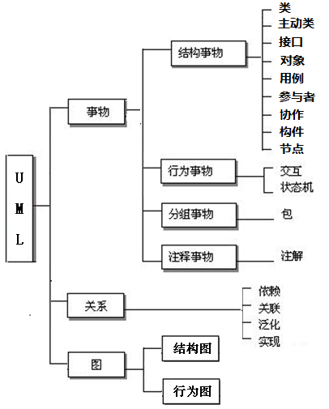

# 总览




# 类图

##  注释(comment)


## 接口（Interface）

接口表示法

- 构造型的类符号

  - `<<interface>>`

- 接口图标表示方法

  

## 抽象类（abstract class）

抽象类用斜体书写类名称来表示


## 模板（template）

图标符号


**模板参数绑定: **

- 显式模板参数绑定
  - `<<bind>>`依赖
          
- 隐式模板参数绑定
  - 类名中加绑定表达式
                                 

## 类（class）

### 使用 UML 表示类的四种不同方式


假如我现在定义了这么一个类：

```c++
class Persion
{
public:
    string getName()
    {
    	return name;
    }
    void setName(string name)
    {
    	this->name = name;
    }
protected:
    void playBasketball()
    {
    	pass();
    }
private:
    void pass()
    {
    }
private:
    string name = "Jack";
};
```

那么此类对应的UML为：


看到该图分为三层：最顶层的为类名，中间层的为属性，最底层的为方法。
属性的表示方式为：【可见性】【属性名称】：【类型】= {缺省值，可选}
方法的表示方式为：【可见性】【方法名称】（【参数列表】）：【类型】
可见性都是一样的，"-"表示private、"+"表示public、"#"表示protected。

### 可见性（visibility）

- 可见性特征用于控制对属性、操作甚至整个类的访问，以有效地实施封装
- UML 的四种不同的可见性分类
  

### 类的属性（attribute）

#### 基础

属性的完整语法 `visibility name : type multiplicity = default {property-string}`

​                          【可见性】【属性名称】：【类型】= {缺省值，可选}

内联属性和关联属性


#### 重数

属性表示的对象个数

- 一个属性可以表示任意数量的该类型的对象；在程序中，这就像声明一个属性是一个数组。
- 重数指定一个属性实际上代表一个对象的集合，可以应用于内联属性和关联属性

常用属性重数值

| 表示方式 | 多重性说明                                                  |
| -------- | ----------------------------------------------------------- |
| 1……1     | 表示另一个类的一个对象只与一个该类对象有关系                |
| 0……*     | 表示另一个类的一个对象与零个或多个该类对象有关系            |
| 1……*     | 表示另一个类的一个对象与一个或多个该类对象有关系            |
| 0……1     | 表示另一个类的一个对象没有或只与一个该类对象有关系          |
| m……n     | 表示另一个类的一个对象与最少m、最多n个该类对象有关系 (m<=n) |


### 类的方法（operation）

操作的完整表示语法 `visibility name (parameter-list) : return-type {property-string}`

​                                    【可见性】【方法名称】（【参数列表】）：【类型】

​      

### 类的static属性和操作

UML中的操作和属性可以声明为static

表示法：加下画线


### 关联的修饰

#### 名字（name）

- 关联名描述关联的性质
- 读名字的方向，无歧义的情况下不需要


#### 导航（navigation）

- 给定一个 User对象，能够找到相应的Password对象；
- 给定一个Password对象，不能找到对应的User


#### 角色（role）

- 参与关联的类在关联中扮演的角色
- 角色可以命名，也叫做end name


#### 重数（multiplicity）

- 说明一个关联实例（链）可以连接多少个对象

- 这个“多少”被称为关联角色的重数

- 用一个整数范围表示，指定相关对象集可能的大小

  - `0..1`
  - `0..*(*)`
  - `1`
  - `m..n`
  - `m,n`

  

#### 可见性（visibility）

- 给定一个User对象，可以访问Password
- 给定一个 UserGroup 对象，可以导航到它的 User 对象，反之亦然；但无法从这个链查看 User 对象的 Password 对象； 因为它们是User私有的。


#### 聚合（aggregation）

- 有时想要对“整体/部分”关系建模，其中一个类代表一个更大的事物（“整体”），它由较小的事物（“部分”）组成。
- 这种关系称为聚合，代表一种“has-a”关系，意思是整体的对象有部分的对象。
- 聚合实际上只是一种特殊的关联


#### 组合（composition）

- 简单聚合是概念性的，只是区分“整体”和“部分”，不会改变整体和部分之间关联的导航含义，也不会链接整体和部分的生命周期。
- 组合是一种更强的聚合形式，一个部分对象只能属于一个整体复合对象；在复合对象中，整体对象必须管理其部分的创建和销毁


#### 限定关联（qualification）

- 限定符（qualifier）


#### 关联类（Association Class）

关联类

- 在两个类之间的关联中，关联本身可能具有属性


关联类同时具有关联和类的特性
                                


### 类图中的关系（relationship）

- 关联、聚合、组合
- 泛化（generalization）
- 依赖（dependency）
- 实现（realization）


#### UML 的5种不同的类关系

- 类关系的强度取决于关系涉及的类彼此之间的依赖程度
- 两个相互强烈依赖的类被认为是紧密耦合的； 对一个类的更改很可能会影响另一个类


记忆: 箭头都指向被依赖类

#### 依赖关系

依赖（Dependency）：表示一个类依赖另一个类，大多数情况下依赖关系体现在某个类的方法使用另一个类
的对象作为参数。

==表现形式：虚线+箭头，箭头指向被依赖的类==

<font color = red>依赖关系通常通过三种方式来实现：</font>

1. 在一个类的方法中将一个类的对象作为其方法的参数(被依赖的类)
2. 在一个类的方法中将另一个类的对象作为其对象的局部变量(被依赖的类)
3. 在一个类的方法中调用另一个类的静态方法(被依赖的类)

比如，驾驶员（Driver）开车，Driver类的drive()方法将车（Car）的对象作为一个参数传递(可以通过构造函数参数，方法参数，方法返回值，方法内局部变量的形式存在于Driver类中)，以便在drive()方法中能够调用car的move()方法，且驾驶员的drive()方法依赖车的move()方法，因此也可以说Driver依赖Car，C++代码为：

```c++
class Car
{
public:
	void move();
};
```

```c++
class Driver
{
public:
    void drive(Car car)
    { 
    	car.move();
    }
};
```

其UML的画法为：


比如，选课管理系统中抽取的类：从 CourseSchedule (课程计划)到 Course (课程)的依赖关系，其中 Course 用于 CourseSchedule 的添加和删除操作。

```c++
class Course
{
public:    
    void add();
    void remove();
};
```

```c++
class CourseSchedule
{
public:
    void add(Course c)
    { 
    	c.add();
    }
    void remove(Course c)
    { 
    	c.remove();
    }
};
```

其UML的画法为：
                                                   

比如人与手机的关系图，人通过手机的语音传送方法打电话。其UML的画法为：


#### 关联关系

关联（Assocition）关系是类与类之间最常见的一种关系，它是一种结构化的关系，表示一类对象与另一类对象之间有联系，如汽车和轮胎、师傅和徒弟、班级和学生等。在UML类图中，用实线连接有关联关系的对象所对应的类，在C++中通常将一个类的对象作为另一个类的成员变量。

==表现形式：实线+箭头，箭头指向被使用的类==

<font color = red>依赖关系通常通过一种方式来实现：</font>

1. 将一个类的对象作为另一个类的成员变量(被使用的类)

关联的类型:  自关联，二元关联，n元关联（一对一（员工->工牌），一对多（部门->员工），多对多（商店->商品）


##### 单向关联关系

单向关联指的是关联只有一个方向，比如顾客（Customer）拥有地址（Address），其代码实现为：

```c++
// 地址类
class Address
{
};
```

```c++
// 顾客类
class Customer
{
private:
	Address address; // 作为成员变量
};
```

UML的画法为：


##### 双向关联关系

默认情况下的关联都是双向的，比如顾客（Customer）购买商品（Product），反之，卖出去的商品总是与
某个顾客与之相关联，这就是双向关联。c++ 类的写法为：

```c++
// 商品类
class Product
{
private:
	Customer customer; // 该商品属于哪一位顾客, 作为成员变量
};
```

```c++
// 顾客类
class Customer
{
private:
	Product product[64]; // 给顾客购买了哪些商品, 作为成员变量
};
```

对应的UML类图应当是：(注:  双向关联用一个不带箭头的线来表示)


比如老师和学生的关系图，每个老师可以教多个学生，每个学生也可向多个老师学，他们是双向关联。UML的画法为：


#####  自关联关系

自关联，指的就是对象中的属性为对象本身，这在链表中非常常见，单向链表Node中会维护一个它的前驱
Node，双向链表Node中会维护一个它的前驱Node和一个它的后继Node。就以单向链表为例，它的C++写
法为：

```c++
// 链表节点
class Node
{
private:
	Node* nextNode; // 指向后继节点的指针, 作为成员变量
};
```

对应的UML类图应当是：


#### 聚合关系

聚合（Aggregation）：是关联关系的一种，是强的关联关系。聚合关系是整体和个体的关系。一般关联关系的两个类处于同一个层次上，**聚合关系中的两个类处于不同的层次，一个是整体，一个是部分**。

==表现形式：空心菱形+实线+箭头，箭头指向个体==

在UML中，聚合关系用带空心菱形的直线表示，如汽车（Car）与引擎（Engine）、轮胎（Wheel）、车灯（Light），C++ 表示为：

```c++
class Engine
{
};
```

```c++
class Wheel
{
};
```

```c++
class Light
{
};
```

```c++
class Car
{
public:
    Car(Engine engine, Light light, Wheel wheel)
    {
        this->engine = engine;
        this->light = light;
        this->wheel = wheel;
    }
    void drive()
    {
    }
private:
    Engine engine;
    Light light;
    Wheel wheel;
};
```

对应的UML类图为：


代码实现聚合关系，成员对象通常以构造方法、Setter方法的方式注入到整体对象之中。

比如大学和教师的关系图UML的画法为：


#### 组合关系

组合（Composition）：是关联关系的一种，是比聚合关系更强的关系。要求普通的聚合关系中代表整体的对像负责代表个体的对象的生命周期。**当删除整体对象时也要级联删除个体对象**(在组合关系中整体对象可以控制成员对象的生命周期，一旦整体对象不存在，成员对象也不存在，整体对象和成员对象之间具有同生共死的关系)

==表现形式：实心菱形+实线+箭头，箭头指向个体==

比如人的头（Head）和嘴巴（Mouth）、鼻子（Nose），嘴巴和鼻子是头的组成部分之一，一旦头没了，
嘴巴也没了，因此头和嘴巴、鼻子是组合关系，C++ 表示为：

```c++
class Mouth
{
};
```

```c++
class Nose
{
};
```

```c++
class Head
{
public:
    Head()
    {
        mouth = new Mouth();
        nose = new Nose();
    }
    void shake()
    {
    }
private:
    Mouth *mouth;
    Nose *nose;
};
```

其UML的表示方法为：


代码实现组合关系，通常在整体类的构造方法中直接实例化成员类，因为组合关系的整体和部分是共生关
系，如果通过外部注入，那么即使整体不存在，那么部分还是存在的，这就相当于变成了一种聚合关系了。

比如头和嘴的关系图UML的画法为：


#### 实现关系

实现：表示类与接口之间的上下级关系。当类A实现自接口B时，就说类A是接口B的实现类，接口B是类A的接口。

==表现形式：虚线+空心三角形，三角形指向接口==

- 实现接口的类和接口之间的关系
- 实现关系的表示法
  - 构造型：空心三角箭头虚线
    
  - 图标表示：实线
    

#### 继承关系

继承也叫作泛化（Generalization），用于描述父子类之间的关系，父类又称为基类或者超类，子类又称作
派生类。

==表现形式：实线+空心三角形，三角形指向父类==

##### 普通继承关系

假如现在我又定义了一个Student和一个Teacher：

```c++
class Student : public Persion
{
public:
    void study()
    {
    }
private:
    string studentNo;
};  
```

```c++
class Teacher : public Persion
{
public:
	void teach()
    {
    }
private:
    string teacherNo;
};
```

那么，用UML表示这种关系应当是：


##### 抽象继承关系

上面的继承是普通的继承，在C++中，除了普通的继承之外，众所周知的还有一种抽象的继承关系，因此就
再讲讲抽象继承关系，作为上面的继承的补充。
比方说我想实现一个链表（Link），插入（insert）与删除（remove）动作我想让子类去实现，链表本身只
实现统计链表中元素个数的动作（count），然后有一个子类单向链表（OneWayLink）去实现父类没有实现
的动作，C++代码为：

```c++
// 抽象类(含有纯虚函数的类)
class Link
{
    public:
    virtual void insert() = 0;
    virtual void remove() = 0;
    int count()
    {
    	return 0;
    }
};
```

```c++
// 子类
class OneWayLink : public Link
{
public:
    void insert()
    {
    }
    void remove()
    {
    }
};
```

其UML的画法为：


在UML中，抽象类无论类名还是抽象方法名，都以斜体的方式表示，因为这也是一种继承关系，所以子类与
父类通过带空心三角形的实线来联系。

#### 关联关系、聚合关系、组合关系之间的区别

关联和聚合的区别主要在于语义上：关联的两个对象之间一般是平等的，聚合则一般是不平等的。
聚合和组合的区别则在语义和实现上都有差别：组合的两个对象之间生命周期有很大的关联，被组合的对象
在组合对象创建的同时或者创建之后创建，在组合对象销毁之前销毁，一般来说被组合对象不能脱离组合对
象独立存在，而且也只能属于一个组合对象；聚合则不一样，被聚合的对象可以属于多个聚合对象。
再举例子来说：
你和你的朋友属于关联关系，因为你和你的朋友之间的关系是平等的，关联关系只是表示一下两个对象
之间的一种简单的联系而已，就像我有一个朋友
你和你借的书属于聚合关系，第一是因为书可以独立存在，第二是因为书不仅仅属于你，也可以属于别
人，只是暂时你拥有
你和你的心脏属于组合关系，因为你的心脏只是属于你的，不能脱离与你而存在
不过，实际应用中，我个人感觉三种关系其实没有区分得这么清楚，有些架构师甚至会说"组合和聚合没什么
区别"，所以，有时候不需要把细节扣得这么细，合理利用对象之间的关系给出设计方案即可。

## 对象图


# 用例图


# 活动图


# 交互图


# 状态机图

