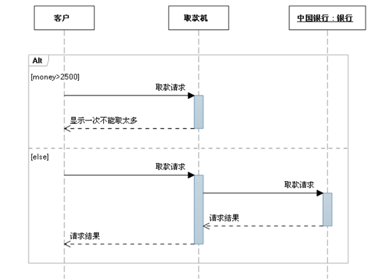

#    

总览

## 1. 作为Object的表现形式的模型技术

进入UML技术的说明之前，我们首先来谈谈Object指向技术。Object指向是软件开发的一种先进技术，正如[Object]名字所暗示的，该技术的所有考虑出发点都是Object.

使用Object可以提高大型软件项目的开发效率和速度。

所谓的Object指向，就是说要把复杂的问题细化分解，用图表的方式表达出来。比如下图：


如上图所示，一个好的模型能够正确的合理的表达复杂的意思。上图中复杂的路径信息经过简化之后就会变成清晰可见的模型图。

## 2.  作为统一表达模型的UML技术

如上所示，用图形来表达复杂的逻辑和需求是个很好的选择和做法。

但是每个人的思路都不一样，每个人画出来的图也都不一样，怎么样才能让大家都能听得懂对方的思路呢。


在这个时候，UML登场了。UML是1997年由OMG组织推出来的，全球统一的模型图形技术。

## 3. UML技术可以提高分析和设计的精度

在没有UML技术的时候，大家都知道随口乱说。

+ 需求分析的时候，客户随口说说需求。
+ 系统设计的时候，架构师随口说说设计。
+ 程序开发的时候，开发者随口编写程序。

一切都是无序和混乱的，但是，有了UML就不会再出现这种问题了。所有的交流和文档都能够有一种大家都能听得懂的好方法传递，这就是UML。


##  4. UML的内容


可以这样使用UML技术并且在很多自动开发工具之中，可以根据以上图形自动生成代码。

| 软件开发阶段 | UML图                | 用途                 |
| ------------ | -------------------- | -------------------- |
| 需求分析阶段 | 用例图               | 搞清楚系统服务的要求 |
| 类图         | 搞清楚具体的技术概念 |                      |
| 系统设计阶段 | 类图                 | 表达系统的构造       |
| 时序图       | 表达对象的动作       |                      |

## 5. UML是必须的知识

对于现代软件开发和管理而言，UML是必需的知识，无论是外包还是内包，UML都是不可或缺的技术。


# TODO


# 类图：对系统的逻辑结构建模 

##  注释(comment)


## 接口（Interface）

接口表示法

- 构造型的类符号

  - `<<interface>>`

- 接口图标表示方法

  

## 抽象类（abstract class）

抽象类用斜体书写类名称来表示


## 模板（template）

图标符号


**模板参数绑定: **

- 显式模板参数绑定
  - `<<bind>>`依赖
          
- 隐式模板参数绑定
  - 类名中加绑定表达式
                                 

## 类（class）

### 使用 UML 表示类的四种不同方式


假如我现在定义了这么一个类：

```c++
class Persion
{
public:
    string getName()
    {
    	return name;
    }
    void setName(string name)
    {
    	this->name = name;
    }
protected:
    void playBasketball()
    {
    	pass();
    }
private:
    void pass()
    {
    }
private:
    string name = "Jack";
};
```

那么此类对应的UML为：


看到该图分为三层：最顶层的为类名，中间层的为属性，最底层的为方法。
属性的表示方式为：【可见性】【属性名称】：【类型】= {缺省值，可选}
方法的表示方式为：【可见性】【方法名称】（【参数列表】）：【类型】
可见性都是一样的，"-"表示private、"+"表示public、"#"表示protected。

### 可见性（visibility）

- 可见性特征用于控制对属性、操作甚至整个类的访问，以有效地实施封装
- UML 的四种不同的可见性分类
  

### 类的属性（attribute）

#### 基础

属性的完整语法 `visibility name : type multiplicity = default {property-string}`

​                          【可见性】【属性名称】：【类型】= {缺省值，可选}

内联属性和关联属性


#### 重数

属性表示的对象个数

- 一个属性可以表示任意数量的该类型的对象；在程序中，这就像声明一个属性是一个数组。
- 重数指定一个属性实际上代表一个对象的集合，可以应用于内联属性和关联属性

常用属性重数值

| 表示方式 | 多重性说明                                                  |
| -------- | ----------------------------------------------------------- |
| 1……1     | 表示另一个类的一个对象只与一个该类对象有关系                |
| 0……*     | 表示另一个类的一个对象与零个或多个该类对象有关系            |
| 1……*     | 表示另一个类的一个对象与一个或多个该类对象有关系            |
| 0……1     | 表示另一个类的一个对象没有或只与一个该类对象有关系          |
| m……n     | 表示另一个类的一个对象与最少m、最多n个该类对象有关系 (m<=n) |


### 类的方法（operation）

操作的完整表示语法 `visibility name (parameter-list) : return-type {property-string}`

​                                    【可见性】【方法名称】（【参数列表】）：【类型】

​      

### 类的static属性和操作

UML中的操作和属性可以声明为static

表示法：加下画线


### 关联的修饰

#### 名字（name）

- 关联名描述关联的性质
- 读名字的方向，无歧义的情况下不需要


#### 导航（navigation）

- 给定一个 User对象，能够找到相应的Password对象；
- 给定一个Password对象，不能找到对应的User


#### 角色（role）

- 参与关联的类在关联中扮演的角色
- 角色可以命名，也叫做end name


#### 重数（multiplicity）

- 说明一个关联实例（链）可以连接多少个对象

- 这个“多少”被称为关联角色的重数

- 用一个整数范围表示，指定相关对象集可能的大小

  - `0..1`
  - `0..*(*)`
  - `1`
  - `m..n`
  - `m,n`

  

#### 可见性（visibility）

- 给定一个User对象，可以访问Password
- 给定一个 UserGroup 对象，可以导航到它的 User 对象，反之亦然；但无法从这个链查看 User 对象的 Password 对象； 因为它们是User私有的。


#### 聚合（aggregation）

- 有时想要对“整体/部分”关系建模，其中一个类代表一个更大的事物（“整体”），它由较小的事物（“部分”）组成。
- 这种关系称为聚合，代表一种“has-a”关系，意思是整体的对象有部分的对象。
- 聚合实际上只是一种特殊的关联


#### 组合（composition）

- 简单聚合是概念性的，只是区分“整体”和“部分”，不会改变整体和部分之间关联的导航含义，也不会链接整体和部分的生命周期。
- 组合是一种更强的聚合形式，一个部分对象只能属于一个整体复合对象；在复合对象中，整体对象必须管理其部分的创建和销毁


#### 限定关联（qualification）

- 限定符（qualifier）


#### 关联类（Association Class）

关联类

- 在两个类之间的关联中，关联本身可能具有属性


关联类同时具有关联和类的特性
                                


### 类图中的关系（relationship）

- 关联、聚合、组合
- 泛化（generalization）
- 依赖（dependency）
- 实现（realization）


#### UML 的5种不同的类关系

- 类关系的强度取决于关系涉及的类彼此之间的依赖程度
- 两个相互强烈依赖的类被认为是紧密耦合的； 对一个类的更改很可能会影响另一个类


记忆: 箭头都指向被依赖类

#### 依赖关系

依赖（Dependency）：表示一个类依赖另一个类，大多数情况下依赖关系体现在某个类的方法使用另一个类
的对象作为参数。

==表现形式：虚线+箭头，箭头指向被依赖的类==

<font color = red>依赖关系通常通过三种方式来实现：</font>

1. 在一个类的方法中将一个类的对象作为其方法的参数(被依赖的类)
2. 在一个类的方法中将另一个类的对象作为其对象的局部变量(被依赖的类)
3. 在一个类的方法中调用另一个类的静态方法(被依赖的类)

比如，驾驶员（Driver）开车，Driver类的drive()方法将车（Car）的对象作为一个参数传递(可以通过构造函数参数，方法参数，方法返回值，方法内局部变量的形式存在于Driver类中)，以便在drive()方法中能够调用car的move()方法，且驾驶员的drive()方法依赖车的move()方法，因此也可以说Driver依赖Car，C++代码为：

```c++
class Car
{
public:
	void move();
};
```

```c++
class Driver
{
public:
    void drive(Car car)
    { 
    	car.move();
    }
};
```

其UML的画法为：


比如，选课管理系统中抽取的类：从 CourseSchedule (课程计划)到 Course (课程)的依赖关系，其中 Course 用于 CourseSchedule 的添加和删除操作。

```c++
class Course
{
public:    
    void add();
    void remove();
};
```

```c++
class CourseSchedule
{
public:
    void add(Course c)
    { 
    	c.add();
    }
    void remove(Course c)
    { 
    	c.remove();
    }
};
```

其UML的画法为：
                                                   

比如人与手机的关系图，人通过手机的语音传送方法打电话。其UML的画法为：


#### 关联关系

关联（Assocition）关系是类与类之间最常见的一种关系，它是一种结构化的关系，表示一类对象与另一类对象之间有联系，如汽车和轮胎、师傅和徒弟、班级和学生等。在UML类图中，用实线连接有关联关系的对象所对应的类，在C++中通常将一个类的对象作为另一个类的成员变量。

==表现形式：实线+箭头，箭头指向被使用的类==

<font color = red>关联关系通常通过一种方式来实现：</font>

1. 将一个类的对象作为另一个类的成员变量(被使用的类)

关联的类型:  自关联，二元关联，n元关联（一对一（员工->工牌），一对多（部门->员工），多对多（商店->商品）


##### 单向关联关系

单向关联指的是关联只有一个方向，比如顾客（Customer）拥有地址（Address），其代码实现为：

```c++
// 地址类
class Address
{
};
```

```c++
// 顾客类
class Customer
{
private:
	Address address; // 作为成员变量
};
```

UML的画法为：


##### 双向关联关系

默认情况下的关联都是双向的，比如顾客（Customer）购买商品（Product），反之，卖出去的商品总是与
某个顾客与之相关联，这就是双向关联。c++ 类的写法为：

```c++
// 商品类
class Product
{
private:
	Customer customer; // 该商品属于哪一位顾客, 作为成员变量
};
```

```c++
// 顾客类
class Customer
{
private:
	Product product[64]; // 给顾客购买了哪些商品, 作为成员变量
};
```

对应的UML类图应当是：(注:  双向关联用一个不带箭头的线来表示)


比如老师和学生的关系图，每个老师可以教多个学生，每个学生也可向多个老师学，他们是双向关联。UML的画法为：


#####  自关联关系

自关联，指的就是对象中的属性为对象本身，这在链表中非常常见，单向链表Node中会维护一个它的前驱
Node，双向链表Node中会维护一个它的前驱Node和一个它的后继Node。就以单向链表为例，它的C++写
法为：

```c++
// 链表节点
class Node
{
private:
	Node* nextNode; // 指向后继节点的指针, 作为成员变量
};
```

对应的UML类图应当是：


#### 聚合关系

聚合（Aggregation）：是关联关系的一种，是强的关联关系。聚合关系是整体和个体的关系。一般关联关系的两个类处于同一个层次上，**聚合关系中的两个类处于不同的层次，一个是整体，一个是部分**。

==表现形式：空心菱形+实线+箭头，箭头指向个体==

在UML中，聚合关系用带空心菱形的直线表示，如汽车（Car）与引擎（Engine）、轮胎（Wheel）、车灯（Light），C++ 表示为：

```c++
class Engine
{
};
```

```c++
class Wheel
{
};
```

```c++
class Light
{
};
```

```c++
class Car
{
public:
    Car(Engine engine, Light light, Wheel wheel)
    {
        this->engine = engine;
        this->light = light;
        this->wheel = wheel;
    }
    void drive()
    {
    }
private:
    Engine engine;
    Light light;
    Wheel wheel;
};
```

对应的UML类图为：


代码实现聚合关系，成员对象通常以构造方法、Setter方法的方式注入到整体对象之中。

比如大学和教师的关系图UML的画法为：


#### 组合关系

组合（Composition）：是关联关系的一种，是比聚合关系更强的关系。要求普通的聚合关系中代表整体的对像负责代表个体的对象的生命周期。**当删除整体对象时也要级联删除个体对象**(在组合关系中整体对象可以控制成员对象的生命周期，一旦整体对象不存在，成员对象也不存在，整体对象和成员对象之间具有同生共死的关系)

==表现形式：实心菱形+实线+箭头，箭头指向个体==

比如人的头（Head）和嘴巴（Mouth）、鼻子（Nose），嘴巴和鼻子是头的组成部分之一，一旦头没了，
嘴巴也没了，因此头和嘴巴、鼻子是组合关系，C++ 表示为：

```c++
class Mouth
{
};
```

```c++
class Nose
{
};
```

```c++
class Head
{
public:
    Head()
    {
        mouth = new Mouth();
        nose = new Nose();
    }
    void shake()
    {
    }
private:
    Mouth *mouth;
    Nose *nose;
};
```

其UML的表示方法为：


代码实现组合关系，通常在整体类的构造方法中直接实例化成员类，因为组合关系的整体和部分是共生关
系，如果通过外部注入，那么即使整体不存在，那么部分还是存在的，这就相当于变成了一种聚合关系了。

比如头和嘴的关系图UML的画法为：


#### 实现关系

实现：表示类与接口之间的上下级关系。当类A实现自接口B时，就说类A是接口B的实现类，接口B是类A的接口。

==表现形式：虚线+空心三角形，三角形指向接口==

- 实现接口的类和接口之间的关系
- 实现关系的表示法
  - 构造型：空心三角箭头虚线
    
  - 图标表示：实线
    

#### 继承关系

继承也叫作泛化（Generalization），用于描述父子类之间的关系，父类又称为基类或者超类，子类又称作
派生类。

==表现形式：实线+空心三角形，三角形指向父类==

##### 普通继承关系

假如现在我又定义了一个Student和一个Teacher：

```c++
class Student : public Persion
{
public:
    void study()
    {
    }
private:
    string studentNo;
};  
```

```c++
class Teacher : public Persion
{
public:
	void teach()
    {
    }
private:
    string teacherNo;
};
```

那么，用UML表示这种关系应当是：


##### 抽象继承关系

上面的继承是普通的继承，在C++中，除了普通的继承之外，众所周知的还有一种抽象的继承关系，因此就
再讲讲抽象继承关系，作为上面的继承的补充。
比方说我想实现一个链表（Link），插入（insert）与删除（remove）动作我想让子类去实现，链表本身只
实现统计链表中元素个数的动作（count），然后有一个子类单向链表（OneWayLink）去实现父类没有实现
的动作，C++代码为：

```c++
// 抽象类(含有纯虚函数的类)
class Link
{
    public:
    virtual void insert() = 0;
    virtual void remove() = 0;
    int count()
    {
    	return 0;
    }
};
```

```c++
// 子类
class OneWayLink : public Link
{
public:
    void insert()
    {
    }
    void remove()
    {
    }
};
```

其UML的画法为：


在UML中，抽象类无论类名还是抽象方法名，都以斜体的方式表示，因为这也是一种继承关系，所以子类与
父类通过带空心三角形的实线来联系。

#### 关联关系、聚合关系、组合关系之间的区别

关联和聚合的区别主要在于语义上：关联的两个对象之间一般是平等的，聚合则一般是不平等的。
聚合和组合的区别则在语义和实现上都有差别：组合的两个对象之间生命周期有很大的关联，被组合的对象
在组合对象创建的同时或者创建之后创建，在组合对象销毁之前销毁，一般来说被组合对象不能脱离组合对
象独立存在，而且也只能属于一个组合对象；聚合则不一样，被聚合的对象可以属于多个聚合对象。
再举例子来说：
你和你的朋友属于关联关系，因为你和你的朋友之间的关系是平等的，关联关系只是表示一下两个对象
之间的一种简单的联系而已，就像我有一个朋友
你和你借的书属于聚合关系，第一是因为书可以独立存在，第二是因为书不仅仅属于你，也可以属于别
人，只是暂时你拥有
你和你的心脏属于组合关系，因为你的心脏只是属于你的，不能脱离与你而存在
不过，实际应用中，我个人感觉三种关系其实没有区分得这么清楚，有些架构师甚至会说"组合和聚合没什么
区别"，所以，有时候不需要把细节扣得这么细，合理利用对象之间的关系给出设计方案即可。

## 对象图

- 对象实例
- 链（link）
- 对象图

### 实例（instance）

类在编译时定义，对象在运行时作为类的实例创建

创建一个新Part对象的Java语句

```java
Part myScrew = new Part("screw", 28834, 0.02) ;
```

Part对象的UML表示
                                                         

- 对象是类的实例
                        

- UML中实例的图形表示

  - 命名实例

    

  - 匿名实例
                            

### 对象状态

带属性值的实例
                            

带显式状态的实例
                           

### 对象的特性

- 对象是具有状态、行为和唯一标识的某事物

- 状态（state）

  - 包含在对象属性中的数据值通常称为对象的状态
  - 这些数据值会随系统变化而改变，结果是对象的状态可以改变
  - 在OOPL中，对象的状态由对象所属类定义的域指定，在UML中由类的属性指定

- 行为

  - 在OOPL中，对象的操作在类中定义为一组方法，即接口
  - 在UML中，操作不出现在对象图标中

- 唯一标识（identity）

  - 对象模型假定为每个对象提供唯一标识，作为区别于其他对象的标志。

  - 每个对象和其他所有对象都是可区别的，即使两个对象保存完全相同的数据，并在接口中提供完全相同的操作集合。

    - 下面的代码创建两个状态相同的对象，但它们是不同的对象。

      ```java
      Part screw1 = new Part("screw", 28834, 0.02) ;
      Part screw2 = new Part("screw", 28834, 0.02) ;
      ```

  - 对象的标识是对象模型固有的一部分，不同于对象中存储的任何其他数据项。 设计人员不需要定义一个特殊数据来区分类的各个实例。

    - 有时应用领域会包含对每个对象都不相同的真实数据项，例如各种识别号码，这些数据项通常作为属性建模。

### 链（link）

- 对象之间的链
  - 对象图上的对象之间的链表明这两个对象可以相互通信。
    
- 链和关联
  - 不能将任意两个对象链接在一起。
  - 如果在两个对象之间创建链接，则类之间必须有相应的关联。
  - 对象之间的链接对应于对象的类之间的关联： 应用于关联上的约束规则，链接必须遵守。

```java
public class CatalogueEntry {
    private String name ;
    private long number ;
    private double cost ;
    public CatalogueEntry(String nm, long num, double cst) {
        name = nm ; number = num ; cost = cst ;
    }
    public String getName() { return name ; }
    public long getNumber() { return number ; }
    public double getCost() { return cost ; }
}

public class Part {
    private CatalogueEntry entry ;  //关联关系
    public Part(CatalogueEntry e) { entry = e ; }
}

//-----------------------------------------------
CatalogueEntry screw = new CatalogueEntry("screw", 28834, 0.02) ;
Part s1 = new Part(screw) ;
Part s2 = new Part(screw) ;
```

链的UML表示法

- 对象保存另一对象的引用，在这两个对象之间画一个链来表示
- 链表示为从保存引用的对象指向被引用对象的箭头，箭头表示只能在一个方向上遍历或导航；
- 在箭头上可以标示保存引用的域的名字；


### 消息传递(函数调用)

面向对象程序中的数据是分布在系统的对象之中的

- 一些数据作为属性值保存
- 对象之间的链接也含有信息，描述对象之间保持的关系

信息分布意味着为了完成系统的任何功能，一般而言都需要多个对象进行交互

- 假设想要为Part类增加一个方法cost来查询一个零件的成本；
- 表示零件成本的数据值并没有保存在零件对象中，而是保存在零件引用的目录条目对象中
- 新方法必须调用目录条目类中的getCost()方法

```java
public class Part {
    public double cost() { return entry.getCost(); }
    private CatalogueEntry entry ;  //关联
}
//如果客户持有一个Part的引用并要查询它的成本
//可以如下调用cost方法。
Part s1 = new Part(screw);
double s1cost = s1.cost();
```

UML将方法调用表示为从一个对象发送到另一对象的消息

- 当对象调用另一对象的方法时，可以看作是请求被调用的对象执行某些处理，这个请求作为消息建模。
- 上面的代码中调用s1.cost()的消息如图
  

对象在接收到消息时，通常会以某种方式响应
          

 例子:  **层次中的消息传递**


## 总结


# 用例图：对系统需求建模

用例图主要用来描述“用户、需求、系统功能单元”之间的关系。它展示了一个外部用户能够观察到的系统功能模型图。【用途】：帮助开发团队以一种可视化的方式理解系统的功能需求。

与用例相关的关键概念

- Actors（参与者、施动者、行事者）
  - 可能与主体交互的用户和其他系统被表示为参与者
  - 参与者对系统外部的实体建模
- Use cases（用例）
  - 所需的主体行为由一个或多个用例规定
  - 用例根据参与者的需要而定义
- Subject（主题、主体）
  - 正在被开发的系统，用例应用于该系统


用例图所包含的元素如下：

##  1. 参与者(Actor)

### 参与者表示方法

表示与应用程序或系统进行交互的用户、组织或外部系统。用一个小人表示。


参与者的UML 表示法


### 参与者的泛化关系

参与者相互之间可能有泛化关系


## 2. 用例(Use Case)

用例就是外部可见的系统功能，对系统提供的服务进行描述。用椭圆表示。


用例的UML表示法

- 椭圆
- 构造型


## 3. 子系统(Subsystem)

用来展示系统的一部分功能，这部分功能联系紧密。　　

在用例图中用一个方框表示系统边界


- 方框上部标示有系统的名字

- 用例在方框中，参与者在方框外

  

## 4.  关系

用例图中涉及的关系有：关联、泛化、包含、扩展。


### a. 关联(Association)

表示参与者与用例之间的通信，任何一方都可发送或接受消息。

【箭头指向】：指向消息接收方


### b. 泛化(Inheritance)

就是通常理解的继承关系，子用例和父用例相似，但表现出更特别的行为；子用例将继承父用例的所有结构、行为和关系。子用例可以使用父用例的一段行为，也可以重载它。父用例通常是抽象的。

【箭头指向】：指向父用例


### c. 包含(Include)

包含关系用来把一个较复杂用例所表示的功能分解成较小的步骤。

【箭头指向】：指向分解出来的功能用例


### d. 扩展(Extend)

扩展关系是指用例功能的延伸，相当于为基础用例提供一个附加功能。

【箭头指向】：指向基础用例


### e. 依赖(Dependency)

以上4种关系，是UML定义的标准关系。但VS2010的用例模型图中，添加了依赖关系，用带箭头的虚线表示，表示源用例依赖于目标用例。

【箭头指向】：指向被依赖项

​                                                               


## 5. 项目(Artifact)

用例图虽然是用来帮助人们形象地理解功能需求，但却没多少人能够通看懂它。很多时候跟用户交流甚至用Excel都比用例图强，VS2010中引入了“项目”这样一个元素，以便让开发人员能够在用例图中链接一个普通文档。

用依赖关系把某个用例依赖到项目上：


然后把项目-》属性 的Hyperlink设置到你的文档上；

这样当你在用例图上双击项目时，就会打开相关联的文档。

## 6. 注释(Comment)

 

　　

**包含(include)、扩展(extend)、泛化(Inheritance)** **的区别：**

+ 条件性：泛化中的子用例和include中的被包含的用例会无条件发生，而extend中的延伸用例的发生是有条件的
+ 直接性：泛化中的子用例和extend中的延伸用例为参与者提供直接服务，而include中被包含的用例为参与者提供间接服务。
  + 对extend而言，延伸用例并不包含基础用例的内容，基础用例也不包含延伸用例的内容
  + 对Inheritance而言，子用例包含基础用例的所有内容及其和其他用例或参与者之间的关系

**一个用例图示例：**                                                                                             

**用例描述表：**

鉴于用列图并不能清楚地表达功能需求，开发中大家通常用描述表来补充某些不易表达的用例


## 总结


# 活动图：对系统工作流建模

- 基本元素
- 活动和动作
- 分支和并发
- 活动图建模


# 状态机图：对象生命周期的状态变化和行为

- 状态和转移
- 事件、条件、动作
- 组合状态
- 状态机建模


# 交互图：描述对象之间的动态合作关系

交互图是描述对象之间的关系以及对象之间的[信息传递]()的图。[序列图、]()[时序图]()、[协作图、]()通信图、[交互概览图]()统称交互图。

- Sequence Diagram
- Communication Diagram
- Timing Diagram
- Interaction Overview

## 序列图（Sequence Diagrams）：Modeling Ordered Interactions

**序列图主要用于展示对象之间交互的顺序。**

序列图将交互关系表示为一个二维图。纵向是时间轴，时间沿竖线向下延伸。横向轴代表了在协作中各独立对象的类元角色。类元角色用生命线表示。当对象存在时，角色用一条虚线表示，当对象的过程处于激活状态时，生命线是一个双道线。

消息用从一个对象的生命线到另一个对象生命线的箭头表示。箭头以时间顺序在图中从上到下排列。 

序列图中涉及的元素：

### 1.生命线

每个参与者对象有一条生命线（lifeline），生命线名称可带下划线。**当使用下划线时，意味着序列图中的生命线代表一个类的特定实例。**

 

　

### **2.** 同步消息

发送人在它继续之前，将等待同步消息响应。

　　 

　　**3.** **异步消息**

　　在发送方继续之前，无需等待响应的消息。

 

　　**4.** **注释**

**
**

　　**5.** **约束**

　　约束的符号很简单；格式是: [Boolean Test]

 

　　**6.** **组合片段**

　　**组合片段****用来解决交互执行的条件及方式**。它允许在序列图中直接表示逻辑组件，用于通过指定条件或子进程的应用区域，为任何生命线的任何部分定义特殊条件和子进程。

　　常用的组合片段有：

　　**抉择（Alt****）**

　　抉择用来指明在两个或更多的消息序列之间的互斥的选择，相当于经典的if..else..。

　　抉择在任何场合下只发生一个序列。 可以在每个片段中设置一个临界来指示该片段可以运行的条件。**else** 的临界指示其他任何临界都不为 True 时应运行的片段。如果所有临界都为 False 并且没有 **else**，则不执行任何片段。

 

　　**选项（Opt****）**

　　包含一个可能发生或不发生的序列

 

　　**循环（Loop****）**

　　片段重复一定次数。 可以在临界中指示片段重复的条件。

**** 

　　**并行（Par****）**

 

　　**下表列出了常用的组合片段：**

| 片段类型     | 名称   | 说明                                                         |
| ------------ | ------ | ------------------------------------------------------------ |
| **Opt**      | 选项   | 包含一个可能发生或可能不发生的序列。 可以在临界中指定序列发生的条件。 |
| **Alt**      | 抉择   | 包含一个片段列表，这些片段包含备选消息序列。 在任何场合下只发生一个序列。可以在每个片段中设置一个临界来指示该片段可以运行的条件。 **else** 的临界指示其他任何临界都不为 True 时应运行的片段。 如果所有临界都为 False 并且没有 **else**，则不执行任何片段。 |
| **Loop**     | 循环   | 片段重复一定次数。 可以在临界中指示片段重复的条件。Loop 组合片段具有**“Min”**和**“Max”**属性，它们指示片段可以重复的最小和最大次数。 默认值是无限制。 |
| **Break**    | 中断   | 如果执行此片段，则放弃序列的其余部分。 可以使用临界来指示发生中断的条件。 |
| **Par**      | 并行   | 并行处理。 片段中的事件可以交错。                            |
| **Critical** | 关键   | 用在 Par 或 Seq 片段中。 指示此片段中的消息不得与其他消息交错。 |
| **Seq**      | 弱顺序 | 有两个或更多操作数片段。 涉及同一生命线的消息必须以片段的顺序发生。 如果消息涉及的生命线不同，来自不同片段的消息可能会并行交错。 |
| **Strict**   | 强顺序 | 有两个或更多操作数片段。 这些片段必须按给定顺序发生。        |

　　**有关如何解释序列的片段**

　　默认情况下，序列图表明可能发生的一系列消息。 在运行的系统中，可能会出现您未选择显示在关系图上的其他消息。

　　以下片段类型可用于更改此释义：

| 片段类型     | 名称 | 说明                                                         |
| ------------ | ---- | ------------------------------------------------------------ |
| **Consider** | 考虑 | 指定此片段描述的消息列表。 其他消息可发生在运行的系统中，但对此描述来说意义不大。在**“Messages”**属性中键入该列表。 |
| **Ignore**   | 忽略 | 此片段未描述的消息列表。 这些消息可发生在运行的系统中，但对此描述来说意义不大。在**“Messages”**属性中键入该列表。 |
| **Assert**   | 断言 | 操作数片段指定唯一有效的序列。 通常用在 Consider 或 Ignore 片段中。 |
| **Neg**      | 否定 | 此片段中显示的序列不得发生。 通常用在 Consider 或 Ignore 片段中。 |


## 通讯图（Communication Diagram）：Focusing on Interaction Links

## 时序图（Timing Diagrams）：Focusing on Interaction Timing


## 交互概览图（Interaction Overview Diagrams）：Completing the Interaction Picture

- Interaction Overview

  - 活动图的一种变体，将交互图片段与控制结构流结合在一起

- 表示法

  - 结点：序列图、通讯图符号，主要是引用、嵌套的交互图片段，来自活动图的决策和分叉符号
  - 边是控制流符号，显示嵌套交互片段之间的高级控制流

- 一个大学录取的学生例子

  - 首先，学生必须接受或拒绝录取
  - 接受后，学生必须同时注册课程和申请住宿
  - 在这两项都完成后，学生必须付款。 如果没有及时收到付款，该学生将被拒绝。

  

- 交互概览图

  - 看起来像是一个活动图，不过其中的动作是交互
  - 可以将交互概图中的每个部分当作是一个完整的交互
  - 每个交互有自己的图
    - 如果概览图中的一个交互最关注时间，就用时序图
    - 如果一个交互关注消息次序，就用序列图
  - 交互概览图将这些分离的交互粘结在一起

- 交互概览图的目的是为了提供系统交互的全局视角

  - 交互概图提供了一个更高层次的视图，了解几个交互如何一起工作以实现一个系统的关注（concern），比如一个用例
  - 序列图、通讯图和时序图都聚焦于特定的细节，关注组成交互的消息
  - 交互概图将这些不同的交互连接在一起，形成一个完整的交互图，形成一个特定的系统关注点
    Interaction Overview

- 参与者对象

  - 交互中涉及的对象也可以出现在交互概图中
  - 在图的标题上加一个lifelines 子标题
    - 显示了所有交互的参与者对象列表

  

- 开始和结束

  - 交互概览图从起始节点开始，到终止节点结束

- 控制流

  - 控制流通过起始节点和终止节点之间的交互
  - 如同在活动图中一样，除了顺序流，还可以使用判断、并行、循环等控制流

- 用交互概览图对用例建模

  - 例子： Create a New Regular Blog 用例
  - 在交互概览图中，可以选择不同的交互图类型，每部分的交互可以用最适合的技术建模

- 第一步：确定将交互概览如何分解为最适合各个交互的图

  - 在此例子中使用了三种交互图
    - sd 序列图
    - cd 通讯图
    - td 时序图

  

- 在对 Select Blog Account Type, Create Regular Blog Account, 和 Tidy Up Author Details 交互建模时，消息的次序是最重要的因素，所以使用序列图对它们建模

  - 用序列图建模的一些交互

  

  

- Enter Author Details 交互则用通讯图建模

  - Enter Author Details 交互的通讯图

  

- Check Author Details 交互使用时序图建模

  - 显示关键时间约束的时序图

  

- 添加交互参与者对象

  - 在标题下列出参与者

  

- 最后一步，将这些交互粘结在一起

  - 添加控制流，控制流表明了各个交互的执行顺序

  


# 组合结构：对组合类的内部结构建模

- Composite Structure
- Internal Structure
- Part and Connector
- Collaboration


# 包图：组织系统模型

- 包（Package）
- Namespace和可见性
- 关系
- 包图建模用途

## 包表示法

包的名字在没有显示包内的元素时也可以显示在包中间,  每个包代表系统的一个特定关注方面


## 包的内容


**包的内容有两种表示方法**

- 将内容画在包记号中，这时将包的名字写在tab上
- 将内容画在包外，用线（嵌套）连接到包，如右图


**一个包还可以包含其他的包**

- 可以多层嵌套


**显示嵌套内层的包及其内容**

- 将包展开：用 packageA::packageB::packageC 如此类推表示


### Namespace 名空间

- 限定名
  
- 名字唯一
  


### 元素可见性

包中的元素可以具有public 或 private可见性


## 包的关系

### 依赖关系

**如果一个包中的类要使用另一个包中的元素，则引起包之间的依赖**

如图，如果A中一个元素使用B中的一个元素，则包A依赖包B
               

理解包之间的依赖有助于分析系统的稳定性
              

### public import关系

**public import关系（导入、引入）** 

- 如果A imports B，那么包B中的元素可以在A中不用全名使用
  - public元素可用，private元素仍不可见
- 其中B又称为target package

**表示法**

- 用标注有 `<<import>>` 构造型的依赖箭头表示


- users 包导入了security包
  

- 一个包也可以只导入另一个包中的某个特定元素

  - users 包只导入了security包中的 Credentials 元素，而不是整个包

  

### private import关系

**import 和 access 的区别**

- 被导入的元素具有public可见性，可以被进一步导入到其他包（传递）
- access 相当于 private import(理解成私有继承)

**表示法**

+ 用标注有`<<access>>`构造型的依赖箭头表示

+ A 可以看到C中的public元素，但不能看到D中的

​                      

## 管理包的依赖关系

复杂的依赖关系可能使软件系统不够稳定

- 一个包的改变会影响所有依赖于它的包
- 例如，下图中任一个包的修改都会影响到其他包
                           

原则

- avoiding cyclical package dependencies 避免循环依赖
- depending in the “direction of stability”
  - 如软件体系结构中的依赖关系：上层依赖下层
  - 易变的包依赖稳定的包

去除循环依赖的方法

- 析出一个新的包，让两个包都依赖这个新包
  
- 考虑能否将它们放在同一个包中

## 组织用例

可以用包来组织用例

- 包可以用来将功能相似的类组织在一起

- 包还可以用来组织其他的UML元素，如用例

- 将用例组织成更高的层次有助于组织模型，可以看到参与者与系统的哪部分交互           

  


## UML 包图示例

### 图书馆系统


### 管理系统模型


### 分层应用


### MVC结构

​                                    

### 股票交易系统


### 售票系统


### 通用业务系统


[UML Archives - Visual Paradigm 博客 (visual-paradigm.com)](https://blog.visual-paradigm.com/cn/category/uml/)


# 部署图（Deployment Diagram）：对部署的系统建模

UML的部署图显示系统的物理视图

- 显示运行时处理节点的配置及其上存在的工件。
- 描述软件被如何分配到硬件和各部分如何通讯，从而将软件带到了现实世界
- 部署图可以在类级别或实例级别
- 在部署图中，“系统”指所创建的软件和软件运行的硬件系统

## 节点（Node）

**节点分类:**

+ 硬件节点
  + 例如，Server，Desktop PC，Disk drives

+ 软件节点
  + 例如，操作系统，J2EE container，Web server，Application server
  + 库文件、可执行文件、属性文件等不是节点

### 硬件用节点表示

+ 构造型 `<<device>>` 表示这是硬件节点

+ 如图，本系统的硬件是一台PC

  ​                        


### 软件节点表示

- 构造型 `<<executionEnvironment>>` 强调节点是执行环境

- 如图，一个应用服务器节点
                       


注意:  软件节点要在硬件上运行，不能单独存在，如图

  ​                

### 节点实例

- 用 name : Node-type 记号表示
- 可以强调两个节点是同一类型的不同实例


### 节点间的通讯

- 通讯路径（communication paths）
  - 节点间需要互相通讯来完成工作
  - 通讯路径表示节点在运行时能够互相通讯
    - 不是表示消息传递
  - 表示法：连接两个节点的实线
  - 通讯的类型可以由构造型表示
  - 如图，使用TCP/IP通讯的PC和Server
    

#### 通讯路径

可以表示执行环境节点之间的通讯路径


## 工件（Artifact）

==Artifact对软件建模==

- 下图表示一个简单的工件软件制品（artifact）
  
  - 这个例子中是一个JAR文件，名为 3dpacman.jar
- 构造型`<<artifact>>`的表示法

## 工件部署到节点

工件被部署到节点

- 意思是该工件驻留或被安装在该节点上

表示法的选择

- 有很少工件时，用方式1
- 要表示工件之间的依赖关系时(节点内虚线箭头，节点外再加`<<deploy>>`依赖表示)，列表用方式2
- 有很多工件时，用方式3


### 节点和工件的关系

#### deploy 关系

`<<deploy>>`依赖

#### manifest 关系

`<<manifest>>`依赖

- manifest关系
  - 将（物理的）工件与它实现的逻辑元素相关
    - 软件设计时构件、包等最终形成一个或多个工件（或文件）
  - 工件可以manifest任何packageable元素
    - 构件、类、包等

### 部署规约

Deployment Specifications

部署规约（规范）是特殊的工件

- 说明了其他工件如何部署到一个节点
- 用来提供安装和配置信息

表示法

- 矩形，构造型 `<<deployment spec>>`
- 部署规约可以有属性： `name : type`

部署规约实例

​                           
​                          

### 将部署规约与其描述的部署联系起来

#### 方法一

从部署规约画一个依赖箭头到制品

- 都在部署的目标节点内


#### 方法二

将部署规约附到部署依赖上


## 使用部署图

**部署图在设计过程中的各个阶段都有用**

- 开始设计系统的早期，可以用部署图对系统的重要物理布局建模

  - 例如，系统的体系结构、客户访问方式等

  

  

**在软件开发的后期，详细的部署图可以用来说明系统的实现，作为安装系统的蓝图**

  

## 部署图建模——嵌入式系统


## 部署图建模——Client/Server系统


## 部署图建模——完全分布式系统


## 总结

